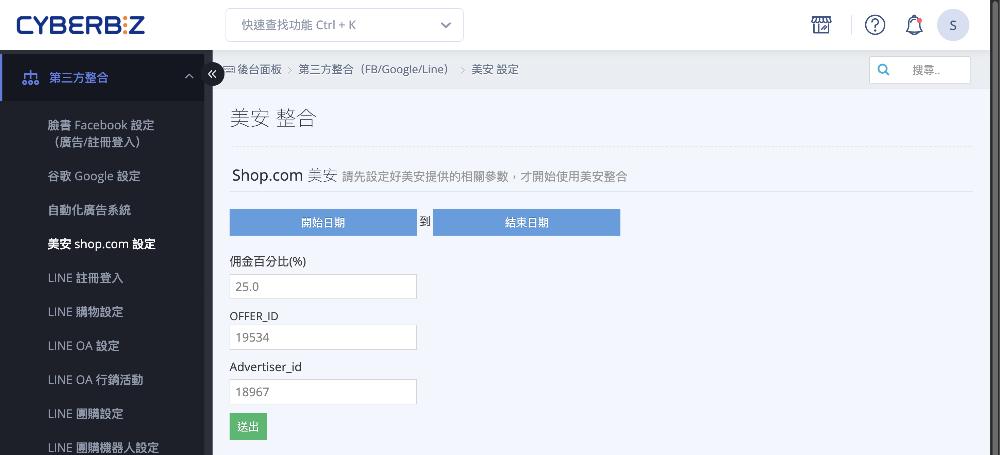
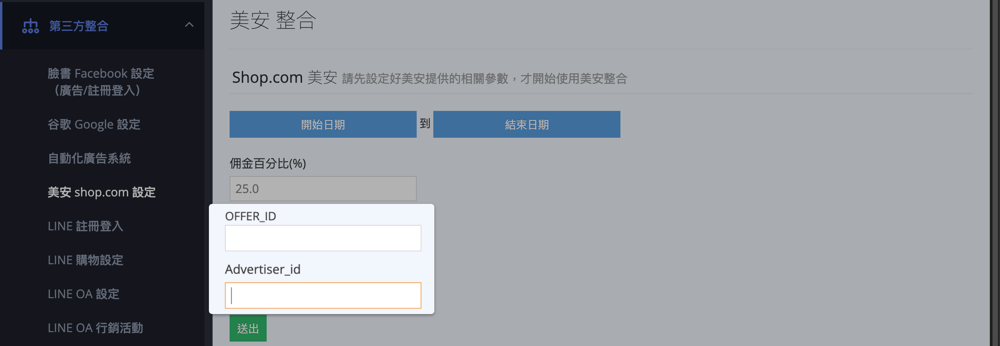
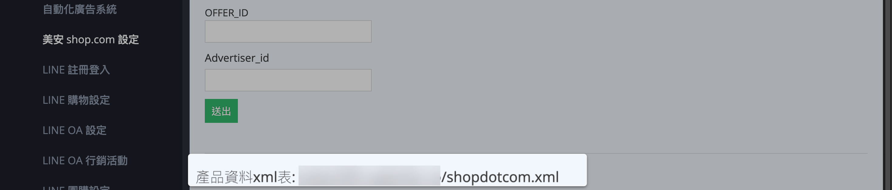
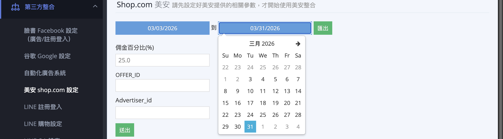

串接CYBERBIZ 官網與美安 (SHOP.COM)，透過經銷商會員管道銷售商品並增加品牌曝光。
{ .subtitle }

[:lucide-tag:{ title="適用方案" }](../../../resources/conventions#適用方案) | 進階 / 高手 / 進階 PLUS / 高手 PLUS / 企業
{ .doc-badge }

{ .hero-page }

## 串接美安說明

將您的 CYBERBIZ 官網與 **美安 (SHOP.COM)** 串接，能有效增加品牌曝光並透過其活躍的經銷商會員管道銷售商品。

## 串接前準備與簽約

1.  **完成簽約**：店家需先與美安夥伴商店部門聯繫並完成簽約。
2.  **提供基本資料**：店家需提供以下資訊給美安：統編、通訊地址、聯絡人資訊、佣金比例、網站名稱與 **網站網址**。
    *   **注意**：網址必須是 **獨立的自有網域**（如 `https://www.yourname.com.tw`），不可使用 CYBERBIZ 的子網域（如 `xxx.cyberbiz.co`）。
3.  **取得參數**：美安會在收到資料後約 5 個工作天內提供專屬的 **OFFER_ID** 與 **Advertiser_id**。

## 後台設定步驟

!!! warning "若您是在 2022 年前即串接美安的老客戶，請先聯繫 CYBERBIZ 客服開啟 **美安 API** 功能方可運作。"

1.  **填入識別碼**：前往 CYBERBIZ 後台「**第三方整合**」>「**美安 shop.com 設定**」，填入取得的 OFFER_ID 與 Advertiser_id。

    

2.  **檢查商品資訊**：確保商品符合美安規範，否則 XML 饋給會產生錯誤：
    *   **必填欄位**：商品名稱、網址、簡述、圖片、售價、定價、產品編號 (SKU) 與群組。
    *   **網址規範**：網址部分僅限 **英文與數字**，不能包含中文。
    *   **圖片規範**：必須使用 **RGB 模式的 JPG 檔**。
    !!! info "欄位填寫設定，請參閱 [商品基本設定](../products/creation/新增單一商品.md) 或 [Excel 大量匯入商品](../products/Excel 大量匯入商品.md)。"
3.  **提供 XML 檔案**：在同一個後台頁面複製「**產品資料 XML 表**」網址並提供給美安。

    

4.  **回報主機 IP**：若美安要求提供主機 IP 以記錄交易與取消紀錄，請回覆 IP 為：`52.194.101.168`。

    ??? tip "如何驗證 XML 資料準確性？"
        若需確認 XML 內容是否完整，建議採取以下方式：

        - 直接預覽：將 XML 網址貼至瀏覽器，檢查是否能正常讀取。
        - 離線檢視：下載 XML 檔並轉換為 Excel 格式，以便快速核對大量商品的必填欄位。

## 排除不欲上傳的商品

若有商品（如贈品或不適合美安銷售的品項）不希望在美安顯示，請在商品標籤欄位輸入「**贈品**」，可達成以下效果：

- 該商品不會在美安顯示，在 CYBERBIZ 網站並不會受到影響。
- 成立訂單時，帶有「贈品」標籤的商品金額，不會同步至美安。
- 訂單取消/退貨時，「贈品」標籤商品的負項金額不會同步至美安。

瞭解 [如何將商品排除上傳至第三方平台](../products/categorization/管理商品標籤.md#排除上傳至第三方平台標籤){ data-preview }。

!!! warning "美安串接目前 **不支援**「排除product feed」標籤，僅能透過「贈品」標籤進行排除。"

## 訂單測試流程

在正式上線前，美安會進行訂單測試：

1.  **下單測試**：美安會以「美安測試」名義下三筆訂單（通常兩筆會認列，一筆不會），並以 Email 通知店家。
2.  **回傳報表**：登入 CYBERBIZ 後台，前往「**美安 shop.com 設定**」匯出該時段訂單報表並回傳給美安（報表需包含 RID、Click ID 等資訊）。

    

3.  **取消訂單**：確認成功後，前往「**訂單**」>「**美安訂單**」取消測試單。
    *   **注意**：取消時需維持系統自動帶入的 **訂單金額**（不含運費），不可輸入 0。

    

!!! info "聯絡與支援"
    若對串接進度或美安端的操作有任何疑問，請直接聯繫 美安 (SHOP.COM) 夥伴商店部門：

    * **電子信箱**：[twunfranchiseservices@markettaiwan.com.tw](mailto:twunfranchiseservices@markettaiwan.com.tw)
    * **客服電話**：02-87125598
    * **服務時間**：週一至週五 09:30 – 18:30 (週末及國定假日休息)

## 常見問題

??? quote "上傳產品資料 XML 檔出現失敗該如何處理？"

    請確認提供的商品資料 XML 中，必填欄位是否有缺漏，補填後再傳送一次即可。

??? quote "如果我在官網上架新產品，需要重新匯入一次產品資料 XML 檔嗎？"

    產品資料 XML 檔只需要在串接時匯入一次即可，美安那邊會自動更新。商品在美安那邊的更新時間是以美安那邊來抓取資料為主，並非即時更新。

??? quote "如果企業版操作部分退款，美安會退還退款部份抽成嗎？"

    目前未支援部分退款機制，將計算整筆訂單抽成。

??? quote "美安測試訂單相關問題？"

    CYBERBIZ 僅提供系統串接，不負責美安操作相關的服務。

??? quote "定期定額與一頁式商店可以獲得美安回饋嗎？"

    定期定額不行，一頁式商店可以。

??? quote "後台傳給美安的訂單編號有任何限制嗎？"

    目前傳給美安的訂單編號會判斷：若只有 a-z、A-Z、# 等標示，就會傳送完成訂單名稱給美安；如有不是上述字元存在，就只會傳送訂單編號的數字。

