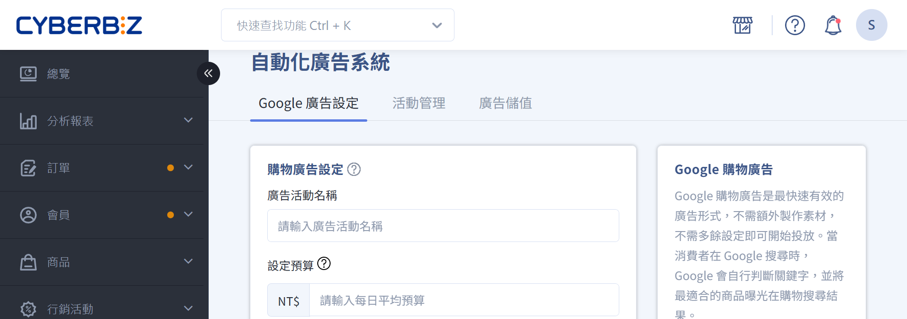
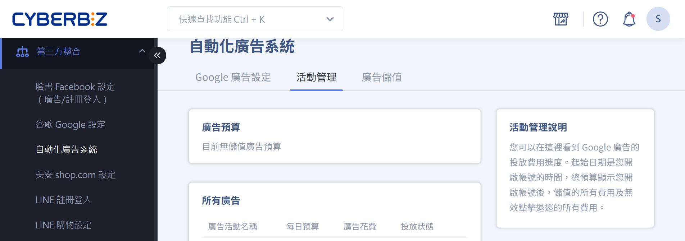
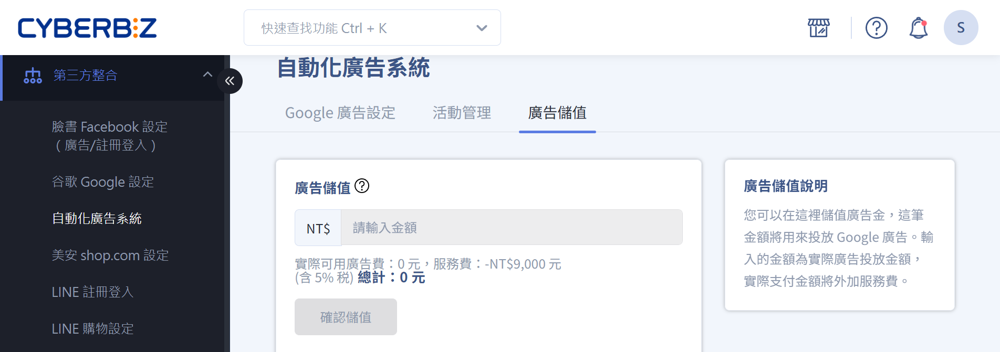
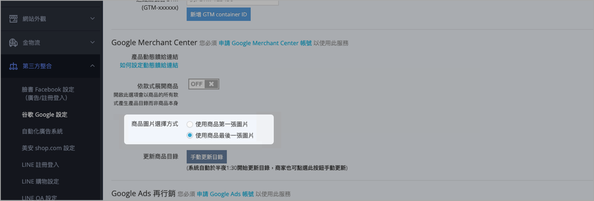
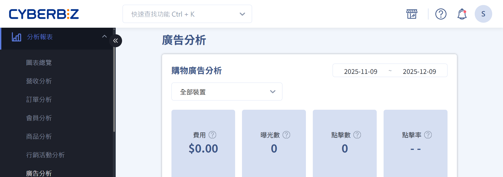

串接 Google 購物廣告，立即開始投放廣告。
{ .subtitle }

{ title="自動化廣告系統：第三方整合 > 自動化廣告系統" .hero-page }

## Google 購物廣告效果

1. 當有人在 Google 搜尋關鍵字時，若 Google 判斷該關鍵字跟您的產品相關 ，您的產品就會以產品圖卡的方式出現在搜尋結果頁。  
2. 使用者點擊廣告後，進入 EC 產品頁進行購物。 

## 開通自動化廣告系統

1. 登入 CYBERBIZ 管理後台，前往 **第三方整合 > 自動化廣告系統**。
2. 點擊 **申請開通**。
3. 請完成儲值，以進行後續廣告設定及投放。  
> 首次儲值免服務費，第二次開始服務費為 5%。

	{ .screenshot }

4. 選擇 GMC 帳號串接。  
	- [CYBERBIZ 代管](#cyberbiz-代管)（建議）：建立 CYBERBIZ 代管 GMC 帳號。
	> 廣告投放異常時，CYBERBIZ 可以迅速進行排查。然而，商家將無法直接登入 GMC 帳號、查看數據。
	- [商家自有帳號](#商家自有帳號)：串接商家原本的 GMC 帳號。
	> :lucide-triangle-alert: 商家需注意避免隨意更改設定或轉移帳戶聲明，以免影響廣告投放的正常運作。

=== "CYBERBIZ 代管" 

	1. 啟用設定：點選 **CYBERBIZ 代管**。  
	2. 若顯示 **網站所有權已被聲明** 提示，點擊 **確認** 繼續。點 **返回** 可改使用商家自有帳號。  
	3. CYBERBIZ 會進行後續 GMC 聲明權轉移，請商家稍待開通。 
	
	{ .screenshot }
	
	!!! warning "注意事項"
		建立 CYBERBIZ 代管 GMC 帳號後，請勿自行另外申請 GMC 帳號，以免廣告投放異常。

=== "商家自有帳號"
	1.  啟用設定：點選 **商家自有帳號**。
	2. GMC 帳戶：輸入商家的自有 GMC 帳號 ( 為一串九位數代碼，可至 GMC 後台右上角查看 )。
	3. 根據後台提示至 GMC 後台進行 Google Ads ID 綁定動作。
	> 系統將每日定時檢查商家是否綁定完成，綁定完成即開通。
	
	{ .screenshot }

## 廣告設定

自動化廣告系統目前支援 Google 購物廣告活動。系統開通後，從以下路徑進行相關設定：

1. 登入 CYBERBIZ 管理後台，前往 **第三方整合 > 自動化廣告系統。**
2. 依序設定相關頁籤。

### Google 廣告設定  

- 廣告活動名稱：輸入廣告活動的名稱。
- 預算：每日廣告預算。  
> :lucide-flame: 如果您有行銷活動的規劃，建議您可以在活動檔期間將預算調高 2~4 倍，讓廣告發揮加乘效果。
- 投放狀態：選擇開啟/關閉廣告活動。

### 活動管理  

查看預算花費進度。  

- 廣告預算：查看廣告預算。
- 所有廣告：查看廣告設定資訊。

### 廣告儲值  

- 進行廣告金儲值。 
> :lucide-triangle-alert: 首次儲值免服務費，第二次開始服務費為 5%。 
- 儲值後，發票將自動寄送到您留的電子信箱。
> 點選確認儲值後會跳出視窗提供資訊填寫。  

## Google 廣告設定最佳做法

為了讓廣告更吸引人，也同時能符合 Google 的政策規範，請您依照以下說明設定商品資訊：  

- **商品圖片：** 基於 Google 政策，圖片請盡量使用未受遮蔽的商品圖片，請勿加上宣傳文字或浮水印。  
> 可以放一張純商品圖片在最後，並到 **第三方整合 > 谷歌 Google 設定** 中勾選 **使用商品最後一張圖片**，系統將會以這張圖片作為廣告使用。  

	

- **商品名稱：** 盡量一目瞭然，建議可以放上您的品牌名稱、商品規格（大小、顏色、型號、口味……等）。
- **商品價格：** 建議評估您在其他平台上架的價格，避免自己的商品互相競爭。
- **網站體驗：** 顧客進到商品頁之後的體驗，可搭配官網其他行銷活動，衝高客單價、提高廣告效益。
- **違禁商品：** 請確認您沒有販售下列 Google 廣告政策禁止的商品。 
	* 成人導向內容成人商品（性暗示內容、含有露出肌膚和裸體的圖片...）
	* 酒精飲料啤酒（清酒、紅白酒...）
	* 版權內容（未經授權即散布受版權保護的實體 CD、DVD 或軟體...）
	* 賭博相關內容（賭博相關優待券或紅利積分、賭博相關樂透彩券、樂透/刮刮樂卡片...)
	* 醫療照護和藥品（非處方藥/處方藥、未經核可的藥品和營養補給品、懷孕和生育相關產品壯陽、催情治療...）

## 成效追蹤

廣告開始投放後，可前往廣告分析頁面查看成效數據。
> :lucide-navigation: 後台路徑：**分析報表 > 廣告分析**。  

## 常見問題

??? quote "申請開通後，需要多久才能開始投放？"
	在後台申請開通廣告自動化系統後，約 3~5 個工作天即可開通，開通後會同步發 email 通知您 。

??? quote "為什麼廣告開始投放後，都還沒有看到廣告數據？"
	- Google 廣告審核需要約 3~5 天的時間，廣告審核通過後廣告會自動開跑，請您耐心等候。（您的廣告一直沒有開始投放，請聯繫客服）
	- 如果您是使用自己的 GMC帳號，請進入您的GMC帳號裡進行檢查。 
	
	1. 至左側 **產品 > 診斷** 確認有效的商品項目是否有成功上傳產品。
	2. 至左側 **產品 > 動態饋給** 確認新增產品方式有無誤。可參考 [GOOGLE購物廣告設定(GMC)](https://www.cyberbiz.io/support/?p=230)
	3. 至左側 **成長 > 管理計畫 > 購物廣告**，點選 **開始使用/修正未完成的內容**。並且確認購物廣告計畫裡面的項目 *除了*  **新增帳單詳細資料** 與 **建立廣告活動** 外，其他項目皆是打勾狀態。

??? quote "每日廣告預算應該怎麼設定？"
	為了讓廣告跑出成效，建議每日預算最低不要少於 300 元。如果您有行銷活動的規劃，建議您可以在活動檔期間將預算調高 2~4 倍，讓廣告發揮加乘效果！

??? quote "為什麼有些天數的廣告花費會超過每日預算？"
	Google 會依據每日流量變化、截至目前的當月花費等因素，為您的支出進行最佳化，最高可達預算的兩倍。然而，整月的花費不會超過每日花費 x 30.4。詳情請見 [Google 說明文件](https://support.google.com/google-ads/answer/1704443)

??? quote "廣告儲值金要多久使用完畢？"
	無使用效期，但記得查看廣告剩餘預算，避免廣告被暫停。

??? quote "可以使用我自己的 Google Ads 帳號嗎？"
	不行。使用自動化廣告系統，CYBERBIZ 會為您建立專屬的廣告帳戶。

??? quote "可以使用我自己的 GMC (Google Merchant Center) 帳號嗎？"
	可以。若您想使用自己的 GMC 帳戶，須將自己的 GMC 權限分享給 CYBERBIZ 的 Google Ads 帳號。

