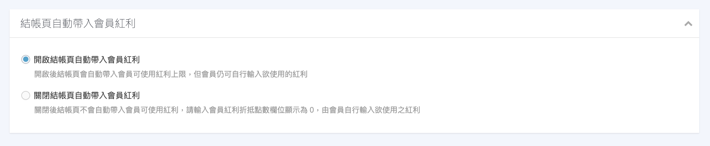

# 設定紅利點數
透過紅利點數建立會員回饋機制，吸引新客首購並提升舊客回購率。
{ .subtitle }

{ .hero-page }

!!! tip "應用情境"
	- **提升忠誠度**：設定消費回饋，讓顧客在每次消費後獲得點數，增加回訪誘因。
	- **節慶促銷**：全館發送紅利點數，營造限時購物的急迫感。
	- **補償或獎勵**：手動發送點數給特定會員，作為客服補償或專屬活動獎勵。

## 使用須知

- **發送計算基準**：紅利點數贈送以「不含運費」的結帳金額計算。
- **生效時間**：修改紅利發送規則後，僅適用於「設定後」產生的行為，不影響已發送的點數。
- **匯入限制**：紅利點數一旦發送或刪除，系統無法自動撤回或復原，請謹慎操作。
- **歸戶時間**：訂單狀態須變更為「已結案」，紅利點數才會正式匯入會員帳戶供其使用。

    > 退貨狀態為「不須退貨」時，亦適用此規則。

## 操作流程

1. 登入 CYBERBIZ 管理後台，前往 **行銷活動 > 全館折扣-紅利 & 優惠券**。
2. 下拉找到 **會員紅利點數** 區塊，將功能切換為 `開啟`。
3. 設定核心參數：
    - **紅利折抵換算**：設定 `X 點 = NT 1`（預設為 1:1）。
    - **最低消費門檻**：訂單需滿多少元才可使用紅利。
    - **其他通路有效訂單套用消費紅利發送**：當手動替會員新增 [其他通路有效訂單](../../members/manage-member-profiles.md#2-其他通路訂單) 時是否同步發送紅利。**(企業版專用)**
    - **單筆訂單折抵上限**：可設定固定金額或訂單金額的百分比。**(PLUS、企業版專用)**
    - **每一筆紅利的有效期限**：設定點數有效天數（0 代表永不失效）。
    > 此期限設定亦會同步套用於「註冊禮發送的紅利」。

   { .screenshot }

## 紅利發送方式

### A. 全站消費回饋（自動發送）

在 **會員紅利點數** 區塊設定「消費門檻」與「贈送點數」。

- **範例**：設定每消費 100 元贈送 10 點。
- **邏輯**：系統會依比例累計。消費 1000 元得 100 點；消費 999 元則得 90 點。

### B. 全館發送（針對所有會員）

1. 在同頁面點選 **全館發送紅利點數** 展開欄位。
2. 輸入點數、期限與發送名稱，點選 **確認新增**。
3. 系統將自動匯入點數至所有已註冊會員帳戶。

{ .screenshot }

### C. 手動發送（針對特定會員）

前往 **會員 > 所有會員**。

=== "單一發送"

    點進特定會員個人頁面，在「紅利點數」欄位點選 **新增紅利點數**。

    { .screenshot }

=== "篩選發送"

    使用篩選器選出特定群組（如：VIP 會員），批次新增點數。

    

    - { .screenshot }
    - { .screenshot }

    

### D. EXCEL 批次發送

!!! info "使用須知"
    - 此功能僅限 **企業版** 使用。
    - 商家若有 **開啟外部紅利** 功能，則無法使用批次匯入紅利。若有發送紅利的需求，請直接於您的外部中台系統操作。
    

1. 下載範本，依範本內提供欄位規格填寫。

    { .screenshot }

2. 填入會員的 Email 或手機、指定的活動名稱、預計發送的紅利等欄位。

    { .screenshot }

3. 上傳 Excel。系統會發送 Email 通知匯入結果，匯入成功後立即發送紅利給指定會員。

## 設定商品級折抵上限

您可以針對個別商品設定紅利折抵上限。**若欲開放該商品進行紅利折抵，請填寫可折抵的點數數值**；**若此欄位保留為 0，則代表該商品不開放紅利折抵**。

1. 前往 **商品 > 所有商品**，點進指定商品。
2. 進入 **款式管理**，在 **紅利折抵** 欄位輸入該款式最高可折抵的「點數」。
> **系統判定邏輯**：當「全館折抵上限」與「商品折抵上限」同時存在時，系統將採取 **較嚴格**（數值較低）的限制。

!!! tip "如何批次修改此欄位"
    您可 [大量匯出商品 Excel 表格](../../products/bulk-operations/batch-update-product-descriptions-shipping.md#匯出商品-excel-表格)，編輯 `商品款式紅利最高折抵` 欄位後，[匯入 Excel 檔案](../../products/bulk-operations/batch-update-product-descriptions-shipping.md#上傳-excel-檔案)，完成批次編輯。

=== "後台設定畫面"

    { .screenshot }

=== "前台結帳畫面"

    { .screenshot }

## 結帳頁自動帶入紅利

系統預設 **開啟** 結帳頁自動帶入會員紅利，商家可設定當會員進入結帳頁面時，系統是否自動帶入該會員目前可使用的紅利點數上限。

1. 前往 **金物流 > 結帳頁 & 物流設定**。
2. 展開 **購物車相關設定** 區塊，找到 **結帳頁自動帶入會員紅利**。
3. 根據需求選擇設定：
    - **開啟結帳頁自動帶入會員紅利**（系統預設）：結帳頁將自動帶入會員可使用的紅利上限，但會員仍可自行輸入欲使用的紅利。
    - **關閉結帳頁自動帶入會員紅利**：關閉後結帳頁不會自動帶入會員可使用紅利，「請輸入會員紅利折抵點數」欄位將預設顯示為 `0`，需由會員自行輸入欲使用之紅利。

=== "後台設定畫面"

    { .screenshot }

=== "前台結帳畫面"

    { .screenshot }

## 系統邏輯說明

### 折扣套用順序

紅利點數的折抵順序在 **所有折扣優惠之後**。意即系統會先計算完所有促銷活動、優惠券後，最後才扣除紅利點數。

### 取消處理

當訂單尚未出貨時，商家或消費者均可取消訂單。系統針對取消訂單的紅利處理規則如下：

| 情境 | 訂單中使用的紅利 | 消費獲得的紅利 |
| :--- | :--- | :--- |
| **取消訂單** | 自動歸還至消費者帳戶 | 若訂單尚未結案，則不發送回饋 若已結案且點數已使用，則不予扣回 |

### 退貨處理

商家可自訂退貨時的紅利處理規則：

| 情境 | 訂單中使用的紅利 | 消費獲得的紅利 | 
| ---- | -------------- | ------------- |
| **已退貨訂單** | 可設定是否返還(預設不返還) | 結案時不發送紅利 | 
| **部分退貨訂單** | 可設定是否返還(預設不返還) | 可設定是否發送(預設不發送) |

!!! info "適用版本"
    - **已退貨訂單** 可設定是否返還開關，僅限 **PLUS 版與企業版** 專用。
    - **部分退貨訂單** 可設定是否返還開關，僅限 **企業版** 專用。

請前往 **金物流 > 結帳頁 & 物流設定 > 訂單相關設定** 進行設定。

{ .screenshot }

### 結案後執行退貨

若訂單已結案才進行退貨，購物所獲得的紅利點數 **不會自動從會員帳戶中扣除**。

!!! tip "建議操作"
    - 商家需前往會員個人頁面 [手動刪除該筆紅利](../../members/manage-member-profiles.md#1-紅利點數派發與管理)。
    - 建議等訂單過退換貨期間，確定已無退貨需求後，再按下 **結案訂單**，以確保紅利發放的準確性。

!!! warning "串倉商家注意"
    此自動返還功能不支援串倉商家。串倉訂單退貨時，系統皆不會自動返還或發送紅利點數。

## 管理與分析

### 查詢紅利點數

=== "商家端"

    商家可於後台查詢、新增或刪除個別會員的紅利點數。

    1. 前往 **會員 > 所有會員**，搜尋並點進指定會員。
    2. 在該會員個人頁面中查看 **紅利點數列表**。
    
    { .screenshot }
    { .screenshot }

=== "會員端"

    會員可於官網前台自行查詢點數紀錄。

    1. 前往 **我的帳戶 > 紅利點數**。
    
    { .screenshot }

### 紅利點數兌換比率

系統會根據設定的比例，自動換算並顯示對應的金額：

#### 使用須知

- 此功能僅限 **企業版專用**。
- 兌換匯率僅於「紅利折抵」時生效。
- 若商家更改換算匯率，將直接影響消費者帳戶內現有紅利的折現價值。

#### 前台顯示範例

- **會員中心**：顯示可用點數及約略等值金額。

    { .screenshot }

- **商品頁面**：顯示該商品最高可折抵的點數及約略等值金額。

    > 於後台設定商品「紅利點數折抵上限」時，填寫數值為 **點數** 而非金額。

    { .screenshot }

- **結帳頁面**：顯示折抵點數及實際扣除的金額。

    { .screenshot }

#### 報表匯出欄位

可於 [匯出訂單報表](../../orders/reports/export-order-report.md) 時，將同步呈現紅利折抵與金額換算之詳細欄位：

- **紅利折抵**：單位為紅利點數。
- **商品紅利折扣總金額**：紅利點數經匯率換算後之實際折抵金額。

{ .screenshot }

### 查詢與匯出報表

1. 前往 **分析報表 > 行銷活動分析 > 紅利分析**。

2. 點擊 **匯出紅利圖表**。

    { .screenshot }

3. 系統將發送 Excel 報表至管理員信箱。

    > 匯出區間不得超過 180 天。

    { .screenshot }

## 更多操作

- :lucide-bell-ring:{ .lg }
  [__設定紅利點數到期通知__](../purchase-restrictions/coupon-and-bonus-points-expiry-notification.md)
  設定紅利點數到期提醒，引導顧客在點數失效前回到官網進行折抵消費。

