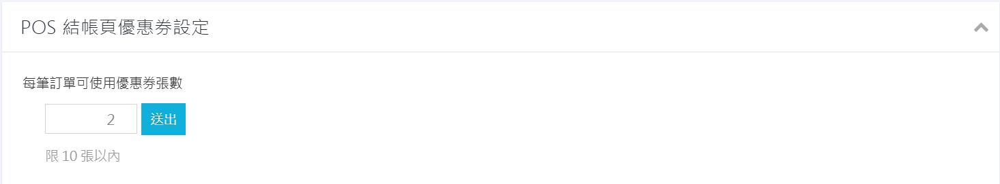
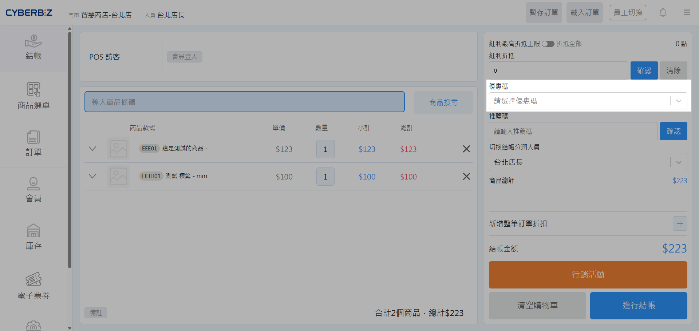
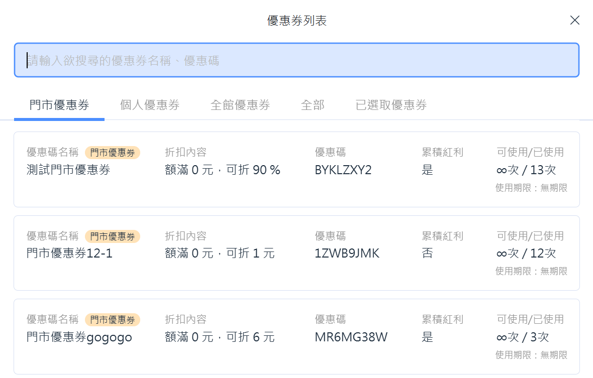
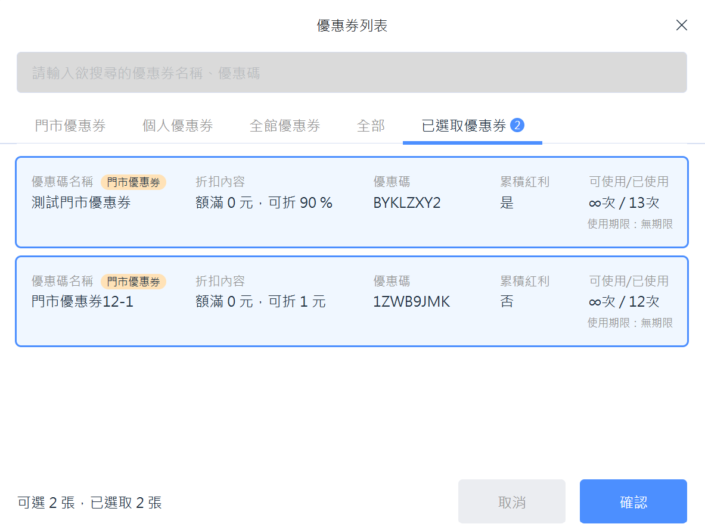
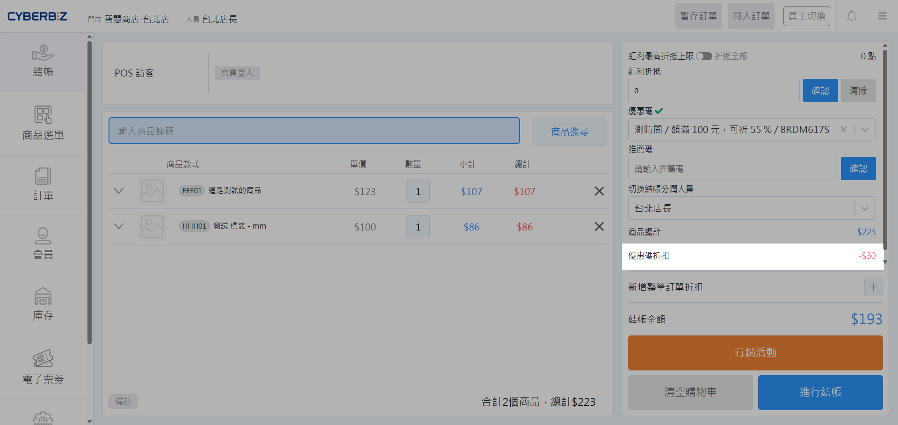

# 多張優惠券併用設定指南
 設定單筆訂單使用多張優惠券或優惠碼，包含張數上限設定、折抵邏輯計算範例及前台操作流程。
{ .subtitle }

[:lucide-layers:{ title="適用產品" }](../../resources/conventions#適用產品){ title="圖示慣例" } | 品牌官網
[:lucide-tag:{ title="適用方案" }](../../resources/conventions#適用方案) | 高手 PLUS / 企業  
[:lucide-layers:{ title="適用產品" }](../../resources/conventions#適用產品){ title="圖示慣例" } | 智能 POS
{ .doc-badge }

## 使用須知

- **通路限制**：多張優惠券併用功能支援 **EC 官網** 與 **POS 系統**，兩通路須分別設定張數上限。
- **併用規則**：多張優惠券併用不影響其與「紅利點數」或其他「行銷活動」的併用設定。
    

## 操作流程

=== "EC"

    1. 前往 **金物流 > 結帳頁 & 物流設定 > 結帳頁優惠券設定**。
    2. 設定 **每張訂單至多可使用的優惠券/碼數量**。

        > 此數量為優惠券與優惠碼的合併總數，系統不支援分開設定各自的使用上限。

        { .screenshot }

=== "POS"

    1. 前往 **金物流 > 結帳頁 & 物流設定 > POS 結帳頁優惠券設定**。
    2. 設定 **每張訂單至多可使用的優惠券/碼數量**。

        > 此數量為優惠券與優惠碼的合併總數，系統不支援分開設定各自的使用上限。

        { .screenshot }

## 多優惠券折抵邏輯

當訂單同時套用多張優惠券時，系統依以下規則計算折扣：

| 邏輯類型 | 說明 | 範例 |
| :--- | :--- | :--- |
| **計算順序** | 先扣除「固定金額」再計算「百分比折扣」 | 100 元訂單套用「8 折」與「折 20 元」，計算為 `(100-20) x 0.8 = 64` |
| **門檻判定** | 以「折抵前」的訂單金額作為門檻基準 | 1500 元訂單可同時套用門檻為 1000 元、900 元、800 元的三張券 |
| **標籤限制** | 綁定標籤的優惠券僅針對該標籤商品進行折抵 | 若購物車包含一般商品 A 與標籤商品 B，標籤優惠券僅會計算商品 B 的折抵金額 |

!!! example "多張優惠券併用計算範例"
    **情境假設：**

    - 購物車內容：商品 A （ 1000元，一般商品）、商品 B （ 500元，綁定 `特定標籤`）
    - 持有優惠券：
        1. **全館券**：折 50元
        2. **個人標籤券**：9 折 （僅限 `特定標籤`）
        3. **全館標籤券**：73 折 （僅限 `特定標籤`）

    **運算方式：**

    1. **套用全館券 （50元）**：依商品金額比例分攤，商品 A 折 34元、商品 B 折 16元。
    2. **套用個人標籤券 （9 折）**：僅針對商品 B 剩餘金額折抵，（500 - 16） ✕ 10% = 48元。
    3. **套用全館標籤券 （73 折）**：僅針對商品 B 剩餘金額折抵，（500 - 16 - 48） ✕ 27% = 117元。

    **最終結果：**

    - **商品 A**：總共折抵 34元。
    - **商品 B**：總共折抵 16 + 48 + 117 = 181元。

## 前台結帳操作

=== "EC"

    1. 顧客在結帳頁點擊 **選擇優惠券或輸入優惠碼**。

        { .screenshot }

    2. 彈窗將預設顯示該會員擁有的個人優惠券（依到期日排序）。

        { .screenshot }

    3. 顧客可勾選多張欲使用的優惠券，若達張數上限，其餘選項將變更為不可勾選。
    4. 套用後可即時檢視各券的折抵金額，並支援隨時更換或刪除。

        { .screenshot }

=== "POS"

    1. 店員在結帳頁點擊 **請選擇優惠碼**。

        { .screenshot }

    2. 彈窗將預設顯示 **門市優惠券** 列表。

        { .screenshot }

    3. 店員可勾選多張欲使用的優惠券；若達張數上限，其餘選項將變更為不可勾選。

        > 可切換至 **已選取優惠券** 頁籤，檢視目前已勾選的優惠券。

        { .screenshot }

    4. 確認後套用，即可即時查看各券折抵金額，並可隨時更換或取消。

        { .screenshot }