## 免運費說明 { #intro-free-shipping }

免運費是提升顧客下單意願、拉高客單價的重要行銷工具。您可以依據不同的行銷目的，選擇最適合的免運方式：

- **鼓勵顧客湊單**：「全館運費門檻免運」
- **特定商品促銷**：「指定商品免運」

各種方式可單獨或搭配使用。

!!! info "提示"
    免運設定分散在不同頁面：全館與物流相關免運在「金物流」設定。本文彙整各入口，協助您快速找到需要的設定。

## 免運功能總覽 { #overview-free-shipping }

| 免運方式 | 適用情境 |
| :-- | :-- |
| [全館運費門檻免運](#operate-free-shipping-home-threshold) | 鼓勵顧客湊滿指定金額或重量享免運 |
| [超商取貨免運](#operate-free-shipping-cvs) | 針對超商取貨顧客設定滿額免運 |
| [串接物流免運](#operate-free-shipping-integrated) | 黑貓、新竹、宅配通等指定物流滿額免運 |
| [指定商品免運](#operate-free-shipping-product) | 顧客購買特定商品即整筆訂單免運 |

## 使用前提與限制 { #prerequisites-free-shipping }

!!! plan "方案 / 開通條件"
    * **指定商品免運**：需高手版、各 PLUS版（進階 PLUS、高手 PLUS、專業 PLUS）或企業版。
    <!-- * **免運券（優惠碼）**：需 PLUS版 或 企業版。 -->
    <!-- * **自動套用免運券**：需高手 PLUS版 或 企業版；系統在結帳頁自動帶入，不需顧客手動輸入序號。 -->
    <!-- * **VIP 專屬免運**：需開通 VIP 會員分級功能（企業版）。 -->

## 操作步驟 { #operate-free-shipping }

免運設定分散於「金物流」與「商品」設定頁面，以下依使用情境分別說明。

### 全館運費門檻免運 { #operate-free-shipping-home-threshold }

??? info "串接物流不適用此設定"
    以下「訂單金額／訂單重量」的切換僅存在於 **自訂宅配物流** 的編輯頁。串接物流（黑貓、新竹、宅配通等）的編輯頁 **沒有** 這兩個選項，僅以訂單金額單一門檻計算免運，設定方式請見 [設定串接物流免運](#operate-free-shipping-integrated)。

針對宅配物流，讓整間店的顧客只要訂單達到指定金額或重量，即享免運。

前往後台「金物流」>「宅配物流」> 「自訂物流」，點選要設定的物流「編輯」：

1. **選擇免運依據：** 於運費設定中，選擇以 **「訂單金額運費設定」** 或 **「訂單重量運費設定」** 作為條件，兩者建議擇一設置[^both-conditions]。

    === "訂單金額"

        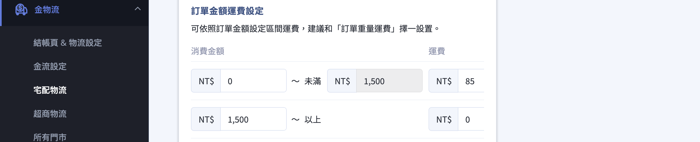{ title="訂單金額運費設定" }

        ??? example "設定範例"

            如果需設置全館不論訂單金額都享有免運，請將消費金額設定中的起始金額輸入 0，運費的部分也請輸入 0。

            儲存後即可達到下單 $0 以上就不會收取運費的效果。

    === "訂單重量"

        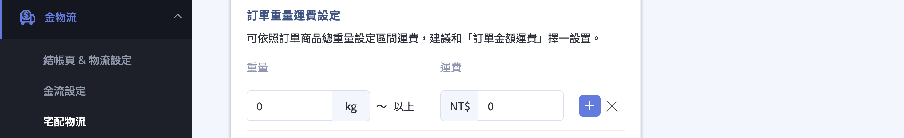{ title="訂單重量運費設定" }

        ??? example "設定範例"

            如果需設置全館不論訂單重量都享有免運，請將訂單重量運費設定中的起始重量輸入 0，運費的部分也請輸入 0。

            儲存後即可達到訂單 0 kg 以上就不會收取運費的效果。

    ??? warning "溫層限制"
        如果新增的免運物流設定中有設置溫層，則僅有該溫層的商品可以套用此免運設定。

        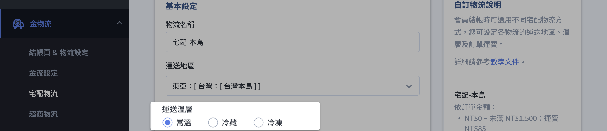{ title="溫層限制示意" }

2. **設定免運門檻：** 點擊 **「新增運費」**，填入免運起始金額（或重量），並將該區間的「運費」設為 0，代表達此門檻即免運。

    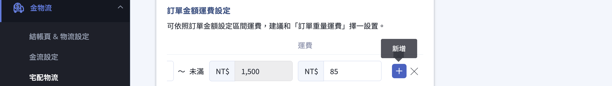{ title="設定免運門檻" }

3. **設定不限金額免運：** 若要全館一律免運，將起始金額（或重量）設為 0、運費也設為 0 後儲存即可。
4. **儲存：** 確認後儲存設定即生效。

[^both-conditions]: 若同時設定「訂單金額」與「訂單重量」兩種條件，系統會以對顧客較有利（運費較低）的方式從優計算。

---

### 超商取貨免運 { #operate-free-shipping-cvs }

針對超商取貨的顧客，設定滿額免運。每個超商物流各自獨立設定。

前往後台「金物流」>「超商物流」，點選要設定的超商物流「編輯」：

1. **開啟免運設定：** 於「免運設定」將開關切換為 **「開啟」**。
2. **填入免運門檻：** 於下方填入免運的訂單金額門檻，達此金額的超商取貨訂單即免運[^cvs-threshold]。

    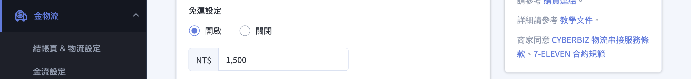{ title="超商免運門檻設定" }

3. **關閉免運：** 若要取消免運，將「免運設定」切回 **「關閉」** 即可。
4. **儲存：** 儲存後設定生效。

[^cvs-threshold]: 超商取貨免運以「訂單金額」單一門檻計算，與宅配可設定多個區間的方式略有不同。

---

### 串接物流免運 { #operate-free-shipping-integrated }

針對黑貓、新竹物流、宅配通等 CYBERBIZ 串接的物流，可個別設定滿額免運。

前往後台「金物流」>「宅配物流」>「串接物流」，點選要設定的物流（如黑貓貨到付款）「編輯」：

1. **開啟免運設定：** 於「免運設定」填入免運門檻金額。

    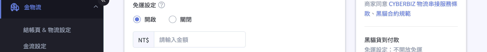{ title="串接物流免運設定" }

2. **設定運費：** 於下方運費設定填入未達門檻時的運費。系統會綜合免運設定與運費設定，只要其一先達到免運門檻，即在結帳頁從優提示顧客[^integrated-priority]。

    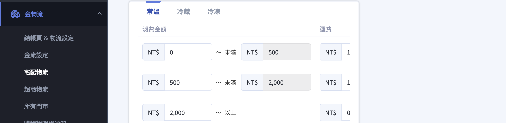{ title="串接物流運費設定" }

3. **開啟結帳頁提示（選用）：** 開啟 **「結帳頁提示免運門檻」**，於結帳頁顯示免運門檻金額。

    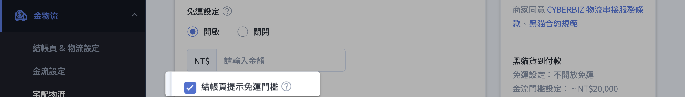{ title="結帳頁免運門檻提示" }

4. **儲存：** 儲存後生效。

[^integrated-priority]: 「從優提示」指當免運設定與運費設定的條件不同時，系統會以對顧客較有利的門檻在結帳頁呈現。

---

### 指定商品免運 { #operate-free-shipping-product }

[:lucide-tag:{ title="適用方案" }](../../../resources/conventions#適用方案) | 高手 / PLUS版 / 企業
{ .doc-badge }

讓顧客只要購買特定商品，整筆訂單即享免運。作法是先建立一組運費為 0 的物流，再將商品綁定該物流。

前往後台「金物流」>「宅配物流」>「自訂物流」，點選 **新增自訂物流**：

1. **建立免運物流：** 依 [全館運費門檻免運][operate-free-shipping-home-threshold]{ data-preview } 的方式，新增一組運費為 0（訂單金額或訂單重量）的物流，作為「免運配送方式」。

    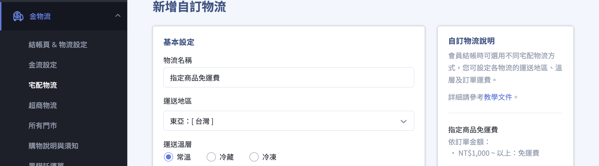{ title="建立免運物流" }

    !!! info "自動套用規則"
        全部符合「運送地區」/「運送溫層」的商品，皆會自動套用設置的免運規則。

2. **單一商品綁定：** 前往「商品」> [編輯商品](../products/create-and-manage/create-update-products.md#operate-product-edit-entry){ data-preview } > [「設定」分頁](../products/create-and-manage/create-update-products.md#operate-product-edit-settings){ data-preview }，捲動至 **「溫層和物流配送設定」**，於「物流綁定狀態」啟用要套用的免運配送方式後儲存。

    { title="單一商品綁定免運物流" }

3. **大量商品綁定：** 透過 **「匯出商品」** 下載 Excel，於 **「商品運送名稱」** 欄位填入免運物流的名稱，再以 Excel 匯入更新商品[^product-excel]。詳細操作步驟請參考 [Excel 大量匯入商品](../products/bulk-operations/excel-import-products.md){ title="Excel 大量匯入商品" }。

    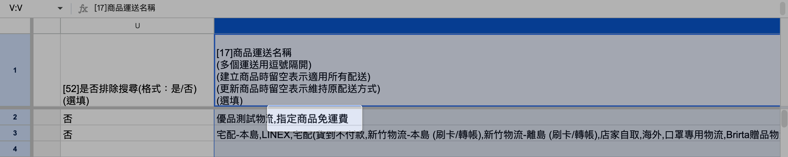{ title="大量商品綁定免運物流" }

    ??? success "驗證匯入結果"
        完成匯入後，可透過以下方式確認是否設定成功（此為檢查步驟，若不需檢查即可跳過）：

        1. 進入商品編輯頁的 [「設定」分頁](../products/create-and-manage/create-update-products.md#運送溫層與物流配送)，確認「物流綁定狀態」是否已正確套用免運配送方式。
        2. 前往官網商店頁面，點選已綁定免運配送方式的商品，將商品加入購物車並進入結帳流程，確認結帳時是否顯示免運。

            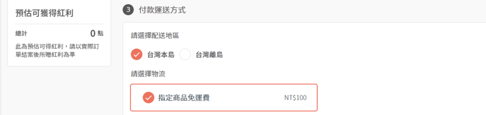{ title="前台結帳免運驗證" }

[^product-excel]: 「商品運送名稱」欄位多個名稱以逗號隔開；建立商品時留空代表適用所有配送方式，更新商品時留空則維持原本的配送方式。

---

<!-- ### 免運券 <small>優惠碼</small> { #operate-free-shipping-coupon }
[:]
 [:lucide-tag:{ title="適用方案" }](../../../resources/conventions#適用方案) | PLUS版 / 企業
{ .doc-badge }

免運券可搭配指定物流、指定商品或標籤使用，是常見的催單工具。

前往後台「行銷活動」>「優惠碼」>「新增優惠碼」：

1. **選擇種類為免運：** 於「優惠碼種類」選擇 **「免運」**。
2. **設定使用門檻：** 於 **「消費使用門檻」** 填入訂單需達的金額，顧客滿額才能使用。
3. **綁定商品或標籤（選用）：** 透過 **「綁定商品或商品標籤」**，限制只有購買特定商品時整張訂單才免運。
4. **綁定物流（選用）：** 於 **「綁定物流」** 限制僅特定配送方式適用免運；此欄留空則所有物流皆適用免運。
5. **儲存並提供給顧客：** 完成後儲存，將免運券序號提供給顧客或搭配活動發放。

!!! tip "技巧"
    若您使用高手 PLUS 版或企業版，可另外開啟「自動套用免運券」，系統會在顧客進入結帳頁時自動帶入全館型免運券，不需顧客手動輸入序號。此設定位於「金物流」的結帳頁相關設定中。

---

### VIP 專屬免運 { #operate-free-shipping-vip }

為特定等級的會員提供專屬免運，回饋忠實顧客（需開通 VIP 會員分級功能）。

前往 VIP 會員分級設定，編輯要設定的會員等級：

1. **開啟訂單免運費：** 於等級的優惠設定中，開啟 **「訂單免運費」**。
2. **設定免運門檻：** 於 **「免運門檻」** 填入該等級專屬的免運金額；若免運門檻留空，則該等級會員一律免運[^vip-threshold]。
3. **設定併用限制：** 於 **「與其他行銷活動併用限制」** 選擇此 VIP 免運是否要與全館折扣、單品折扣等其他行銷活動併用。
4. **儲存：** 儲存後，符合條件的會員結帳時即自動套用。

[^vip-threshold]: 未填寫免運門檻時，代表該 VIP 等級的會員不限金額皆享免運。
 -->

## 重要規範與限制 { #specs-free-shipping }

!!! warning "注意"
    * **配送方式需一致：** 若訂單中包含「加價購」或「滿額贈」商品，這些商品必須與「指定免運商品」綁定相同的配送方式（物流與溫層），否則系統會拆分購物車，導致無法享有免運。
    * **重量未填視為 0：** 若採用「訂單重量」設定免運，但商品未填寫重量，系統會以 0 計算，可能導致意外全館免運。請務必確認商品重量資料完整。
    * **免運從優提示：** 當同時存在多種免運條件時，系統會以對顧客較有利的門檻在結帳頁提示。

## 常見問題 { #faq-free-shipping }

??? quote "設定了全館免運，為什麼有些訂單還是要收運費？"
    { #faq-free-shipping-still-charged }
    可能有兩種原因：訂單金額或重量未達您設定的免運門檻；或訂單中含有綁定不同配送方式的商品（如加價購、滿額贈），導致購物車被拆分。請確認：

    - 顧客選擇的配送方式確實已設定免運。
    - 加價購 / 滿額贈商品與主商品綁定相同的配送方式與溫層。

<!-- ??? quote "免運券建立時找不到「免運」種類選項？"
    { #faq-free-shipping-coupon-type-missing }
    「免運」種類需要 PLUS 版或企業版才會顯示。若「優惠碼種類」沒有「免運」選項，代表目前方案尚未開通免運券功能，請洽 CYBERBIZ 業務窗口確認。 -->

??? quote "指定商品免運要怎麼一次設定很多商品？"
    { #faq-free-shipping-product-bulk }
    透過「匯出商品」下載 Excel，在「商品運送名稱」欄位填入免運物流的名稱（多個以逗號隔開），再以 Excel 匯入更新商品。此欄留空代表適用所有配送方式。

<!-- ??? quote "VIP 免運可以和折扣活動一起用嗎？"
    { #faq-free-shipping-vip-combine }
    可以。在 VIP 等級設定的「與其他行銷活動併用限制」中，您可以自行選擇 VIP 免運是否與全館折扣、單品折扣等其他行銷活動併用。 -->
