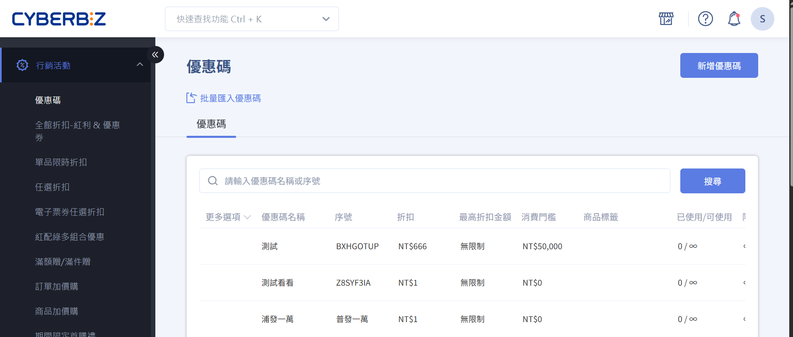

# 行銷成長

 
 
<big>__打造完整行銷與促銷策略__</big>  
設定優惠活動、管理廣告投放，追蹤會員互動與銷售成效。  
 
[快速上手 :lucide-circle-arrow-right:](quickstart.md)

---

=== "優惠活動"

	

	
	-   :lucide-tag: __折扣與促銷__
	    
	    ---
	    

	    
	    [設定單品折扣](設定單品折扣.md)  
	    [設定分類或群組折扣](分類折扣設定.md)  
	    [限時優惠活動](限時優惠活動.md)  
	    
	    

	
	-   :lucide-circle-percent: __VIP / 會員優惠__
	    
	    ---
	    

	    
	    [設定 VIP 專屬價格](VIP專屬價格.md)  
	    [會員專屬折扣群組](會員折扣群組.md)  
	    
	    

	
	-   :lucide-circle-plus: __加價購與組合優惠__
	    
	    ---
	    

	    
	    [加價購群組設定](加價購群組.md)  
	    [訂單加價購設定](訂單加價購.md)  
	    
	    

	
	

=== "廣告與推播"

	

	
	-   :lucide-bell-ring: __訊息推播__
	    
	    ---
	    

	    
	    [會員訊息推播設定](會員訊息推播.md)  
	    [行銷活動通知設定](行銷活動通知.md)  
	    
	    

	
	-   :lucide-mail: __電子郵件行銷__
	    
	    ---
	    

	    
	    [設定電子報活動](電子報設定.md)  
	    [會員分群電子郵件發送](會員分群電子郵件.md)  
	    
	    

	
	-   :lucide-facebook: __社群與廣告串接__
	    
	    ---
	    

	    
	    [Facebook / Instagram 廣告設定](社群廣告設定.md)  
	    [追蹤廣告成效與 ROI](廣告成效追蹤.md)  
	    
	    

	
	

=== "成效分析"

	

	
	-   :lucide-bar-chart: __銷售報表__
	    
	    ---
	    

	    
	    [查看行銷活動銷售報表](銷售報表.md)  
	    [會員互動與回購分析](會員互動分析.md)  
	    
	    

	
	-   :lucide-pie-chart: __流量分析__
	    
	    ---
	    

	    
	    [追蹤網站訪客來源](網站流量追蹤.md)  
	    [分析購物行為與轉換率](購物行為分析.md)  
	    
	    

	
	-   :lucide-trending-up: __成長策略__
	    
	    ---
	    

	    
	    [設定自動行銷規則](自動行銷規則.md)  
	    [分析銷售與會員成長趨勢](銷售會員成長分析.md)  
	    
	    

	
	

=== "系統與權限"

	

	
	-   :lucide-key: __權限管理__
	    
	    ---
	    

	    
	    [設定行銷人員權限](行銷人員權限.md)  
	    [控制活動編輯與查看權限](活動編輯查看權限.md)  
	    
	    

	
	-   :lucide-shield-check: __安全管理__
	    
	    ---
	    

	    
	    [啟用行銷活動審核流程](活動審核流程.md)  
	    [活動資料備份與恢復](活動資料備份.md)  
	    
	    

	
	

	
