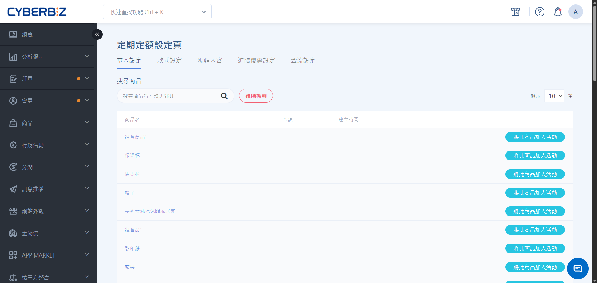
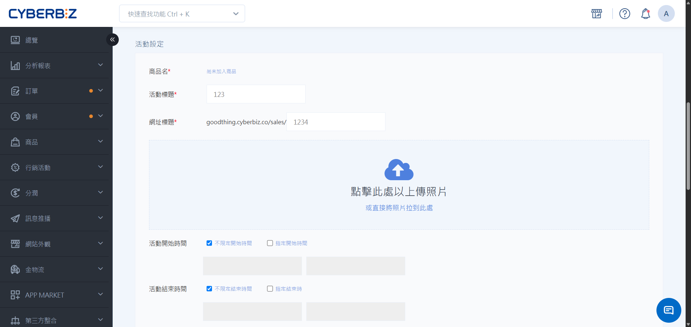
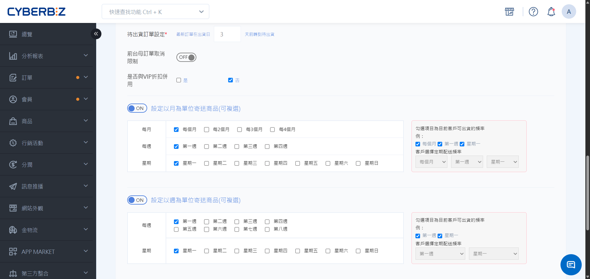

# 定期訂購活動頁
說明如何建立訂閱制活動頁面，包含基本設定、期數優惠、金流限制及備貨期配置，協助品牌創造穩定營收。
{ .subtitle }

[:lucide-tag:{ title="適用方案" }](../../../resources/conventions#適用方案) | 所有 PLUS 版 / 企業版
{ .doc-badge }

{ .hero-page }

!!! info "版本差異說明"
    - 「定期訂購」在 PLUS 方案中屬於選配模組（11 選 2），商家需確認已選配該模組方可使用。企業版則直接內建此功能。

!!! tip "應用情境"
    - **穩定回購**：針對消耗品（如益生菌、衛生紙）設定每月配送，省去顧客重複下單的麻煩。
    - **長期訂閱優惠**：透過「指定期數折扣」激勵顧客持續訂閱，例如第 3 期起打 9 折。
    - **會員回饋**：定期定額訂單結案後，系統可自動發送紅利點數，強化顧客忠誠度。

## 使用須知

在開始設定前，請務必了解以下系統規則與限制：

- **1 元刷卡授權**：消費者初次下訂時，系統會呈現 1 元刷卡授權以驗證卡片，此金額 **實際不會請款亦不會扣費**，商家無須執行退刷。
- **不支援行銷活動**：定期定額頁面 **無法套用** 系統其他行銷活動和分潤功能。
- **物流限制**：超商物流僅支援常溫溫層。
- **金流限制**：
    - 支援：CYBERBIZ PAYMENTS、貨到付款、Aftee、GMO 3D驗證、幕後授權。
    - 不支援：分期付款。
    - 特殊案例：若未使用 CYBERBIZ PAYMENTS，需自行串接金流（如綠界、藍新）並申請開通自訂物流貨到付款。
- **版型相依**：活動頁面會套用目前使用的版型。若更換網站版型，需重新建立新的活動頁面。

## 步驟一：定期定額購物車設定

此設定決定了消費者進入活動頁時，商品預設的購買數量。

1. 登入 CYBERBIZ 管理後台，前往 **金物流 > 結帳頁 & 物流設定 > 定期定額購物車設定**。

| 設定選項 | 說明 | 消費者端呈現 |
| :--- | :--- | :--- |
| **數量預設為 1** | 消費者進入頁面時，商品數量已填入 1 | 僅能選擇增加數量，無法不購買任一商品 |
| **數量預設為 0** | 消費者進入頁面時，商品數量皆為 0 | 可在組合中自由選擇欲購買的商品項目 |

> **注意**：設定後會立即套用至所有活動頁，但不會影響已成立的舊訂單。

{ .screenshot }

## 步驟二：建立定期定額活動頁

1. 登入 CYBERBIZ 管理後台，前往 **行銷活動 > 定期訂購活動頁**。
2. 點選右上角 **新增頁面**。
    { .screenshot }
3. 填寫 **標題**（前台顯示名稱）與 **網址標題**（自訂 URL 後綴）。
    { .screenshot }
4. 儲存後即可進入詳細設定頁。
    { .screenshot }

## 步驟三：活動詳細設定

### 1. 基本設定

- **搜尋商品**：將商品加入頁面，單一頁面 **最多加入 10 個商品**。

    { .screenshot }

- **活動標題**：自訂活動名稱，此名稱將顯示於前台頁面標題。
- **網址標題**：自訂該活動頁的 URL 後綴路徑。
- **圖片上傳**：上傳活動頁的主視覺圖片（Banner）。
- **活動時間**：設定開始與結束時間。結束後會員無法再看到頁面，但 **已成立的子訂單會保持有效**，除非由商家或會員手動取消。

    { .screenshot }

- **待出貨訂單設定（備貨期）**：
    - 例如設定為 3 天：若 10/31 為出貨日，系統會在 10/27 正式轉單請款（轉單日與出貨日不計入備貨期）。

    { .screenshot }

- **前台母訂單取消限制**：
    - 可設定顧客在第 N 期之後才可於前台自行取消母訂單。若未開啟，顧客僅能取消單一子訂單，整筆母訂單需由店家後台取消。

        !!! info "快速理解"
            此處設定的是 **定期訂單期數**（第幾次配送），而非 **實際訂單數**（第幾張成功訂單）。即使訂單建立失敗（例如扣款失敗），該輪次依然會被計入期數中。
            
            範例：
            設定 **1**，則系統於 **第 2 期** 後可取消訂單。即使第 1 期訂單成立失敗，第 2 次配送期一到，顧客仍可取消母訂單。

    { .screenshot }
    
- **是否與 VIP 折扣併用**：若開啟，系統會判斷母訂單是否享有 VIP 折扣/免運。

- **寄送時間單位**：設定以「月」、「週」或「特定日期」為單位寄送商品（可複選）。
    { .screenshot }

### 2. 款式設定

在此處設定該活動頁專屬的商品價格，並選擇是否在購物車內容中顯示。

{ .screenshot }

### 3. 編輯內容

提供進階語法編輯功能，供具備技術背景的人員自訂定期定額頁面的版面樣式。

!!! danger "重要提醒"
    CYBERBIZ 不提供任何關於此區塊的修改或復原教學。若需調整語法，請務必由貴司內部的技術人員執行，並建議在修改前自行備份原始代碼。

{ .screenshot }

### 4. 進階優惠設定

- **指定期數送贈品**：可設定 **指定期數** 或 **指定區間** 配送時，額外贈送特定商品。

    { .screenshot }

- **指定期數折扣**：可設定 **指定期數** 或 **指定區間** 配送時，享有額外折數優惠。

    { .screenshot }

!!! warning "操作注意事項"
    - **期數優惠防重疊限制**：已設定優惠的期數，不可重複建立相同類型的優惠。
    - **訂單排除機制**：實際配送次數計算時，會排除「取消」或「退貨」的訂單。

!!! example "退貨後的期數判定與排除機制"
    當定期購訂單發生退貨時，系統會重新計算有效訂單數，但會自動排除「已領取過」的贈品。

    **設定範例**：
    
    - **第 1 期**：送贈品 A
    - **第 2 期**：送贈品 B
    - **第 3 期**：送贈品 C

    **訂單演變與判定流程**：

    | 訂單期數 | 系統判定邏輯 | 贈品發送結果 |
    | :--- | :--- | :--- |
    | **第 1 次成立** | 正常第 1 期 | ✅ **送贈品 A** |
    | **第 2 次成立** | 正常第 2 期 | ✅ **送贈品 B** |
    | **發生退貨** | **前 2 期訂單皆辦理退貨** | - |
    | **第 3 次成立** | 重新計算後視為「第 1 期」 | ✕ **不送贈品** (理由：贈品 A 已領取過) |
    | **第 4 次成立** | 重新計算後視為「第 2 期」 | ✕ **不送贈品** (理由：贈品 B 已領取過) |
    | **第 5 次成立** | 重新計算後視為「第 3 期」 | ✅ **送贈品 C** (理由：贈品 C 未曾領取) |

    > 系統會回溯所有歷史紀錄。若因退貨導致期數重新計算，只要該特定贈品曾隨該次訂閱成功出貨過，系統就不會重複發送。

### 5. 金流設定

勾選欲提供給此活動的付款方式。

{ .screenshot }

!!! tip "設定提示"
    若未看到預期的付款選項，請先至 **金物流 > 金流設定** 中啟用金流，或前往 **金物流 > 宅配物流 / 超商物流** 啟用物流，該選項才會出現在此清單中。

## 常見問題

??? quote "為什麼顧客反應收不到紅利點數？"
    定期定額的紅利點數在該筆 **子訂單結案** 後才會發送至顧客帳戶。

