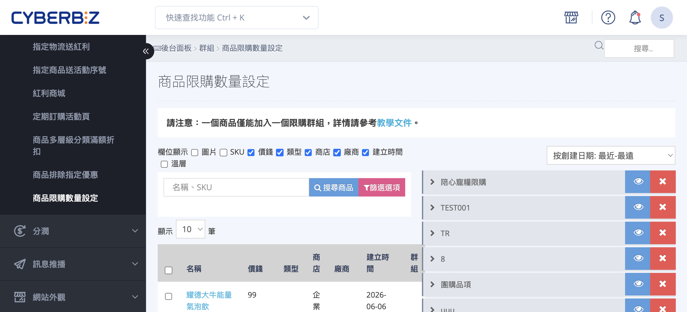
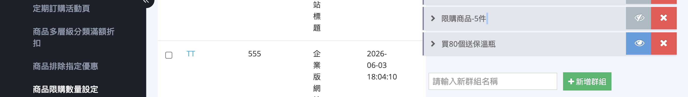
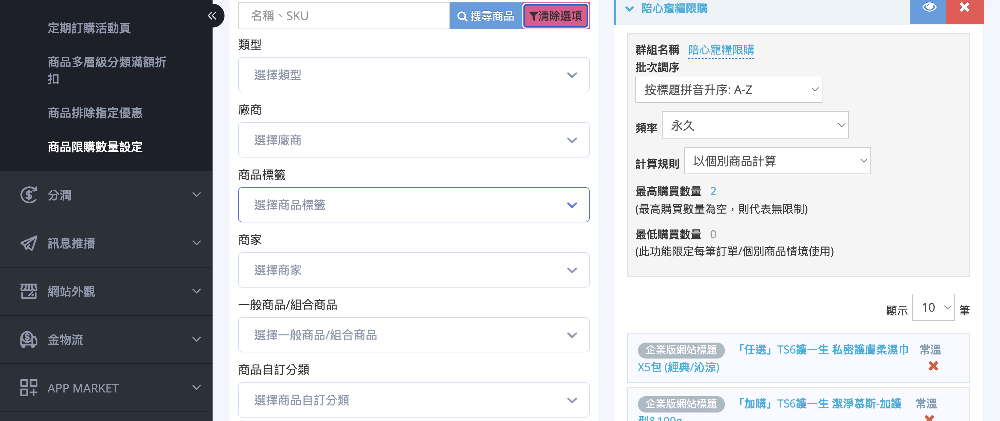
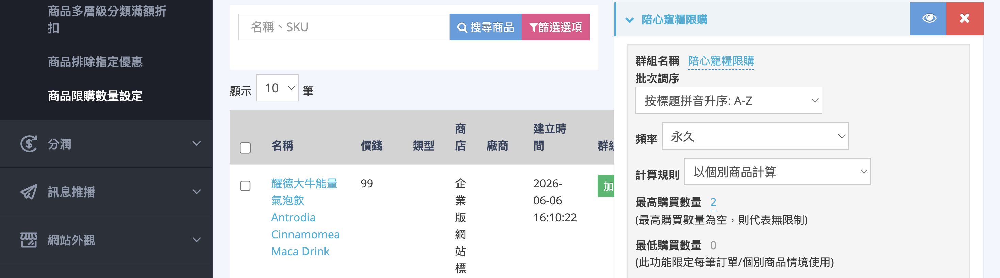
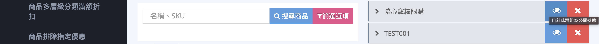
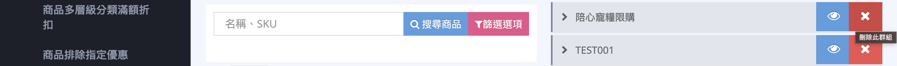
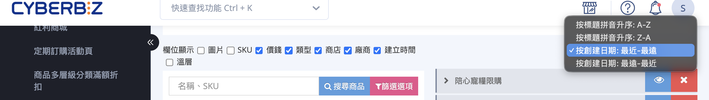
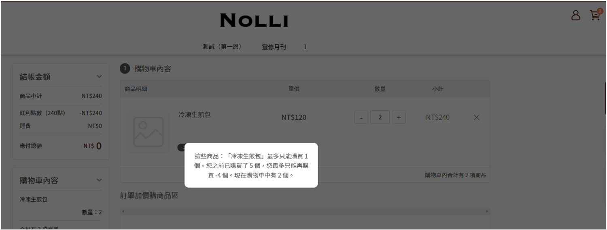
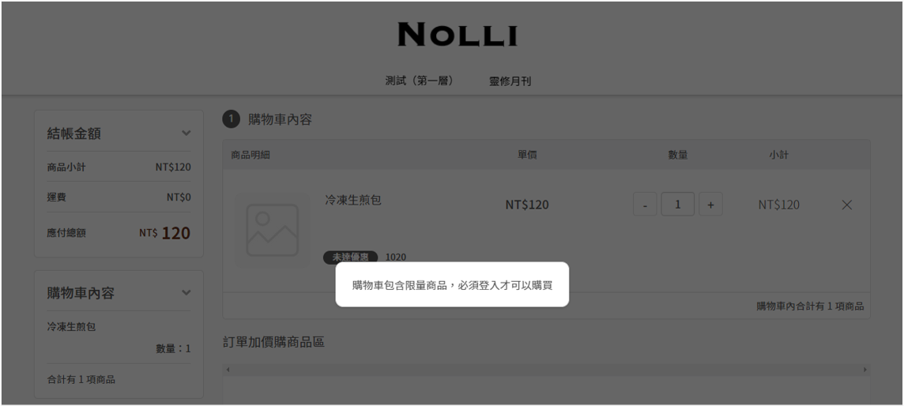

{{ subtitle(page.meta.description) }}

[:lucide-tag:{ title="適用方案" }](../../../resources/conventions#適用方案) | 進階 / 高手 / 專業PLUS / 進階PLUS / 高手PLUS / 企業
{ .doc-badge }

{ .hero-page }

## 商品限購數量說明

「商品限購數量設定」讓您把商品歸入「限購群組」，並為群組設定購買上限。當顧客在前台或 POS
結帳時，系統會自動依群組規則檢查購買數量，超過上限即無法結帳。此功能也要求顧客 **必須登入會員** 才能購買限購商品，可有效避免同一人重複大量下單。

!!! info "提示"
    限購規則的檢查時機是在顧客 **結帳時**，而非加入購物車時。會員過往已完成的訂單數量會一併納入累計（依「頻率」設定的區間計算）。

---

## 使用前提與限制 { #prerequisites-purchase-limit }

- [x] **方案開通**：「商品限購數量設定」需先開通才會出現在後台選單，部分方案預設未包含，請洽客服確認。
- [x] **顧客需登入**：限購商品一律需登入會員才能購買，未登入的訪客無法結帳。

部分進階能力依方案不同而有差異，整理如下：

??? plan "方案功能對照"
    | 能力 | 說明 | 開通條件 |
    | :-- | :-- | :-- |
    | 建立限購群組與設定限購數量 | 後台「商品限購數量設定」的核心功能 | 進階方案以上 |
    | 前台顯示限購資訊 | 在商品頁與結帳頁主動向顧客顯示「限購 N 件」提示 | 企業版等較高階方案 |
    | 最低購買數量設定 | 設定單筆訂單某商品「至少」要買幾個 | 企業版等較高階方案 |

    若您不確定目前方案包含哪些能力，請聯繫客服確認。

---

## 操作步驟 { #operate-purchase-limit }

後台路徑：「行銷活動」>「商品限購數量設定」。

### 建立群組並加入商品 { #operate-purchase-limit-create }

1. **建立群組：** 進入「商品限購數量設定」頁面，於群組列表下方欄位輸入群組名稱，點擊 **「新增群組」** 完成建立。
2. **加入商品：** 展開該群組，點擊加入商品的入口，於商品搜尋清單中找到目標商品，點擊商品列右側的 **「加入」**。
3. **確認加入：** 系統會跳出 **「加入群組」** 視窗，點擊 **「確認加入」** 即可[^1]。
4. **移出商品：** 若要將商品移出群組，可於商品搜尋清單再次點擊 **「移出」**，或在群組商品列表中點擊該商品的移除圖示。

??? tip "善用篩選快速找到要加入的商品"
      在加入商品的搜尋視窗中，可先用上方的關鍵字欄位(以 **名稱** 或 **SKU** 搜尋)，或點擊 **「篩選選項」** 依 **商品自訂分類** 、 **商品條件分類** 、 **商品標籤** 、 **廠商** 、**類型** 、 **商品公開狀態** 等條件縮小範圍，再批次勾選後一次加入群組。需要重設條件時，點擊 **「清除選項」** 即可。

      

[^1]: 每個商品僅能屬於一個限購群組。若加入的商品原本已在其他群組中，確認後會自動從原群組移至目前群組。

---

### 設定限購條件 { #operate-purchase-limit-rules }

在群組的編輯區塊中設定下列欄位，設定後即時生效：

1. **頻率：** 選擇限購數量的計算週期，共有 **永久** 、 **每月** 、 **每年** 、 **每筆** 四種。
2. **計算規則：** 選擇 **以群組商品計算** 或 **以個別商品計算** ，決定群組內商品是合併還是各自計算上限。
3. **最高購買數量：** 輸入允許購買的數量上限。留空代表 **無限制**[^2]。
4. **最低購買數量：** 設定單筆訂單該商品至少要購買的數量。此欄位僅在頻率為 **「每筆」** 且計算規則為 **「以個別商品計算」** 時可填寫，並需開通對應方案能力。

[^2]: 後台欄位提示為「最高購買數量為空，則代表無限制」。

---

### 管理群組 { #operate-purchase-limit-manage }

1. **編輯群組：** 點擊群組列表中的 **「群組名稱」** 展開設定，可調整名稱、限購條件與群組內商品的 **「批次調序」** 。
2. **公開或隱藏：** 點擊 :lucide-eye: 切換群組的公開狀態。狀態顯示為「目前此群組為公開狀態」或「目前此群組為隱藏狀態」[^3]。

    

3. **刪除群組：** 點擊 **:lucide-x:「刪除此群組」** ，系統跳出「確定要刪除群組」確認後即刪除。

    

4. **群組排序：** 透過頁面的排序選單，依群組名稱或建立日期排列後台群組清單。

    

[^3]: 群組被隱藏或刪除後，其限購規則會立即失效。若日後將同一商品加入新的群組，則改套用新群組的規則。

## 前台顯示 <small>顧客端畫面</small>

只要開通限購功能，顧客在結帳送出訂單時，系統就會依群組規則把關：購買數量超過上限、或帳號狀態不符（如未登入、未啟用、已停用）時，結帳會被擋下並顯示對應提示，例如「這些商品：『……
  』最多只能購買 N 個……」。帳號狀態的判定詳見 [帳號狀態與購買權限對照表][reference-purchase-limit-account] 。此把關適用於所有限購頻率（永久、每月、每年、每筆）。

-   { title="超過數量提示" }

    __超過數量提示__

-   { title="未登入提示" }

    __未登入提示__

??? plan "前台主動顯示限購與購物車即時提醒"
    在商品頁與結帳頁主動向顧客顯示「此商品每筆訂單限購 N 件」，並在購物車數量超過上限時即時跳出提示「商品『……』達購買上限，系統將自動調整商品數量。」並自動修正數量，為 **企業版** 才有的功能，且僅適用於頻率為 **「每筆」** 的群組。其他方案仍會在顧客送出訂單時擋下超量購買，但前台不會主動標示限購數量、購物車也不會即時提醒。

## 重要規範與限制 { #specs-purchase-limit }

!!! note "限購規則重點"
    * **單一歸屬**：一個商品僅能加入 **一個** 限購群組；重複加入會自動移至新群組。
    * **群組數量上限**：每間商店最多可建立 **30** 個限購群組，達上限時需先刪除未使用的群組。
    * **必須登入**：未登入的訪客無法購買限購商品，前台會要求先登入會員。
    * **累計既往訂單**：限購數量會把會員在計算區間內「已完成」的訂單數量一併計入，而非只看本次購物車。

!!! tip "常見設定情境"
    * **每人限購 2 件的限量商品** ：頻率 = 永久、計算規則 = 以個別商品計算、最高購買數量 = 2。
    * **整個系列合計每月限購 5 件** ：把系列商品加入同一群組、頻率 = 每月、計算規則 = 以群組商品計算、最高購買數量 = 5。
    * **單筆訂單每款至少買 3 件、最多 10 件** ：頻率 = 每筆、計算規則 = 以個別商品計算、最低購買數量 = 3、最高購買數量 = 10。

---

## 後續操作

- :lucide-circle-plus:{ .lg }  
  [__設定商品加價購__](設定商品加價購.md)  
  除了限制購買數量，也可設定加價購活動，在結帳頁推薦顧客加購相關商品，提高客單價。

---

## 常見問題 { #faq-purchase-limit }

??? quote "顧客反映「必須登入才可以購買」無法結帳"
    { #faq-purchase-limit-login-required }
    這是正常的限購機制。限購商品一律需要登入會員才能購買，未登入的訪客會被要求先登入。請提醒顧客登入或註冊會員後再結帳。

??? quote "一個商品可以同時加入多個限購群組嗎"
    { #faq-purchase-limit-single-group }
    不行。每個商品僅能屬於一個限購群組。若您把已在其他群組的商品加入新群組，系統會在確認後自動將它移至新群組，並改套用新群組的規則。

??? quote "每月、每年是從什麼時候開始重新計算"
    { #faq-purchase-limit-reset-cycle }
    以日曆週期計算，並非從群組建立日起算。

    - **每月**：每月 1 日重新計算。
    - **每年**：每年 1 月 1 日重新計算。

??? quote "設定了限購，但前台商品頁／結帳頁沒有顯示限購提示"
    { #faq-purchase-limit-no-frontend-hint }
    限購規則本身仍會在結帳時生效，但「在前台主動顯示限購資訊」是較高階方案才有的能力。若需要在商品頁與結帳頁向顧客顯示「限購 N 件」提示，請聯繫客服確認方案。

??? quote "「最低購買數量」欄位無法填寫"
    { #faq-purchase-limit-min-count-disabled }
    「最低購買數量」僅在頻率為 **「每筆」** 且計算規則為 **「以個別商品計算」** 時才能設定，且需開通對應方案能力。後台欄位提示為「此功能限定每筆訂單／個別商品情境使用」。

??? quote "限購群組最多可以建立幾個"
    { #faq-purchase-limit-max-groups }
    每間商店最多可建立 30 個限購群組。若已達上限，請先刪除不再使用的群組再新增。

---

## 參考資料 { #reference-purchase-limit }

- [帳號狀態與購買權限對照表](references/purchase-limit-account-status.md){ title="帳號狀態與購買權限對照表" }

