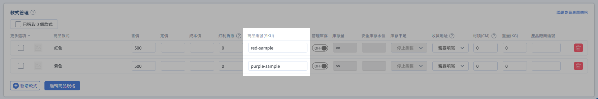
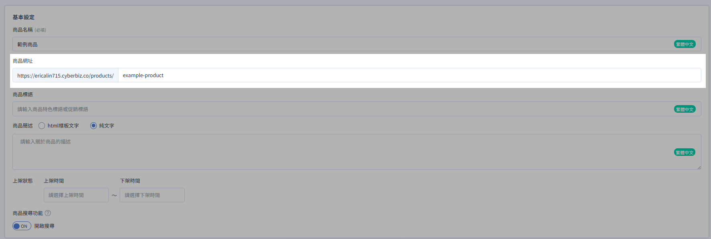

# 商品連結帶入 SKU 自動選取款式

在商品頁網址後方加上 `?sku=` 參數，消費者點擊後會進入商品頁並自動選取對應款式，適合社群與 EDM 指定規格導購。
{ .subtitle }

[:lucide-tag:{ title="適用方案" }](../../../resources/conventions.md#適用方案) | 企業
{ .doc-badge }

!!! tip "應用情境"
    - **社群指定規格**：在 LINE／Instagram 貼文推廣「紅色款」或「L 號」，點擊即預選該款式。
    - **EDM 精準導購**：電子報針對不同受眾發送不同 SKU 連結，減少消費者自行切換規格的步驟。
    - **廣告素材對應**：每個廣告素材對應一個款式連結，方便追蹤與轉換。


## 使用須知

- **適用範圍**：本連結會開啟 **商品頁**（`/products/...`）並預選款式，消費者仍需自行加入購物車。若希望點擊連結後 **直接將指定商品帶入購物車**，請改用[建立含指定商品的購物車連結](create-cart-link-specific-products.md)。
- **必要條件**：目標款式必須已填寫 **商品編號(SKU)**；SKU 空白時無法對應。
- **大小寫**：網址中的 SKU 須與後台款式的 SKU **完全一致**（含大小寫與符號）。
- **發布前請自測**：對外發送前，請先用無痕視窗點擊連結，確認前台已自動選取正確款式。


## 操作流程

### 步驟 1：確認款式已設定 SKU

1. 登入 CYBERBIZ 管理後台，前往 **商品 > 所有商品**。
2. 開啟目標商品，捲動至 **款式管理**。
3. 確認欲推廣的款式已填寫 **商品編號(SKU)**。

    { .screenshot }

    !!! tip "尚未設定 SKU？"
        請先於款式欄位填寫 SKU 並儲存。設定方式可參考[新增商品：款式、價格與庫存](../../products/create-and-manage/create-update-products.md#operate-product-create-variants)。

### 步驟 2：取得商品頁網址

任選一種方式：

=== "從前台複製"

    1. 開啟官網該商品頁。
    2. 自瀏覽器位址列複製完整網址（不含參數亦可）。

    ```http title="商品頁網址示意"
    https://www.example.com/products/example-product
    ```

=== "從後台確認"

    1. 於商品編輯頁查看 **商品網址** 欄位。
    2. 組合為：`https://您的網域/products/` + `商品網址路徑`。

    { .screenshot }

### 步驟 3：在網址後方加上 SKU 參數

在商品頁網址後接上參數，格式如下：

```http
[商品頁網址]?sku=[款式的SKU]
```

| 組成 | 說明 | 範例 |
| --- | --- | --- |
| `[商品頁網址]` | 官網商品頁完整路徑 | `https://www.example.com/products/example-product` |
| `?sku=` | 固定參數名稱（小寫） | `?sku=` |
| `[款式的 SKU]` | 後台該款式的商品編號 | `red-sample` |

!!! example "完整範例"
    假設商品頁為 `https://store123.cyberbiz.co/products/example-product`，紅色款 SKU 為 `red-sample`：

    ```http
    https://store123.cyberbiz.co/products/example-product?sku=red-sample
    ```

    消費者點擊後，商品頁會自動選取紅色款式。

### 步驟 4：測試後對外發送

1. 使用無痕視窗或另一裝置開啟連結。
2. 確認商品頁已預選正確款式（顏色、尺寸等）。
3. 確認無誤後，將連結用於社群貼文、EDM、廣告素材或簡訊。


## 進階用法

### 同一商品、不同款式各一條連結

為每個要推廣的款式各建立一條連結，僅更換 `sku=` 後的值：

```http title="紅色款"
https://www.example.com/products/tshirt?sku=TSHIRT-RED-M
```

```http title="藍色款"
https://www.example.com/products/tshirt?sku=TSHIRT-BLUE-M
```


## 延伸閱讀

<div class="grid cards" markdown>

- :lucide-shopping-cart:{ .lg }
  [__建立含指定商品的購物車連結__](create-cart-link-specific-products.md)
  一鍵將指定商品與數量帶入購物車，適合快速下單導購。

- :lucide-package:{ .lg }
  [__新增與管理商品__](../../products/create-and-manage/create-update-products.md)
  設定款式、價格、庫存與商品編號(SKU)。

</div>
