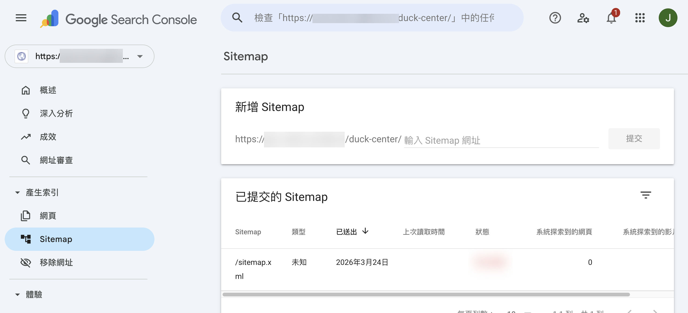
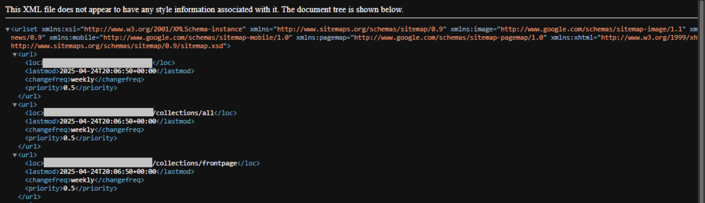
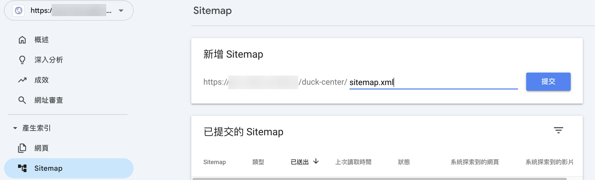

# 將 Sitemap 提交至 Google Search Console

將 CYBERBIZ 自動產生的 Sitemap 提交至 Google Search Console，加快網頁收錄速度並優化 SEO 表現。
{ .subtitle }

{ .hero-page }

## 什麼是 Sitemap

Sitemap（網站地圖）是一份以 XML 格式呈現的檔案，用來列出網站中所有重要頁面的網址，提供搜尋引擎（如 Google）作為爬取與索引的依據。

在 CYBERBIZ 系統中，平台會自動為每個網站產生 Sitemap，商家無需手動建立檔案。您只需將 Sitemap 提交至 Google Search Console（GSC），即可協助搜尋引擎更有效率地理解與收錄您的網站內容。

!!! note "更多 sitemap 相關資訊，請參考 [Google 官方說明 :lucide-external-link:](https://developers.google.com/search/docs/crawling-indexing/sitemaps/overview?hl=zh-tw)。"

## 為什麼要提交 Sitemap

透過提交 sitemap 網站地圖，您可以：

*   **加快新頁面被收錄的速度**：讓搜尋引擎更快發現您的新商品或活動頁。
*   **加速內容更新**：當您修改了網頁內容，搜尋引擎能更有效率地抓取更新。
*   **優化 SEO 表現**：幫助搜尋引擎理解您的網站架構。

## 操作前準備

在開始上傳之前，請務必確認已完成以下設定：

- [x] [**註冊 Google Search Console**](../../integrations/google/註冊並驗證 Google Search Console.md){ data-preview }：並完成網站所有權驗證。
- [x] [**串接 Google Analytics (GA4)**](../../integrations/google/ga/建立並串接 Google Analytics.md){ data-preview }：建議 GSC 與 GA4 使用同一組 Google 帳號管理。

## 檢測您的 Sitemap 檔案

您可以在瀏覽器網址列輸入您的官網網址，並在最後加上 `/sitemap.xml` 來確認檔案是否存在。

*   例如：`www.yourname.com/sitemap.xml`。
*   若頁面顯示正確的 XML 代碼畫面，代表您的網站已擁有 Sitemap。

## 提交步驟教學

1.  **登入 GSC**：進入 [Google Search Console :lucide-external-link:](https://search.google.com/search-console/) 頁面。
2.  **進入 Sitemap 頁面**：點擊左側選單中的「**產生索引**」>「**Sitemap**」。
3.  **輸入檔案名稱**：在「新增 Sitemap」欄位中輸入 `sitemap.xml`。
4.  **執行提交**：點擊「**提交**」按鈕。
5.  **完成設定**：系統若顯示「**已成功提交 Sitemap**」的彈窗，即代表設定完成。

## 重要提醒

*   **等待期**：提交後 Google 需要一定的作業時間進行分析與排序，一切更新皆以 Google 的排程為主。
*   **網域設定**：建議將官網後台的主網域設定在「自有網域」上，並開啟「總是導向」功能，以確保收錄網址的一致性。

## 常見問題

??? quote "提交後狀態顯示「無法擷取」或「擷取失敗」怎麼辦？"
    這通常是暫時性的現象。請先確認您的網址是否輸入正確（僅需輸入 sitemap.xml）。若網址無誤，通常是因為 Google 的爬蟲尚未排程處理。

    * 建議做法：等待 24-48 小時再查看。若持續失敗，請檢查您的網站是否開啟了「阻擋搜尋引擎索引」的設定（如測試站環境）。

??? quote "我更新了商品或分類，需要重新提交一次 sitemap.xml 嗎？"
    不需要。 CYBERBIZ 的 Sitemap 是動態產生的。當您新增商品或頁面時，該檔案會自動更新內容。Google 會定期回訪您的 Sitemap 抓取新資料，手動重複提交並不會加速此過程。

??? quote "為什麼 Sitemap 裡的網址數量跟 Google 實際索引的數量不一樣？"
    這是正常的。Sitemap 是您「建議」Google 抓取的清單，但 Google 會根據頁面品質、重複內容或檢索預算來決定是否納入索引。

    * 可能原因：部分頁面內容過於單薄、存在重複網址，或是新頁面還在排隊等待爬取。

??? quote "提交時應該輸入完整的網址嗎？"
    不需要。在 Google Search Console 的 Sitemap 提交欄位中，前端已經固定顯示了您的網站根目錄網址，您只需要在後方的輸入框填入 sitemap.xml 即可。
