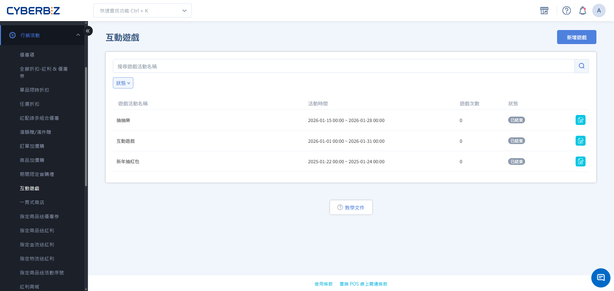
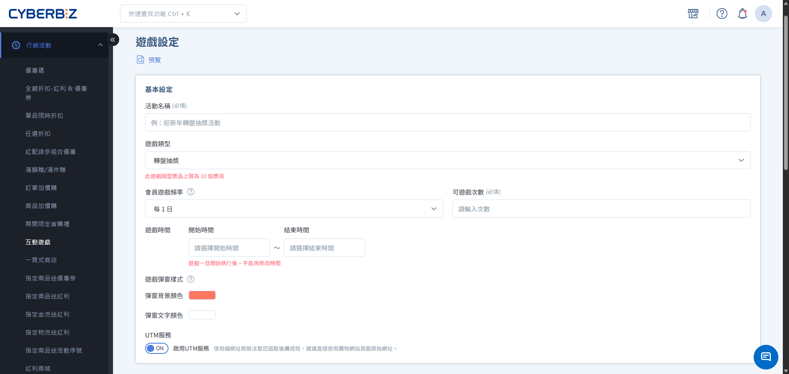
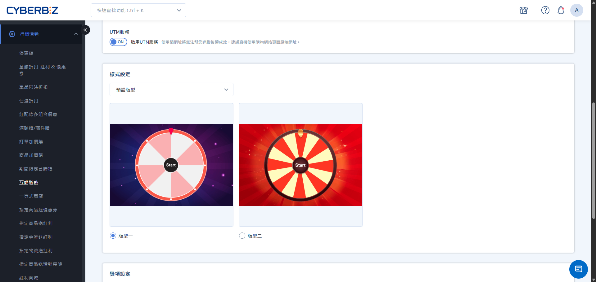
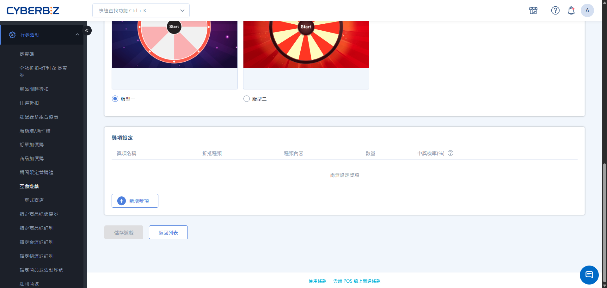
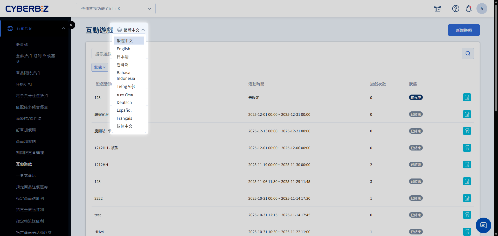

# 互動遊戲 (EC)

透過轉盤、紅包或寶箱等趣味遊戲，發放優惠券、紅利點數 or 贈品，提升會員參與度與轉單率。
{ .subtitle }

[:lucide-tag:{ title="適用方案" }](../../resources/conventions#適用方案) | 所有PLUS / 企業
{ .doc-badge }

{ .hero-page }
    

!!! info "版本差異說明"
    - **電商官網 (EC)** 與 **實體門市 (POS)** 皆支援互動遊戲功能，此文件僅適用 **電商官網 (EC)** 互動遊戲之設定方式。
    - 「互動遊戲」在 PLUS 方案中屬於「行銷 B」選配模組（11 選 2），商家需確認已選配該模組方可使用。企業版則直接內建此功能。

## 互動遊戲說明

「互動遊戲」是一種強大的行銷工具，透過遊戲化的互動方式（如轉盤、紅包）發放獎勵，不僅能增加會員回訪頻率，更能有效提升訂單轉換率。

!!! tip "應用情境"
    - **每日簽到**：設定每天可玩 1 次，吸引會員每日進站領取小額紅利或優惠券。
    - **節慶活動**：如春節紅包雨，營造節慶氣氛並發放大面額優惠券。

## 使用須知

- **編輯限制**：活動一旦進入「進行中」狀態， **計價規則、遊戲頻率、次數及獎項內容** 將無法修改（結束時間可縮短或延長）。
- **結束遊戲**：遊戲建立後則無法刪除，若要立即結束遊戲，請將到期時間改為當下日期之前時段。
- **延長遊戲**：若遊戲走期即將結束，而獎項沒抽完，可直接更改遊戲結束時間，延長遊戲活動。
- **登入遊玩**：互動遊戲為官網會員專屬功能，會員需登入後方可參與遊戲。
- **即刻歸戶**：會員抽到獎項後即會歸戶，可立即使用。
- **獎項耗盡**：當某獎項發完後，該選項仍會出現在遊戲中，但抽中時將自動視為「未中獎」。

## 操作流程

### 步驟 1：新增遊戲基本資訊

1. 登入 CYBERBIZ 管理後台，前往 **行銷活動 > 互動遊戲**。
2. 點擊 **新增遊戲**，輸入 **活動名稱**。
3. 選擇 **遊戲類型**：
    - **轉盤抽獎**：經典轉盤，指針停止位置即為中獎項目。
    - **紅包抽獎**：點擊紅包或寶箱開啟獎項。
4. **遊戲頻率與次數**：設定計算週期（每 1/7/30/90 日）及可玩次數。
5. **活動起訖時間**：設定遊戲在官網或門市出現的日期。
6. **彈窗設定**：設定中獎彈窗的背景色與按鈕文字。

!!! info "獎項連結說明"
    設定獎項連結並啟用 UTM 服務，可追蹤會員中獎後點擊「前往購物」的成效。

### 步驟 2：設定遊戲樣式

1. **版型選擇**：可選用「預設版型」或「自訂版型」。
2. **顏色與圖片**：

    === "預設版型"
        - **轉盤**：選擇系統預定義版型。
        - **紅包**：選擇系統預定義版型。

    === "自訂版型"
        - **轉盤**：自訂扇形區塊顏色、文字顏色、指針顏色及背景圖。
        - **紅包**：上傳「抽獎圖片」（未開啟）與「開獎圖片」（已開啟）。
    
        > **上傳容量限制**：單一遊戲內所有上傳圖片（樣式圖、獎項圖）總空間不得超過 **10MB**。

### 步驟 3：管理獎項內容

點擊 **新增獎項**，設定對應獎項：

| 可設定獎項 | 關鍵參數 |
| :--- | :--- |
| 優惠券、紅利點數、免運券、贈品券 | 獎項名稱、發放數量、中獎機率、獎項連結 |

!!! info "參數設定須知"
    - **機率設定**：所有獎項（包含未中獎）的機率總和 **必須精確等於100%**。
    - **視覺建議**：獎項名稱建議在 **10 個中英文字元** 內，避免轉盤文字因過長而被自動縮小影響美觀。

### 步驟 4：預覽與發布設定

1. **預覽確認**：點擊 **預覽**，確認遊戲畫面與獎項顯示是否正常。
2. **前台發布**：
    - **情境一：官網自動彈窗**：前往 **網站外觀 > 套版主題管理 > 網站設定 > 彈窗廣告**，新增區塊並選擇該互動遊戲。
    - **情境二：特定頁面嵌入**：點擊遊戲設定頁上方的 **iframe 語法** 並複製代碼，貼至自訂頁面、部落格或商品描述的原始碼編輯器中。
3. **儲存發布**：確認無誤後點擊 **儲存**，若狀態為「公開」，遊戲將依設定時間上線。

## 多國語系設定

設定互動遊戲的多國語系名稱，使前台可根據語系顯示正確文字。

!!! warning "注意事項"
	- 若要更改英文語系，需先 **切換至英文語系**，再進行修改。
	- 欄位有顯示 **語系標籤**，前台顯示才可隨語系切換文字。如：**群組名稱** 互動遊戲 `繁體中文`。
	- 若其他語系欄位未填寫內容，前台顯示該語系時，將自動使用 **繁體中文** 內容作為預設顯示。

### 操作步驟

1. 登入 CYBERBIZ 管理後台，前往 **行銷活動 > 互動遊戲**
2. 在語系選單中，切換至欲編輯的語系（例如：繁體中文、英文）。  
3. 展開欲編輯的加購群組，然後直接點擊群組名稱欄位進行修改，完成後按 ++enter++ 儲存變更。  

## 常見問題

??? quote "轉盤上的獎項數量會影響視覺嗎？"
    會。若獎項數量為 **奇數**，系統會自動在轉盤上新增一個「開始」選項作為起始點；若為 **偶數** 則僅顯示設定的獎項。建議獎項名稱保持簡短以利文字呈現。

??? quote "為什麼會員反應看不到遊戲彈窗？"
    請確認：1. 活動是否處於「公開」狀態。 2. 目前是否在活動時間內。 3. 會員在該週期內的遊戲次數是否已用完。 

??? quote "如果我想修改進行中的獎項機率該怎麼辦？"
    系統不允許直接修改進行中的機率。建議先將原活動「暫停」，點擊「複製遊戲」建立新活動並修改機率後，再重新發布。
