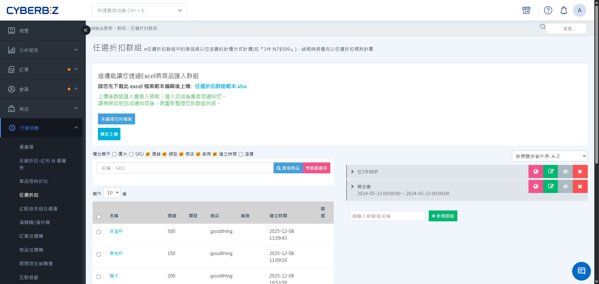
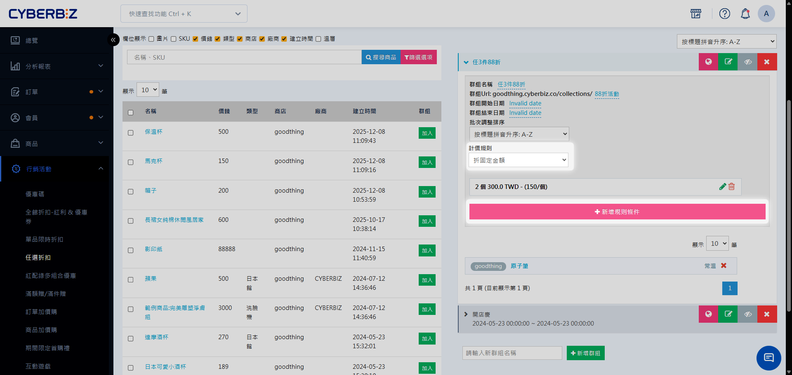
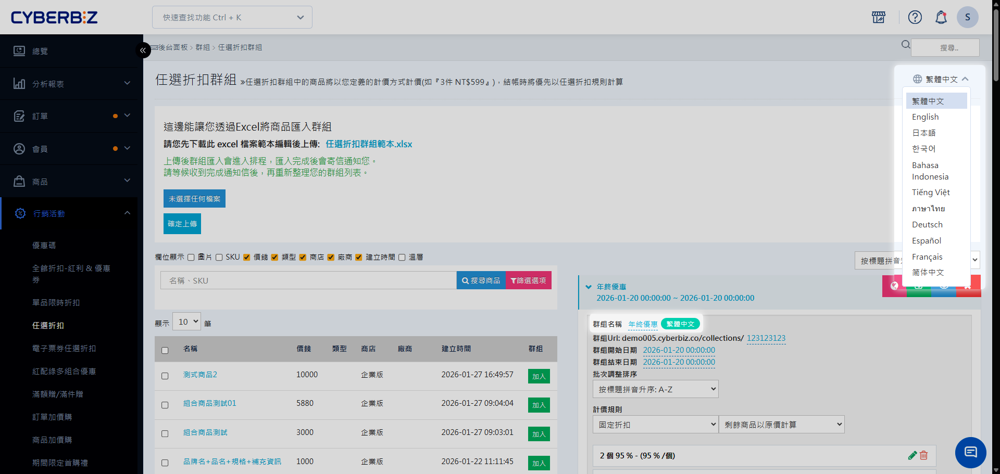

# 任選折扣

建立「任選折扣群組」，設定件數門檻與折扣計價方式（固定金額、折數或折固定金額），並管理活動商品與有效期間。
{ .subtitle }

{ .hero-page }

## 任選折扣說明

「任選折扣」可針對一組商品設定「買 N 件享優惠」的階梯式規則，例如「3 件 $599」、「3 件 7 折」。顧客在結帳時，系統會優先比對並套用此規則，適合用於季末清倉、跨品項組合促銷等情境。

!!! tip "應用情境"
    - **季末清倉**：設定「2 件 $500、3 件 $699」，加速中低價位商品去化。
    - **新品帶舊款**：組合新舊商品並設定「2 件 8 折」，提高整體曝光與銷售。
    - **多品項促銷**：將高、中、低價位商品混搭，設定「3 件 $999」拉高平均客單價。

## 使用須知

- **商品限制**：一個商品只能加入一個任選折扣群組。
- **門檻計算**：可設定多組階梯規則（如 2 件 $699、3 件 $599），系統將自動套用最優惠門檻。

## 操作流程

### 步驟 1：建立任選折扣群組

1. 登入 CYBERBIZ 管理後台，前往 **行銷活動 > 任選折扣**。
2. 輸入群組名稱，點擊 **新增群組**，進入設定頁面。

### 步驟 2：設定基本資訊與活動期間

1. 在 **基本資訊** 區塊，填寫以下欄位：
    - **群組名稱**：後台識別用的名稱。
    - **群組 URL**：前台活動頁面的網址路徑（限英數與連字號 `-`）。
2. 設定 **開始/結束日期**，決定活動生效的時間範圍。

### 步驟 3：設定計價規則與門檻

在群組列表中，點擊展開欲設定的群組，依序設定以下欄位：

1. **選擇規則類型**：
    - **固定金額**：設定活動期間總商品的固定售價。
      > 範例：3 件 $599。
    - **固定折扣**：設定活動期間總商品的固定折扣比例。
      > 範例：3 件 70%（即 7 折）。
    - **折固定金額**：設定活動期間總商品的固定折扣金額。
      > 範例：3 件折 $100。
    - **每件折固定金額**：設定活動期間每件商品的固定折扣金額。
      > 範例：3 件每件折 $50。

    **:lucide-info: 適用版本**

    | 規則類型 | 專業/PLUS | 進階/PLUS | 高手/PLUS | 企業 |
    |----------|-------------|-----------|-----------|------|
    | 固定金額 | ✓ | ✓ | ✓ | ✓ |
    | 固定折扣 | ✓ | ✓ | ✓ | ✓ |
    | 折固定金額 | ✕ | ✕ | ✓ | ✓ |
    | 每件折固定金額 | ✕ | ✕ | ✓ | ✓ |

2. **新增階梯規則**：
    - 點擊 **新增規則條件** 可設定多層級件數門檻（例如：2 件、3 件、5 件）。

    **:lucide-info: 適用版本**

    | 規則類型 | 專業版/PLUS | 進階版/PLUS | 高手版/PLUS | 企業版 |
    |----------|-------------|-----------|-------------|--------|
    | 單層級 | ✓ | ✓ | ✓ | ✓ |
    | 多層級 | ✕ | ✕ | ✓ | ✓ |

3. **設定剩餘商品計價**：選擇 **固定折扣** 、 **每件折固定金額** 規則類型，可進一步選擇剩餘商品是否沿用優惠。
    - **以優惠計算**：未達門檻的剩餘商品按單件優惠價計。
    - **以原價計算**：未達門檻的剩餘商品按原價計。

    !!! example "計價範例：3 件 $599"

        - 若選「以優惠計算」：買 4 件時，前 3 件共 $599，第 4 件按單件優惠價 $199.67 計算。
        - 若選「以原價計算」：買 4 件時，前 3 件共 $599，第 4 件按商品原價計算。

### 步驟 4：將活動商品加入群組

將商品加入折扣活動群組，可使用以下兩種方式：

=== "手動加入"
    
    1. 展開欲設定的折扣群組。    
    2. 在左側商品列表區域，點擊 **加入**，將單品或商品款式加入群組。
    3. 完成加入後，可在群組內確認商品列表與排序。

=== "批次匯入"
    
    1. 下載 **任選折扣群組範本.xlsx**。
    2. 依範本格式填寫商品資料，包括商品名稱、款式、折扣設定等欄位。
    3. 上傳已編輯完成的 Excel 檔案至系統，系統將自動將商品匯入群組。

    !!! warning "匯入注意事項"

        - 請保持 Excel 檔案格式與範本一致，以避免匯入失敗。
        - 群組名稱需與已建立的折扣群組名稱完全一致。

## 多國語系設定

設定任選折扣群組的多國語系名稱，使前台可根據語系顯示正確文字。

!!! warning "注意事項"
	- 若要更改英文語系，需先 **切換至英文語系**，再進行修改。
	- 欄位有顯示 **語系標籤**，前台顯示才可隨語系切換文字。如：**群組名稱** 任選折扣 `繁體中文`。
	- 若其他語系欄位未填寫內容，前台顯示該語系時，將自動使用 **繁體中文** 內容作為預設顯示。

### 操作步驟

1. 登入 CYBERBIZ 管理後台，前往 **行銷活動 > 任選折扣**
2. 在語系選單中，切換至欲編輯的語系（例如：繁體中文、英文）。  
3. 展開欲編輯的加購群組，然後直接點擊群組名稱欄位進行修改，完成後按 ++enter++ 儲存變更。  

