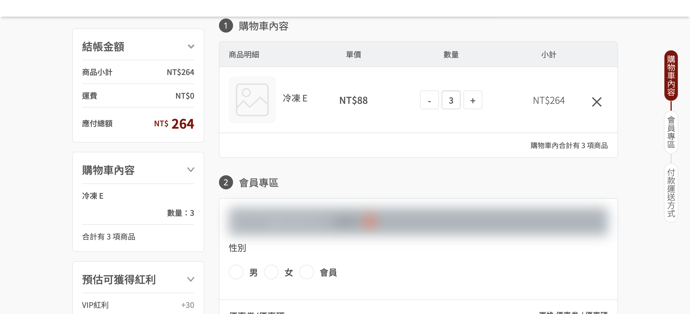
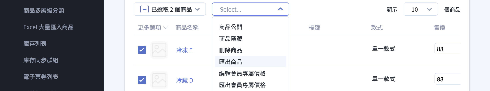
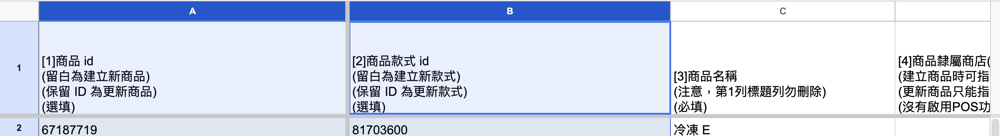

建立特殊購物車連結，自動將預設商品與數量加入購物車，適用於社群導購、EDM 行銷等情境
{ .subtitle }

{ .hero-page }

## 指定商品購物車連結說明

這項功能允許商家生成一個特殊的網址，當顧客點擊該連結時，系統會 **自動將預先設定好的商品與數量加入購物車**。這對於社群導購、EDM 行銷或針對特定受眾的促銷活動非常有效。

!!! tip "應用情境範例"

    您可以將製作好的連結應用在以下管道：

    *   **社群導購連結**：放在 LINE 或 Instagram 貼文中，縮短顧客尋找商品的流程，提升轉換率。
    *   **EDM 快速下單**：在電子報中針對熱門組合加入連結，讓顧客一鍵完成加購。
    *   **分眾導流活動**：針對不同的會員受眾設定專屬的購物車內容，搭配行銷策略推廣。

    !!! warning "在正式對外發布前，**請務必先自行測試網址**，確認點擊後是否能正確引導至購物車並載入指定的商品與數量。"

## 如何取得商品 ID 與款式 ID
                               
要製作導購連結，首先需要從後台匯出商品資料以取得對應的 ID。

1.  **進入路徑**：前往「**商品**」>「**所有商品**」。
2.  **勾選商品**：在商品列表中勾選您想要導入購物車的商品品項。
3.  **匯出資料**：點擊右上角的「**匯出商品**」按鈕。

    

4.  **查找 ID**：下載並開啟 Excel 檔案，展開隱藏欄位：                        
    - A 欄：商品 id — 用於 type=product 模式（單一款式商品適用）
    - B 欄：商品款式 id — 預設模式，可精確指定款式                 

    

5.  **紀錄數值**：欄位顯示的數字即為商品相關 ID，請將其記錄下來以利後續填入導購網址。

## 購物車連結網址格式

請參考以下語法規範，手動組合您的導購連結。

- **網址組成結構**：導購連結由「基礎路徑」與「參數字串」組成：

    ``` http
    [您的網址]/cart/replace?products=[款式ID]:[數量],[款式ID]:[數量]&[其他參數]=[數值]
    ```

    ``` http title="範例：兩款商品，數量各一"
    https://www.goodthing.com/cart/replace?products=001234:1,001235:1
    ```

- **參數定義**：所有參數皆接續在 `?` 之後，若同時使用多個參數，請使用 `&` 符號連接。

    | 參數 | 必填 | 說明 | 範例 / 規範 |
    | :--- | :---: | :--- | :--- |
    | `products` | **是** | 指定商品與數量 | 格式為 `ID:數量`。多項商品請以 `,` 或 `;` 分隔。 |
    | `type` | 否 | 指定 ID 識別模式 | 帶入 `product` 時，系統將 ID 視為「商品 ID」並自動選取首個款式。 |
    | `coupon` | 否 | 自動套用折扣碼 | 顧客點擊連結後，購物車將自動套用此優惠代碼。 |
    | `utm_source` | 否 | 流量來源 | 標記廣告管道（如：`line`、`instagram`）。 |
    | `utm_medium` | 否 | 行銷媒介 | 標記流量類型（如：`social`、`email`）。 |
    | `utm_campaign` | 否 | 活動名稱 | 區分不同的行銷專案（如：`summer_sale`）。 |
    | `utm_term` | 否 | 追蹤關鍵字 | 標記特定廣告關鍵字。 |
    | `utm_content` | 否 | 廣告內容 | 用於區分同一活動中不同的素材或版位。 |


## 進階用法
                                                                   
### 使用商品 ID（單一款式商品適用）
                                                                  
加上 `type=product` 參數，直接帶入 A 欄的商品 ID：                 

``` http
[您的網址]/cart/replace?products=[商品ID]:[數量]&type=product
```
            
!!! question "何時用哪個 ID？" 
    商品有多個款式時，請使用 **款式 ID** 以確保加入正確款式。商品只有單一款式時，使用 **商品 ID** 搭配 `type=product` 參數較為方便。                                    
                                                                 
---

### 搭配折扣碼      

在連結中加入 coupon 參數，顧客點擊後購物車會自動套用折扣：       

``` http
[您的網址]/cart/replace?products=[款式ID]:[數量]&coupon=[折扣碼]
```

--- 

### 搭配 UTM 參數追蹤                                                

在連結後附加 UTM 參數，可在 GA 或後台追蹤各渠道的導購成效：      

``` http
[您的網址]/cart/replace?products=[款式ID]:[數量]&utm_source=line&utm_medium=social&utm_campaign=summer2025
```

## 實際範例    

!!! example "範例設定"
    - 官網為 `https://www.goodthing.com`。
    - 加入款式 ID 001234 與 001235 各 1 件。

``` http title="情境一：社群導購，帶入兩款商品"
https://www.goodthing.com/cart/replace?products=001234:1,001235:1

```
``` http title="情境二：EDM 活動，搭配折扣碼與 UTM 追蹤"
https://www.goodthing.com/cart/replace?products=001234:1,001235:1&coupon=SUMMER10&utm_source=edm&utm_medium=email&utm_campaign=summer2025

```
``` http title="情境三：單一款式商品，使用商品 ID"
https://www.goodthing.com/cart/replace?products=56789:2&type=product

```

## 常見問題

??? quote "如何取得商品 ID 與款式 ID？"

    前往「商品」>「所有商品」，勾選要匯出的商品後點擊「匯出商品」，下載的 Excel 檔案中 A 欄為商品 ID，B 欄為商品款式 ID。

??? quote "什麼時候該用商品 ID，什麼時候該用款式 ID？"

    商品有多個款式時，請使用 **款式 ID** 以確保加入正確款式。商品只有單一款式時，使用 **商品 ID** 搭配 `type=product` 參數較為方便。

??? quote "可以在導購連結中自動套用折扣碼嗎？"

    可以，在連結中加入 `coupon=[折扣碼]` 參數，顧客點擊後購物車會[自動套用該折扣碼][搭配折扣碼]{ data-preview }。
