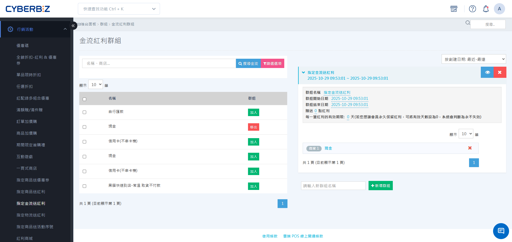

# 指定金流送紅利

建立「指定金流送紅利」群組，針對特定付款方式設定贈送紅利點數，引導顧客選擇低成本 or 預付型金流。
{ .subtitle }

[:lucide-tag:{ title="適用方案" }](../../resources/conventions#適用方案) | 企業
{ .doc-badge }

{ .hero-page }

## 指定金流送紅利說明

「指定金流送紅利」是一種以「付款方式」為導向的回饋機制。當顧客選擇店家指定的金流方式（如：信用卡、ATM 轉帳）完成付款時，系統會自動贈送固定點數的紅利。此功能無需設定消費門檻，旨在優化店家的營運成本與現金流。

!!! tip "應用情境"
    - **提升線上支付比例**：針對「信用卡」設定較高紅利（如 150 點），減少貨到付款（COD）的比例。
    - **加速資金回流**：針對「ATM 轉帳」設定中等紅利（如 100 點），引導顧客選擇預付方式，降低退貨風險。
    - **降低營運成本**：針對手續費較高的金流設定較低紅利，平衡店家的支出成本。

## 使用須知

- **贈送規則**：若一個金流同時加入多組「金流紅利群組」，則會加總各群組贈送紅利點數一併贈送給顧客。
- **訂單顯示**：訂單明細頁內的「預計會員可獲得的紅利積點」包含金物流、商品及訂單贈送之紅利。

## 操作流程

### 步驟 1：建立金流紅利群組

1. 登入 CYBERBIZ 管理後台，前往 **行銷活動 > 指定金流送紅利**。
2. 輸入 **群組名稱**（如：信用卡付款回饋 2024），點擊 **新增群組**。

### 步驟 2：設定活動期間與紅利規則

點擊展開欲設定的群組，填寫以下資訊：

1. **基本設定**：
    - **群組名稱**：後台管理用的識別名稱。
    - **開始/結束日期**：設定活動生效時間。若無結束日期則為長期活動。
2. **規則設定**：
    - **贈送紅利（點）**：輸入欲贈送的點數（例：`150`）。
    - **有效期限**：輸入紅利有效天數（例：`60`）。輸入 `0` 代表永久有效。

### 步驟 3：選擇套用的金流方式

1. 在左側 **金流方式清單** 中，勾選欲套用此規則的金流（如：信用卡、ATM）。
2. 點擊 **加入群組**，確認金流名稱出現在右側群組列表中。
3. 若需移除，在群組清單中勾選金流後點擊 **移出群組**。

!!! info "金流啟用狀態"
    僅有在 **金流設定** 中已啟用的金流方式才會出現在清單中。若未見到特定金流，請先至後台設定啟用。
