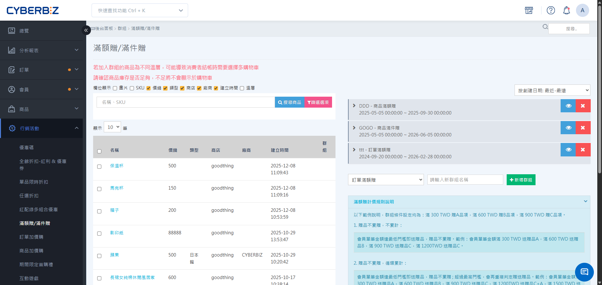
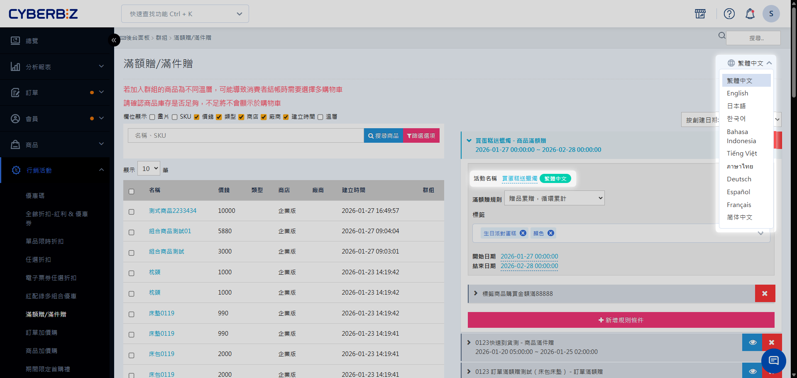

# 滿額贈 / 滿件贈

建立滿額贈與滿件贈活動，設定訂單或特定標籤商品的金額/件數門檻，自動發送贈品並管理累贈規則。
{ .subtitle }

{ .hero-page }

## 滿額/滿件贈說明

「滿額贈/滿件贈」是一種當顧客消費達門檻時，由系統自動提供贈品的促銷活動。支援「全館訂單」或「指定商品標籤」的計算方式，並可設定多層級的階梯門檻。

!!! tip "應用情境"
    - **夏季服飾滿額贈**：針對帶有`夏季服飾`標籤的商品，滿 $2000 送涼感巾。
    - **保健食品滿件贈**：針對帶有`保健食品`標籤的商品，滿 3 件送試用包。
    - **全館週年慶**：全館不限商品滿 $3000 送環保購物袋，滿 $5000 送保溫杯。
    - **買三送一**：指定商品買滿 3 件，贈送同款或指定贈品 1 件。

**:lucide-info: 適用版本**

| 功能 | 一般版 | PLUS版 | 企業版 | 
|------|-------|--------|--------|
| 商品滿額(件)贈 | ✕ | 選配 | ✓ | 
| 訂單滿額贈 | 支援進階版、高手版 | 選配：專業PLUS版 標配：進階 PLUS版、高手 PLUS版 | ✓ | 

## 贈品贈送規則

- 支援贈送未公開商品，但已下架商品不支援。
- 贈品若為多款式商品，消費者無法自行選擇款式。
- 放進群組的贈品皆一併贈送。

## 操作流程

### 步驟 1：建立活動並選擇類型

1. 登入 CYBERBIZ 管理後台，前往 **行銷活動 > 滿額贈/滿件贈**。
2. 在 **活動類型** 下拉選單中選擇類型：
    - **訂單滿額贈**：計算整筆訂單總金額。
    - **商品滿額贈**：計算含有特定標籤之商品的總金額。
    - **商品滿件贈**：計算含有特定標籤之商品的總件數。
3. 輸入 **活動名稱**，點擊 **新增活動**。

### 步驟 2：設定基本資訊與累贈規則

點擊展開活動進入設定區，完成以下設定：

1. **基本設定**：確認活動名稱、選擇 **開始/結束日期**。
2. **累贈規則**：選擇贈品發送邏輯（5 種），詳細可參考下方 **累計/累贈細則說明**。
3. **標籤選擇**（僅限商品滿額/滿件贈）：從下拉選單選擇要納入計算的商品標籤。

### 步驟 3：設定門檻規則與贈品

1. **新增規則**：點擊 **新增規則** 建立門檻。
2. **設定門檻值**：
    - 滿額贈：輸入金額（例：`1000`）。
    - 滿件贈：輸入件數（例：`3`）。
3. **加入贈品**：在該規則下，從右側商品搜尋區找到贈品商品，點擊 **加入**。

### 步驟 4：儲存與排序

1. 如有多個門檻，重複步驟 3 建立階梯式規則。
2. 檢查贈品清單是否正確。
3. 點擊 **儲存**，完成設定。

## 累計/累贈細則說明

### 累贈

當訂單同時符合多個贈品門檻規則時，可透過「累贈」設定決定贈送方式：

| 設定值 | 系統行為 |
| --- | --- |
| 累贈 | 贈送所有符合條件的贈品 |
| 不累贈 | 僅贈送一個價值最高的贈品 |

### 累計
當訂單超過最高價值贈品的門檻時，可透過「累計」設定決定是否多輪贈送：

| 設定值 | 系統行為 |
| --- | --- |
| 累計 | 訂單若超出最高贈品門檻，能兌換多輪贈品。 |
| 不累計 | 訂單僅能兌換一輪贈品，剩餘金額不進行贈品兌換。 |

「累計」可再細分兩個發送規則：

| 設定值 | 計算方式 | 公式舉例 |
| --- | --- | --- |
| 循環累計 | 訂單扣除最高價值贈品門檻後發送 訂單餘額再判定一次 | 訂單金額−最高價值贈品門檻 → 累贈/不累贈發送   訂單剩餘金額−最高價值贈品門檻 → 累贈/不累贈發送   訂單剩餘金額−最高價值贈品門檻 → 累贈/不累贈發送   直到訂單剩餘金額<最高價值贈品門檻 |
| 倍數累計 | 各個贈品分開計算發送數量 | 訂單金額÷A贈品贈送門檻=A商品贈送數量   訂單金額÷B贈品贈送門檻=B商品贈送數量   訂單金額÷C贈品贈送門檻=C商品贈送數量   以此類推 |

### 範例

以訂單滿額贈作為示範範例
- A贈品：訂單金額滿500時贈送
- B贈品：訂單金額滿1000時贈送
- C贈品：訂單金額滿1500時贈送

#### 不累贈+不累計

| 贈品條件/訂單金額 | 500 | 1000 | 1500 |
| --- | --- | --- | --- |
| A(500) | 1個 |  |  |
| B(1000) |  | 1個 |  |
| C(1500) |  |  | 1個 |

系統將依下列順序進行判斷：

1. 檢查訂單金額可達成的所有贈品門檻。
2. 從中選擇門檻金額最高的一項贈品。(不累贈)
3. 僅發送該贈品一次，不再以剩餘金額進行後續兌換。(不累計)

#### 累贈+不累計

| 贈品條件/訂單金額 | 500 | 1000 | 1500 | 2000 |
| --- | --- | --- | --- | --- |
| A(500) | 1個 | 1個 | 1個 | 1個 |
| B(1000) |  | 1個 | 1個 | 1個 |
| C(1500) |  |  | 1個 | 1個 |

系統將依下列方式進行判斷：

1. 檢查訂單金額可達成的所有贈品門檻。
2. 發送所有符合門檻的贈品。(累贈)
3. 僅發送該贈品一次，不再以剩餘金額進行後續兌換。(不累計)

####不累贈+循環累計

| 贈品條件/訂單金額 | 500 | 1000 | 1500 | 2000 | 2600 |
| --- | --- | --- | --- | --- | --- |
| A(500) | 1個 |  |  | 1個 |  |
| B(1000) |  | 1個 |  |  | 1個 |
| C(1500) |  |  | 1個 | 1個 | 1個 |

系統將依下列方式進行判斷：

| 判斷輪次 | 第一輪 | 第二輪 | 贈送結果 |
| --------| ------ | --------| ------ |
| 500 元 | 1. 可符合的門檻：A 2. 不累贈，僅贈送門檻最高贈品 A 3. 扣除門檻金額 500 元，剩餘金額為 0 元，停止計算 | - | A 1 個 | 
| 1000 元 | 1. 可符合的門檻：A、B 2. 不累贈，僅贈送門檻最高贈品 B 3. 扣除門檻金額 1000 元，剩餘金額為 0 元，停止計算 | - | B 1 個 | 
| 1500 元 | 1. 可符合的門檻：A、B、C 2. 不累贈，僅贈送門檻最高贈品 C 3. 扣除門檻金額 1500 元，剩餘金額為 0 元，停止計算 | - | C 1 個 |
| 2000 元 | 1. 可符合的門檻：A、B、C 2. 不累贈，僅贈送門檻最高贈品 C 3. 扣除 1500 元後，剩餘金額為 500 元 | 1. 剩餘金額 500 元，符合贈品 A 門檻  2.不累贈，贈送贈品 A  3.扣除 500 元後，剩餘金額為 0 元，停止計算  | C 1 個＋ A 1 個 | 
| 2600 元 | 1. 可符合的門檻：A、B、C 2. 不累贈，僅贈送門檻最高贈品 C 3. 扣除 1500 元後，剩餘金額為 1100 元 | 1. 剩餘金額 1100 元，符合贈品 A、B 門檻  2.不累贈，贈送贈品 B  3.扣除 1000 元後，剩餘金額為 100 元，停止計算  | C 1 個＋ B 1 個 | 

#### 累贈+循環累計

| 贈品條件/訂單金額 | 500 | 1000 | 1500 | 2000 | 2600 |
| --- | --- | --- | --- | --- | --- |
| A(500) | 1個 | 1個 | 1個 | 2個 | 2個 |
| B(1000) |  | 1個 | 1個 | 1個 | 2個 |
| C(1500) |  |  | 1個 | 1個 | 1個 |

系統將依下列方式進行判斷：

| 判斷輪次 | 第一輪 | 第二輪 | 贈送結果 |
| --------| ------ | --------| ------ |
| 500 元 | 1. 可符合的門檻：A 2. 累贈，贈送所有符合門檻贈品 3. 扣除門檻金額 500 元，剩餘金額為 0 元，停止計算 | - | A 1 個 | 
| 1000 元 | 1. 可符合的門檻：A、B 2. 累贈，贈送所有符合門檻贈品 3. 扣除門檻金額 1000 元，剩餘金額為 0 元，停止計算 | - | A 1 個＋B 1 個 | 
| 1500 元 | 1. 可符合的門檻：A、B、C 2. 累贈，贈送所有符合門檻贈品 3. 扣除門檻金額 1500 元，剩餘金額為 0 元，停止計算 | - | A 1 個＋B 1 個＋C 1 個 |
| 2000 元 | 1. 可符合的門檻：A、B、C 2. 累贈，贈送所有符合門檻贈品 3. 扣除 1500 元後，剩餘金額為 500 元 | 1. 剩餘金額 500 元，符合贈品 A 門檻  2.累贈，贈送所有符合門檻的贈品  3.扣除 500 元後，剩餘金額為 0 元，停止計算  | A 2 個＋B 1 個＋C 1 個 | 
| 2600 元 | 1. 可符合的門檻：A、B、C 2. 累贈，贈送所有符合門檻贈品 3. 扣除 1500 元後，剩餘金額為 1100 元 | 1. 剩餘金額 1100 元，符合贈品 A、B 門檻  2.累贈，贈送所有符合門檻的贈品  3.扣除 1000 元後，剩餘金額為 100 元，停止計算  | A 2 個＋B 2 個＋C 1 個 | 

#### 累贈+倍數累計

| 贈品條件/訂單金額 | 500 | 1000 | 1500 | 2000 | 2600 |
| --- | --- | --- | --- | --- | --- |
| A(500) | 1個 | 2個 | 3個 | 4個 | 5個 |
| B(1000) |  | 1個 | 1個 | 2個 | 2個 |
| C(1500) |  |  | 1個 | 1個 | 1個 |

系統將依下列方式進行判斷：

| 計算方式 | A | B | C |
| --------| ------ | --------| ------ |
| 500 元 | 500 ÷ 500 ＝ 1  贈送 A 1 個 | 未達門檻，不贈送 | 未達門檻，不贈送 | 
| 1000 元 | 1000 ÷ 500 ＝ 2   贈送 A 2 個 | 1000 ÷ 1000 ＝ 1   贈送 B 1 個 | 未達門檻 |
| 1500 元 | 1500 ÷ 500 ＝ 3   贈送 A 3 個 | 1500 ÷ 1000 ＝ 1   贈送 B 1 個 | 1500 ÷ 1500 ＝ 1   贈送 C 1 個 | 
| 2000 元 | 2000 ÷ 500 ＝ 4   贈送 A 4 個 | 2000 ÷ 1000 ＝ 2   贈送 B 2 個 | 2000 ÷ 1500 ＝ 1   贈送 C 1 個 |
| 2600 元 | 2600 ÷ 500 ＝ 5   贈送 A 5 個 | 2600 ÷ 1000 ＝ 2   贈送 B 2 個 | 2600 ÷ 1500 ＝ 1   贈送 C 1 個 | 

## 多國語系設定

設定滿額贈滿件贈的多國語系名稱，使前台可根據語系顯示正確文字。

!!! warning "注意事項"
	- 若要更改英文語系，需先 **切換至英文語系**，再進行修改。
	- 欄位有顯示 **語系標籤**，前台顯示才可隨語系切換文字。如：**群組名稱** 滿額贈滿件贈 `繁體中文`。
	- 若其他語系欄位未填寫內容，前台顯示該語系時，將自動使用 **繁體中文** 內容作為預設顯示。

### 操作步驟

1. 登入 CYBERBIZ 管理後台，前往 **行銷活動 > 滿額贈滿件贈**
2. 在語系選單中，切換至欲編輯的語系（例如：繁體中文、英文）。  
3. 展開欲編輯的加購群組，然後直接點擊群組名稱欄位進行修改，完成後按 ++enter++ 儲存變更。  

