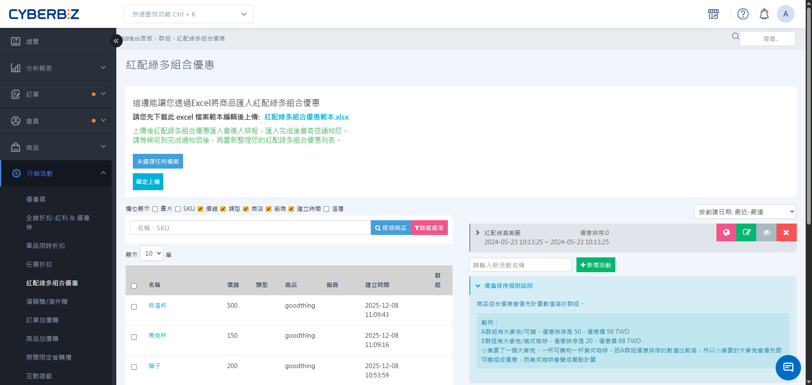
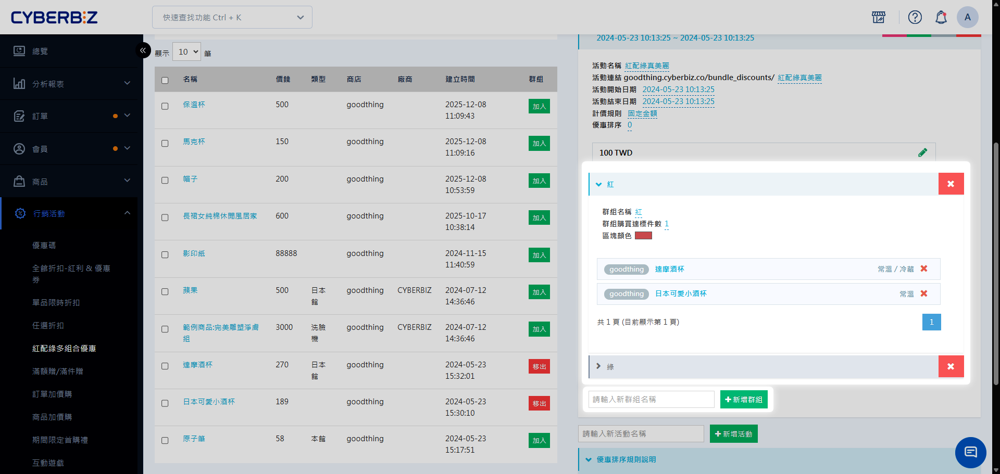
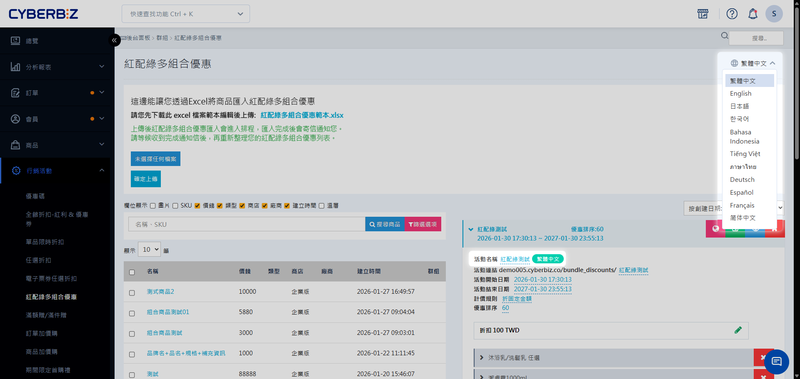

# 紅配綠多組合優惠

透過將不同群組商品進行組合（如 A 群組 + B 群組），設定固定金額、折扣或折價規則，提升客單價與跨品類銷售。
{ .subtitle }

[:lucide-tag:{ title="適用方案" }](../../resources/conventions#適用方案) | 所有PLUS / 企業
{ .doc-badge }

!!! info "版本差異說明"
    紅配綠功能在 PLUS 方案中屬於「行銷 A」選配模組（11 選 2），商家需確認已選配該模組方可使用。企業版則直接內建此功能。

{ .hero-page }

## 紅配綠多組合優惠說明

「紅配綠」是一種經典的促銷手法，透過將不同毛利或性質的商品分群（如：主餐 + 飲料、主機 + 配件），要求消費者在各群組中各挑選指定件數後，即可享有組合優惠。這有助於帶動長尾商品的銷量，並優化整體的毛利組合。

系統支援 N 個群組同時進行組合，除了傳統的「紅配綠」兩群組，您也可以自由設定紅配藍配綠配紫等多個群組，靈活配置您的套餐組合。

!!! tip "應用情境"
    - **套餐組合**：主餐（群組 A）選 1 件 + 飲料（群組 B）選 1 件，特價 $199。
    - **穿搭組合**：上衣選 1 件 + 下著選 1 件 + 配件選 1 件，現折 $300。
    - **加購策略**：購買主商品（群組 A）1 件，即可用 $99 加購指定配件（群組 B）1 件。

## 使用須知

- **狀態預設未公開**：建立活動後預設為「未公開」，若前台出現 404 錯誤，請檢查狀態開關。
- **商品唯一性**：在同一個紅配綠活動中，一個商品（或其規格）只能被歸類在一個群組內。
- **購物體驗建議**：建議每個群組內的商品數量不宜過多（單區建議 8 支以下），以維持較佳的消費者選購體驗。
- **優惠排序**：若訂單中商品同時符合多個活動，系統將優先套用「優惠排序」數值較高的活動。

## 操作流程

### 步驟 1：建立活動基本資訊

1. 登入 CYBERBIZ 管理後台，前往 **行銷活動 > 紅配綠多組合優惠**。
2. 輸入 **活動名稱** ，點擊 **新增活動** 。
3. **活動開始/結束日期**：設定活動生效的區間。
4. **活動連結**：自訂活動頁面的網址路徑。
5. **優惠排序**：輸入數值（1-999），數值越高活動優先權越高。

### 步驟 2：設定計價規則

在活動編輯頁面的「計價規則」區塊，選擇優惠方式：

| 規則類型 | 說明 | 範例 |
| :--- | :--- | :--- |
| **固定金額** | 組合後的總價為固定數值 | A(1)+B(1) = $999 |
| **固定折扣** | 組合後的商品打指定折扣 | A(1)+B(1) 享 85 折 |
| **折固定金額** | 組合後的總價減去固定金額 | A(1)+B(1) 現折 $100 |
| **每件折固定金額** | 組合內每件商品各減去固定金額 | A(1)+B(1) 每件再折 $10 |

### 步驟 3：管理商品群組

1. 填寫 **群組名稱**（如：主餐區、加購區），點擊 **新增群組**。
2. 設定 **群組購買達標件數**：該群組需選購多少件才能觸發優惠。
3. 定義 **區塊顏色**：設定前台頁面各群組的視覺顏色，方便顧客區分。

### 步驟 4：選擇與加入商品

1. 在左方商品列表，透過名稱、SKU 或標籤搜尋商品。
2. 勾選後點擊 **加入**。
    *   **已加入本群組**：可隨時移出。
    *   **已加入其他群組**：不可重複加入。

### 步驟 5：批次匯入商品（選用）

若商品數量較多，可使用 Excel 批次操作：

1. 在活動頁面下載 **紅配綠多組合優惠範本**。
2. 填寫 Excel 表格，關鍵欄位說明如下：

    - **操作**：可選擇新增活動或移除活動。
    - **活動名稱**：需與後台建立的活動名稱完全一致。
    - **群組名稱**：需與後台建立的群組名稱完全一致。
    - **SKU**：填寫正確的商品規格貨號。
    - **所有門市**：填寫「是」或「true」則適用所有門市，留空或其餘值視為「否」。
    - **門市名稱**：若非所有門市通用，請填寫精確的「網站名稱」或「POS 店名」。
    - **在官網舉辦此活動**：設定為「是」才會在官網前台顯示並套用活動。

3. 返回後台點擊 **未選擇任何檔案** 並匯入。
4. 匯入結果將透過 Email 通知。

## 多國語系設定

設定紅配綠優惠的多國語系名稱，使前台可根據語系顯示正確文字。

!!! warning "注意事項"
	- 若要更改英文語系，需先 **切換至英文語系**，再進行修改。
	- 欄位有顯示 **語系標籤**，前台顯示才可隨語系切換文字。如：**群組名稱** 紅配綠多組合優惠 `繁體中文`。
	- 若其他語系欄位未填寫內容，前台顯示該語系時，將自動使用 **繁體中文** 內容作為預設顯示。

### 操作步驟

1. 登入 CYBERBIZ 管理後台，前往 **行銷活動 > 紅配綠多組合優惠**
2. 在語系選單中，切換至欲編輯的語系（例如：繁體中文、英文）。  
3. 展開欲編輯的加購群組，然後直接點擊群組名稱欄位進行修改，完成後按 ++enter++ 儲存變更。  

## 常見問題

??? quote "為什麼前台看不到活動頁面？"
    請檢查：1. 活動是否設定為「公開」。 2. 目前日期是否在「活動時間」範圍內。 3. 是否有至少兩個群組且皆已加入商品。

??? quote "可以設定買 2 送 1 嗎？"
    可以。建立群組 A（買 2）與群組 B（送 1），計價規則選擇「折固定金額」，金額設定為群組 B 商品的售價即可。但若商品價格不一，建議改用「滿件折價」功能較為精準。

??? quote "消費者在群組 A 選了 2 件，群組 B 選了 2 件，會套用兩次優惠嗎？"
    會。系統會根據各群組設定的達標件數，自動倍數計算。例如 A(1)+B(1) 優惠，若消費者買 A(2)+B(2)，則會套用兩次組合優惠。

