# 設定一頁式商店

一頁式商店將商品資訊、特色介紹與結帳流程整合於單一網頁，大幅減少頁面切換造成的流失，是提升廣告轉換率與行動購物體驗的高效工具。
{ .subtitle }

[:lucide-tag:{ title="適用方案" }](../../resources/conventions#適用方案) | 所有PLUS / 企業
{ .doc-badge }

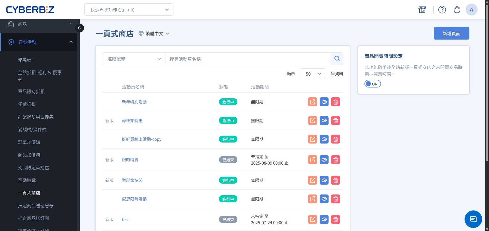{ .hero-page }

!!! info "版本差異說明"
    - 「一頁式商店」在 PLUS 方案中屬於選配模組（11 選 2），商家需確認已選配該模組方可使用。企業版則直接內建此功能。

!!! tip "應用情境"
    - **爆品促銷導流**：針對單一明星商品或限時組合，建立專屬 Landing Page，集中火力推動轉單。
    - **節慶快閃活動**：如雙 11、母親節活動，建立獨立頁面進行波段促銷，不影響官網活動。
    - **KOL/分潤推廣**：搭配分潤代碼生成專屬頁面連結，方便追蹤特定網紅或渠道的導購成效。


## 使用須知

在開始建置前，請了解以下規格限制與系統邏輯：

- **頁面數量限制**：
    - **高手版**：最多可建立 10 組。
    - **企業版 / PLUS 選配**：支援無限組。
- **購物車限制**：**不支援多購物車功能**。一頁式頁面內的商品將統一使用同一個購物車結帳。
- **溫層規範**：同一活動頁內的商品請務必選擇 **相同溫層**，若混入不同溫層商品將導致無法結帳。


## 操作流程

### 步驟 1：建立頁面

1. 登入 CYBERBIZ 管理後台，前往 **行銷活動 > 一頁式商店**。
2. 點擊右上方 **新增頁面**。
3. 填寫以下資訊：
    - **頁面標題**：活動識別名稱。
    - **網址關鍵字**：自訂頁面網址路徑（如：`spring-sale`）。
    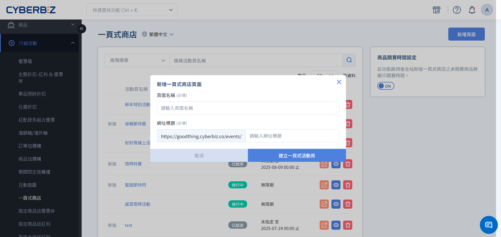

4. 選擇使用 **拖拉版型** 或 **舊版版型**。
    - 建議優先選擇 **拖拉版型** 以獲得最佳的跨裝置適應性與設計彈性。
    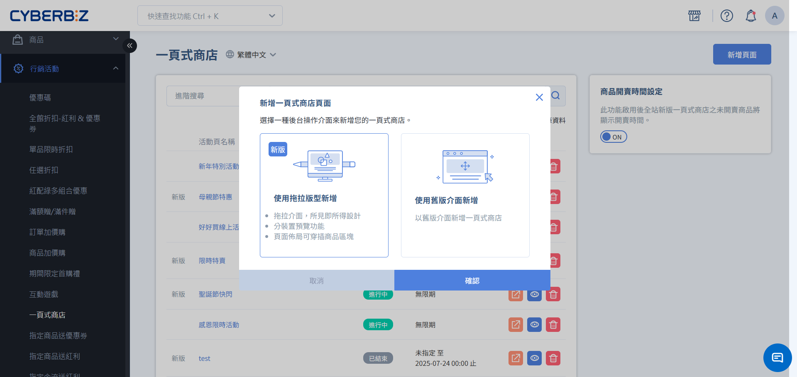

### 步驟 2：完成基本設定

進入活動編輯頁面的 **基本設定** 頁籤，針對網址、視覺與時程進行配置：

1. 活動基本資訊

    - **活動網址與標籤**：自訂該頁面的網址關鍵字（URL）以及後台識別用的活動標籤。
    - **頁面搜尋限制**：若不希望該頁面被搜尋引擎找到（如：秘密員購頁），請將「頁面搜尋」設定為 不可被搜尋，系統將自動加上 noindex 標籤。

    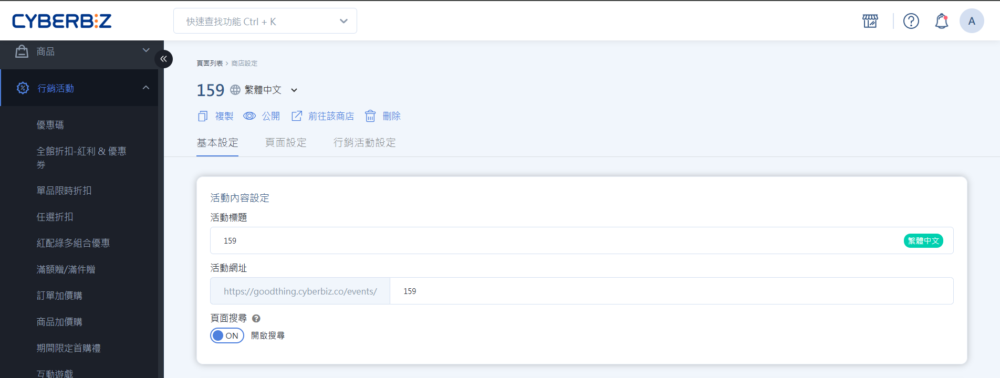

2. 導覽列與視覺設定

    - **網站 LOGO 與連結**：上傳一頁式商店專用的 Logo 圖檔，並設定點擊 Logo 後導向的網址。
    - **導覽列背景**：設定頁面頂端導覽列的背景色系，建議與品牌主色或活動主題呼應。

    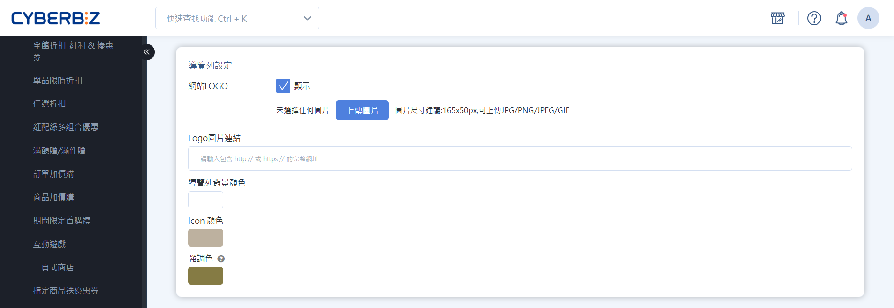

3. 活動時程與催單工具

    - **活動時間設定**：設定頁面自動開啟與結束的日期時間。
    - **置頂活動訊息**：於頁面最上方顯示重要公告（如：全館滿千免運、贈品剩餘數量）。

    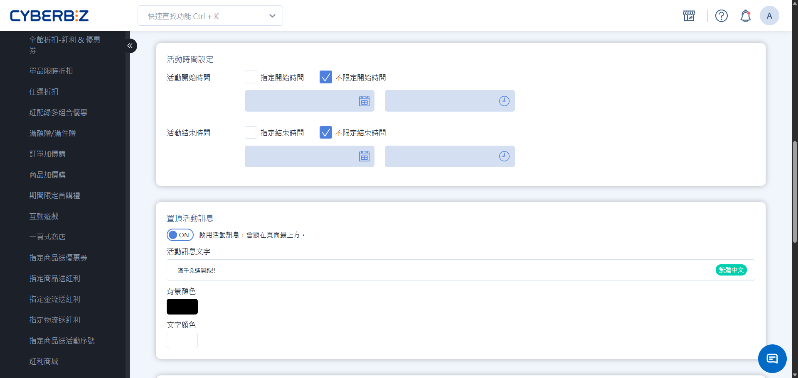

4. 優惠時間倒數

    - 可設定 **固定結束時間** 或 **首次進入後 N 天** 循環倒數。

    !!! info "心理催單邏輯"
        倒數計時器主要用於營造急迫感，時間到期後系統 **不會** 自動下架商品，消費者仍可繼續下單。
    
    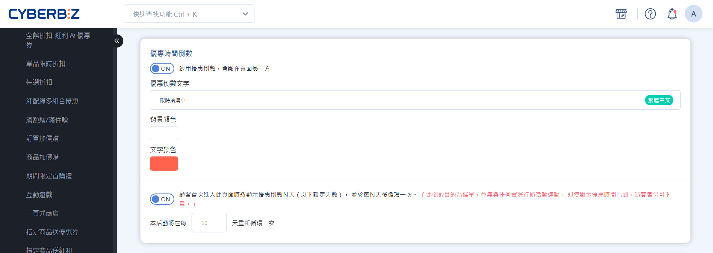

5. SEO 搜尋優化
    - **網頁標題與描述**：填寫精確的關鍵字與活動說明，有助於在 Google 等搜尋引擎獲得更佳的排名位置。

    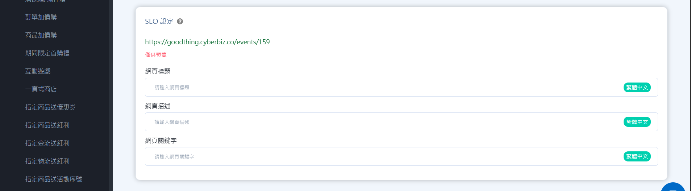

### 步驟 3：配置活動商品

=== "拖拉版型"

    1. 切換至 **頁面設定/銷售內容設定** 頁籤。
    2. 點擊 **新增區塊**，選擇 **商品列表**。
    3. 點擊 **商品列表** 進入編輯介面，並於 **選擇商品** 區塊中點擊 **新增商品**。
    4. 於彈跳視窗中篩選並勾選欲販售的品項，完成後點擊 **確定新增**。
    5. 點擊 **管理**，利用滑鼠拖曳左側的 :lucide-grip-vertical: 圖示，即可調整各商品於前台的先後排序。

    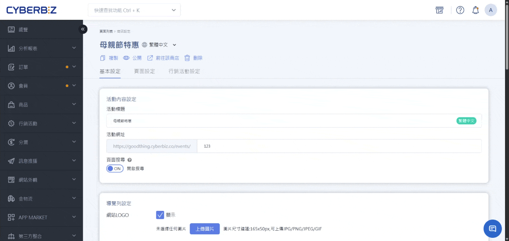

=== "舊版版型"

    1. 切換至 **選擇商品** 頁籤。
    2. 篩選並勾選欲販售的品項，於 `Select...下拉選單`中選擇 **加入活動**。
    3. 利用滑鼠拖曳左側的 :lucide-move: 圖示，即可調整各商品於前台的先後排序。

    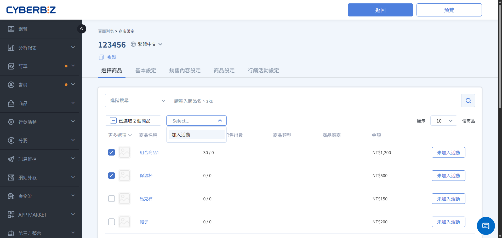

!!! info "商品狀態規範"
    僅可加入 **已上架且公開** 的商品，未公開或已下架商品恕無法加入。


### 步驟 4：設計商品列表佈局

=== "拖拉版型"

    1. 切換至 **頁面設定/銷售內容設定** 頁籤。
    2. 點擊 **新增區塊**，選擇已建立的 **商品列表**。
    3. 點擊 **商品列表** 進入編輯介面。
    4. **輸入群組標題**：於 **標題** 欄位輸入該區塊的名稱（如：超熱賣商品、限時加購），清楚劃分商品類別。
    5. **選擇商品展開模式**：
        - **往下展開**：所有商品依序由上而下排列。若商品數量多，建議使用此模式確保完整呈現。
        - **左右滑動**：一次至多呈現四個商品，其餘需由消費者左右滑動查看。適合用於「加購品」或「推薦商品」，節省頁面垂直空間。
    6. **設定商品排列對齊**：當商品數量未超過限制（電腦 3 個、平板 2 個、手機 1 個）時，可設定排列方式，預設為 **置左**。
    7. **自定義跨裝置版面樣式**：
        - **商品欄數**：可針對 **電腦/平板** 與 **手機** 分開設定每欄商品數。
        - **邊距微調**：可針對 **電腦/平板** 與 **手機** 分開設定 **左右外邊距** 與 **底部外邊距**，避免內容過於擁擠或產生視覺斷層。
        - **電腦版分類樣式**：提供多種顯示版型，包含 **預設**、**顯示部分內容** 或 **全顯示**，可選擇商品資訊顯示的詳盡程度。
    8. **選擇商品圖游標懸停效果**：當消費者的游標移至商品圖時，可設定動態反饋，提升點擊意願。

        | 效果名稱 | 視覺表現與建議 |
        | ------- | ------------- |
        | **快速加入購物車按鈕** | 圖片上直接浮現購買按鈕，大幅縮短轉換路徑 |
        | **圖片切換** | 自動切換至第二張商品圖（如：細節圖或情境圖），提供更多資訊 | 
        | **陰影邊框強調** | 增加外框陰影，使該商品從背景中脫穎而出，導引視覺焦點 |
        | **放大效果** | 商品圖輕微放大，營造細膩的互動感與精品質感 | 

    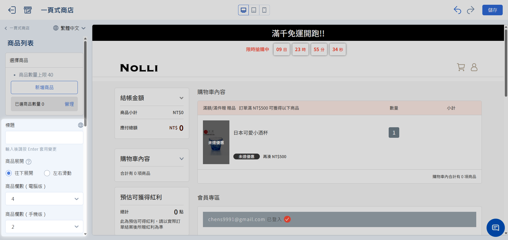

=== "舊版版型"

    1. 切換至 **商品設定** 頁籤。
    2. **自定義導購文案**：
        - **商品旁優惠文字**：可輸入吸引人的促銷短語（如：特別優惠 要買要快），該文字將顯現在商品名稱旁。
        - **特價文字**：自定義特價標籤（如：現正特價中），強化價格競爭力感。
    3. **選擇商品檢視模式**：根據商品數量與資訊密度，選擇最適合的呈現方式。
      
      | 檢視模式 | 前台視覺特性 | 適用情境建議 | 
      | ------- | ----------- | ----------- |
      | 條列檢視 | 大圖呈現，由上而下垂直排列 | 適合單一主打商品或需要詳盡圖文說明的產品 |
      | 格狀檢視 | 兩兩並排，節省垂直空間 | 適合品項眾多（如多色、多款組合）的情境，便於顧客快速掃視 | 

    4. **設定商品列主色調**：
        - **主色調顏色**：統一調整 **前往購買** 按鈕、優惠文字及價格的顏色。
        - **內容背景顏色**：調整商品資訊區塊的底色，強化視覺層次。
    5. **設定自動化套用**：
        - 商品簡述：當此功能開啟（ON）時，**商品介紹** 內容將同步呈現。
        - 購物車預設代入商品：當此功能開啟（ON）時，消費者一進入該商店頁面，系統將自動將列表中的 **所有商品** 加入購物車。

    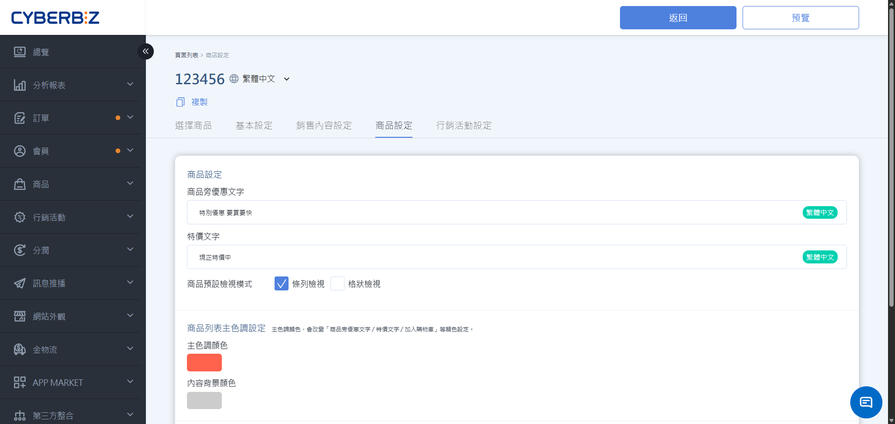


### 步驟 5：設計頁面排版與素材

=== "拖拉版型"

    1. 切換至 **頁面設定/銷售內容設定** 頁籤。
    2. 點擊 **新增區塊**，選擇區塊樣式。

         > 區塊使用方式可參考 [拖拉版型操作教學]()。
    3. 點擊 **顏色設定**，調整系統之色彩配置。

        !!! warning "全站視覺關聯提醒"
            此處色彩異動將同步套用至全站外觀，更改前請務必確認配色的一致性。
    
    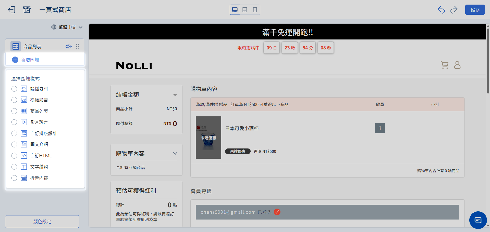

=== "舊版版型"

    1. 切換至 **銷售內容設定** 頁籤。
    2. **配置內容區塊**：根據行銷需求，點擊新增區塊組件。

        - 插入圖片：上傳商品圖或行銷海報。
        - 插入影片：貼入影片 YouTube 連結。
        - 插入文字編輯：運用[文字編輯器]()撰寫商品描述、規格說明或品牌故事。
        - 插入前往購買按鈕：自定義按鈕名稱（如：立即搶購、查看詳情），引導消費者快速轉換。
    3. **調整配置順序**：利用滑鼠拖曳左側的 :lucide-move: 圖示，即可調整各區塊的先後排序。

    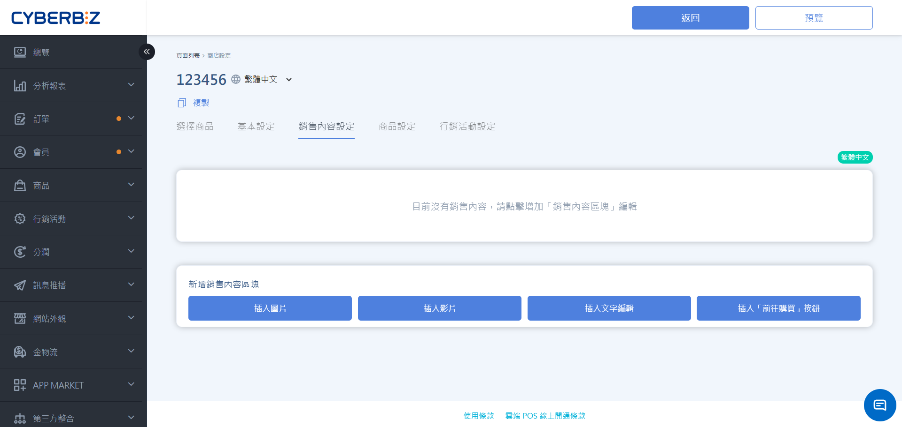


### 步驟 6：設定行銷活動政策 (企業版專用)

1. 切換至 **行銷活動設定** 頁籤。
2. 選擇一頁式商店的行銷活動政策。
  - **同步全站行銷活動**：一頁式商店將與官網全站設定之行銷活動同步。
  - **自訂行銷活動**：可額外新增一頁式商店的專屬滿額贈/滿件贈活動。

!!! info "贈品發送與配置須知"
    - **款式選擇限制**：贈品僅支援以 **商品** 為單位進行綁定，無法針對單一商品的特定 **款式/規格** 單獨綁定。
    - **發送優先順序**：
        - 若商家配置多個贈品，系統將採 **由上而下** 的優先序發放。
        - 當上層贈品庫存歸零後，系統將自動依序派發下一個順位的贈品，以此類推。
    - **品項數量上限**：單一活動之贈品備選清單以 **10 項** 為限。

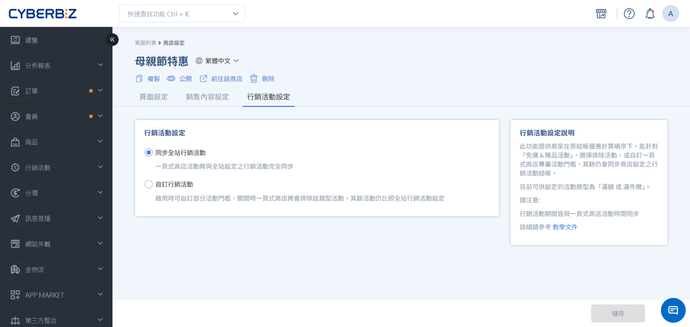

## 進階應用

### 1. 生成分潤推薦碼連結

一頁式商店可結合分潤功能，透過製作帶有推薦碼的網址，當消費者點擊含推薦碼之連結後，系統將自動於購物車帶入推薦碼。

- **原始網址**：`https://store.com/events/spring-sale`
- **推薦碼後綴格式**：`?rcode=[推薦碼]`
- **推薦碼**： `abc123`
- **最終連結**：`https://store.com/events/spring-sale?rcode=abc123`

### 2. 新增頁面鎖右鍵功能

為了保護頁面圖片不被輕易下載，您可以在 **自訂 HTML** 區塊中貼入鎖右鍵腳本：


=== "拖拉版型"

    1. 切換至 **頁面設定/銷售內容設定** 頁籤。
    1. 建立 **自訂 HTML** 區塊並點擊編輯。
    2. 切換至 **原始碼** 模式。
    3. 貼上語法並儲存。
    
    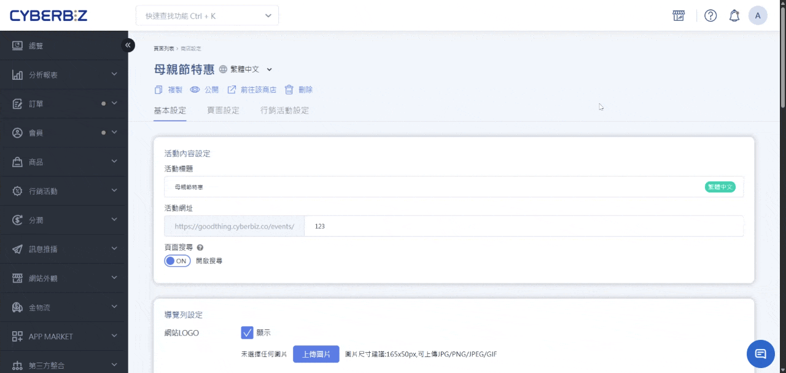

=== "舊版版型"

    1. 切換至 **銷售內容設定** 頁籤。
    2. 選擇 **插入文字編輯**，點擊 **編輯內容**。
    3. 切換至 **原始碼** 模式。
    4. 貼上語法並儲存。

    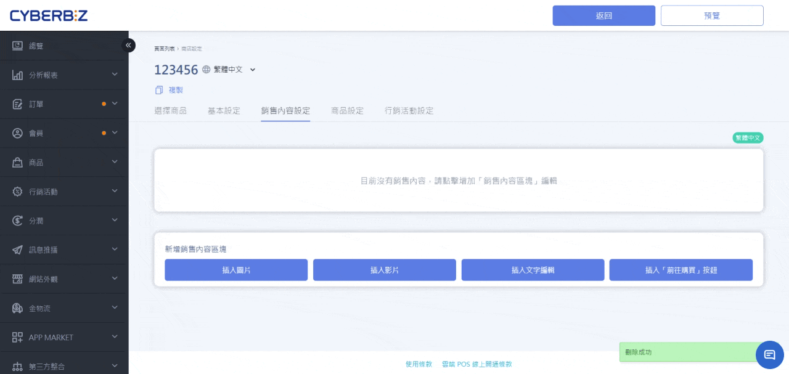

```
<style type="text/css">
*:not(input):not(textarea) { 
-webkit-touch-callout:none;
-webkit-user-select:none;
-khtml-user-select:none; 
-moz-user-select:none;
-ms-user-select:none; user-select:none; } 
</style> 
<script> 
(function () { 
function stopEvent(event) { 
event.preventDefault(); 
event.stopPropagation(); }
['dragstart', 'selectstart', 'contextmenu'].forEach(function(event) { document.addEventListener(event, stopEvent);
}); } )();
</script>
```

### 3. 開啟商品開賣時間設定

系統將在前台自動顯示商品的開賣倒數時間，協助商家提升活動期待感與顧客參與度。

- 啟用路徑：前往 **行銷活動 > 一頁式商店**，於列表右側開啟 **商品開賣時間設定** 開關。
- 生效對象：
    - 系統將自動針對所有 **尚未上架** 的商品套用倒數顯示。
    - 無論商品處於 **公開** 或 **未公開** 狀態，只要未達上架時間，皆會顯示開賣倒數。


!!! info "適用版本與版型"
    - 本功能僅支援 **企業版本** 使用。
    - 僅適用於 **拖拉版型** 建立之一頁式商店。

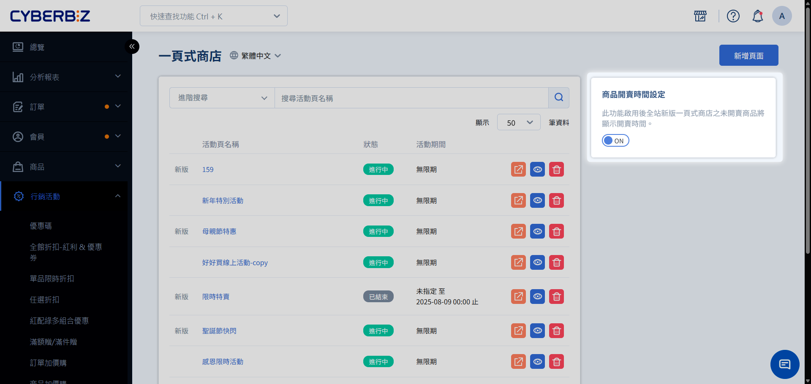


## 常見問題

??? quote "為什麼消費者在結帳時顯示 **找不到物流**？"
    這通常是因為頁面中混合了不同溫層的商品（例如：同時放入常溫餅乾與冷凍冰淇淋）。系統無法在單一訂單處理多重溫層，請確保一頁式頁面內的商品溫層一致。

??? quote "頁面數量達到上限了怎麼辦？"
    若您是高手版商家且已達 10 組上限，可選擇將已過期的活動頁刪除，或聯繫客服升級至 PLUS 版無限組數。

??? quote "倒數計時結束了，消費者還能買嗎？"
    可以。倒數計時器僅為視覺催單工具，並無連動自動下架功能。若需停止銷售，請手動將頁面狀態改為 **不公開**。

---

## 延伸閱讀

<div class="grid cards" markdown>

- :lucide-layout-template:{ .lg }   
  [__拖拉版型基礎操作__](../design/主題版型管理)       
  學習如何熟練使用編輯器中的各項設計元件。

- :lucide-users:{ .lg }     
  [__設定註冊人分潤__](../members/設定註冊人分潤方案)  
  了解如何搭配一頁式商店與分潤系統擴大銷售網絡。

</div>
