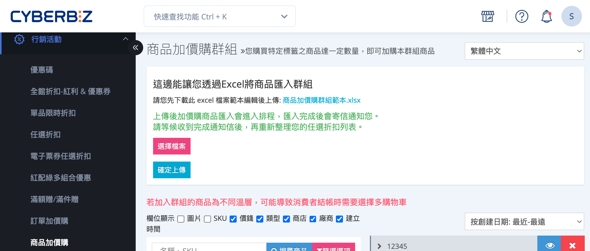
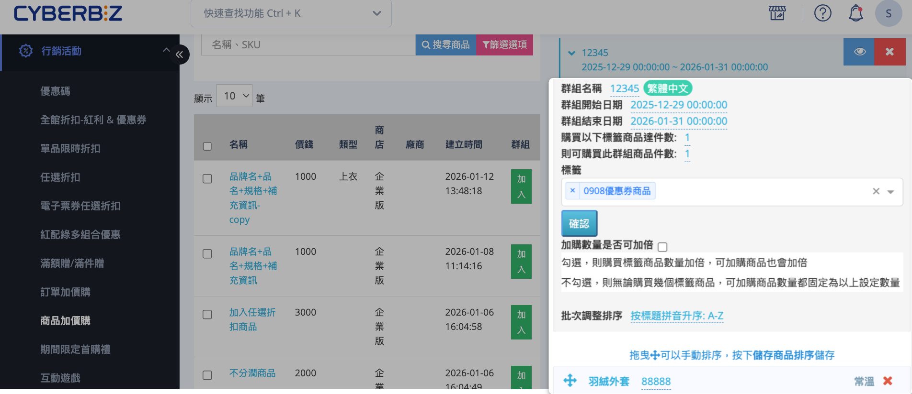
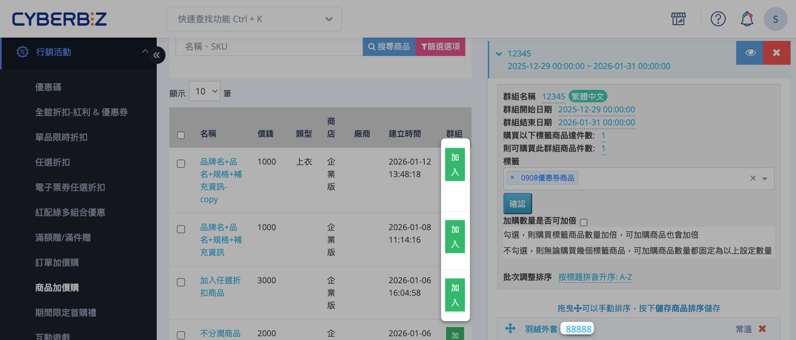
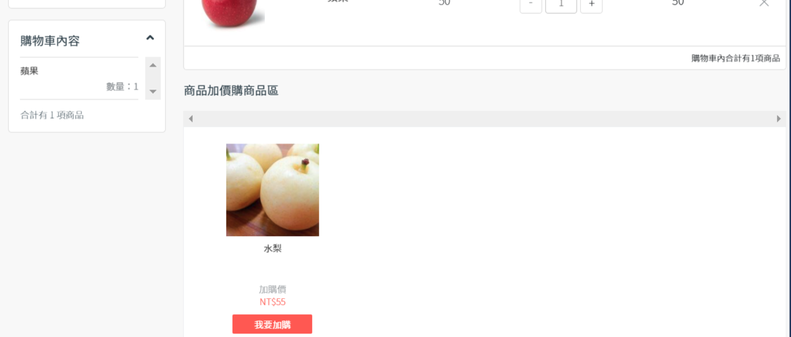
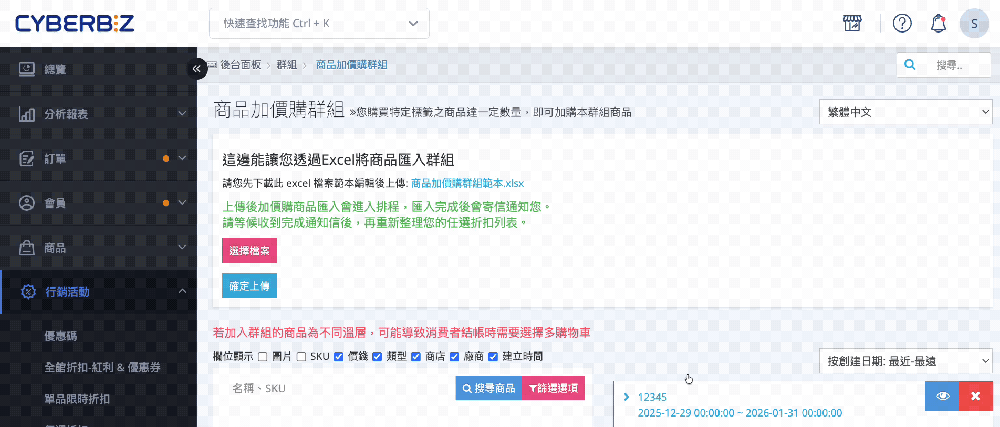
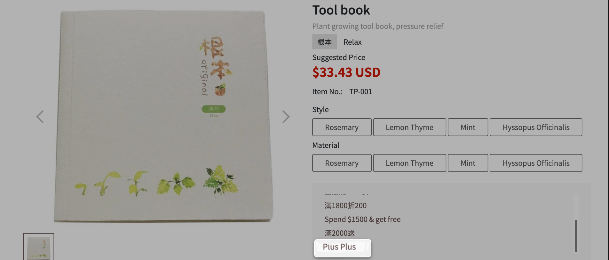

# 設定商品加價購

設定商品加價購及多款式加購商品的價格與前台顯示規則。
{ .subtitle }

[:lucide-lock:{ title="適用方案" }](../../resources/conventions#適用方案) | 進階 (PLUS) / 高手 (PLUS) / 企業
{ .doc-badge }

{ .hero-page }

## 商品加價購說明

商品加價購是一種以「指定商品」作為觸發條件的銷售機制。當顧客購買符合條件的商品時，系統會於購物流程中顯示可加購的指定商品，供顧客以優惠價格加購。

商品加價購常用於：

- 推薦週邊配件或搭配商品
- 提升單一商品的平均銷售金額
- 建立商品組合銷售策略

> 範例：購買相機後，可加購相機配件或記憶卡。

## 設定商品加價購群組

### 步驟 1：進入商品加價購頁面

1. 登入 CYBERBIZ 管理後台，前往  **行銷活動 > 商品加價購**。
2. 在群組列表下方輸入新群組名稱，點擊 **新增群組**。

### 步驟 2：填寫加價購群組資訊

在群組列表中，點擊展開欲設定的加購群組，依序設定以下欄位：

- **群組名稱**：設定商品加價購活動的名稱，用於辨識與管理。
- **群組開始日期 / 群組結束時間**：設定活動的有效期間。
- **購買以下標籤商品達件數**：設定觸發加價購的條件，即顧客需購買的指定標籤商品數量。
- **則可購買此群組商品件數**：設定符合條件後，顧客最多可加購的商品件數。
  > **範例說明**  
  > 若「購買以下標籤商品達件數」設定為 **3 件**，
  > 且「則可購買此群組商品件數」設定為 **1 件**，  
  > 則當顧客購買 **3 件符合標籤的商品** 時，**最多可加購 1 件此加價購群組的商品**。

- **標籤**：須先建立可附加加價購的商品標籤。瞭解 [如何設定商品標籤](../products/管理商品標籤)。 
- **加購數量是否可加倍**：決定加購數量是否可按購買件數倍增。

	??? example "加價數量是否可加倍範例"  
		 範例：購買 1 個蘋果，可加購 1 個水梨  
	    
		|設定|行為說明|
		|---|---|
		|**不勾選**|加購數量固定為 1 份。即使顧客購買多個蘋果，水梨也無法增加加購數量。|
		|**勾選**|加購數量會依購買商品數量加倍。例如：購買 2 個蘋果，可加購最多 2 個水梨。|
			
- **批次調整排序**：調整加價購商品顯示順序。若選擇 **手動排序**，可使用 :material-arrow-all: 拖曳商品調整順序。

### 步驟 3：選擇加價購商品

1. 在左側商品列表區域，點擊 **加入** 將欲加入群組的商品加入加購群組中。
2. 調整每件商品的「加購價格」。

!!! warning "多款式加購商品價格注意事項"

	- 當加價購商品具有多個款式且各款式價格不同時，前台商品頁仍可讓顧客選擇不同款式，但 **顯示價格將依加價購群組設定的固定金額**。
	- 「加價購」商品不同款式皆採 **固定加購金額**。
	- 若希望 **不同款式對應不同價格**，請 **另行建立加價購商品** 以區分款式及價格。

### 步驟 4：前台呈現

- 顧客在 **結帳頁面**，當購買符合標籤的商品時，將顯示可加購商品選項。

## 多國語系設定

設定商品加價購群組的多國語系名稱，使前台可根據語系顯示正確文字。

!!! warning "注意事項"
	- 若要更改英文語系，需先 **切換至英文語系**，再進行修改。
	- 欄位有顯示 **語系標籤**，前台顯示才可隨語系切換文字。如：**群組名稱** 商品加價購 `繁體中文`。
	- 若其他語系欄位未填寫內容，前台顯示該語系時，將自動使用 **繁體中文** 內容作為預設顯示。

### 操作步驟

1. 登入 CYBERBIZ 管理後台，前往 **行銷活動 > 商品加價購**
2. 在語系選單中，切換至欲編輯的語系（例如：繁體中文、英文）。  
3. 展開欲編輯的加購群組，然後直接點擊群組名稱欄位進行修改。  

### 前台顯示效果

- **繁體中文頁面**  

	
    
- **英文頁面**  

	

## 常見問題

??? quote "加價購商品可以支援多款式嗎？若不同款式價格不同，前台顯示會如何呈現？"
	可以。加價購商品可設定多個款式，前台商品頁仍允許顧客選擇不同款式。但需注意以下事項：

	- **固定加購金額**：不論款式價格是否不同，前台顯示價格皆 **以加價購群組設定的固定金額為準**。
	- **多款式不同價格**：若希望不同款式對應不同加購價格，需 **另行建立多個加價購商品** 以區分款式及價格。

??? quote "為什麼商品加價購，客戶可以無限制的點選加價購?"

	- **原因**：加價購商品同時擁有此加價購群組的「標籤」，導致系統無法限制加購數量。
	- **解決方法**：請將加價購商品的標籤與觸發加價購的門檻標籤 **分開設定**，避免標籤重複，系統即可正確限制加購數量。

??? quote "加購數量是否可以依購買件數倍增？"
	可以。 勾選加價購群組設定中的 **加購數量是否可加倍** 選項，即可讓加購商品數量隨購買觸發商品的數量倍增。瞭解 [如何設定加購數量倍增](#步驟-2填寫加價購群組資訊)。