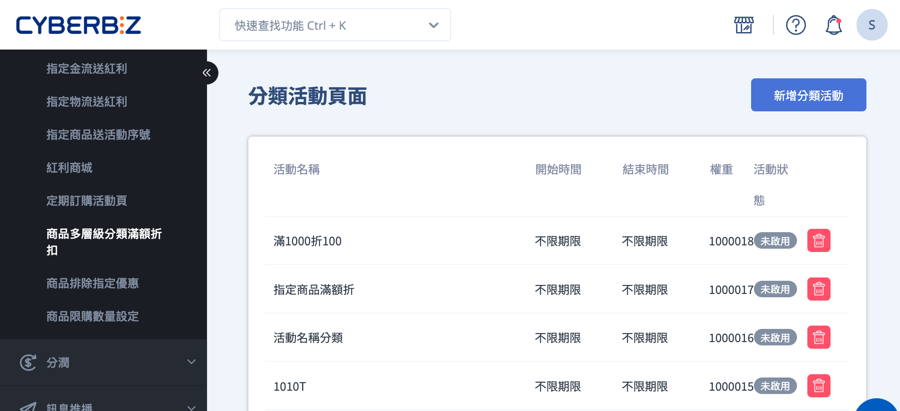
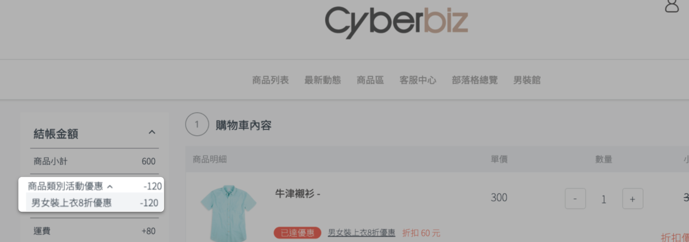

# 設定商品多層級分類滿額折扣

設定針對商品多層級分類的滿額折扣活動，當訂單符合條件時，對該分類內每件商品獨立套用折扣。
{ .subtitle }

[:lucide-tag:{ title="適用方案" }](../../resources/conventions#適用方案) | PLUS / 企業

{ .hero-page }

## 商品多層級分類滿額折扣說明

商品多層級分類滿額折扣是一種 **依商品分類層級套用的行銷活動**。  
商家可將多層級分類中的 **大分類或中分類** 綁定折扣條件，當訂單中符合指定分類的商品金額達到門檻時，系統會對該分類內的 **每件商品分別套用折扣**。
!!! note "分類層級說明"

	- **大分類**：商品多層級分類中的最上層結構，用於概括整理商品方向。
	- **中分類**：建立於大分類之下，用於進一步細分商品分類邏輯。  
	- **小分類**：最底層，實際對應商品群組來源（自訂分類、條件分類或商品類型）。

### 前置條件

請先完成 **商品多層級分類設定**，再建立多層級分類滿額折扣活動。瞭解 [如何設定商品多層級分類](設定商品多層級分類.md)。

### 使用須知

- 同一筆訂單中，系統將依 **優惠排序數值** 套用折扣，數值越大者優先計算。
- 同時將 **大分類** 與其底下的 **中分類/小分類** 加入同一活動時，優惠 **僅計算一次**，不會重複套用。
- 折扣計算方式為：**每件商品折扣 × 符合條件商品數量**，而非僅對整筆訂單折扣一次。

### 折扣計算範例

- 活動設定：指定分類商品 **滿 1,000 元，每件商品折 30 元**
- 訂單中符合條件商品數量：3 件  
- 計算方式：`30 × 3 = 90 元`

> :lucide-info: 折扣會套用至每件符合條件的商品。

## 建立商品多層級分類滿額折扣

### 步驟 1：新增分類活動

1. 登入 CYBERBIZ 管理後台，前往 **行銷活動 > 商品多層級分類滿額折扣**。
2. 點擊 **新增分類活動**，輸入活動名稱。 

### 步驟 2：選擇分類加入活動

1. 勾選選擇欲套用折扣的 **大類別或中類別**。 
2. 點擊 **將分類加入活動**，將分類加入折扣活動。
3. 已加入活動的分類將顯示於 **已選取的分類商品** 列表中，可點擊 :lucide-x: 移除不需要的分類。

### 步驟 3：設定活動內容與時間

前往 **活動設定** 頁籤，設定以下項目：

- **分類活動啟用**：選擇是否啟用活動。
    
    > :lucide-triangle-alert: 若未啟用，顧客結帳時不會套用折扣。
    
- **活動標題**：輸入活動名稱，方便辨識。
- **折扣種類**：可選擇 **金額折扣** 或 **百分比折扣**。
    
    > :lucide-info: 折扣套用至 **每件符合條件的商品**。
    
- **活動最低消費金額**：訂單需達到門檻才會套用折扣。
- **活動優惠排序**：數值越大，優先套用折扣。
- **活動開始/結束時間**：設定活動期間，活動結束後折扣自動失效。

### 步驟 4：顧客前台顯示

活動生效後，顧客於前台結帳時，將看到符合條件商品的折扣資訊。

## 常見問題

??? quote "折扣會重複套用嗎？"
    不會。即使同時將大分類與其底下分類加入活動，系統僅計算一次折扣。
    
??? quote "折扣是套用整筆訂單還是單件商品？" 
    折扣套用於 **每件符合條件的商品**，整筆訂單折扣 = 單件折扣 × 商品數量。