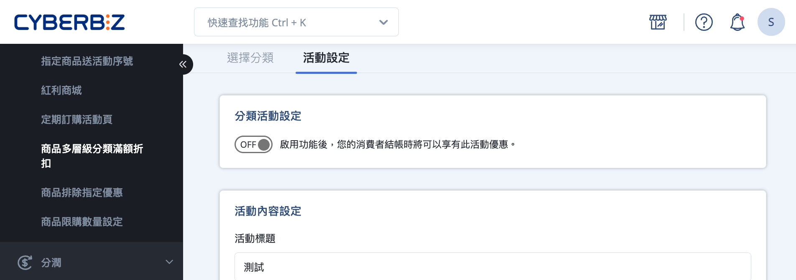

# 設定商品多層級分類滿額折扣

[:lucide-lock:{ title="適用方案" }](../../resources/conventions#適用方案) | PLUS / 企業

{ .hero-page }

## 商品多層級分類滿額折扣說明

商品多層級分類滿額折扣是一種 **依商品分類層級套用的行銷活動**。  
商家可將多層級分類中的 **大類別或中類別** 綁定滿額折扣條件，當訂單中符合指定分類的商品金額達到門檻時，系統將對該分類內的 **每一件商品分別套用折扣**。

!!! quote "詞彙說明：分類層級"

	- **大分類**：商品多層級分類中的最上層結構，用於概括整理商品分類方向。  
	- **中分類**：建立於大分類之下，用於進一步細分商品分類邏輯。  
	- **小分類**：多層級分類中的最底層，實際對應商品群組來源（自訂分類、條件分類或商品類型）。

### 前置條件

請先完成 **商品多層級分類設定**，再建立多層級分類滿額折扣活動。  
→ 瞭解 [如何設定商品多層級分類](設定商品多層級分類)。

### 使用須知

- 同一筆訂單中，活動優惠將依 **優惠排序數值** 計算，數值越大者優先套用。 
- 若同時將 **大類別** 與其底下的 **中類別／小類別** 加入同一活動，優惠 **僅計算一次，不會重複套用**。
- 本活動的折扣計算方式為：**每件商品分別折扣 × 符合條件的商品數量**，而非僅對整筆訂單折扣一次。

### 折扣計算方式說明

- 本活動的 **折扣金額為「每件商品的折扣金額」**。
- 範例說明：
    
    - 設定指定分類商品 **滿 1,000 元，每件商品折 30 元** 
    - 若訂單中有 **3 件商品** 符合條件
    - 則整筆訂單折扣為：`30 × 3 = 90 元`

## 建立商品多層級分類滿額折扣

### 步驟 1：新增分類活動

1. 登入 CYBERBIZ 管理後台，前往 **行銷活動 > 商品多層級分類滿額折扣**。
2. 點擊新增活動，輸入活動名稱。 

### 步驟 2：選擇分類加入活動

1. 勾選選擇欲套用折扣的 **大類別或中類別**。 
2. 點擊 **將分類加入活動**，將分類加入折扣活動。
3. 加入活動的分類會顯示在下方 **已選取的分類商品** 列表中，點擊 :lucide-x: 可以移除。

### 步驟 3：設定活動內容與時間

1. 前往 **活動設定** 頁籤。 
2. 設定以下項目：
    
    - **分類活動設定**：選擇是否啟用分類活動。
    > :lucide-triangle-alert: 若未啟用分類活動，即使完成設定，顧客結帳時也不會套用此折扣。
    - **活動標題**：輸入活動名稱，方便辨識。
    - **折扣種類**：可選擇 **金額折扣** 或 **百分比折扣**。
     > :lucide-info: 折扣會套用至 **每件符合條件的商品**。  
例如：設定指定分類商品滿 1000 元折 30 元，訂單中有 3 件商品符合條件，則總折扣為 30 × 3 = 90 元。
    - **活動最低消費金額**：設定訂單達到的門檻金額，才會套用折扣。
    - **活動優惠排序**：系統會依排序值決定折扣套用優先順序，數值越大，優先計算。
    - **活動開始/結束時間**：設定活動期間，活動結束後折扣自動失效。

### 步驟 4：顧客前台顯示

活動生效後，顧客於前台結帳時，將看到符合條件商品的折扣資訊。

## 常見問題

