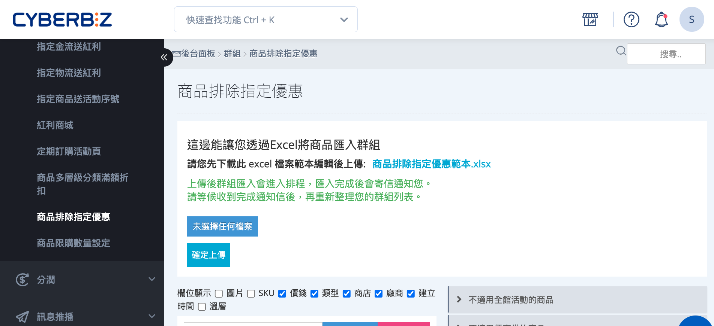
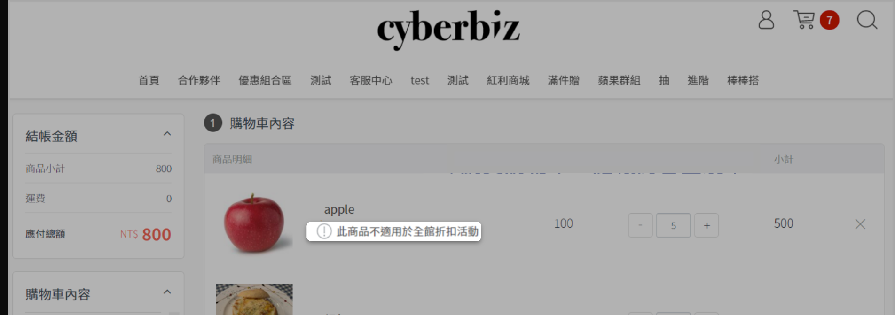
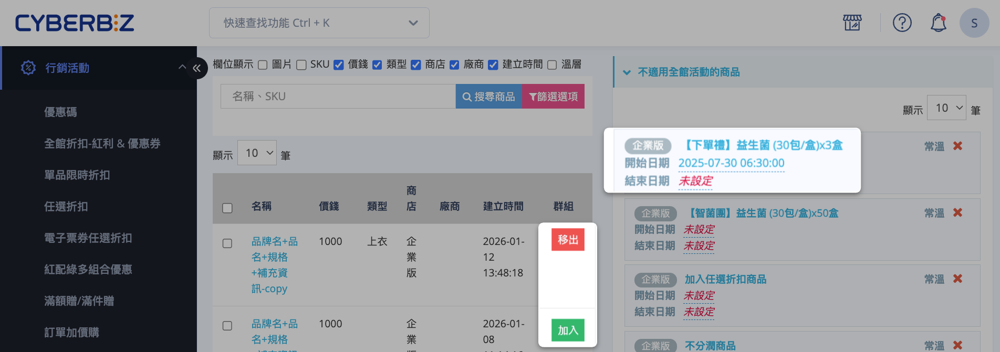

# 設定商品排除指定優惠

設定特定商品無法參與「全館活動」、「優惠券」、「商品多層級分類滿額折扣」及「VIP 優惠」等行銷活動。
{ .subtitle }

[:lucide-tag:{ title="適用方案" }](../../resources/conventions#適用方案) | PLUS / 企業   
[:lucide-layers:{ title="適用產品" }](../../resources/conventions#適用產品) | EC / POS
{ .doc-badge }

{ .hero-page }

## 商品排除指定優惠說明

將商品排除於特定行銷活動，避免重複折扣或影響利潤。此功能可針對全館折扣、優惠券、多層級分類滿額折扣及 VIP 優惠進行精準排除。

**適用情境**

- **避免重複優惠**：排除已有專屬促銷或折扣商品的其他全館性優惠，維持利潤。
- **特殊商品管理**：限制高單價、限量或特殊商品參與一般行銷活動，保護品牌價值與商品獨特性。
- **精準行銷策略**：依商品屬性或銷售目標調整排除範圍，優化行銷資源分配。
- **POS 獨賣商品適用**：確保門市專屬商品不受線上優惠影響。

### 可排除的行銷活動類型

您可以將商品加入對應的「不適用折扣群組」，使其不參與以下行銷活動：

- **全館折扣活動**：排除所有全館型價格折扣與紅利／優惠券疊加。
- **優惠券與優惠碼**：排除所有優惠券、優惠碼，以及由其他行銷活動所發送的優惠券。
> :lucide-triangle-alert: 系統將同時排除透過「首購禮」、「互動遊戲」及「指定商品送優惠券」等活動發送的優惠券。

- **商品多層級分類滿額折扣**：排除依商品分類或階層計算的滿額折扣。
- **VIP 會員專屬優惠**：排除依會員等級套用的專屬折扣。

!!! info "POS 獨賣商品適用"
    此功能同時支援 POS 獨賣商家，可確保門市專屬商品不會受到線上優惠活動影響。

<!-- 
## 相關功能設定

- :lucide-tag:{ .lg }   
  [__全館折扣活動__](設定全館折扣.md)  
  將商品排除於「全館折扣 - 紅利 & 優惠券」設定的全館折扣與疊加優惠。

- :lucide-percent:{ .lg }     
  [__優惠碼 / 優惠券__](設定優惠碼.md)  
  將商品排除於優惠碼與優惠券活動，包括首購禮、互動遊戲與指定商品送優惠券。

- :lucide-clock:{ .lg }   
  [__期間限定首購禮__](設定首購禮.md)  
  將商品排除於期間限定首購禮活動。

- :lucide-gamepad:{ .lg }   
  [__互動遊戲__](設定互動遊戲.md)  
  將商品排除於互動遊戲活動發送的優惠券。

- :lucide-list-check:{ .lg }   
  [__商品多層級分類滿額折扣__](設定商品多層級分類滿額折扣.md)  
  將商品排除於多層級分類滿額折扣活動。

- :lucide-crown:{ .lg }   
  [__VIP 優惠__](設定 VIP 優惠.md)  
  將商品排除於會員專屬折扣優惠。

-->

### 排除效果

當商品被設定排除指定優惠後，在前台結帳頁面，系統將會根據設定給予提醒顯示，確保該商品不參與被排除的行銷活動。

## 設定商品排除指定優惠群組

您可以透過以下步驟，將商品排除特定行銷活動：

1. 登入 CYBERBIZ 管理後台，前往 **行銷活動 > 商品排除指定優惠**。
2. 在群組列表中，找到欲設定的「不適用折扣群組」，點擊展開群組資訊。
3. 在左側商品列表中，選擇要排除的商品，點擊 **加入** 或 **移出**：
    
    - 同一商品可加入多個「不適用折扣群組」。    
    - 已加入的商品將自動排除，不會重複加入。
        
4. 新增商品後，可為各商品設定群組中的排程時間（開始／結束日期）。

## 常見問題

??? quote "一個商品可以加入多個不適用折扣群組嗎？"
    可以。一個商品可以同時加入多個不適用折扣群組，例如同時排除「全館活動」和「優惠券」。

??? quote "排除指定優惠後，商品還能被顧客購買嗎？"
    可以。此功能僅排除商品參與特定行銷活動，不影響商品在商店中的正常顯示與購買功能。
