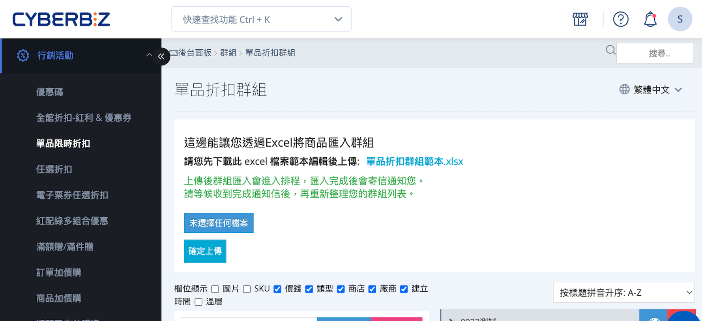
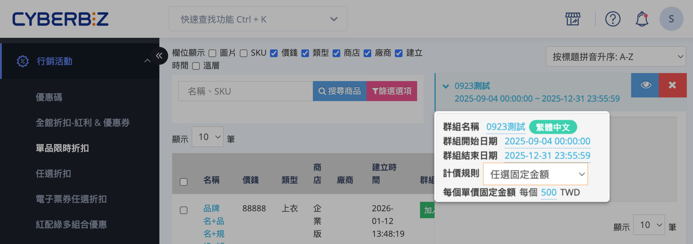
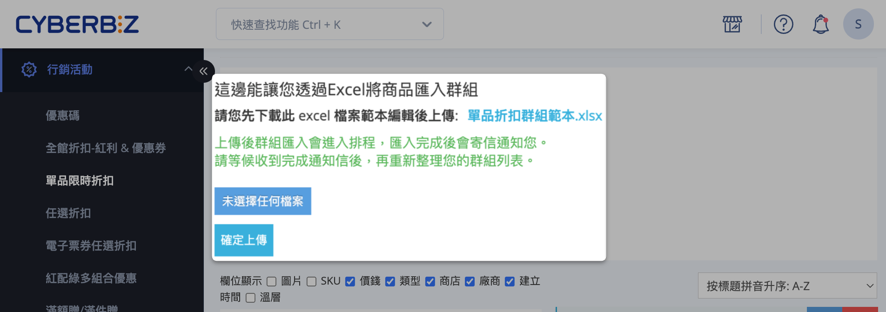

# 設定單品限時折扣群組

建立「單品限時折扣群組」，並設定折扣計價方式（固定金額、百分比或活動價格）、活動商品與有效期間。
{ .subtitle }

[:lucide-lock:{ title="適用方案" }](../../resources/conventions#適用方案) | PLUS / 企業
{ .doc-badge }

{ .hero-page }

## 單品限時折扣說明

單品限時折扣是一種以「商品本身」為折扣對象的行銷活動。  商家可針對指定商品，在特定期間內套用折扣價格，折扣僅於活動期間生效，活動結束後商品價格將自動恢復原價。

### 功能與效益

- **針對單品設定折扣**：只影響指定商品，其他商品價格不受影響。
- **活動期間自動生效**：開始與結束時間可自訂，結束後商品自動恢復原價。
- **提升銷售轉換率**：透過限時優惠，刺激顧客快速下單或增加購買數量。

### 適用情境

- **短期促銷活動**：針對特定商品推出限時優惠。  
- **清倉或庫存去化**：對滯銷商品設定折扣，加速庫存周轉。  
- **新品上市推廣**：對新上架商品提供短期折扣，提升初期銷售量與市場關注度。

## 設定單品限時折扣群組

### 步驟 1：新增單品折扣群組

1. 登入 CYBERBIZ 管理後台，前往 **行銷活動 > 單品限時折扣**。
2. 在群組列表下方輸入新群組名稱，點擊 **新增群組**。

### 步驟 2：填寫群組資訊

在群組列表中，點擊展開欲設定的群組，依序設定以下欄位：

- **群組名稱**：用於辨識與管理此折扣活動。
- **群組開始／結束日期**：設定活動的有效期間。
- **計價規則**：選擇折扣計價類型，決定商品折扣方式：

	- **任選固定金額**：設定活動期間每件商品的固定售價。
    > 範例：商品單價 300 元，設定每件固定售價 100 元，購買 3 件，結帳金額為 300 元。
	- **任選折數**：商品售價依設定折扣比例計算。
    > 範例：商品單價 100 元，折扣 80%，購買 1 件，結帳金額為 80 元。
    - **任選折固定金額**：每件商品折扣指定金額。
    > 範例：商品單價 100 元，每件折扣 20 元，購買 3 件，結帳金額為 240 元。
    
- **折扣數值設定**：根據選擇的計價方式，於欄位中填寫對應數值，例如折扣百分比或固定金額。

### 步驟 3：將活動商品加入群組

將商品加入折扣活動群組，可使用以下兩種方式：

**手動加入**
    
1. 展開欲設定的折扣群組。    
2. 在左側商品列表區域，點擊 **加入**，將單品或商品款式加入群組。
3. 完成加入後，可在群組內確認商品列表與排序。

**批次匯入**（適用商品數量較多的情況）
    
1. 下載 **單品折扣群組範本.xlsx**。
2. 依範本格式填寫商品資料，包括商品名稱、款式、折扣設定等欄位。
3. 上傳已編輯完成的 Excel 檔案至系統，系統將自動將商品匯入群組。

!!! warning "匯入注意事項"

	- 請保持 Excel 檔案格式與範本一致，以避免匯入失敗。
    - 群組名稱需與已建立的折扣群組名稱完全一致。

## 後續步驟

- :lucide-list-ordered:{ .lg }   
  [__結帳優惠計算順序__](結帳優惠計算順序.md)       
  顧客結帳時，各種優惠的套用順序。
- :lucide-group:{ .lg }     
  [__自訂商品群組__](設定商品自訂分類群組.md)  
  自訂商品分類群組。
- :lucide-ban:{ .lg }  
  [__商品排除指定優惠__](#)  
  將特定商品從特定優惠活動中排除。

