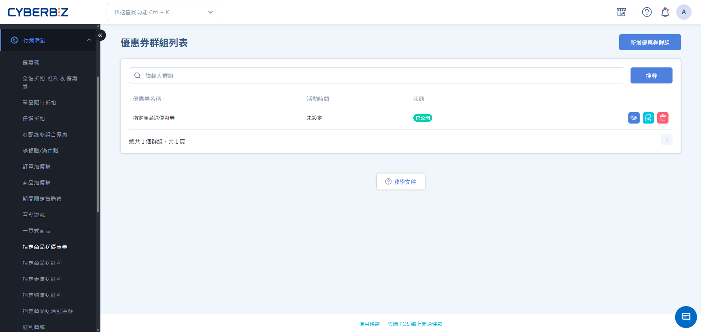
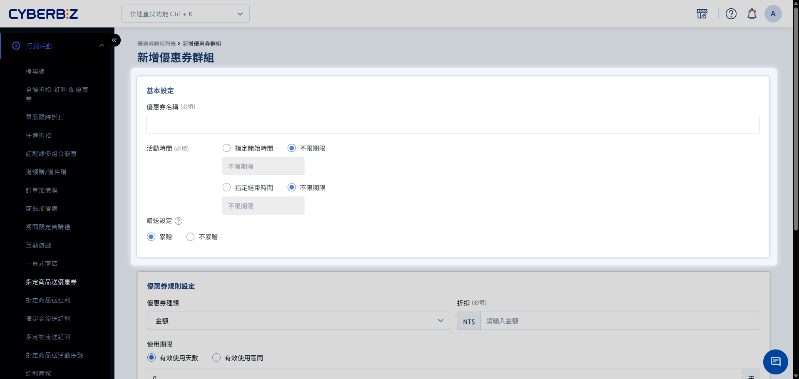
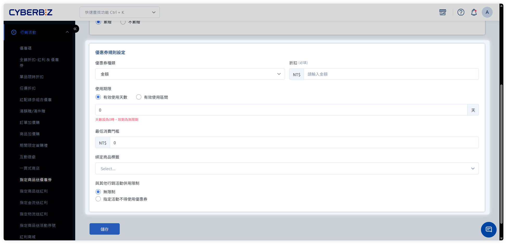

# 設定指定商品送優惠券

建立「優惠券群組」，當會員購買指定商品並完成訂單後，系統自動發送優惠券至其帳戶，提升回購率與客戶忠誠度。
{ .subtitle }

[:lucide-tag:{ title="適用方案" }](../../resources/conventions#適用方案) | 企業
{ .doc-badge }

{ .hero-page }

## 指定商品送優惠券說明

「指定商品送優惠券」（優惠券群組）是一種自動化送券機制。商家可指定特定商品或商品標籤，當會員購買這些商品後，可獲得預設的優惠券。此功能常用於鼓勵回購、跨品項銷售或加速庫存出清。

!!! tip "應用情境"
    - **新品帶回購**：購買「2024 春季新品」送 100 元折價券，吸引顧客下次再次消費。
    - **品類交叉銷售**：購買「保養品」送「彩妝券」，引導顧客嘗試不同品類的商品。
    - **清庫存加速器**：購買「清倉區商品」送高價值優惠券，提高顧客購買滯銷品的動機。

## 使用須知

- **送券數量**：可選擇「累贈」（買幾件送幾張）或「不累贈」（每筆訂單僅送一張）。
- **多群組適用**：同一商品可加入多個優惠券群組，購買後系統將依據該商品所屬的所有群組發送對應優惠券。
- **跨通路使用**：會員在官網購買商品取得的優惠券，可於 POS 門市訂單結帳時使用。
- **POS 商品限制**：僅限官網銷售的商品適用此功能，POS 專屬商品不支援自動送券。
- **併用限制**：可於設定中明確指定該優惠券是否可與全館折扣、單品折扣等活動同時使用。

## 操作流程

### 步驟 1：建立優惠券群組

1. 登入 CYBERBIZ 管理後台，前往 **行銷活動 > 指定商品送優惠券**。
2. 點擊 **新增優惠券群組**。

### 步驟 2：填寫基本設定與贈送規則

1. **基本資訊**：
    - **優惠券名稱**：後台管理識別用名稱（如：2024 春季送券活動）。
    - **活動時間**：勾選並設定活動起訖日期。若不勾選則為立即生效且長期執行。
2. **贈送設定**：
    - **累贈**：每件商品送一張券（買越多送越多）。
    - **不累贈**：每筆訂單僅送一張券（成本控制）。

### 步驟 3：設定優惠券詳細規則

在 **優惠券規則** 區塊，定義發送的券內容：

1. **優惠券種類**：選擇「金額折扣」或「百分比折扣」並輸入數值。
2. **使用期限**：
    - **有效使用天數**：從發券日起算（例：`30` 天）。
    - **有效使用區間**：固定日期範圍，所有券統一到期。
3. **最低消費門檻**：使用此券時訂單需達到的最低金額（例：`500`）。
4. **綁定商品標籤**（選填）：限制此券僅能購買特定標籤的商品。

### 步驟 4：設定併用限制

1. 選擇 **無限制**（可疊加所有優惠）或 **指定活動不得使用優惠券**。
2. 若選後者，請勾選欲禁止併用的活動類型（如：全館折扣、單品折扣、VIP 折扣等）。

