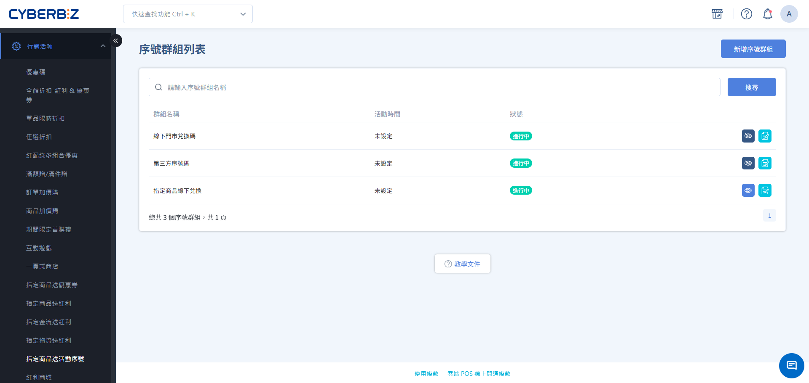

# 設定指定商品送活動序號

建立「序號群組」，當顧客購買指定商品並付款後，系統自動發送專屬活動序號，適用於票券、兌換碼或抽獎活動。
{ .subtitle }

[:lucide-lock:{ title="適用方案" }](../../resources/conventions#適用方案) | 企業
{ .doc-badge }

{ .hero-page }

## 指定商品送活動序號說明

「指定商品送活動序號」（序號群組）是一種自動化贈送序號的行銷工具。當顧客購買指定商品並完成付款後，系統會自動在訂單明細中發送一組專屬序號。此功能可協助商家自動化處理虛擬商品或活動贈品，無需人工手動發券。

!!! tip "應用情境"
    - **票券發送**：販售實體活動入場券（如演唱會、展覽、課程），付款後自動發送入場憑證。
    - **第三方兌換**：提供遊戲點數、影音平台會員或外部平台兌換碼。
    - **抽獎活動**：顧客購買指定促銷商品後，自動獲得一組抽獎序號。
    - **保固與註冊**：隨商品附贈專屬保固序號，供顧客至官網註冊使用。

## 使用須知

- **訂單收款方式**：僅支援貨到不付款訂單。
- **核銷自行管理**：本功能主要提供活動序號之發送服務。關於序號於第三方平台的實際核銷進度，建議商家搭配該平台系統進行管理。若需追蹤序號的使用狀態，請店家依據第三方系統之規範自行控管。
- **發放時機**：序號會在訂單狀態變更為 **已結案** ，立即由系統自動分配。
- **訂單退貨**：若訂單在發送序號後退貨，已分配的序號無法由系統自動收回或作廢。
- **產生方式限制**：一旦選擇序號產生方式後，**即無法修改**。若需變更，請建立新的群組。
- **低庫存提醒**：採用 **自行上傳 Excel** 方式時，建議設定提醒數量，避免序號用罄導致活動中斷。

## 操作流程

### 步驟 1：建立序號群組

1. 登入 CYBERBIZ 管理後台，前往 **行銷活動 > 指定商品送活動序號**。
2. 點擊 **新增序號群組**。

### 步驟 2：設定基本資訊與產生方式

1. **基本設定**：
    - **序號群組列表名稱**：後台識別用的活動名稱。
    - **活動時間**：設定開始與結束日期。若不勾選，則為立即生效且長期執行。
2. **選擇序號產生方式**：
    - **系統自動產生序號**：系統在訂單成立時，自動產生 8 位隨機英數序號。
    - **自行上傳 Excel 序號**：商家預先準備序號檔案（如：第三方兌換碼），並設定 **低庫存提醒數量**。

### 步驟 3：匯入序號內容（僅限自行上傳）

若選擇「自行上傳 Excel 序號」，需執行以下步驟：

1. 切換至 **序號列表** 頁籤，點擊 **Excel 匯入**。
2. 下載範例檔案，並將序號填入 `序號` 欄位（每行一組，單次上限 10,000 行）。
3. 上傳檔案，系統完成匯入後會發送通知信至管理員信箱。

### 步驟 4：選擇活動商品

1. 切換至 **選擇商品** 頁籤。
2. 透過篩選條件（類型、標籤、廠商）或搜尋功能，找到欲參加活動的商品。
3. 勾選商品後點擊 **加入群組**，確認商品出現在 **選取商品** 列表中。

### 步驟 5：公開與儲存

1. 在基本設定區，將 **公開狀態** 切換為 `開啟`（眼睛圖示變為藍色）。
2. 點擊 **儲存**，完成活動設定。

## 贈獎發送機制

### 群組內累加發送

於同一序號群組內，系統將偵測符合條件之商品件數。若單筆訂單購買多件，將 **按件數配發** 對應數量序號。

### 跨群組同步發送

單一商品可關聯至多個獨立序號群組。當交易達成時，各群組的序號將 **同時派發** 。

### 範例

| 購買清單 | 綁定群組 | 獲得序號數量 | 備註 |
| ------- | -------- | ---------- | ---- |
| 商品 A ×1 | 群組 a | 1 組 | 基本發送 |
| 商品 A ×2 | 群組 a | 2 組 | 同組累加發送 |
| 商品 A + B | 皆為群組 a | 2 組 | 同組累加發送 |
| 商品 A ×1 | 群組 a + 群組 b | 2 組 | 跨群組同步發送 |

## 管理序號狀態

您可以在 **序號列表** 頁籤中，即時追蹤所有序號的發放進度與當前狀態。

=== "系統自動產生序號"
    1. 系統於訂單結案時即時建立序號並發送給會員。
    2. 發送完成後，系統會於列表顯示 **已發送** 序號。

=== "自行上傳 Excel 序號"

    1. 序號匯入成功後，初始狀態預設為 **未發送** 。
    2. 待後續正式配發予會員，系統將自動同步更新為 **已發送** 。

## 查看訂單對應序號

=== "會員查詢"

    - 會員可登入官網，前往 **會員中心 > 我的訂單**，點擊進入購買該商品的訂單詳情頁面，即可看到 **活動序號** 。
    - 會員可於 **獲得活動序號通知信** 中，查看獲得序號。
      > 可於 **訊息推播 > Email 通知樣板** 啟用 **顧客獲得指定商品送活動序號** 通知開關。

=== "商家查詢"

    - 商家可登入後台，前往 **訂單 > 所有訂單** ，查看 **活動序號** 一欄。
      > 若列表中無此欄位，請點擊 **編輯欄位** ，勾選顯示 **活動序號** 。
    - 商家可點擊指定訂單，於訂單明細頁中查看 **活動序號** 。

## 常見問題

??? quote "自動產生與手動上傳序號該如何選擇？"
    若序號僅作為內部識別或抽獎使用，建議使用「自動產生」；若序號需在第三方平台驗證（如：遊戲點數、Netflix 序號），則必須使用「自行上傳」以確保格式符合要求。

??? quote "活動期間序號用完了，會發生什麼事？"
    訂單仍會正常成立，但無法分配序號。系統會發送庫存耗盡通知給管理員，商家可手動補充序號並補發給受影響的顧客。

??? quote "活動結束仍有未送出序號，會發生什麼事？"
    系統不會再發出序號，後台會顯示未送出序號。

??? quote "透過 Excel 匯入序號時，可以上傳兩份檔案嗎？"
    可以。當上傳第二份序號檔案時，第二份檔案的序號會自動接續在第一份檔案之後。

??? quote "可否手動刪除活動？"
    可以。當刪除活動時，已發送的序號依然會被記錄在訂單中。

