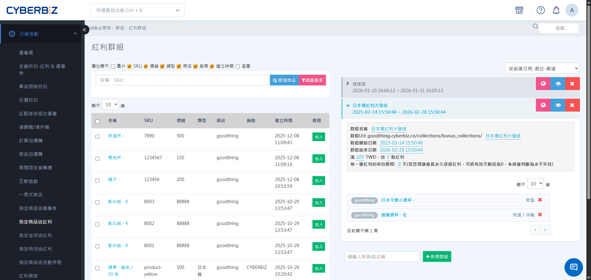

# 設定指定商品送紅利

建立「指定商品送紅利」群組，針對特定商品設定滿額贈送紅利點數，提升回購率與客單價。
{ .subtitle }

[:lucide-lock:{ title="適用方案" }](../../resources/conventions#適用方案) | PLUS / 企業
{ .doc-badge }

{ .hero-page }

## 指定商品送紅利說明

!!! tip "應用情境"
    - **入門回購刺激**：針對「日用品」群組設定「滿 $1,000 送 100 點」（效期 60 天），吸引顧客在點數過期前再次消費。
    - **高單價商品導引**：針對「家電用品」群組設定「滿 $2,000 送 300 點」，增加高客單價商品的購買誘因。
    - **新品推廣**：針對「新品」群組設定「滿 $1,500 送 150 點」，快速建立市場關注度。

## 使用須知

- **前置作業**：請先於 **行銷活動 > 全館折扣-紅利&優惠券** 開啟紅利點數功能。
- **計算規則**：**群組內單項商品滿額才會贈送紅利**，紅利群組內商品合計達門檻則不會贈送紅利。
- **適用商品**：此功能不支援組合商品使用。
- **商品歸屬**：同一個商品無法加入相同活動期間(走期)的紅利群組中。

## 操作流程

### 步驟 1：建立指定商品送紅利群組

1. 登入 CYBERBIZ 管理後台，前往 **行銷活動 > 指定商品送紅利**。
2. 在頁面下方輸入 **群組名稱**。
3. 點擊 **新增群組**，進入詳細設定介面。

### 步驟 2：設定基本資訊與活動期間

1. 在 **基本設定** 區塊，確認或修改以下欄位：
    - **群組名稱**：後台管理用的名稱。
    - **群組 URL**：前台活動頁面的網址路徑（限英數與連字號 `-`）。
2. 設定 **開始/結束時間**：
    - 若無結束時間，該活動將視為長期常駐活動。
    - 活動期間外，即使購買相關商品也不會觸發贈點。

### 步驟 3：設定紅利贈送規則與效期

1. **設定消費門檻**：在 **消費門檻（元）** 欄位輸入達標金額（例：`1000`）。
2. **設定贈送點數**：在 **贈送紅利（點）** 欄位輸入欲贈送的整數點數（例：`100`）。
3. **設定有效期限**：在 **有效天數** 欄位輸入天數（例：`30`）。
    - 輸入 `0` 代表點數永久有效。

### 步驟 4：選擇活動商品

1. 在 **商品列表** 區塊，點擊 **加入群組**。
2. 透過搜尋名稱、SKU 或標籤，勾選欲參加活動的商品。
3. 點擊 **加入**，確認商品出現在群組清單中。

