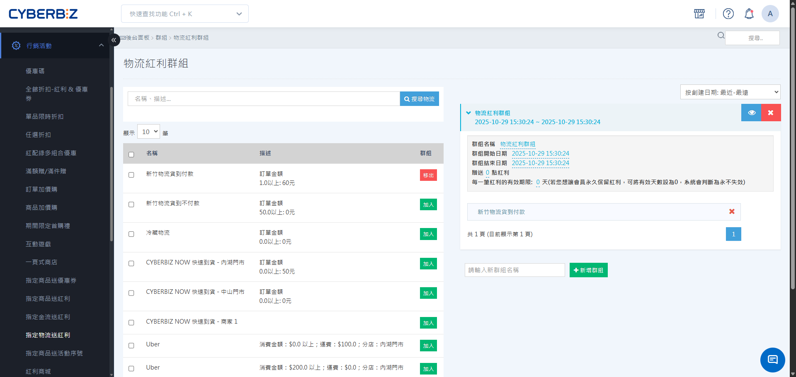

# 設定指定物流送紅利

透過「指定物流送紅利」工具，您可以針對特定配送方式提供紅利點數回饋，有效引導消費者選擇低成本或特定合作物流。
{ .subtitle }

[:lucide-tag:{ title="適用方案" }](../../resources/conventions#適用方案) | 企業
{ .doc-badge }

{ .hero-page }

!!! tip "應用情境"
    - **優化配送成本**：針對成本較低的「門市自取」或「超商取貨」提供高額紅利，降低宅配物流負擔。
    - **配合物流促銷**：當物流業者（如 7-11 或全家）推出限時運費優惠時，同步加碼紅利贈送。
    - **分散旺季壓力**：在電商大促期間，透過紅利引導消費者選擇非宅配通路，緩解物流塞車壓力。

## 使用須知

在設定物流紅利前，請務必了解以下核心規則：

- **贈送時機**：紅利點數會在訂單狀態變更為 **已結案** 後自動歸戶至會員帳戶。
- **疊加規則**：若訂單同時符合「指定物流」、「指定商品」及「指定金流」送紅利條件，系統會 **全部累加發送**。
- **多群組判定**：若同一個物流方式被加入多個啟用的物流紅利群組，系統將會同時判定並贈送各群組所設定的紅利。

## 操作流程

### 步驟 1：新增物流紅利群組

1. 登入 CYBERBIZ 管理後台，前往 **行銷活動 > 指定物流送紅利**。
2. 輸入群組名稱，點擊右側的 **新增群組** 按鈕。

### 步驟 2：設定群組基本規則

點擊新建立的群組，在下方設定區域填寫以下資訊：

1. **群組名稱**：輸入管理用的名稱（如：環保配送紅利加碼 - 春季）。
2. **活動日期**：設定活動的 **開始日期** 與 **結束日期**。
3. **贈送紅利**：輸入消費者選擇該物流時可獲得的固定點數。
  > 贈送點數必須為 **正整數**；若將「有效天數」設為 `0`，則該點數永不失效。
4. **有效期限**：輸入紅利點數的可使用天數。

### 步驟 3：選擇並加入物流方式

1. 在左側 **物流搜尋與選擇** 區域，可透過搜尋框輸入物流名稱（如「超商」）。
2. 勾選欲加入此群組的物流方式。
3. 點擊 **加入** 按鈕。
4. 加入成功的項目將顯示在群組中。

{ .screenshot }

## 常見問題

??? quote "為什麼在左側清單找不到某個物流方式？"
    請檢查該物流方式是否已經啟用。若尚未啟用，則該選項將不會出現在可配置的清單中。

??? quote "修改活動中的紅利點數會影響舊訂單嗎？"
    不會。修改點數僅會對 **修改後成立** 的新訂單生效。已成立或已完成的訂單，將維持下單當下的贈點規則。

??? quote "可以設定「滿額才送物流紅利」嗎？"
    目前指定物流送紅利採「無門檻固定贈點」制，只要選擇該物流即贈送。若有金額門檻需求，建議改用「指定商品送紅利」並於文案引導消費者。

