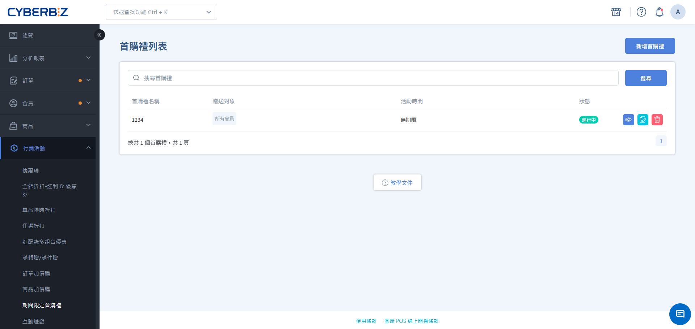

# 設定期間限定首購禮

期間限定首購禮是專為新會員首次消費設計的促銷工具。當符合條件的會員完成首筆付款訂單時，系統將自動贈送指定禮物。
{ .subtitle }

[:lucide-tag:{ title="適用方案" }](../../resources/conventions#適用方案) | 所有PLUS / 企業
{ .doc-badge }

!!! info "版本差異說明"
    「期間限定首購禮」在 PLUS 方案中屬於「行銷 B」選配模組（11 選 2），商家需確認已選配該模組方可使用。企業版則直接內建此功能。

{ .hero-page }

!!! tip "應用情境"
    - **全館新客招募**：不限金額，所有新客首購即送品牌精美小禮或 50 元折價券。
    - **特定族群激勵**：針對特定標籤會員的首購，提供高價值贈品或高額紅利點數。
    - **節慶波段導流**：針對特定月份（如雙 11）註冊的新會員，設定限時首購贈禮，提升當月轉單率。

---

## 使用須知

在設定首購禮前，請務必了解以下核心規則：

- **首購定義**：指會員帳號下第一筆狀態變更為 `已付款` 的訂單。即使是註冊已久的舊會員，只要從未有過付款成功的紀錄，仍符合首購資格。
- **登入要求**：會員必須先 **登入** 帳號後進行結帳，系統才能判定首購身份並發送贈禮。
- **活動並行邏輯**：系統支援多個首購禮活動同時並行排程。若會員同時符合多個活動條件，系統將 **全數送出**。
- **贈禮發送時間點**：依贈禮類型不同，發送邏輯如下。
    - **紅利 / 優惠券**：於活動期間與頻率內，依商家訂單 **結案** 時間進行發送（以購買當下的時間點判定是否符合滿額贈活動，結案動作可超過活動期限）。
    - **商品 / 現金折價**：於活動期間與頻率內，以會員 **第一筆成立** 的訂單內進行折價或贈送。

系統邏輯與操作限制如下：

- **商品調整風險**：若商品已被設為 **首購禮贈品**，請勿單獨調整該商品的 **款式設定**。此舉將導致前台結帳頁出現 404 錯誤。若需調整款式，請先移除贈禮設定，調整完成後再重新加入。
- **不支援範圍**：本功能不支援 **定期定額、POS、CYBERBIZ NOW 快速到貨、電子票券** 及 **LINE 團購訂單**。
- **溫層處理**：首購禮贈送商品不限溫層。請商家自行評估是否需一併寄送或拆單配送，並留意貨物保鮮狀態。
- **多購物車判定**：若消費者有兩台購物車且皆符合條件，兩台皆會顯示首購禮資訊。當其中一台完成結帳後，另一台雖仍顯示贈禮資訊，但結帳時系統會判定其非首購訂單而不予帶入。
- **失格限制**：首筆訂單若發生 **付款失敗、取消或退貨**，將視同放棄首次購物資格，系統於活動期間內不會補送贈禮。

    !!! info "退貨與結案發送邏輯"
        - **已退貨訂單**：若訂單已標記為 `已退貨`，點擊 **結案** 時系統 **不會** 發送首購禮。該會員須等待至下一個「首購禮頻率」週期，方能再次獲得贈禮資格。
        - **退貨處理中狀態**：若訂單處於 `退貨中` 或 `退貨審查` 狀態，點擊 **結案** 仍會觸發** 首購禮發送。為避免誤送贈禮，建議商家務必確認訂單流程已完全執行完畢後，再行點擊「結案」。

    

## 操作流程

### 步驟 1：建立首購禮活動與基本設定

1. 登入 CYBERBIZ 管理後台，前往 **行銷活動 > 期間限定首購禮**。
2. 點擊 **新增首購禮** 按鈕。
3. 填寫 **活動名稱**。
4. 選擇 **活動開始與結束時間**。
  > 活動一旦完成建立並儲存，系統即不支援修改活動走期。請在送出前務必確認發送日期與時間的正確性。

### 步驟 2：設定目標會員與門檻規則

1. **目標會員**（三選一）：
    - **所有會員**：所有新註冊且首次購買的會員。
    - **會員標籤**：僅限擁有特定標籤的會員（可綁定多個標籤）。
    - **指定註冊區間**：限於特定時間範圍內註冊的會員。
2. **首購禮頻率**：設定會員獲得贈禮的次數限制。
3. **規則類型**（決定獲得門檻）：
    - **消費門檻**：訂單金額（不含運費）需達設定的最低值。
    - **商品標籤**：訂單中必須包含指定標籤的商品。

{ .screenshot }

### 步驟 3：配置贈禮內容

您可以從以下四種贈禮類型中選擇一種：

=== "贈送商品"

    可設定實體或虛擬商品作為贈禮。

    - **優先順序機制**：可選擇最多 10 個商品。系統會按清單順序發送。
    - **庫存自動補位**：當第一個贈品庫存不足時，系統會自動發送下一個備選贈品。
    - **價格邏輯**：贈品在訂單中將以 0 元計入。
    - **庫存耗盡處理**：若清單內所有贈品皆已送完，系統將停止發送首購禮，但 **不會自動關閉** 活動。商家須自行留意並及時補足贈品庫存。

=== "現金折價"

    直接發送折價券碼。

    - **類型**：可設定「固定金額」或「百分比折扣」（如 9 折）。
    - **使用**：會員首購完成後，系統自動產生一組序號並發送至會員帳戶，限下次消費使用一次。

=== "發送優惠券"

    發送預設規則的優惠券。

    - **設定**：包含優惠券名稱、折扣數值、最低消門檻、有效天數、指定商品適用。
    - **併用限制**：可個別勾選是否與「全館折扣」、「VIP 折扣」等其他活動併用。

=== "贈送紅利"

    發送紅利點數。

    - **設定**：輸入贈送點數值與使用期限（0 表示永久有效）。

## 常見問題

??? quote "舊會員從未買過，現在買可以拿首購禮嗎？"
    可以。只要其帳號在後台的 **已付款訂單次數** 為 0，且符合活動設定的 **目標會員** 條件，該會員完成首筆訂單後即可獲得。

??? quote "若發送贈禮後訂單發生取消或退貨，系統會自動收回優惠券或紅利嗎？"
    系統 **不會自動收回** 已發出的優惠券或紅利。
    
    若訂單在發送紅利後才進行「取消」或「退貨」，商家如需收回該筆優惠券或紅利，可前往 **會員 > 會員管理**，進入該會員帳戶頁面進行手動扣除。

