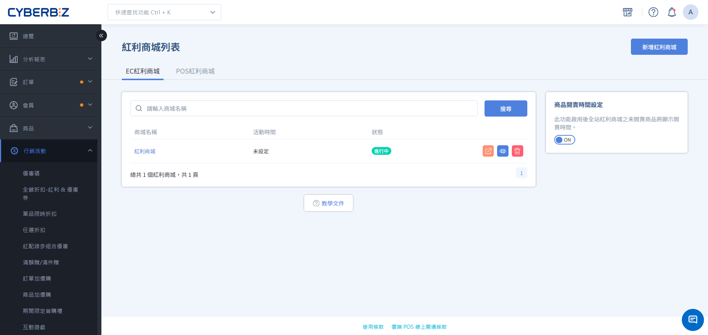
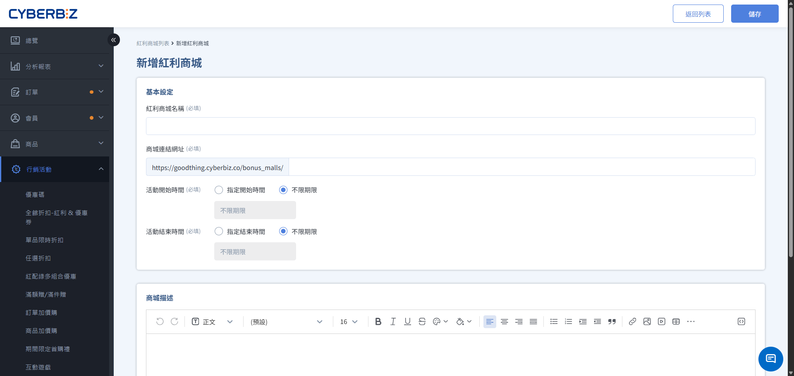
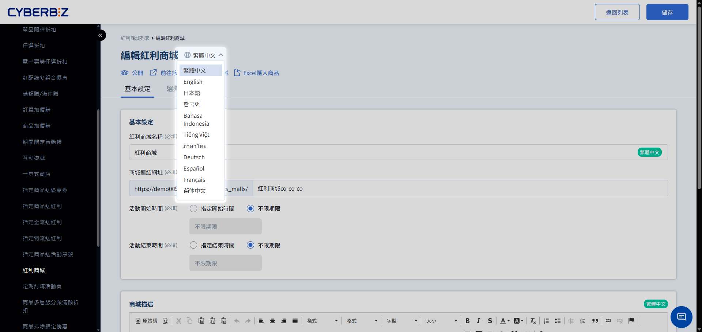

# 設定紅利商城 (EC)

建立專屬的線上紅利兌換商城，設定商品兌換所需點數，透過紅利積點機制提升會員回訪與品牌忠誠度。
{ .subtitle }

[:lucide-tag:{ title="適用方案" }](../../resources/conventions#適用方案) | 所有PLUS / 企業
{ .doc-badge }

!!! info "版本差異說明"
    - **電商官網 (EC)** 與 **實體門市 (POS)** 皆支援紅利商城功能，此文件僅適用 **電商官網 (EC)** 紅利商城之設定方式。
    - 紅利商城在 PLUS 方案中屬於「行銷 A」選配模組（11 選 2），商家需確認已選配該模組方可使用。企業版則直接內建此功能。

{ .hero-page }

## 紅利商城說明

「紅利商城」提供一個獨立的商品展示與兌換空間，讓會員能將平日消費累積的紅利點數轉化為實質商品。透過這種「只換不賣」或「點數專購」的機制，能有效活化會員帳戶內的點數餘額，並建立長期的品牌黏著度。

同一商品在一般商店維持現金購買，在紅利商城則為點數兌換，兩者庫存共用。

!!! tip "應用情境"
    - **會員回饋計畫**：提供高價值商品僅限紅利兌換，激勵會員持續消費累積點數。
    - **點數消耗策略**：針對即將到期的點數，推出限時紅利商城活動，導流會員進站兌換。
    - **新品試用**：將試用品放入紅利商城，讓忠誠會員以點數搶先體驗，收集產品回饋。

## 使用須知
- **前台顯示**：商品必須處於「已上架」且「公開」狀態，才會顯示在紅利商城中。
- **多款式商品顯示限制**：若加入紅利商城的商品具有多個款式（如不同顏色、尺寸），前台僅會固定顯示該商品的「第一張主圖」，且消費者無法在商城頁面切換查看其他款式的對應圖示。建議商家選擇單一款式或確保主圖具代表性。
- **外觀色系**：紅利商城頁面恕不支援色票功能。
    

## 操作流程

### 步驟 1：建立紅利商城基本資訊

1. 登入 CYBERBIZ 管理後台，前往 **行銷活動 > 紅利商城**。
2. 點擊右上角 **新增紅利商城**。
3. 填寫以下欄位：
    - **紅利商城名稱**：後台識別與前台顯示的商城標題。
    - **商城連結網址**：自訂網址路徑（如：`vip-rewards`）。
    - **活動開始/結束時間**：勾選並設定生效區間。
4. **商城描述**：使用編輯器撰寫商城規則或文案，此內容將顯示於商品列表上方。
  > 上傳容量限制：單一商城內上傳的圖片（樣式與描述）總空間不得超過 **10MB**。
5. **SEO設定**：依需求彈性設定。
6. 點擊 **儲存**。

### 步驟 2：加入兌換商品

=== "手動勾選加入"

    1. 在商城編輯頁面中，切換至 **選擇商品** 頁籤。
    2. 透過名稱、SKU 或商品標籤搜尋欲加入的商品。
    3. 點擊商品右側的 **未加入商城** 按鈕（加入後文字會變更為已加入）。
    4. 若需一次加入多項商品，可勾選左側核取方塊後，點擊 **加入商城**。

=== "EXCEL批次匯入"

    1. 若需加入大量商品、批次編輯或移除，可點擊右上角選單的 **Excel 匯入商品**：
    2. 選擇操作行為，依照格式填入商品 **SKU** 與對應的 **紅利換購金額**。
        - 檔案格式僅限 **.xlsx**。
        - 單一檔案大小不得超過 **2MB**。
        - 每次上傳上限為 **200 行**（若超過請分批上傳）。
    3. 系統將於背景執行，完成後會寄送 Email 通知。

### 步驟 3：設定兌換所需點數 (僅限手動勾選加入)

1. 於 **選擇商品** 頁籤，捲動至下方的 **已選取的商品** 區塊。
2. 在 **紅利點數** 欄位中，輸入該商品兌換所需的點數數值（系統預設會帶入商品原價）。
3. 按下 **Enter** 或點擊空白處，系統將自動儲存設定。

### 步驟 4：測試並公開商城

1. 確認所有商品與點數設定無誤。
2. 點擊頁面右上角的 **未公開** 按鈕，切換為 **公開** 狀態。
3. 點擊下拉選單中的 **前往該商城**，在新分頁檢視實際顯示效果。

## 前台兌換流程

了解消費者在紅利商城的瀏覽、挑選與結帳路徑，確保行銷活動符合預期。

### 1. 登入與餘額檢視
消費者進入紅利商城頁面後，必須登入會員帳號。

- **紅利資訊顯示**：頁面將顯示會員目前擁有的紅利總點數，以及已使用的點數資訊。
- **自動引導登入**：若消費者在未登入狀態下嘗試將商品「加入購物車」，系統將引導至登入頁，登入成功後會自動跳回紅利商城頁面。

### 2. 商品瀏覽與挑選
- **紅利標價**：商城內商品僅顯示「兌換所需點數」，不顯示商品原價。
- **來源追蹤**：若消費者同時在多個紅利商城群組挑選商品，購物車會紀錄商品所屬的群組名稱，並提供連結可跳回該群組頁面。

### 3. 結帳與點數扣除
- **紅利不足警示**：若購物車內商品所需的點數總額超過會員餘額，結帳按鈕將無法點擊，並提示「您的紅利點數不足」。
- **點數扣除優先序**：當購物車同時包含紅利商品與一般商品時，系統會優先扣除紅利商品所需的點數，餘額若仍有剩，才可用於折抵一般商品。
- **全額折抵**：紅利商城商品僅能使用紅利點數「全額兌換」，結帳時無法搭配現金支付差額。

## 進階管理

### 自定義訂單取消時返還紅利點數
商家可決定紅利訂單取消後是否自動返還點數：

1.  前往 **金物流 > 結帳頁 & 物流設定 > 訂單相關設定**。
2.  尋找 **訂單取消退貨相關紅利設定**，根據營運需求開啟或關閉。

!!! warning "退貨處理提醒"
    目前系統預設「退貨」訂單不會自動返還紅利，商家如有返還需求，可進入會員管理介面手動補回點數。

### 商品開賣時間倒數 (企業版專用)
在 **行銷活動 > 紅利商城**，可啟用 **商品開賣時間設定**。啟用後，若商品設定了未來的開始時間，前台將自動顯示倒數計時器。

- **前置條件**：需搭配「拖拉版型」。
- **適用範圍**：僅針對「尚未上架」的商品顯示開賣倒數。

## 多國語系設定

設定紅利商城的多國語系名稱，使前台可根據語系顯示正確文字。

!!! warning "注意事項"
	- 若要更改英文語系，需先 **切換至英文語系**，再進行修改。
	- 欄位有顯示 **語系標籤**，前台顯示才可隨語系切換文字。如：**群組名稱** 紅利商城 `繁體中文`。
	- 若其他語系欄位未填寫內容，前台顯示該語系時，將自動使用 **繁體中文** 內容作為預設顯示。

### 操作步驟

1. 登入 CYBERBIZ 管理後台，前往 **行銷活動 > 紅利商城**
2. 在語系選單中，切換至欲編輯的語系（例如：繁體中文、英文）。  
3. 展開欲編輯的加購群組，然後直接點擊群組名稱欄位進行修改，完成後按 ++enter++ 儲存變更。  

## 常見問題

??? quote "為什麼前台商城頁面出現 404 錯誤？"
    請檢查：1. 商城狀態是否已切換為「公開」。 2. 目前日期是否在設定的「活動時間」區間內。 3. 商城網址連結是否有誤。

??? quote "商品已加入商城但前台沒出現？"
    請確認該商品本身是否在 **商品管理** 中設定為「上架」且「公開」。若商品下架，紅利商城會自動隱藏該商品。

??? quote "紅利點數設為 0 或留空會怎樣？"
    若點數為 0 或空白，消費者在前台將無法點擊兌換按鈕。請確保所有商品皆有填寫正確的正整數點數。

