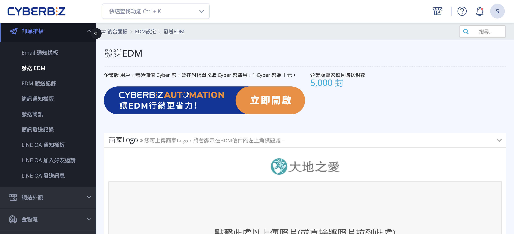
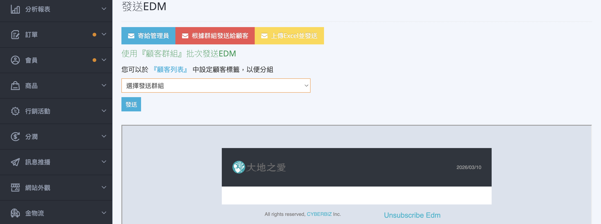
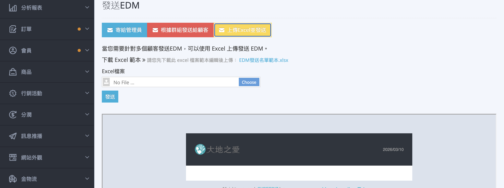
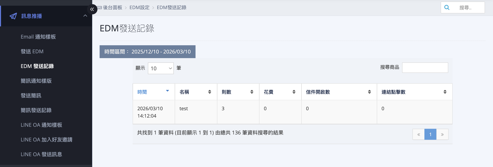

# 設定與發送 EDM 電子報

建立 EDM 內容、選擇發送對象並發送電子報給會員。
{ .subtitle }

{ .hero-page }

## 什麼是 EDM 電子報 

**EDM（電子報行銷）** 是用於執行電子報行銷的重要工具，商家可以透過發送最新消息或促銷活動來建立品牌忠誠度並提高轉換率。

以下是 **EDM 設定與發送** 的詳細教學：

## EDM 發送有哪些限制 

*   **免費額度**：系統每月 1 號凌晨 12 點會自動重置贈送 **5,000 封** 免費 EDM。
*   **費用計算**：超過免費封數後，每發送 50 封扣除 **1 點 CYBER 幣**（不足 50 封仍扣 1 點）。
*   **對象限制**：系統僅能發送給「已註冊且勾選願意接受電子報」的官網會員。

## 建立 EDM 內容

1. **進入操作頁面**：登入 CYBERBIZ 管理後台，前往 **訊息推播 > 發送 EDM**。
2. **編輯內容**：點擊 **新增 EDM** 或點擊列表中的 **編輯圖示** :lucide-pencil:，可進入編輯頁面設定以下資訊：

    *   **EDM LOGO**：建議尺寸為 **448×167px**。
    *   **EDM 標題**：建議不超過 **25 個字**，且 **不可使用 emoji 符號**，以確保在手機上能完整呈現。
    *   **EDM 圖片**：
        *   圖片寬度建議為 **560px**，高度不限。
        *   一封 EDM 最多可上傳 **3 張** 圖片，且所有圖片總大小合計不得超過 **2MB**。
        *   若設定圖片連結，建議使用原網址（包含 UTM 參數），以利追蹤成效。
    *   **文字內容**：支援 HTML 與 CSS 語法，同樣 **不可使用 emoji 或特殊符號**。

---

## 選擇 EDM 發送對象 

編輯完標題與內容後，點擊 EDM 名稱進入「選擇發送對象」：

-  **寄給管理員測試**：強烈建議正式發送前先寄給管理員測試，確認內容無誤（測試信也會計入 EDM 發送封數）。
-  **根據群組發送**：可選擇特定「會員標籤」的群組發送。

    

-  **透過 Excel 匯入**：匯入要發送的 Email 名單。若要排除未註冊顧客（如結帳時未勾選註冊者），建議篩選名單後再匯入發送。
    *   *注意：Excel 欄位中請勿留有任何空格，以免上傳失敗。*

    

---

## 查看 EDM 成效

發送完成後，可至 **發送EDM > EDM紀錄** 查看成效。

*   **關鍵指標**：包含「信件開啟率」與「連結點擊數」。
*   **更新時間**：相關數據並非即時更新，系統會在 **每日凌晨 1:30** 統一更新數據。

## 後續操作

- :lucide-zap:{ .lg }   
  [__自動化發送(AUTOMATION)__](../app-market/automation/使用 AUTOMATION 建立自動化推播流程.md){ data-preview }  
  設定自動發送 EDM 給「VIP 客戶」、「潛在忠誠顧客」或「沉睡客戶」。

## 常見問題

??? quote "為什麼我發送的測試信沒有收到？"
    請先檢查「垃圾信件匣」。此外，若標題包含過多敏感字眼（如：現賺、發財、特價、$$$），容易被郵件伺服器判別為廣告信。建議發送前先移除標題中的特殊符號。

??? quote "為什麼不能在標題或內文使用 Emoji？"
    由於各家收件軟體（如 Outlook, Gmail, iPhone Mail）對 Emoji 的解碼方式不同，使用 Emoji 極易導致信件在收件者端顯示為亂碼（如：?? 或 [X]），進而影響品牌專業度。

??? quote "Excel 匯入名單失敗的常見原因？"

    1. 欄位空格：Email 前後若有隱形空格會導致讀取錯誤。
    2. 格式錯誤：請確保檔案為 .xlsx 或 .csv 格式，且 Email 欄位格式正確。
    3. 重複名單：同一份清單中若有重複的 Email，系統會自動去重。

??? quote "免費的 5,000 封沒用完，可以累積到下個月嗎？"
    不可以。每月贈送的 5,000 封額度會在每月 1 號凌晨 00:00 歸零並重新計算，無法跨月累積。
