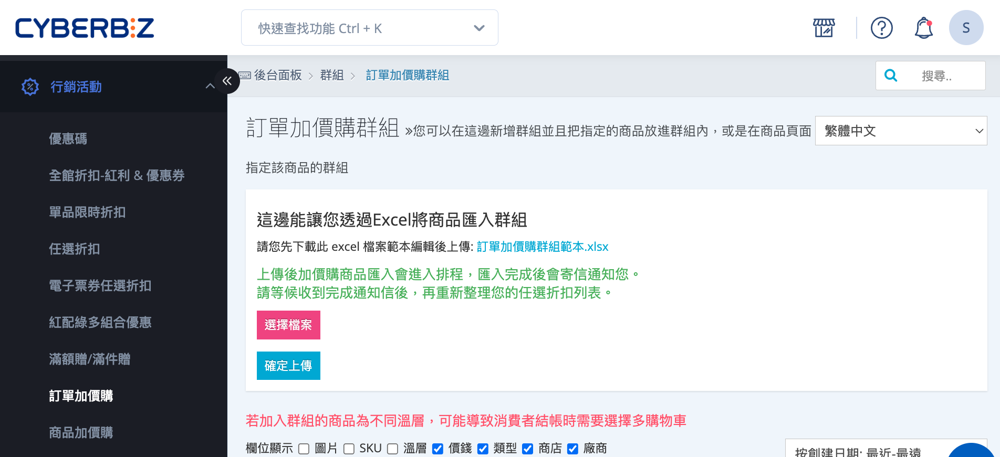
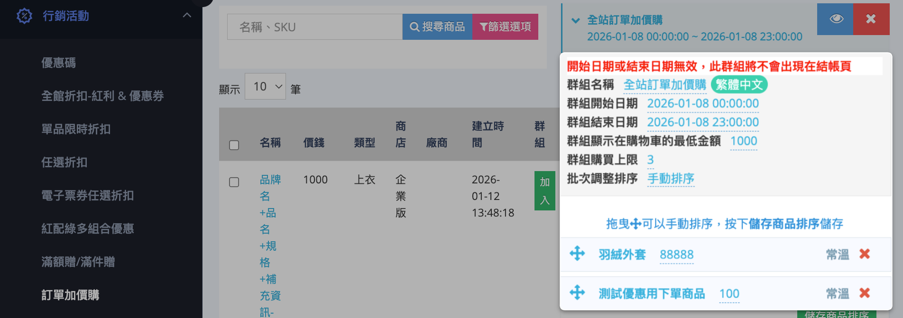
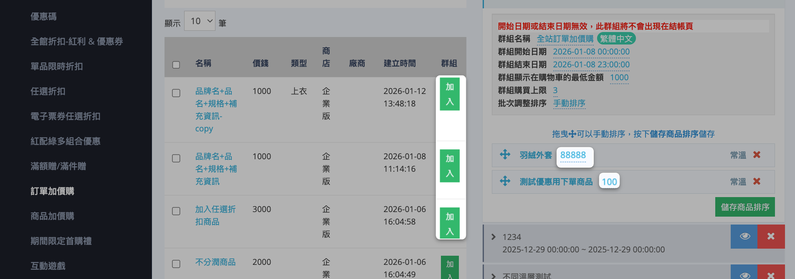
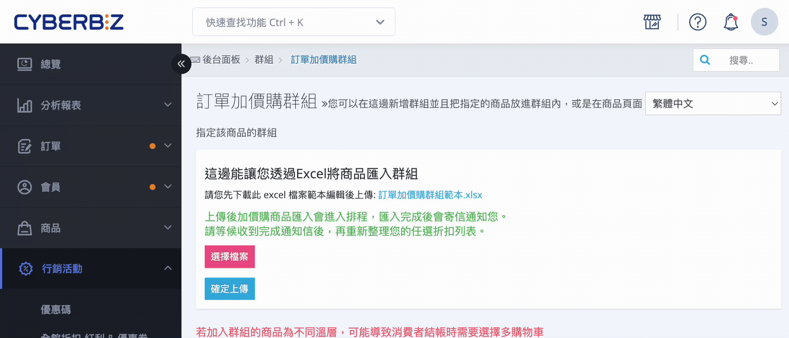
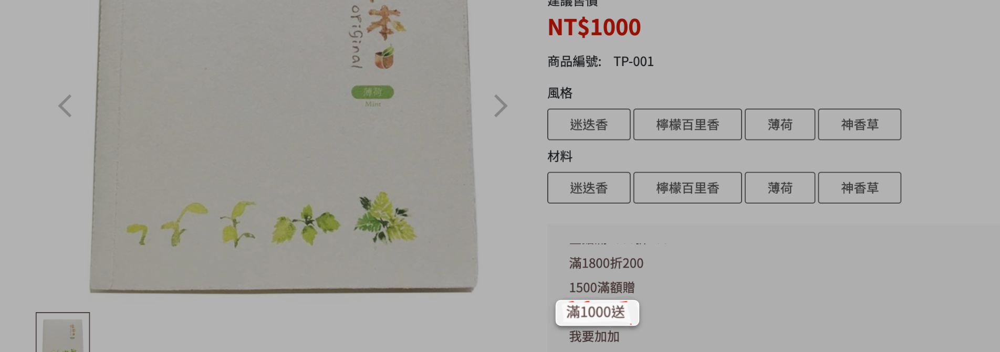
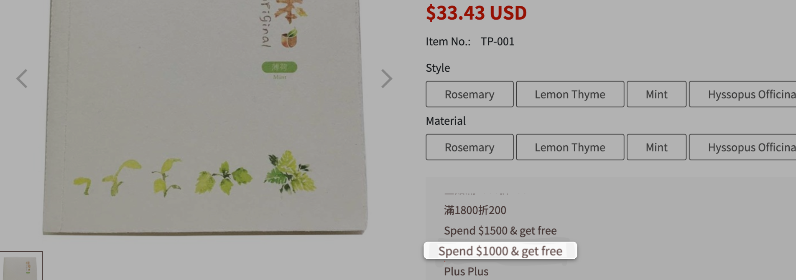

# 設定訂單加價購

設定訂單加價購可依訂單金額或條件作為觸發門檻，於結帳流程中提供顧客以優惠價格加購指定商品。
{ .subtitle }

[:lucide-tag:{ title="適用方案" }](../../resources/conventions#適用方案) | 進階 (PLUS) / 高手 (PLUS) / 企業
{ .doc-badge }

{ .hero-page }

## 訂單加價購說明

訂單加價購是一種以「**訂單金額或條件**」作為觸發門檻的行銷機制，當顧客於結帳時符合條件，即可用優惠價格加購指定商品。

### 訂單加價購類型說明

訂單加價購依觸發條件可分為以下兩種：

- **不限消費金額即可加購**  
    顧客進入結帳頁面後，即可直接選擇加購商品  
- **消費滿額加購**  
    當訂單金額達指定門檻後，才可進行加購。
    
    > 範例：消費滿 TWD 2,000，可加 TWD 1 購買針織毛毯。
    
## 設定訂單加價購群組

### 步驟 1：新增訂單加價購群組

1. 登入 CYBERBIZ 管理後台，前往  **行銷活動 > 訂單加價購**。
2. 在群組列表下方輸入新群組名稱，點擊 **新增群組**。

### 步驟 2：填寫加價購群組欄位

在群組列表中，點擊展開欲設定的加購群組，依序設定以下欄位：

- **群組名稱**：用於辨識與管理此訂單加價購活動。
- **群組開始／結束日期**：設定活動的有效期間。
- **群組顯示在購物車的最低金額**：設定觸發加價購的訂單金額門檻。
- **群組購買上限**：限制每筆訂單最多可加購的商品數量。

	!!! info "加購數量上限說明"  
		若群組購買上限設定為 **1 件**，當顧客嘗試加購第 2 件商品時，系統將顯示「已達數量上限」。

- **批次調整排序**：設定加價購商品於前台顯示的排序方式。若選擇 **手動排序**，可使用 :material-arrow-all: 拖曳商品調整順序。
	- 預設為「依商品標題拼音排序」
	- 建議使用「暢銷商品排序」以提升轉換率

### 步驟 3：選擇加價購商品

1. 於左側商品列表中，點擊 **加入** 將欲設定的商品 **加入群組**。
2. 針對每項商品，設定其 **加購價格**。

### 步驟 4：前台結帳頁面呈現

當訂單金額達到「**群組顯示在購物車的最低金額**」時，結帳頁面將顯示可加購商品。

- **未達門檻時**：不顯示加購選項
- **達門檻後**：顯示可加購商品

## 多國語系設定

設定商品加價購群組的多國語系名稱，使前台可根據語系顯示正確文字。

!!! warning "注意事項"
	- 若要更改英文語系，需先 **切換至英文語系**，再進行修改。
	- 欄位有顯示 **語系標籤**，前台顯示才可隨語系切換文字。如：**群組名稱** 商品加價購 `繁體中文`。
	- 若其他語系欄位未填寫內容，前台顯示該語系時，將自動使用 **繁體中文** 內容作為預設顯示。

### 操作步驟

1. 登入 CYBERBIZ 管理後台，前往 **行銷活動 > 商品加價購**
2. 點選語系選單，切換至要編輯的語系（繁體中文、英文等）。  
3. 展開欲編輯的加購群組，然後直接點擊群組名稱欄位進行修改，完成後按 ++enter++ 儲存變更。 

### 前台顯示效果

- **繁體中文頁面**  

	
    
- **英文頁面**  

	

## 常見問題

??? quote "訂單加價購可以限制每筆訂單的加購數量嗎？"
	可以。可透過設定「群組購買上限」來限制每筆訂單最多可加購的商品數量；當顧客加購數量超過上限時，系統將提示已達數量限制。

??? quote "訂單加價購的加購價格是否會影響原商品價格？"
	不會。訂單加價購僅影響加購商品於結帳時的顯示價格，不會變更商品原本的售價或影響商品頁面上的價格設定。
