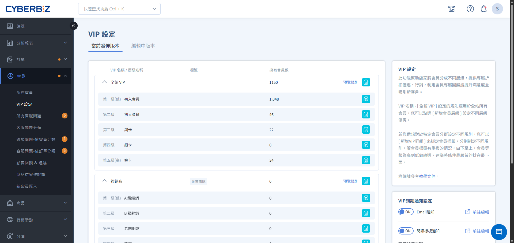

# VIP 制度運作機制

深度解析新版 VIP 系統的滾動式計算、即時觸發判定以及升降等回溯邏輯，協助商家建立精準的會員營運觀念。
{ .subtitle }

{ .hero-page }

理解 VIP 系統的「大腦」如何運作，是建立成功會員制度的第一步。新版 VIP 系統跳脫了傳統的年度結算，改用「即時觸發」與「滾動計算」機制，讓會員等級能更真實地反映顧客的當前價值。

## 第一章：系統何時觸發判定等級

系統並非在固定時間點「巡視」所有會員，而是透過「事件觸發」來啟動運算引擎。

### 1. 觸發判定時機

每當會員發生以下行為時，系統會立即針對「該位會員」重新計算等級：

*   **訂單狀態異動**：有效訂單成立、無效訂單成立。
*   **資料變動**：新會員註冊、商家手動修改會員標籤、商家手動增減會員的「其他通路有效訂單」。
*   **版本生效**：當商家發佈了新的 VIP 制度版本並到達生效日。

### 2. 滾動式回溯計算法

系統不看「日曆年」，而是以「觸發當下」往前回溯一段特定的效期。

*   **移動式區間**：想像一個固定寬度（例如 365 天）的時間區間，每當重新計算會員等級時，會以當下時間點往回追溯時間區間內的所有訂單。
*   **新陳代謝**：新訂單成立時會「進入區間」，增加總額；365 天前的舊訂單則會「移出區間」，不再計入總額。

!!! info "為什麼會員累積消費金額會減少？"
    如果一年前的「大額訂單」剛好過期移出計算區間，而新訂單的金額較小，會員看到的累積消費總額就可能下降。

---

## 第二章：哪些訂單會被計入計算

並非所有訂單都會計入 VIP 累計金額。系統僅計算「實質完成交易」且「無退貨疑慮」的訂單：

### 會計入 VIP 的「有效訂單」

*   **已付款訂單**：付款狀態為 **已付款**。
*   **貨到付款已收貨訂單**：付款狀態為 **貨到付款**，配送狀態為 **已收貨**。(自訂貨到付款訂單則為 **已出貨**)。
*   **已出貨之結案訂單**：訂單狀態為 **已結案**，且配送狀態為 **未出貨、準備出貨** 以外訂單。

> 以上3種訂單，訂單狀態不可為 **已取消**，退貨狀態需為 **不需退貨**，否則視為無效訂單。

*   **拒絕退貨訂單**：若該筆訂單曾有退貨爭議，但最終標記為 **拒絕退貨**。

### 不計入 VIP 的「無效訂單」

*   **已取消訂單**：訂單狀態為 **已取消**。
*   **退貨訂單**：退貨狀態非 **拒絕退貨** 或 **不需退貨** 的訂單。
*   **部分退貨訂單**：若訂單發生 **部分退貨**，系統預設會排除該整筆訂單金額。

    > 若希望部分金額仍計入，可手動於「其他通路有效訂單」補足金額。

---

## 第三章：升等/降等/續會的運作規則

### 1. 升等機制：即時獎勵與最優判定
*   **立即生效**：達標當下等級立即變更，優惠現領現用。
*   **最有利原則**：若同時設定「單筆」與「累積」門檻，系統會取對會員最有利的結果。
*   **支持跳級**：大額消費可直接從一般會員晉升至最高等級（僅發放最終等級的升等禮）。
*   **效期計算**：前台顯示的 VIP 起始日，統一從升等當日的「隔日」起算。

### 2. 降等機制：實質貢獻度校準
*   **即時校正**：當訂單轉為無效訂單時，系統立即重新計算。若剩餘金額不足，則會執行降等。
*   **回溯重計**：降等後的效期，會以該會員 **最後一筆有效訂單** 的日期為準重新起算。
*   **福利不追討**：已送出的升等禮或紅利點數，降等後 **不會自動扣回** ，維護基本的客群關係。

### 3. 續會機制：資格維持與自動判定
當 VIP 效期屆滿時，系統會評估會員在該期間的表現，決定其續約或降級。

*   **判定時機**：於 VIP 效期結束後的隔日凌晨 00:00 自動進行。
*   **計算起始**：續會金額是從 **升等隔日** 才開始累積，升等當下的那筆訂單不計入。
*   **最優保留**：若會員同時符合多個等級的續會條件，系統會優先套用層級最高的等級，由上往下檢查是否符合該等級門檻。
*   **退回一般會員**：若所有 VIP 門檻皆未達成，則會員身份會回復為一般會員。

!!! example "續會情境舉例"
    *   **VIP1 升等門檻**：累積 5,000 元。
    *   **VIP1 續會門檻**：累積 3,000 元。
    *   顧客買了 5,000 元後升等，他必須在接下來的會員效期內再買滿 3,000 元，才能在效期到期後繼續維持 VIP1 身份。

---

## 第四章：版本管理與生效緩衝

為了保護消費者權益並給予商家公告時間，系統對 VIP 規則的變動設有嚴格控管：

*   **基本設定（D+2 規範）**：修改層級名稱、升等/續會門檻等核心邏輯後，需於 **2 天後** 才會生效（首次發佈除外）。
*   **優惠設定（即時生效）**：修改折扣折數、贈送點數等回饋內容，儲存後可立即生效，不受 D+2 限制。
*   **版本管理**：透過「複製版本」功能，您可以在不影響當前運行版本的情況下，規劃下一階段的會員策略。

---

