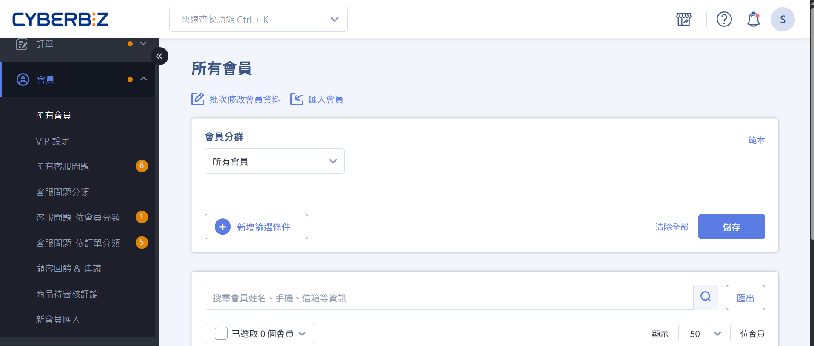

# 會員管理

 
<big>__開始使用__</big>  
全面掌握會員資料與互動。  
設定會員資訊、等級與權益，追蹤行為，提升顧客忠誠度與回購率。  
 

---

=== "會員資料管理"

	

	
	-   :lucide-user: __會員資料__
	    
	    ---
	    

	    
	    [大量匯入新會員](batch-import-and-edit-members.md#任務一大量匯入新會員)  
	    [批次修改既有資料](batch-import-and-edit-members.md#任務二批次修改既有會員資料) 
	    
	    

	
	-   :lucide-search: __會員查詢__
	    
	    ---
	    

	    
	    [查看會員數據](manage-member-profiles.md#任務一查看會員行為與資產數據)  
	    [編輯基本資料](manage-member-profiles.md#1-編輯會員基本資料)  
	    [代客下單](manage-member-profiles.md#任務六代客下單)  
	    
	    

	
	

=== "會員等級與權益"

	

	
	-   :lucide-star: __會員等級__
	    
	    ---
	    

	    
	    [設定會員等級規則](../members/vip/index.md)  
	    [升等降等與續會規則](../members/vip/vip-upgrade-downgrade-renewal-rules.md)  
	    
	    

	
	-   :lucide-gift: __會員專屬優惠__
	    
	    ---
	    

	    
	    [設定 VIP 會員專屬價格](../products/pricing/setup-vip-member-pricing.md)  
	    [設定 VIP 會員專屬折扣優惠](../members/vip/setup-exclusive-vip-discounts.md)  
	    
	    

	
	-   :lucide-bell: __通知與提醒__
	    
	    ---
	    

	    
	    [會員優惠券、紅利到期提醒](../marketing/purchase-restrictions/coupon-and-bonus-points-expiry-notification.md)  
	    [會員 Email 通知](../notifications/manage-email-templates.md)  
		[會員簡訊通知](../notifications/send-sms-notifications-v2.md)
		[會員 LINE 通知](../notifications/manage-line-oa-templates.md)
		[發送會員 EDM](../notifications/send-edm-newsletters-v2.md) 
	    
	    

	
	

=== "互動與回饋"

	

	
	-   :lucide-thumbs-up: __評論與評價__
	    
	    ---
	    

	    
	    [管理會員商品評論](../products/engagement/manage-product-reviews.md)  
	    
	    

	
	-   :lucide-messages-square: __留言與訊息__
	    
	    ---
	    

	    
	    [會員留言客服區](../members/member-customer-service-system.md)  
	    [會員訊息管理](../members/member-customer-service-system.md#四訊息回覆與管理)  
	    
	    

	
	-   :lucide-git-branch: __會員分群__
	    
	    ---
	    

	    
	    [建立會員分群](../members/member-filters-and-groups.md#使用會員分群)    
	    
	    

	
	

=== "系統與權限"

	

	
	-   :lucide-key: __會員權限__
	    
	    ---
	    

	    
	    [設定管理員查看會員權限](../website-management/add-admin-set-permissions.md)  
	    
	    

	
	-   :lucide-shield-check: __安全管理__
	    
	    ---
	    

	    
	    [啟用會員登入驗證](../website-management/setup-customer-email-phone-verification.md)  
	    [設定會員密碼規則](../website-management/member-security-settings.md#operate-security-website-password)  
	    
	    

	
	

