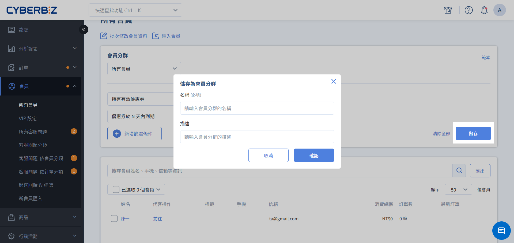

# 篩選器與會員分群
透過多維度條件精準鎖定目標客群，建立分眾名單以進行高效再行銷。
{ .subtitle }

!!! tip "應用情境"
    - **精準行銷**：篩選特定商品收藏者，發送專屬優惠券。
    - **喚回流失客**：找出超過 90 天未下單的沉寂會員，發送簡訊或電子郵件提醒。
    - **VIP 經營**：篩選累計消費金額達標的會員，手動升級等級或發送贈品。
    - **活動分眾**：針對特定地區（如收貨地址包含「台北」）的會員發送線下活動邀請。

## 使用須知

- **有效訂單統計原則**：在篩選「消費習性」或「購買經驗」等會員消費紀錄時，一律以 **有效訂單** 的歷史數據進行統計。
- **篩選邏輯規範**：
    - **交集運算 (AND)**：當您新增多個不同的篩選條件時，系統會篩選出同時符合所有條件的會員。
    - **聯集運算 (OR)**：在同一個篩選條件內勾選多個選項時，符合任一選項的會員皆會被納入。

## 使用會員篩選器

### 1. 新增篩選條件

前往 **會員 > 所有會員**，點擊頁面右上方的 **新增篩選條件** 按鈕。

{ .screenshot }

### 2. 設定條件並套用

1. 在彈窗中選擇欲使用的篩選類別（如：會員狀態、消費習性）。
2. 設定具體參數（如：註冊時間、累計購買金額）。
3. 點擊 **套用**，下方列表將即時顯示符合條件的會員名單。

### 3. 批次操作

勾選會員後批次 **發送優惠券**、**匯出報表** 或 **修改標籤** 等操作。

{ .screenshot }

## 使用會員分群

### 建立分群

當您在篩選器中設定好條件並點擊 **套用** 後，下一步即是建立分群：

1. **建立會員輪廓**：點擊 **儲存** 並為此名單命名（如：高價值回購客）。將篩選出的會員池定義為具備特定輪廓的群組，方便後續直接調用，無需重複設定篩選條件。
2. **啟動自動化更新**：儲存為分群後，名單將具備「動態監測」特性。系統會持續比對會員狀態，凡符合該條件的新會員皆會自動歸入此分群，確保您的行銷名單永遠維持在最新狀態。

{ .screenshot }

### 應用情境

建立會員分群後，您可以直接針對該特定群體執行以下營運任務：

- **精準訊息推播**：在發送簡訊、Email 或 LINE 訊息時，直接選取特定的 **會員分群** 作為對象。這能確保訊息只傳達給真正感興趣的會員，避免無謂的打擾並節省推播成本。
定向行銷活動派發：
- **優惠券派發**：針對「沉寂會員」分群批量發送喚回優惠券，或針對「生日分群」自動發送專屬禮。
- **紅利商城導流**：篩選出「點數即將到期」的會員並儲存為分群，定期推播兌換提醒以提升點數消耗率。
成效追蹤與策略分析：透過分群觀察特定客群（如：特定商品愛好者）的消費頻率與客單價變化，藉此評估分眾策略的轉化效果，優化後續的行銷佈局。

## 篩選條件說明

系統提供六大類篩選維度，協助您從不同角度分析會員：

!!! info "適用版本說明"
    會員篩選器的支援欄位區分為「標配」與「選配」兩種：

    - 標配：支援全版本商家使用。
    - 選配：企業版用戶可直接使用；PLUS 版用戶則需額外選配 **會員模組** 方可使用。

### 會員狀態

針對會員的基本帳號情況進行篩選。

| 條件名稱 | 說明 | 標配 | :lucide-lock: 選配 |
| :--- | :--- | :--- | :--- | 
| **註冊時間** | 篩選在指定日期區間內加入的會員 | ✓ | ✓ |
| **會員標籤** | 包含或排除特定標籤的會員 | ✓ | ✓ |
| **帳號狀態** | 篩選已啟用、已禁用、未驗證或警示帳號 | ✓ | ✓ |
| **VIP 等級** | 依據目前的 VIP 層級進行篩選 | ✓ | ✓ | 
| **資產狀態** | 篩選持有有效優惠券、紅利點數，或資產即將到期的會員 | ✕ | ✓ | 
| **社群綁定** | 篩選是否完成 LINE、Facebook 快速登入或 LINE OA 綁定 | ✕ | ✓ |
    

### 消費習性

分析會員的購物行為與意圖。

| 條件名稱 | 說明 | 標配 | :lucide-lock: 選配 |
| :--- | :--- | :--- | :--- |
| **最近一次取消訂單** | 篩選最近一次取消訂單符合特定時間的會員 | ✓ | ✓ |
| **購物車/收藏清單** | 篩選購物車或收藏清單中包含特定商品或群組的會員 | ✕ | ✓ | 
| **未購買天數** | 篩選超過 N 天未成立（有效）訂單的會員 | ✕ | ✓ | 
| **活躍狀態** | 依據下單間隔時間判定為「活躍」、「沉寂」或「流失」 | ✕ | ✓ |
| **未結帳行為** | 篩選加入購物車 N 天內未結帳的會員（需進入過結帳頁） | ✕ | ✓ | 

### 購買經驗

依據歷史成交數據進行篩選。

| 條件名稱 | 說明 | 標配 | :lucide-lock: 選配 |
| :--- | :--- | :--- | :--- |
| **累積購買金額** | 篩選指定期間內達到累計購買金額的會員 | ✓ | ✓ |
| **訂單數量** | 篩選指定期間內達到累計訂單筆數的會員 | ✓ | ✓ |
| **平均購買金額** | 篩選指定期間內達到平均客單價的會員 | ✕ | ✓ |
| **購買數量** | 篩選購買特定商品（群組）數量或金額的會員 | ✕ | ✓ |
| **支付與物流** | 篩選曾使用 LINE Pay、街口支付或超商取貨的會員 | ✕ | ✓ |
| **通路來源** | 篩選曾在官網或特定線下門市（POS）消費的會員 | ✕ | ✓ |
| **推薦碼** | 篩選曾輸入分潤推薦碼完成消費的會員 | ✕ | ✓ |
| **定期定額子訂單** | 篩選成立定期定額訂單的會員 | ✕ | ✓ |

### 會員基本資料

依據會員填寫的個人資訊篩選。

| 條件名稱 | 說明 | 標配 | :lucide-lock: 選配 |
| :--- | :--- | :--- | :--- | 
| **是否訂閱商家優惠** | 篩選願意接收電子報（EDM）的會員 | ✓ | ✓ |
| **生日月份** | 篩選當月或指定月份壽星 | ✓ | ✓ |
| **收貨地址包含** | 篩選特定收貨區域或地點的會員 | ✕ | ✓ |
| **性別** | 篩選特定性別的會員 | ✕ | ✓ |
| **年齡** | 篩選特定年齡區間的會員 | ✕ | ✓ | 
| **是否有手機** | 篩選儲存手機資訊的會員 | ✕ | ✓ |
| **是否有 Email** | 篩選儲存Email資訊的會員 | ✕ | ✓ |

### 智慧篩選 (ORFM)

利用大數據模型自動分析會員價值。

| 條件名稱 | 說明 | 標配 | :lucide-lock: 選配 |
| :--- | :--- | :--- | :--- | 
| **最近購買日 (Recency)** | 距離上次消費的時間 | ✕ | ✓ | 
| **購買頻率 (Frequency)** | 指定期間內的消費次數 | ✕ | ✓ |
| **購買金額 (Monetary)** | 指定期間內的消費總額 | ✕ | ✓ |

> 透過 ORFM 分數，可快速找出高價值核心客戶或需重點喚回的對象。

### 自訂欄位

若您在 **管理中心 > 顧客註冊設定** 中 [新增自訂欄位](../website-management/customer-registration-flow-and-fields.md#步驟-4-建立與管理自訂欄位)，可在本區塊針對填寫內容進行篩選。

- 支援欄位格式：文字輸入、勾選方塊、下拉選單、日期。
- 不支援欄位格式：上傳圖片。

## 常見問題

??? quote "為什麼篩選出的會員數量與預期不符？"
    請檢查：
    1. **條件衝突**：多個條件之間是「且 (AND)」的關係，條件越多，名單越精簡。
    2. **有效訂單定義**：部分條件僅計算「有效訂單」，請參考[使用須知](#使用須知)中的定義。
    3. **數據同步**：若會員剛完成操作，系統可能需要數分鐘處理數據同步。

??? quote "如何篩選出「從未買過東西」的新會員？"
    請使用 **購買經驗 > 訂單數量**，設定條件為 `等於 0`。

