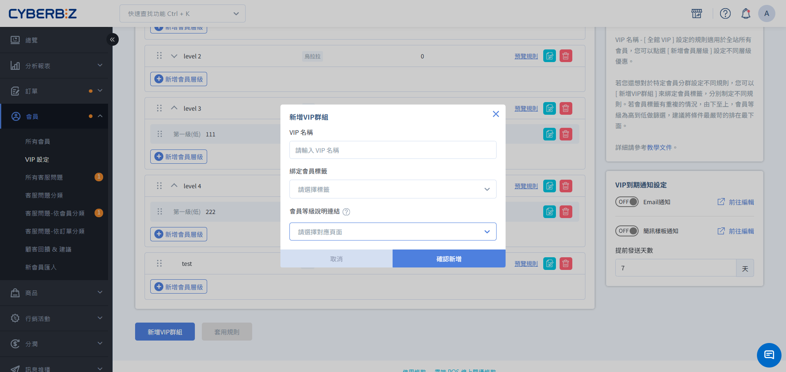

# Create Exclusive VIP Groups

Through the VIP group tagging feature, you can bind tags to specific customer segments and set exclusive VIP rules to achieve segmented management and precise marketing.

{ .subtitle }

{ .hero-page }

## Function Description
The "VIP Group Tagging" feature allows merchants to apply a separate set of tiered rules, distinct from the "All-Store VIP" system, to members with specific **membership tags**. This is extremely useful for managing specific customer groups (such as sales staff, KOLs, and high-net-worth individuals).

### VIP type distinction
1. **All VIP Membership**: Applicable to all members not categorized into a specific group.

2. **VIP Group**: Linked to a specific **member tag**, only members with that tag can participate.

## Operating procedures

### Step 1: Create a VIP group and bind tags
1. Log in to the management backend and go to **Members > VIP Settings**.

2. Click the **Version Editing** tab.

3. Click **Add VIP Group**.

4. In the **Bind Member Tag** dropdown menu, select the pre-created member tag.

5. Complete the level threshold and discount settings for this group.

### Step 2: Adjust group sorting
1. On the VIP settings list page, locate the sorting function on the right.

2. By dragging or adjusting the numbers, ensure that the priority of specific groups aligns with your operational strategy.

3. Click **Save Sort**.

## Operational logic and judgment rules

### 1. Triggering Calculation Timing
The system will recalculate a member's VIP level in the following situations:

* **Tag Changes**: When a merchant **adds** or **removes** a tag associated with a member's VIP group.

* **Valid Orders**: When a member places a new valid order.

### 2. Priority and Ranking
If a member has multiple customer tags, and these tags are linked to different VIP groups:

* **Sorting Decision:** The system will determine the order based on the **sorting** in the VIP list in the backend.

* **Filtering Logic:** The system will filter upwards from the **bottom** of the list, and the first group that meets the criteria is the one for which the rules apply to that member.

* **Recommendation:** Please place the group with the strictest criteria and highest benefits at the bottom of the list.

### 3. Determine membership eligibility
The system will review the upgrade requirements for the lowest tier (entry level) within the VIP group.

- **Meeting the requirements:** Members will officially enter the VIP group and be assigned a corresponding level based on their spending power (direct upgrade to the highest level is supported).

- **Not meeting the requirements:** Even if a member has the tag, the system will still determine that they do not possess VIP status for this group. The member will maintain their original status (e.g., VIP or regular member) until the next event is triggered and the spending requirement is met.

**Key Concept Reminder:** The tag only represents eligibility for **entry tickets**, not **direct access**. Members must meet the group's spending requirements in addition to holding the tag for the system to officially upgrade them to VIP status in that group.

## Calculation details when adding or subtracting labels
When merchants manually adjust member tags, the system's calculation logic is as follows:

| Action | Calculation Logic | Validity Period Start Date |

| :--- | :--- | :--- |

| **Adding a Tag** | Considered a **Valid Order** event, the validity period calculation threshold is calculated retroactively from the current date. | The start date is the **day the tag was added**. |

| **Removing a Tag** | Considered an **Invalid Order** event, the calculation is performed retroactively from the most recent valid event. | The start date is the date of the most recent valid event. |

**0. Manual Adjustment Risk**

It is not recommended to frequently perform the "decrease tag then add tag" operation on members for testing purposes. Because "adding a tag" triggers a new retroactive calculation, if the member's spending is insufficient within the new retroactive period, it may lead to an unexpected downgrade of the member's status.

## Frequently Asked Questions
0. Quote "Why does the member have a tag but not join the corresponding VIP group?"

Please check if the member has met the upgrade threshold for the "lowest level" in the VIP group. Even with a tag, members still need to meet spending thresholds (single transaction or cumulative) to officially upgrade.

1. Quote "Can I delete the tag currently being used in the VIP group?"

No. For a tag to be deleted, it must simultaneously meet the following conditions: no customer use, no product use, **no VIP group binding**, and no member-exclusive product use.

