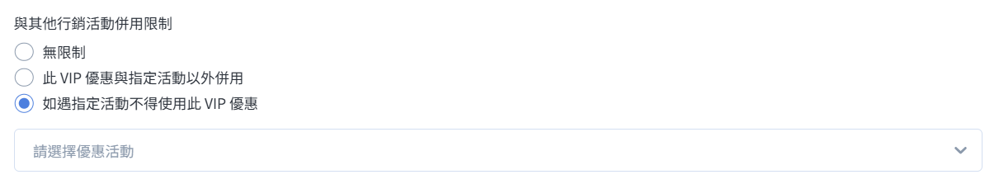

# Set Up Exclusive VIP Offers

Set up exclusive discounts, bonus rewards, and differentiated pricing for VIP members, and master the rules for their use in conjunction with overall marketing activities.

{ .subtitle }

[:lucide-tag:{ title="適用方案" }](../../../resources/conventions#適用方案) | Expert / All PLUS / Enterprise

{ .doc-badge }

{ .hero-page }

The core appeal of the VIP system lies in its "sense of prestige" and "tangible rewards." The new VIP system offers a variety of offer combinations to help you design differentiated benefits that members will appreciate.

## VIP discounts and rules
When setting up VIP offers, please define the rules for combining the offer with designated marketing activities. The system provides three different strengths of stacking logic:

- **Unrestricted**

VIP offers can be directly stacked with all activities.

- **Combined with other activities (product-level exclusion)**

If a single product already enjoys a selected activity discount, that product will not enjoy the VIP offer; other products in the order that are not participating in activities will not be affected.

- **No discount during activities (order-level exclusion)**

If the shopping cart contains any product eligible for a selected activity, the entire order will have its VIP offer completely canceled.

When setting up various offers, if you encounter a section on **Rules for combining with other marketing activities**, please refer to the instructions here to select the appropriate logic.

{ .screenshot }

!!! info "Bonus Points Activation Switch"

To award bonus points, please go to **Marketing Activities > Storewide Discounts - Bonuses & Coupons** and [Activate Bonus Points Function](../../marketing/bonus-and-gifts/setup-bonus-points/#操作流程).

## 1. Enjoy discounts
1. Enter the **specified discount**. This VIP member will enjoy a specified discount on their entire order.

**Discount value:** Please set the discount value to 1-99. For example, 90 represents a 10% discount, and 70 represents a 30% discount.

2. **Setting rules for combining with other marketing activities**

First, select [**Combination logic**](**0**), then select the marketing activities from the list to which you want to apply this rule.

Marketing activities that can be bound to and combined with rules:

- Member-only price

- Single item discount

- Red and green (combination discount)

- Optional discount

- Multi-level product category discount (advanced product category discount)

- Storewide discount

**2**

## 2. Free shipping on orders.
1. Enter the **Free Shipping Threshold**. VIP members who reach the threshold will enjoy free shipping on their entire order.

2. **Set Rules for Using with Other Marketing Campaigns**

First, select [**Use Logic**](#vip-優惠併用規則), then select the marketing campaigns from the list to which you want to apply this rule.

Marketing campaigns that can be bound to and used with rules:

- Member Exclusive Price

- Single Item Discount

- Red & Green (Combination Discount)

- Optional Discount

- Multi-level Product Category Discount (Advanced Product Category Discount)

- Storewide Discount

{ .screenshot }

## 3. Bonus multiplier setting

### Instructions for Use
* **Stacked Bonus:** If you have set up both "Store-wide Bonus" and "VIP Extra Bonus" simultaneously, members will **receive both** when placing an order.

### Setting method
Enter the **spending threshold, bonus amount, and validity period**. This VIP member will receive extra bonus points after placing an order.

{ .screenshot }

## 4. Birthday Gift Setup

### Send Schedule
- **Sending Time**: The system defaults to sending the monthly birthday gift on the 1st of each month.

- **Early Sending**: You can customize **sending the birthday gift N days in advance**.

Sending is determined based on the member's current level. If the sending time is earlier than the member's upgrade date, the member will not receive the birthday gift for the upgraded level. You can manually send the birthday gift to the member according to the store's VIP policy.

**Example Scenario**

Customer A's birthday is in May, and they upgraded to VIP1 on April 27th.

The system is set to send the monthly birthday gift 5 days in advance, so the sending time for the VIP1 May birthday gift is April 26th.

The system sent the May birthday gift on April 26th, but Customer A had not yet upgraded at that time, and therefore could not receive the VIP1 corresponding birthday gift.

- **Check Time**: At 5:00 AM on the same day, the system begins checking eligible members and sending gifts in sequence.

1. The exact time a member receives their birthday gift may vary slightly depending on system operation time.

- **Notification Sending Time:** If birthday gift notifications are enabled in **Push Notifications > Email Notification Template** or **SMS Notification Template**, the system will send a notification to the member at 12:00 noon on the same day.

### Membership Claiming Rules
- **Register during your birthday month:** If the initial VIP level threshold is 0 yuan, the birthday person will be automatically granted that level and receive a birthday gift upon registration, without being subject to the **birthday gift sent N days in advance** restriction.

- **Single Claim Policy:** During the birthday gift sending period (from the date of advance issuance to the end of the birthday month), each member is limited to **one VIP birthday gift**, and it will not be sent repeatedly due to level upgrades during this period.

### Related operations
- **Stacked Gifts**: If you set a birthday gift for all members under **Marketing Activities > Storewide Discounts - Bonuses & Coupons**, consumers will **receive both**. Please plan your birthday gift distribution policy carefully.

- **Delete Birthday Gift**: Please go to **Members > All Members**, select your personal page, and [Manually Reclaim] (0 points) coupons or bonus points.

### Setting method
1. Enter **Birthday Gift Name and Number of Days in Advance**. VIP members will receive their birthday gift on the specified date.

{ .screenshot }

2. Select Birthday Gift Type (Select All):

=== "Bonus"

Enter **Number of Bonus Points and Validity Period**.

{ .screenshot }

=== "Coupon"

1. Click **Add Coupon**.

>  Multiple coupons can be added.

2. Select Coupon Type:

- Amount

- Percentage

- Gift **(Enterprise Edition Only)**

!!! info "VIP Gift Coupon Usage Rules"

1. Product Binding Rules: Each gift coupon can only be bound to one product, and the style cannot be specified.

2. Multiple Gift Item Setup: To offer multiple different items at once, please create multiple gift vouchers.

3. Distribution Mechanism: The system will distribute all linked gift vouchers. Consumers cannot manually select one to claim on the front end.

→ Learn about [Full Gift Voucher Specifications](../../marketing/coupon/gift-coupon-spec/#使用須知).

3. Set Relevant Parameters.

4. **Setting Rules for Use with Other Marketing Campaigns**

First, select [**Using Logic**](#vip-優惠併用規則), then check the marketing campaigns from the list to which you want to apply this rule.

Marketing activities that can be linked and used with rules:

- Member-only pricing

- Single item discounts

- Red and green (combination discount)

- Optional item discounts

- Multi-level product category discounts

- Storewide discounts

- VIP discounts

- Add-on purchases

- Referral code discounts

{ .screenshot }

## 5. Member Day Settings

### Instructions for Use
* **Valid Date Restriction:** If the set Member Day is outside the valid date range of the month, the Member Day feature will not be activated for that month.

* **0** If you set the 30th of each month as Member Day, the Member Day activity will not be automatically applied in February because the longest possible date is the 29th (or 28th).

* **Exclusion of Other VIP Offers:** Other VIP offers are not included in the calculation on Member Day.

* **If Member Day **Order Discounts** are enabled, the **Discount Offer** setting will not be effective on Member Day.

* **If Member Day **Free Shipping** is enabled, the **Free Shipping** setting will not be effective on Member Day.

* **If Member Day **Bonus** is enabled, the **Bonus Multiplier** setting will not be effective on Member Day.

### Setting method
1. Select Member Day.

**14** "**Multiple Member Days per Month Functionality** Applicable Version"

This function is exclusive to the **Enterprise Edition**. You can select multiple dates, and members will receive a member gift on each designated date within that month.

9

2. Select Member Gift:

**15** "Order Discount"

1. Enter the **Specified Discount**. VIP members will enjoy a specified discount on their entire order.

**20** Please set the discount value to 1-99. For example, 90 represents a 10% discount, and 70 represents a 30% discount.

2. **Setting Rules for Use with Other Marketing Activities**

First, select [**Use Logic**](1), then select the marketing activities from the list to which you want to apply this rule.

Marketing campaigns that can be bundled and used with rules:

- Member-only pricing

- Single item discounts

- Red and green (combination discount)

- Optional discounts

- Multi-level product category discounts (advanced product category discounts)

- Storewide discounts

{ .screenshot }

=== "Free shipping on orders"

1. Enter the **free shipping threshold**. When a VIP member reaches the threshold, the entire order will enjoy free shipping.

2. **Set rules for use with other marketing campaigns**

Please first select [**use logic**](#vip-優惠併用規則), then select the marketing campaigns from the list to which you want to apply this rule.

Marketing activities that can be linked and used with rules:

- Member-only pricing

- Single item discounts

- Red and green (combination discount)

- Optional discounts

- Multi-level product category discounts (advanced product category discounts)

- Storewide discounts

{ .screenshot }

=== "Bonus"

Set **spending threshold, bonus, validity period, and cumulative bonus rules**. Bonus points are awarded based on the order amount for purchases made on Member Day.

{ .screenshot }

=== "Coupons"

1. Click **Add Coupon**.

2. Select coupon type:

- Amount

- Percentage

- Gift **(Enterprise Edition Only)**

!!! info "VIP Gift Coupon Usage Rules"

1. Product binding rules: Each gift coupon can only be bound to one product, and the style cannot be specified.

2. Multiple Gift Item Setup: To offer multiple different items at once, please create multiple gift vouchers.

3. Distribution Mechanism: The system will distribute all linked gift vouchers. Consumers cannot manually select one to claim on the front end.

→ Learn about [Full Gift Voucher Specifications](../../marketing/coupon/gift-coupon-spec/#使用須知).

3. Set Relevant Parameters.

4. **Setting Rules for Use with Other Marketing Campaigns**

First, select [**Using Logic**](#vip-優惠併用規則), then check the marketing campaigns from the list to which you want to apply this rule.

Marketing activities that can be linked and used with rules:

- Member-only pricing

- Single item discounts

- Red and green (combination discount)

- Optional item discounts

- Multi-level product category discounts

- Storewide discounts

- VIP discounts

- Add-on purchases

- Referral code discounts

{ .screenshot }

## 6. Promotion Gift Settings

### Instructions for Use
* **Number of Gifts Received:** Each tier upgrade gift can only be given once during the membership period.

* **Version Switching:** Switching from the old VIP version to the new VIP version will not trigger the issuance of upgrade gifts.

### Setting method
1. Choose whether to accumulate upgrade gifts when upgrading across levels.

2. Select upgrade gifts

4. "Bonus"

Set the **bonus gift and validity period**. Bonus points will be awarded after upgrading on Member Day.

5. "Coupons"

1. Click **Add Coupon**.

7. Multiple coupons can be added.

2. Select coupon type:

- Amount

- Percentage

- Gift **(Enterprise Edition Only)**

6. "VIP Gift Coupon Usage Rules"

1. Product Binding Rules: Each gift coupon can only be bound to one product, and the style cannot be specified.

2. Multiple Gift Setting Method: To give away multiple different items at once, please create multiple gift coupons.

3. Sending Mechanism: The system will send all bound gift coupons; consumers cannot choose one to claim on the front end.

→ Understand the [Complete Specifications of Gift Certificate](../../marketing/coupon/gift-coupon-spec/#使用須知).

3. Set relevant parameters.

4. **Set the rules for use with other marketing activities**

First, select [**Use Logic**](#vip-優惠併用規則), then select the marketing activities from the list to which you want to apply this rule.

Marketing activities that can be bound and used with rules:

- Member Exclusive Price

- Single Item Discount

- Red and Green (Combination Discount)

- Optional Discount

- Multi-level Product Category Discount (Advanced Product Category Discount)

- Storewide Discount

- VIP Discount (VIP Discount)

- Add-on Purchase

- Referral Code Discount

{ .screenshot }
