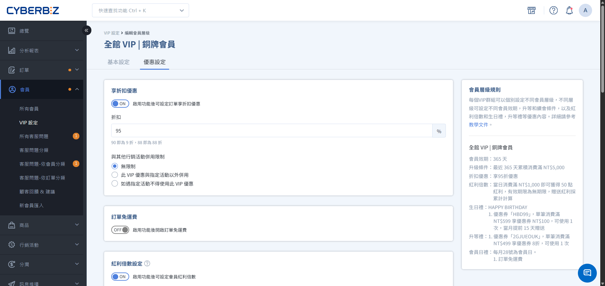
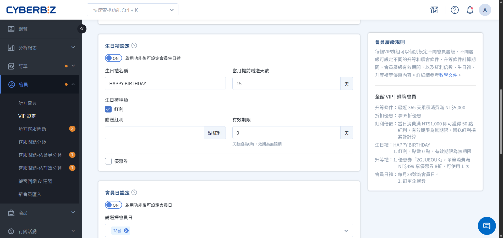
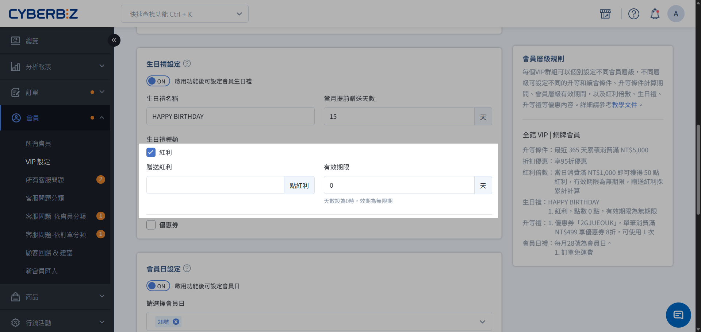
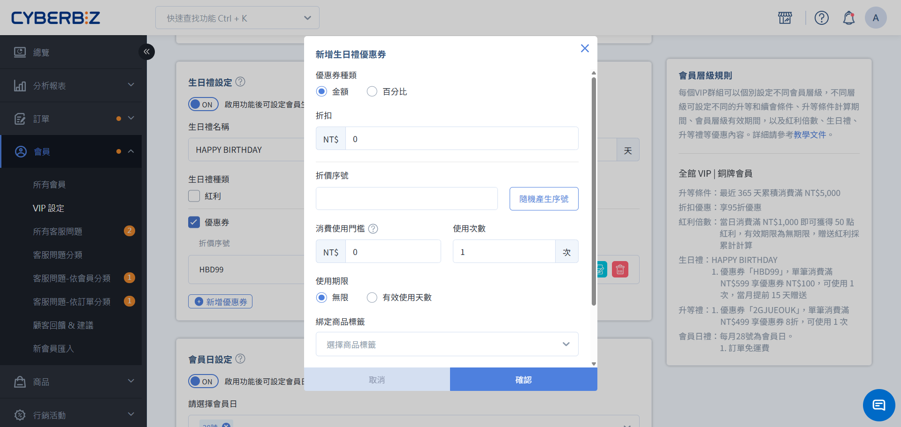
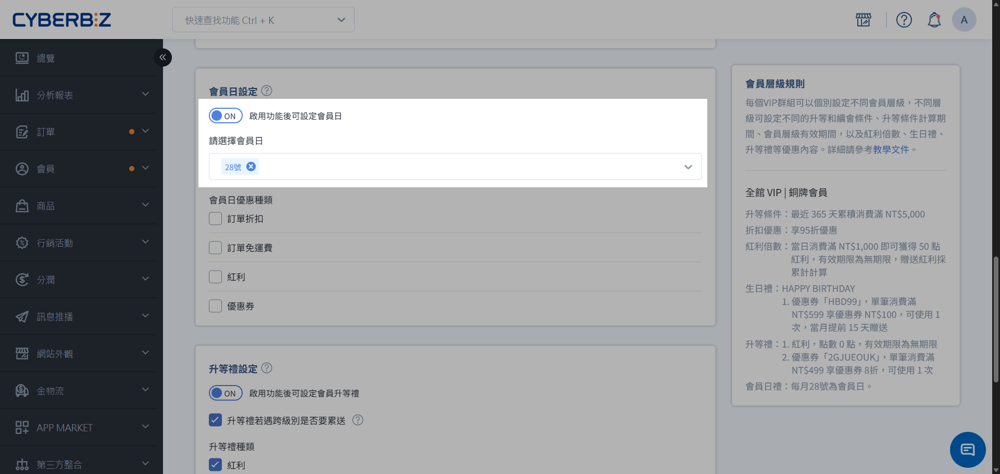
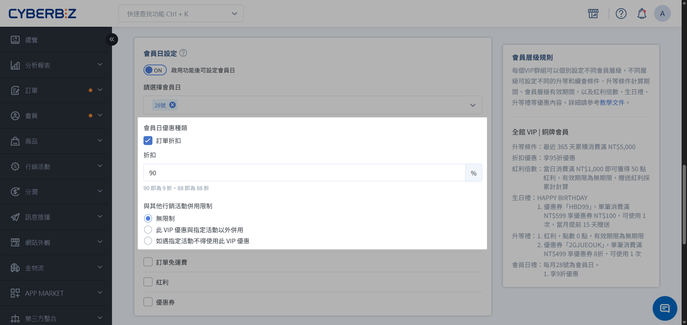
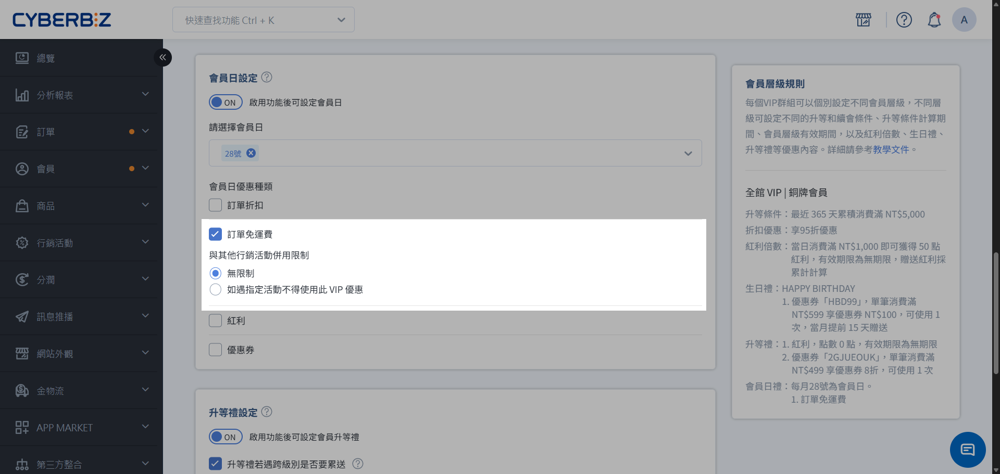
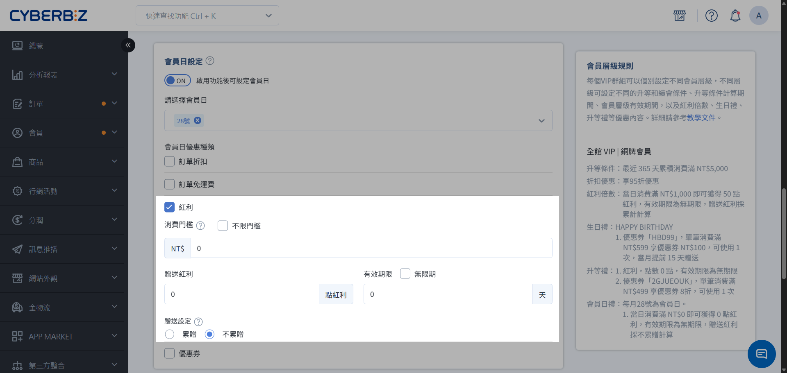
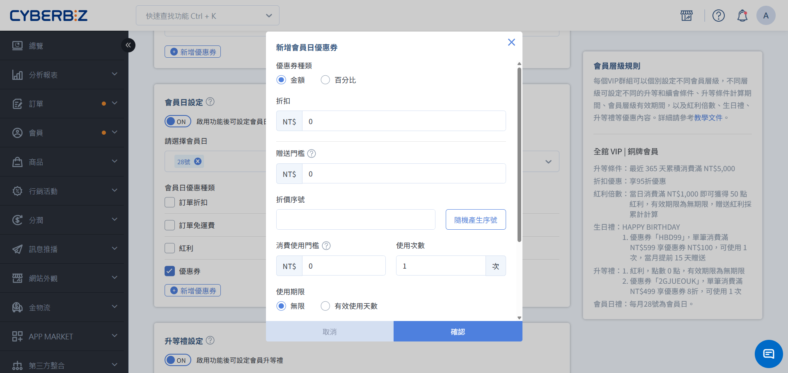
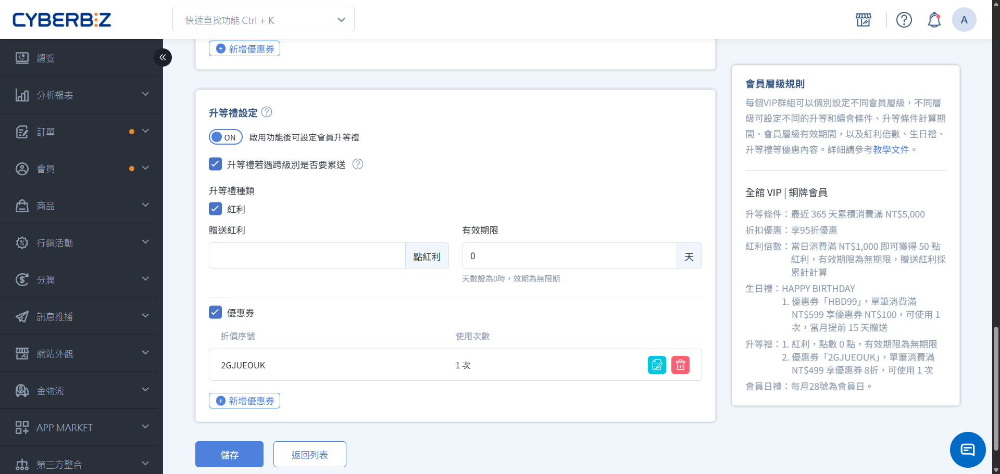

# 設定 VIP 專屬優惠

設定 VIP 會員專屬折扣、紅利獎勵與差異化定價，並掌握與全館行銷活動的併用規則。
{ .subtitle }

[:lucide-tag:{ title="適用方案" }](../../../resources/conventions#適用方案) | 高手 / 所有 PLUS / 企業
{ .doc-badge }

{ .hero-page }

VIP 制度的核心吸引力在於「尊榮感」與「實質回饋」。新版 VIP 系統提供多樣化的優惠組合，協助您設計出讓會員有感的差異化福利。

## 使用須知

設定 VIP 優惠時，請定義該優惠與「指定行銷活動」之間的併用規則。系統提供三種不同強度的疊加邏輯：

- **無限制**

    VIP 優惠可與所有活動「直接累加」使用。

- **活動以外併用（商品級排除）**

    若單一商品已享有勾選的活動折扣，則該商品「不再享有」VIP 優惠；訂單內其他未參加活動的商品則不受影響。

- **遇活動不享優惠（訂單級排除）**

    只要購物車內包含任何一個符合勾選活動的商品，整筆訂單將「完全取消」VIP 優惠。

## 1. 享折扣優惠

1. 輸入 **指定折扣**。該 VIP 層級會員下單時，整筆訂單即可享指定折數折扣。

    > 折扣數值請設定為 1～99。例如：90 表示 9 折，70 表示 7 折。

2. **設定與其他行銷活動的併用規則**
            
    請先選擇 **併用邏輯**，接著從清單中勾選欲套用此規則的行銷活動。

    可供綁定併用規則的行銷活動：
    
    - 會員專屬價格
    - 單品折扣
    - 紅配綠（組合優惠折扣）
    - 任選折扣
    - 商品多層級分類折扣（商品進階分類折扣）
    - 全館折扣

{ .screenshot }

## 2. 訂單免運費

1. 輸入 **免運門檻**。該 VIP 層級會員到達門檻時，整筆訂單即可享免運。

2. **設定與其他行銷活動的併用規則**
            
    請先選擇 **併用邏輯**，接著從清單中勾選欲套用此規則的行銷活動。

    可供綁定併用規則的行銷活動：
    
    - 會員專屬價格
    - 單品折扣
    - 紅配綠（組合優惠折扣）
    - 任選折扣
    - 商品多層級分類折扣（商品進階分類折扣）
    - 全館折扣

{ .screenshot }

## 3. 紅利倍數設定

### 使用須知

*   **疊加贈送：** 若您同時設定了「全館紅利贈送」與「VIP 額外紅利」，會員下單時會 **同時獲得兩者**。

### 設定方式

輸入 **消費門檻、贈送紅利數量、有效期限**。該 VIP 層級會員下單後，可得額外紅利點數。

{ .screenshot }

## 4. 生日禮設定

### 使用須知

*   **疊加贈送：** 若您於 **行銷活動 > 全館折扣-紅利&優惠券** 設定全館會員生日禮，消費者將 **同時獲得兩者**，請謹慎規劃生日禮發放政策。
*   **提前發送：** 當您設定 **提前 N 天發送生日禮**，發送時依會員當下等級判斷是否發送。 若發送時間點早於會員升等日期，該會員將無法收到升等後等級的生日禮。您可依商店的 VIP 政策，手動補送生日禮給會員。

    !!! example "情境舉例"
        顧客Ａ的生日在 5 月，並於 4/27 升等到 VIP1。
        系統設定每月提前 5 天發送該月生日禮，則 VIP1 5 月生日禮的發送時間點為 4/26。
        系統已於 4/26 發送當月生日禮，當時顧客 A 尚未升等，因此無法收到 VIP1 對應的生日禮。

### 設定方式

1. 輸入 **生日禮名稱、提前贈送天數**。該 VIP 層級會員即可於指定日期收到生日禮。

    { .screenshot }

2. 選擇生日禮類型（可全選）：

    === "紅利"
        
        輸入 **贈送紅利點數數量、有效期限**。

        { .screenshot }

    === "優惠券"

        1. 點擊 **新增優惠券**。

            > 可新增多張優惠券。

        2. 選擇優惠券類型：

            - 金額
            - 百分比
        
        3. 設定相關參數。
        4. **設定與其他行銷活動的併用規則**
            
            請先選擇 **併用邏輯**，接著從清單中勾選欲套用此規則的行銷活動。

            可供綁定併用規則的行銷活動：
            
            - 會員專屬價格
            - 單品折扣
            - 紅配綠（組合優惠折扣）
            - 任選折扣
            - 商品多層級分類折扣（商品進階分類折扣）
            - 全館折扣
            - VIP享折扣優惠（VIP 折扣）
            - 加價購
            - 推薦碼折扣            

        { .screenshot }

## 5. 會員日設定

### 使用須知

*   **有效日期限制**：若設定的會員日不在該月的有效日期範圍內，該月份將不會啟用會員日功能。

    > 若您將每月 30 日設為會員日，2 月因日期最長至 29 日（或 28 日），當月將不會自動套用會員日活動。

*   **排除其他VIP優惠**：會員日當天，其他 VIP 優惠不列入計算。

    - 若開啟會員日 **訂單折扣**，則會員日當天優惠設定 **享折扣優惠** 不會生效。
    - 若開啟會員日 **訂單免運費**，則會員日當天優惠設定 **訂單免運費** 不會生效。
    - 若開啟會員日 **紅利**，則會員日當天優惠設定 **紅利倍數設定** 不會生效。

### 設定方式

1. 選擇會員日。

    !!! info "**單月多個會員日功能** 適用版本"
        此功能為 **企業版** 專屬，您可勾選多個日期，會員便能於該月每個指定日期獲得會員禮。

    { .screenshot }

2. 選擇會員禮：

    === "訂單折扣"

        1. 輸入 **指定折扣**。該 VIP 層級會員下單時，整筆訂單即可享指定折數折扣。

            > 折扣數值請設定為 1～99。例如：90 表示 9 折，70 表示 7 折。

        2. **設定與其他行銷活動的併用規則**
            
            請先選擇 **併用邏輯**，接著從清單中勾選欲套用此規則的行銷活動。

            可供綁定併用規則的行銷活動：
            
            - 會員專屬價格
            - 單品折扣
            - 紅配綠（組合優惠折扣）
            - 任選折扣
            - 商品多層級分類折扣（商品進階分類折扣）
            - 全館折扣

          { .screenshot }

    === "訂單免運費"

        1. 輸入 **免運門檻**。該 VIP 層級會員到達門檻時，整筆訂單即可享免運。

        2. **設定與其他行銷活動的併用規則**
            
            請先選擇 **併用邏輯**，接著從清單中勾選欲套用此規則的行銷活動。

            可供綁定併用規則的行銷活動：
            
            - 會員專屬價格
            - 單品折扣
            - 紅配綠（組合優惠折扣）
            - 任選折扣
            - 商品多層級分類折扣（商品進階分類折扣）
            - 全館折扣

          { .screenshot }

    === "紅利"

        設定 **消費門檻、贈送紅利、有效期限、累贈規則**。會員日當天消費，即可依訂單金額贈送紅利點數。

        { .screenshot }

    === "優惠券"

        1. 點擊 **新增優惠券**。

            > 可新增多張優惠券。

        2. 選擇優惠券類型：

            - 金額
            - 百分比
        
        3. 設定相關參數。
        4. **設定與其他行銷活動的併用規則**
            
            請先選擇 **併用邏輯**，接著從清單中勾選欲套用此規則的行銷活動。

            可供綁定併用規則的行銷活動：
            
            - 會員專屬價格
            - 單品折扣
            - 紅配綠（組合優惠折扣）
            - 任選折扣
            - 商品多層級分類折扣（商品進階分類折扣）
            - 全館折扣
            - VIP享折扣優惠（VIP 折扣）
            - 加價購
            - 推薦碼折扣  

        
          { .screenshot }

## 6. 升等禮設定

### 使用須知

*   **發送數量：** 會員效期內各層級的升等禮僅限贈送一次。
*   **新舊版本切換：** 從舊版 VIP 套用到新版 VIP 版本，不會觸發送出升等禮。

### 設定方式

1. 選擇若跨級別升等是否要累送升等禮。
2. 選擇升等禮

    === "紅利"

        設定 **贈送紅利、有效期限**。會員日升等後即可獲得紅利點數。

    === "優惠券"

        1. 點擊 **新增優惠券**。

            > 可新增多張優惠券。

        2. 選擇優惠券類型：

            - 金額
            - 百分比
        
        3. 設定相關參數。

        4. **設定與其他行銷活動的併用規則**
            
            請先選擇 **併用邏輯**，接著從清單中勾選欲套用此規則的行銷活動。

            可供綁定併用規則的行銷活動：
            
            - 會員專屬價格
            - 單品折扣
            - 紅配綠（組合優惠折扣）
            - 任選折扣
            - 商品多層級分類折扣（商品進階分類折扣）
            - 全館折扣
            - VIP享折扣優惠（VIP 折扣）
            - 加價購
            - 推薦碼折扣  

{ .screenshot }