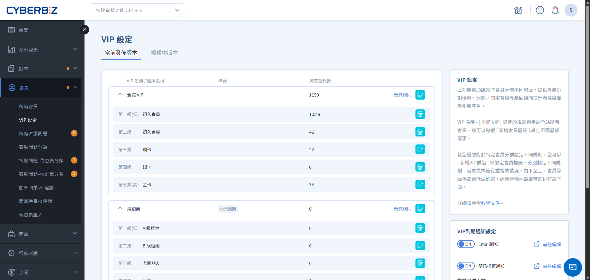
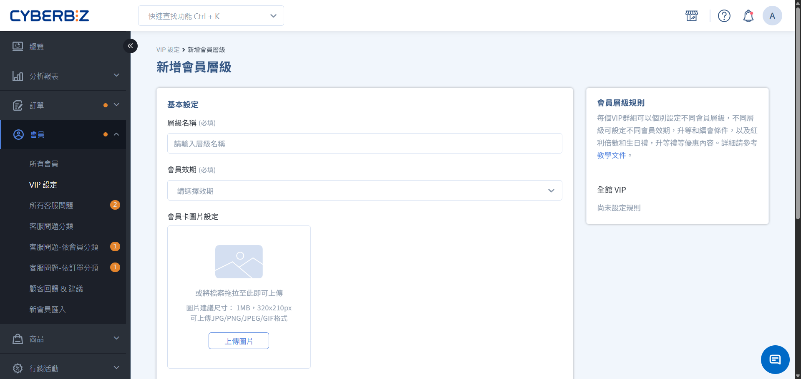
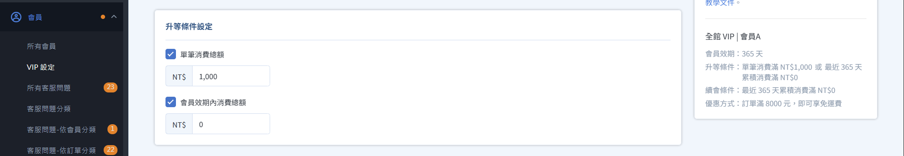
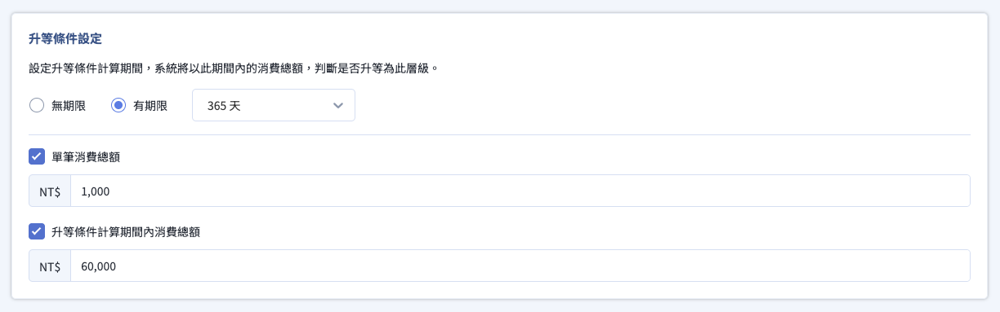
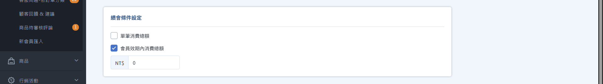
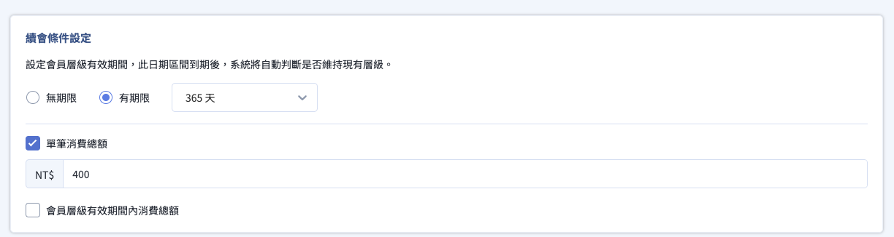

# 建立全館VIP制度

逐步設定 VIP 會員層級、升等門檻與續會條件，建構符合商店品牌形象的會員體系。
{ .subtitle }

{ .hero-page }

完成初步規劃後，您可以開始在後台搭建 VIP 階層。本指南將引導您完成從等級命名到門檻設定的完整流程。

## 步驟 1：基本資料設定

進入後台 **會員 > VIP 設定**，於 **全館VIP** 點擊 **新增會員層級**。

=== "其餘版本"

    1.  **層級名稱**：輸入易於理解的名稱（如：銀卡會員、尊榮 VIP）。
    2.  **會員效期**：建議所有層級設定一致的效期（常見為 365 天），方便管理。
    3.  **會員卡圖片**：此圖片將顯示於會員中心的前台畫面，強化品牌專屬感。
        *   **建議尺寸**：320x210px (1MB 以內)。

    

=== "企業版"

    1.  **層級名稱**：輸入易於理解的名稱（如：銀卡會員、尊榮 VIP）。
    2.  **會員卡圖片**：此圖片將顯示於會員中心的前台畫面，強化品牌專屬感。
        *   **建議尺寸**：320x210px (1MB 以內)。    

    

## 步驟 2：設定升等門檻

=== "其餘版本"

    升等門檻決定了會員如何獲得該等級的身份。

    *   **單筆消費總額**：顧客在一次結帳中達到的金額。適合吸引「大戶」直接晉升。
    *   **效期內消費總額**：在您設定的效期（如過去 365 天）內，所有有效訂單的總和。

    

=== "企業版"

    1. 設定 **升等條件計算期間**

        - **有期限(預設)**：於下拉選單選擇效期天數。
        - **無期限**：以會員所有歷史紀錄，作為會員升等條件計算區間。  
          
    2. 設定 **升等條件門檻**

        - **單筆消費總額**：在您設定的效期內，顧客在一次結帳中達到的金額。
        - **效期內消費總額**：在您設定的效期內，所有有效訂單的總和。

        
    !!! tip "打造累積型升等機制" 
        - **設置方式**：升等期間設為 **無期限**
        - **運作機制**：系統將自動檢索會員自 **該網站首次下單** 起的所有歷史交易紀錄，並依據您指定的門檻判定升等資格：
            - 單筆消費總額：偵測會員自該網站首次下單起，任一筆單筆訂單金額是否達標。
            - 效期內消費總額：回溯會員自該網站首次下單起，，總消費額度是否達標。

    

!!! note "判定優先順序"
    如果您同時設定了「單筆」與「累積」門檻，系統會採取 **最有利於消費者** 的結果進行升等判定。

## 步驟 3：設定續會門檻

=== "其餘版本"

    續會條件用於判定會員在效期結束後，是否能維持原等級。

    *   **單筆消費總額**：顧客在一次結帳中達到的金額。適合吸引「大戶」直接晉升。
    *   **效期內消費總額**：在您設定的效期（如過去 365 天）內，所有有效訂單的總和。

    

=== "企業版"

    1. 設定 **會員層級有效期間**
      
        **會員層級有效期間** 即為該等級的 **會員效期**，系統也會以此區間內的消費紀錄，計算是否符合 **續會資格**。  
      
        - **有期限(預設)**：於下拉選單選擇會員效期天數。
        - **無期限**：會員效期無期限，系統不會檢查續會資格。 ` 

    2.  設定 **續會條件門檻**

        根據上一步 會員層級有效期間 的設定，決定續會門檻的填寫方式：

        - **有期限(預設)**：**請務必填寫續會門檻**。若沒有設定續會門檻，會員效期到期時系統不會執行續會條件判定，會員將會失去 VIP 身分。
        - **無期限**：可不填寫續會門檻 (系統不執行續會檢查，續會條件門檻將不會生效)。

        設定門檻：

        - **單筆消費總額**：在您設定的效期內，顧客在一次結帳中達到的金額。
        - **效期內消費總額**：在您設定的效期內，所有有效訂單的總和。

    !!! tip "打造永久型續會機制"
        - **設置方式**：續會期間設為 **無期限**
        - **運作方式**：系統將不會對此等級發動 **到期續會檢查**。會員一旦升等到該等級會員，不會因續會檢查而遭系統降級。
          
        :lucide-triangle-alert: 會員若產生無效訂單(如：取消訂單或發生退貨)，仍會觸發降等機制排查，仍可能遭到降等處理。
    
    
        
  
!!! note "判定優先順序"
    如果您同時設定了「單筆」與「累積」門檻，系統會採取 **最有利於消費者** 的結果進行升等判定。