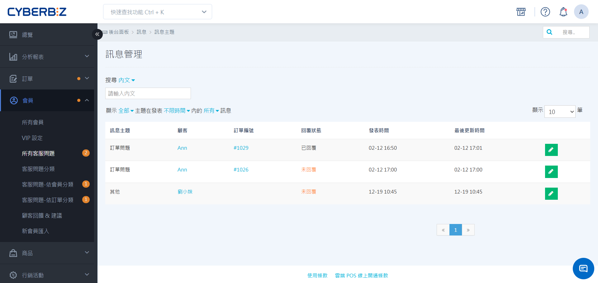
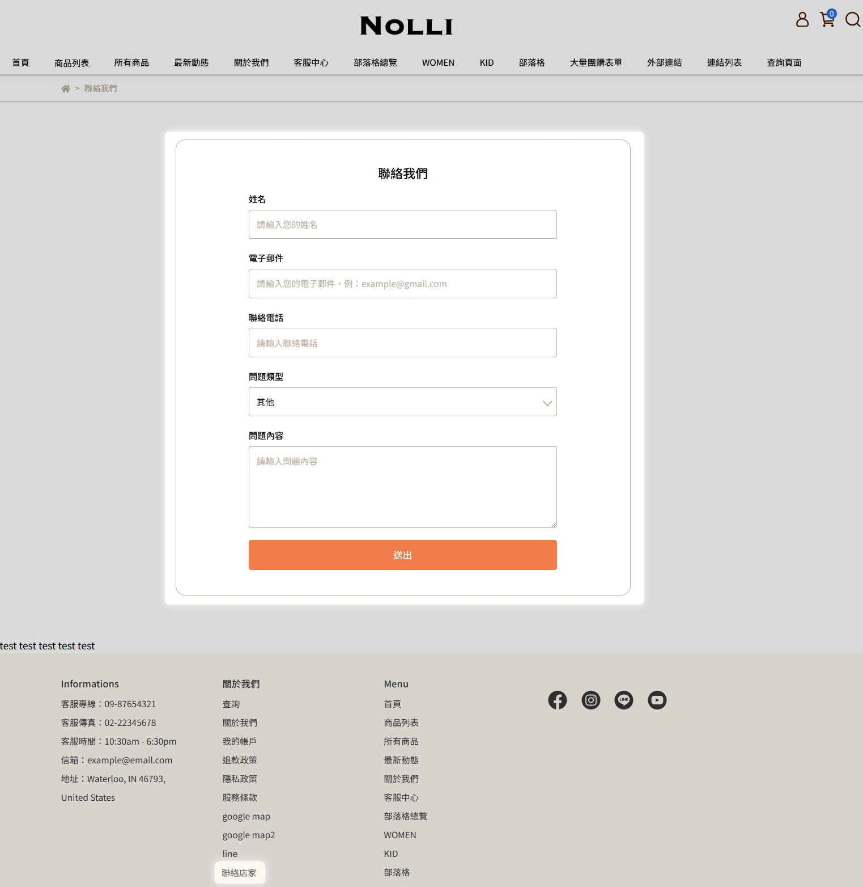
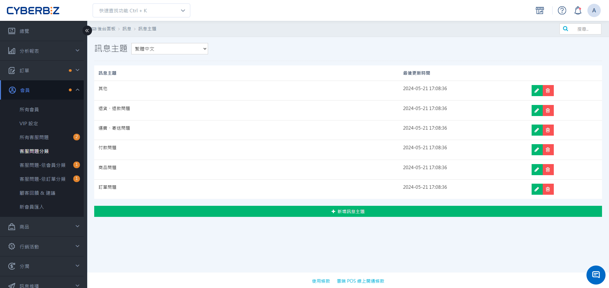
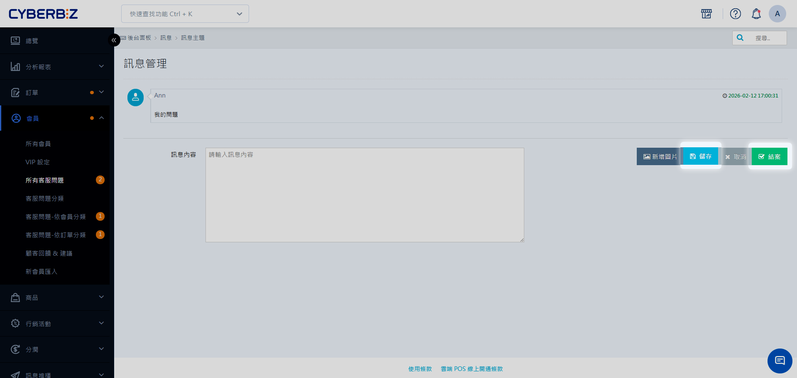
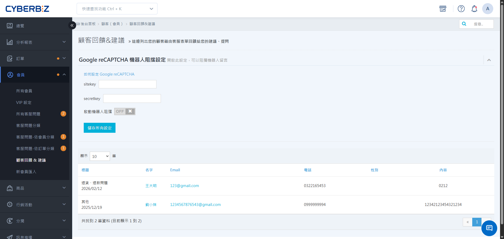
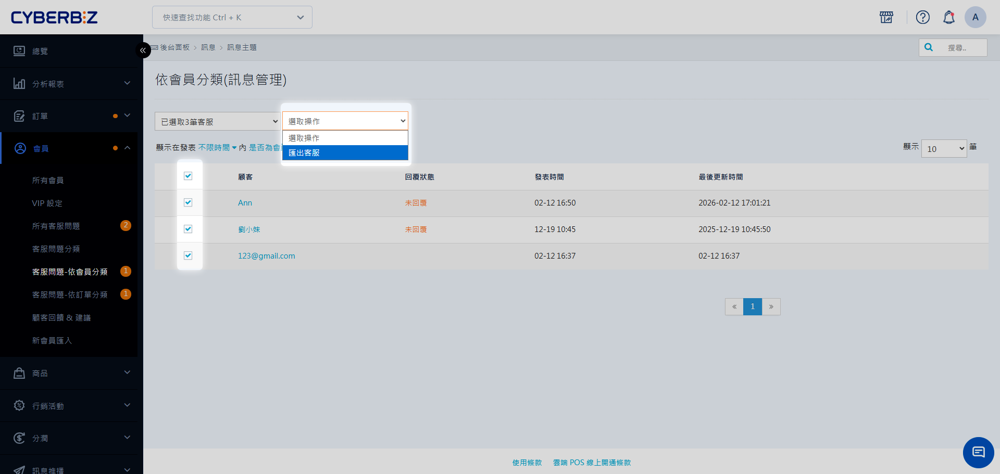

# 管理官網會員客服問答系統

學習如何配置官網內建的客服問答系統，包含設定問題分類、處理會員與訪客留言，以及管理訂單內的諮詢訊息。
{ .subtitle }

{ .hero-page }

!!! tip "應用情境"
    - **精準分流處理**：設定「物流進度」、「退換貨申請」等主題，讓客服人員能快速識別問題重心。
    - **建立溝通歷程**：訊息與會員帳號綁定，即便更換客服窗口也能掌握過往溝通細節。
    - **數據優化建議**：透過匯出功能分析常見問題，作為產品描述優化或 FAQ 建置的依據。

## 一、功能導覽

官網客服問答主要涵蓋以下溝通路徑：

1.  **聯絡我們（全站）**：不論是否登入，訪客皆可透過表單留言。
2.  **訂單詢問（會員限定）**：會員針對 **特定訂單** 在明細頁中留言，訊息會自動標註單號。

## 二、前台架設與互動情境

以下呈現 **客服問答** 的互動流程：

### 1. 聯絡我們表單

=== "顧客視角"

    在官網導覽列或頁腳點擊 **聯絡店家**，選擇問題主題、填寫姓名、Email 與詢問內容後送出。
    > **聯絡店家** 為系統預設文字，商家可手動修改名稱。設定完成後，請務必於頁面中同步指引顧客點擊該指定文字，以確保諮詢路徑明確。

    

=== "商家視角"

    - **通知**：左側選單 **會員** 旁出現橘色圓點提醒。
    - **處理**：前往 **會員 > 所有客服問題**，點擊 :lucide-pencil: 進行回覆。

### 2. 專屬訂單詢問

=== "顧客視角"

    登入會員後，進入 **訂單查詢**，在該筆訂單明細最下方的 **發訊息給店家** 處輸入問題。

    

=== "商家視角"

    - **通知**：左側選單 **會員** 旁出現橘色圓點提醒。
    - **處理**：前往 **會員 > 所有客服問題**，點擊 :lucide-pencil: 進行回覆。
      > 該筆訊息會自動帶入對應的 **訂單編號**，點擊即可直接查看訂單內容。

## 三、設置客服主題

在開放前台留言前，可先設定問題分類，以便將訊息分流處理。

1. 登入管理後台，前往 **會員 > 客服問題分類**。
2. 點擊 **新增訊息主題**。
3. **主題名稱**：輸入欲顯示在前台選單的項目（如：物流進度、批發需求、退款申請）。
4. 點擊 **儲存**。

## 四、訊息回覆與管理

### 1. 回覆會員詢問

1. 前往 **會員 > 所有客服問題**。
2. 針對待回覆項目點選 **編輯**。
3. 在回覆框中輸入文字。
4. **關鍵邏輯選擇**：
    - **點擊儲存**：正式發送回覆內容，系統會發送通知信給會員。
    - **點擊結案**：僅將狀態標記為 **已回覆** 並移除後台提醒數字，**不會儲存或發送訊息內容**。

!!! warning "操作限制"
    回覆內容一旦點擊 **儲存** 送出後，系統 **無法進行修改或刪除**，發送前請務必確認內容正確。

### 2. 處理訪客（非會員）留言

1. 若訪客留下的 Email 系統查無會員帳號，請前往 **會員 > 顧客回饋 & 建議**。
2. 您需使用顧客留下的聯絡資訊（如手動發 Email 或電話）在外部進行回覆。

### 3. 匯出紀錄與分析

1. 前往 **會員 > 客服問題 – 依會員分類**。
2. 勾選欲分析的會員。
3. 點選頁面上方 **選擇操作 > 匯出客服**，系統將產生 Excel 檔案供您下載分析。

## 常見問題

??? quote "為什麼點擊 **結案** 後，顧客反映沒看到回覆？"
    **結案** 是後台的管理狀態切換，用於處理已在其他管道（如電話）解決的問題。若要讓顧客在官網看到回覆文字，必須輸入回覆文字並點擊 **儲存**。

??? quote "顧客可以在哪裡看到回覆記錄？"
    會員可登入官網，進入 **我的帳戶 > 詢問紀錄**，查看自己與客服中心的所有往返內容。

??? quote "如果誤發訊息可以撤回嗎？"
    目前系統不支援撤回或編輯已發送的客服回覆。建議建立一套 **標準回覆範本** 或 **回覆前的檢查流程** 以減少錯誤。

??? quote "為什麼在後台找不到 **所有客服問題** 選單，只看到 **問題管理**？"
    這是系統為了簡化管理介面的動態設計，路徑會根據 **是否有待處理問題** 自動切換：

    - **當有待回覆問題時**：請由 **會員 > 所有客服問題** 進入處理。
    - **若無任何待回覆問題**：該選單會自動調整為 **問題管理**。