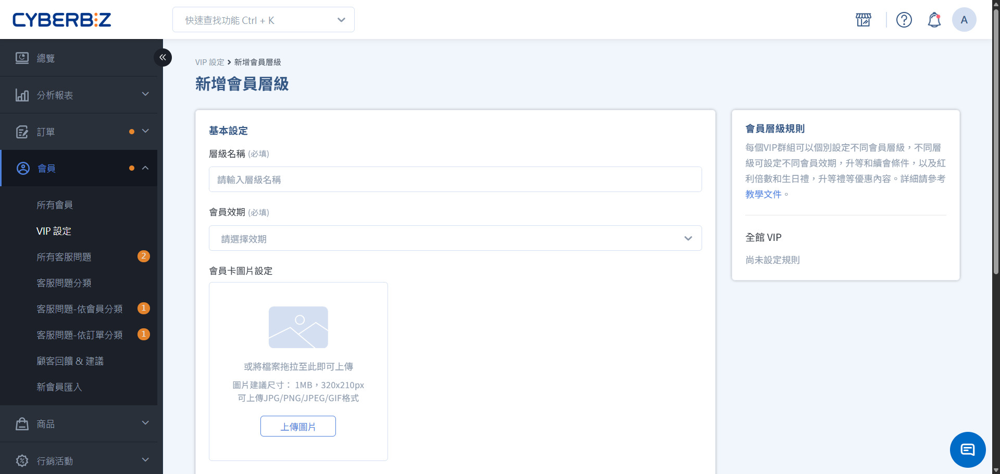
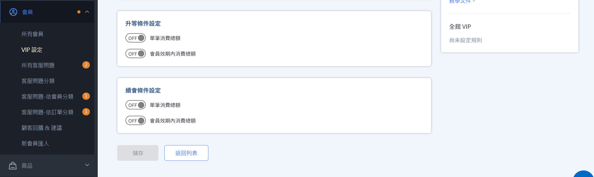

# 建立全館VIP制度

逐步設定 VIP 會員層級、升等門檻與續會條件，建構符合商店品牌形象的會員體系。
{ .subtitle }

{ .hero-page }

完成初步規劃後，您可以開始在後台搭建 VIP 階層。本指南將引導您完成從等級命名到門檻設定的完整流程。

## 步驟 1：基本資料設定

進入後台 **會員 > VIP 設定**，於 **全館VIP** 點擊 **新增會員層級**。

1.  **層級名稱**：輸入易於理解的名稱（如：銀卡會員、尊榮 VIP）。
2.  **會員效期**：建議所有層級設定一致的效期（常見為 365 天），方便管理。
3.  **會員卡圖片**：此圖片將顯示於會員中心的前台畫面，強化品牌專屬感。
    *   **建議尺寸**：320x210px (1MB 以內)。

    !!! info "會員卡設定功能限定版本"
        此功能僅限所有 PLUS 版與企業版專用。

## 步驟 2：設定升等門檻（必填）

升等門檻決定了會員如何獲得該等級的身份。

*   **單筆消費總額**：顧客在一次結帳中達到的金額。適合吸引「大戶」直接晉升。
*   **效期內消費總額**：在您設定的效期（如過去 365 天）內，所有有效訂單的總和。

!!! note "判定優先順序"
    如果您同時設定了「單筆」與「累積」門檻，系統會採取 **最有利於消費者** 的結果進行升等判定。

## 步驟 3：設定續會門檻（建議設定）

續會條件用於判定會員在效期結束後，是否能維持原等級。

*   **單筆消費總額**：顧客在一次結帳中達到的金額。適合吸引「大戶」直接晉升。
*   **效期內消費總額**：在您設定的效期（如過去 365 天）內，所有有效訂單的總和。

!!! note "判定優先順序"
    如果您同時設定了「單筆」與「累積」門檻，系統會採取 **最有利於消費者** 的結果進行升等判定。

