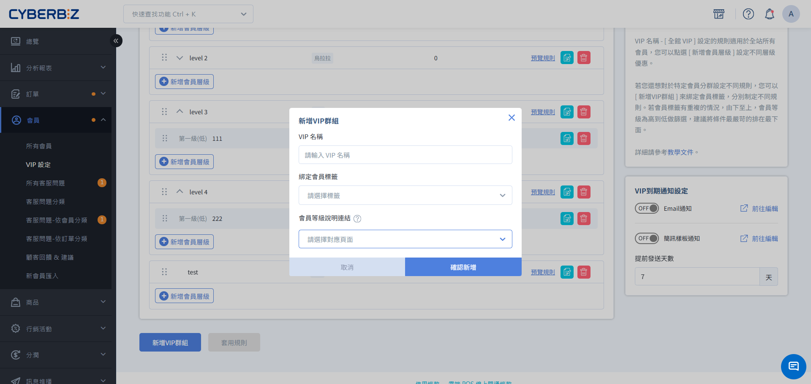

# 建立專屬VIP群組

透過 VIP 群組標籤功能，針對特定客層綁定標籤並設定專屬 VIP 規則，實現分群經營與精準行銷。
{ .subtitle }

{ .hero-page }

## 功能說明

「VIP 群組標籤」允許商家針對帶有特定 **會員標籤** 會員，套用一套獨立於「全館 VIP」之外的等級規則。這對於經營特定客群（如：員購、KOL、大戶）非常有用。

### VIP 類型區分

1.  **全館 VIP**：適用於所有未被歸類到特定群組的會員。
2.  **VIP 群組**：綁定特定 **會員標籤** ，僅限帶有該標籤的會員參與。

## 操作流程

### 步驟 1：建立 VIP 群組並綁定標籤

1. 登入管理後台，前往 **會員 > VIP 設定**。
2. 點擊 **編輯中版本** 頁籤。
3. 點擊 **新增 VIP 群組**。
4. 在 **綁定會員標籤** 下拉選單中，選擇預先建立好的會員標籤。
5. 完成該群組內的等級門檻與優惠設定。

### 步驟 2：調整群組排序

1. 在 VIP 設定列表頁面，找到右側的排序功能。
2. 透過拖曳或調整數字，確保特定群組的優先權符合您的營運策略。
3. 點擊 **儲存排序**。

## 運作邏輯與判定規則

### 1. 觸發計算時機
系統會在以下情況重新計算會員的 VIP 等級：

*   **標籤異動**：當商家為會員 **增加** 或 **移除** 與 VIP 群組綁定的標籤時。
*   **有效訂單**：會員產生新的有效訂單時。

### 2. 優先權與排序
若一位會員身上同時擁有多個顧客標籤，且這些標籤分別綁定了不同的 VIP 群組：

*   **排序決定權**：系統會依據後台 VIP 列表的 **排序** 來決定。
*   **篩選邏輯**：系統會從列表 **最下方** 開始向上篩選，符合條件的第一個群組即為該會員適用的規則。
*   **建議**：請將條件最嚴苛、權益最高的群組排在列表最下方。

### 3. 判斷會員資格
系統會調閱該 VIP 群組中，層級最低（准入等級）的升等條件。

- **符合門檻者：** 正式進入該 VIP 群組，並依據其消費實力賦予對應等級（支援直接跳升至最高等級）。
- **不符門檻者：** 即使身上帶有標籤，系統仍會判定為不具備該群組 VIP 資格。該會員將維持原有的身份（如：全館 VIP 或一般會員），直到下一次觸發事件且消費達標為止。

!!! tip "核心觀念提醒"
    標籤僅代表 **入場券** 的獲取資格，而非 **直通卡** 。會員必須在持有標籤的前提下，額外滿足該群組的消費門檻，系統才會正式將其升等為該群組的 VIP。

## 加減標籤時的計算細則

當商家手動調整會員標籤時，系統的計算邏輯如下：

| 動作 | 計算邏輯 | 效期起始日 |
| :--- | :--- | :--- |
| **增加標籤** | 視為 **有效訂單** 事件，由當下回推效期計算門檻。 | 以 **加標籤當天** 為起始日。 |
| **移除標籤** | 視為 **無效訂單** 事件，回推最近一筆有效事件計算。 | 以最近一次有效事件日期為起始日。 |

!!! warning "手動調整風險"
    不建議為了測試邏輯而頻繁對會員進行「先減標籤再加標籤」的操作。因為「加標籤」會觸發新的回溯計算，若會員在新的回溯區間內消費不足，可能會導致會員意外降等。

## 常見問題

??? quote "為什麼會員身上有標籤，卻沒有進入對應的 VIP 群組？"
    請檢查該會員是否達到了該 VIP 群組中「最低層級」的升等門檻。即使綁定了標籤，會員仍需符合消費門檻（單筆或累積）才會正式升等。

??? quote "可以刪除正在被 VIP 群組使用的標籤嗎？"
    不可以。標籤若要被刪除，必須同時符合：沒有顧客使用、沒有商品使用、**沒有 VIP 群組綁定**、以及沒有會員專屬商品使用。

