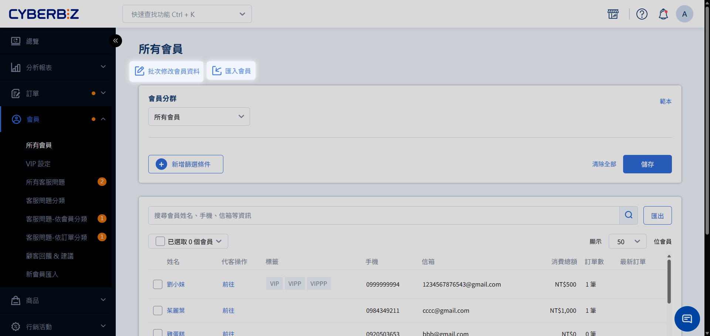
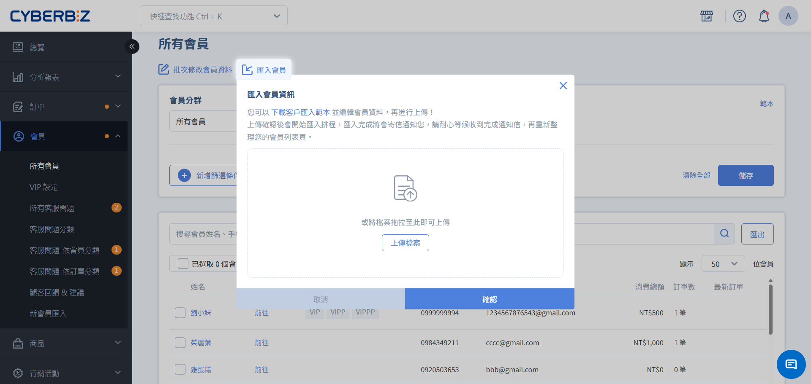
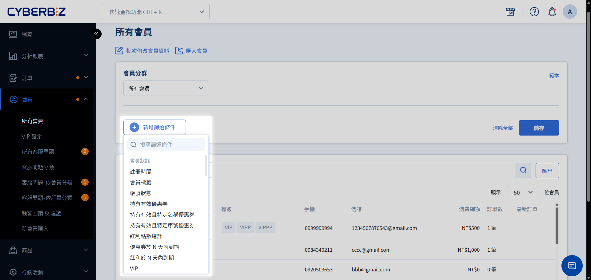
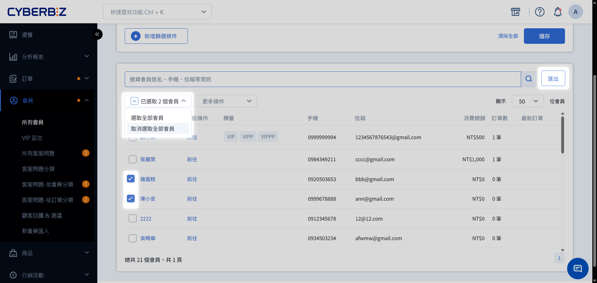
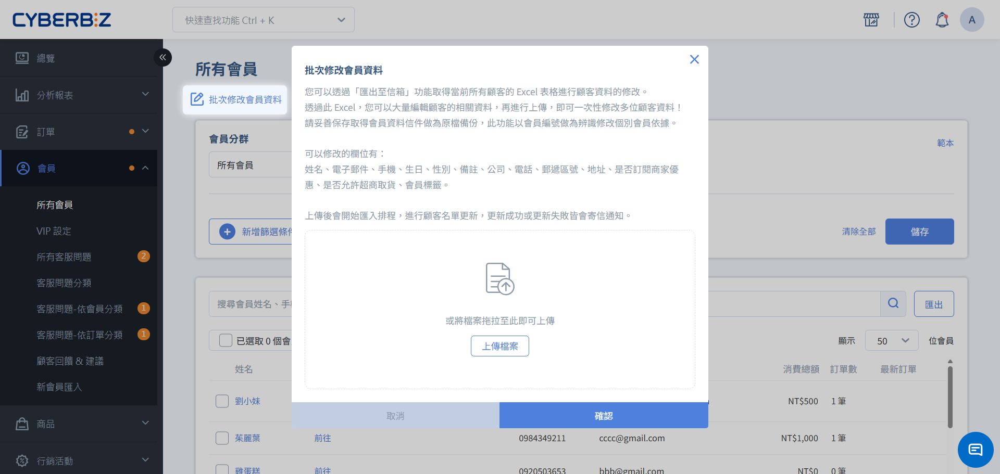
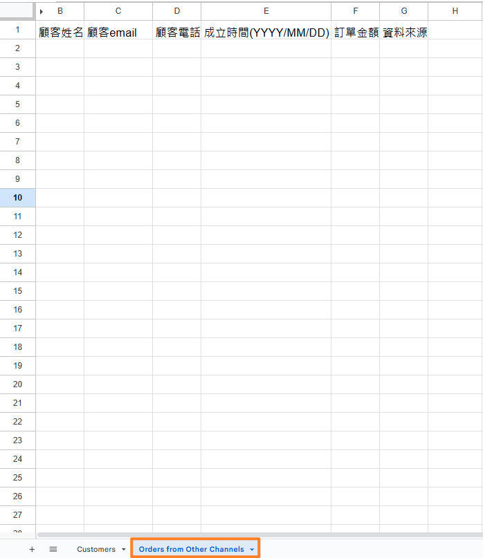
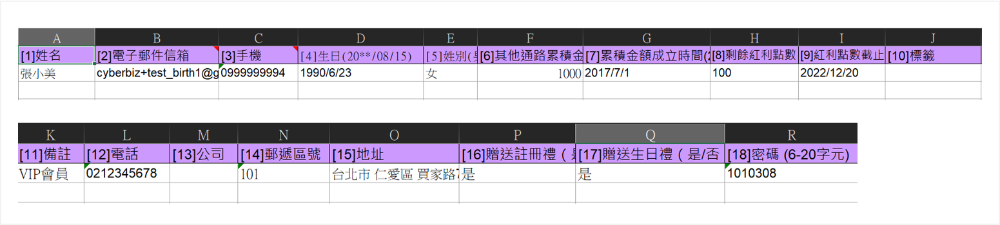

# 批次匯入 / 編輯會員

透過 Excel 檔案，您可以快速完成大量會員的資料建立或內容異動，包含聯絡資訊、紅利點數初始化及行銷標籤管理。
{ .subtitle }

{ .hero-page }

!!! tip "應用情境"
    - **系統遷移**：開店初期將舊有平台的會員名單一次搬移至 CYBERBIZ。
    - **資料補完**：針對地址或生日缺漏的會員，批次匯出並補齊後重新上傳。

## 使用須知

在執行大量匯入或修改操作前，請務必了解以下限制與規範：

- **測試建議**：資料匯入後無法進行批次刪除。大量操作前，請先以 3-5 筆資料進行測試，確認格式正確。
- **格式規範**：請勿更動 Excel 範本的第一行標題內容與順序，否則將導致匯入失敗。
- **欄位限制**：
    - **紅利點數**：僅限 **新增會員** 時可同步匯入。既有會員若需調整紅利，僅能逐一至會員編輯頁手動修改。
    - **密碼**：建議依據會員需求設定預設值，避免過於簡易造成資安風險。

## 操作流程

### 任務一：大量匯入新會員

適用於建立尚未存在於系統中的新名單。

1. 登入管理後台，前往 **會員 > 所有會員**。
2. 點擊頁面右上方 **匯入會員**。
3. 在彈出視窗中點選 **下載客戶匯入範本**。
4. 依照範本格式填寫資料，並將預設的 `張小美` 範例列刪除。
5. 點選 **選擇檔案** 上傳填妥的檔案，按下 **確認** 執行。

    > 系統將於背景執行匯入排程，完成後會寄送 Email 通知結果。

### 任務二：批次修改既有會員資料

適用於更新已在系統內的會員資訊（如：補填生日、修改手機、更新標籤）。

1. 前往 **會員 > 所有會員**，篩選出欲修改的會員。

    === "使用會員篩選器"

          1. 點擊 **新增篩選條件**。
          2. 依需求選擇指定條件。
          3. 系統將自動篩選並於下方列表顯示符合條件的會員名單。
          4. 點擊 :lucide-square: **已選取0個會員**，選取所有符合條件的會員。

          
    
    === "手動勾選"

          1. **選取指定會員**：於列表中直接勾選指定會員。
          2. **選取所有會員**：點擊 :lucide-square: **已選取0個會員**，**選取全部會員**。

          

2. 點擊 **匯出** 並同意資料保護條款。

      > 檔案將寄送至您的登入帳號信箱。

3. 開啟 Excel 編輯資料。
    - **可修改欄位**：姓名、電子郵件、手機、生日、性別、備註、標籤、公司、電話、地址、是否接受電子報、是否允許超商取貨。
4. 返回後台 **會員 > 所有會員**，點擊 **批次修改會員資料**。
    
5. 上傳編輯後的檔案並按下 **確認**。

     > 系統將比對 **Email** 或 **手機** 後進行資料覆蓋。更新成功或失敗皆會發送 Email 通知。

## Excel 核心欄位說明

請確保以下關鍵欄位的填寫格式正確：

| 欄位名稱 | 格式需求 | 說明 |
| :--- | :--- | :--- |
| **姓名** | 文字 | 會員的顯示名稱 |
| **電子郵件信箱** | 文字 (Email) | 系統識別會員的主索引，格式需包含 `@` 與域名 |
| **手機** | 數字 | 系統識別會員的主索引，海外地區請加國碼，如香港輸入 `+85261234567` |
| **生日** | 日期 (YYYY/MM/DD) | 僅限西元格式，例如 `1990/01/01` |
| **剩餘紅利點數** | 正整數 | **僅限新會員匯入時生效** |
| **標籤** | 文字 (逗號分隔) | 同一會員可標記多個標籤，例如：`VIP, 實體店, 潛在客` |
| **贈送生日禮** | 是/否 | 贈送行銷活動的生日禮，VIP裡的生日禮不受此限 |

針對 [其他通路訂單](管理會員檔案/#2-其他通路訂單手動補入) 的補入，請根據您的系統版本選擇對應的操作方式：

=== "企業版"

      請切換至 **Orders from Other Channels** 頁籤並輸入相關資訊。
      

=== "其餘版本"
      請於 **其他通路累積金額** 與 **累積金額成立時間** 欄位直接填入資訊。
      

!!! info "生日禮功能適用版本"
    此功能僅限 PLUS 版與企業版使用，其餘版本則無此欄位。

## 網站建置與連動

###  手機與 Email 必填設定

若您於 [顧客註冊設定](../website-management/設定顧客註冊流程與欄位/#步驟-2設定預設欄位屬性)，將 **Email** 與 **手機** 設為 **必填**，則匯入時兩者皆需填入。

- **手機欄位設定**：
    - **專業版與進階版** ：系統預設為必填且不可更動。
    - **其餘版本**：支援商家自行設定必選或選填。

### 行銷活動

若計畫在匯入會員時同步發送 **紅利點數、優惠券或生日禮**，**建議先完成網站建置並開啟功能。**

完善的購物環境能確保會員收到通知後，順利引流至站內下單；若網站尚未就緒，恐造成期待落空與流量浪費，影響後續回購意願。

## 常見問題

??? quote "批次修改資料會重複建立帳號嗎？"
    不會。系統會以 **電子郵件信箱**、**手機** 作為主要比對 ID。若 Email 或手機已存在，則會更新該筆資料。

??? quote "透過 Excel 大量匯入的新帳號，如果沒有預設密碼該如何登入？"
    若新帳號在匯入時未設定密碼，會員於首次登入時，請先點選 **忘記密碼**。系統將引導會員完成密碼初始化，設定完成後即可正常登入。
