# 管理會員檔案

當特定會員有資料與權限異動、點數與優惠券配置調整、或需要下單協助時，管理員可透過 **會員明細頁** 進行一站式的客服處理與資料維護。
{ .subtitle }

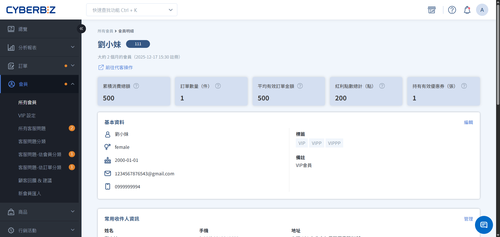{ .hero-page }

!!! tip "應用情境"
    - **日常資料維護**：修正會員誤填的姓名、電話或生日資訊。
    - **客訴補償與獎勵**：針對特定訂單爭議，手動補發紅利點數或優惠券。
    - **風險控管與分眾**：將惡意棄單會員停權，或手動為優質會員貼上 VIP 標籤。
    - **進階客服協助**：協助不擅長操作網頁的會員代客下單，或引導其重設密碼。

## 使用須知

在操作會員資料前，請了解以下系統邏輯：

- **資料連動性**：修改會員明細頁的聯絡資訊後，**不會** 自動同步更新至 **已成立的舊訂單** 收件資訊。
- **不可逆操作**：紅利點數一經發送或收回，系統將即時異動會員資產，操作時請務必確認數值與原因。

## 任務一：查看會員行為與資產數據

進入明細頁後，您可以透過上方的數據概覽，快速判斷該會員的消費實力與目前的互動狀態：

| 數據指標 | 評估維度 | 計算公式 | 
| ------- | ------- | -------- | 
| **累積消費總額** | 忠誠貢獻度 | EC有效訂單+POS訂單+其他通路訂單之金額總額 |
| **訂單數量** | 購買頻率 | EC有效訂單+POS訂單+其他通路訂單之訂單數量總和 |
| **平均有效訂單金額** | 客單價水平 | 累積消費總額 ÷ 訂單數量 |
| **紅利點數總計** | 回流動力 | 會員可用的紅利總和 | 
| **持有有效優惠券** | 成交意願 | 會員可用的優惠券總和 |

數據不只是靜態紀錄，更是制定行銷決策的 **導航儀**，以下提供數據的應用情境範例：

| 數據指標 | 營運洞察 | 實戰應用參考 |
| ------- | ------- | ----------- |
| **累積消費總額** | 決定資源投入的優先順序 | 1. 針對即將升等會員發送禮券引導補單 2. 對高價值流失會員進行專屬人工挽回 |
| **訂單數量** | 判斷會員對品牌的依賴性與回購動能 | 1. 依下單週期預測補貨時間 2. 區分「大額囤貨型」或「高頻免運敏感型」客群採取不同推播策略 |
| **平均有效訂單金額** | 決定商品組合金額與免運門檻 | 1. 推播符合其消費水位的商品價位 2. 參考此指標設定「滿額贈」門檻 | 
| **紅利點數總計** | 衡量資產價值與回流的吸引力 | 點數過高代表購買力尚未被引導回流，可推播點數加價購活動以刺激兌換 |
| **持有有效優惠券** | 訂單成交的最後推動力 | 針對「領券未購」會員進行限時催單 | 

!!! tip "從數據洞察到精準行銷"
    除了在此檢視單一會員的詳細數據，您更可利用會員篩選器，根據特定指標進行批次篩選，實現更精準的群發推播與行銷策略。

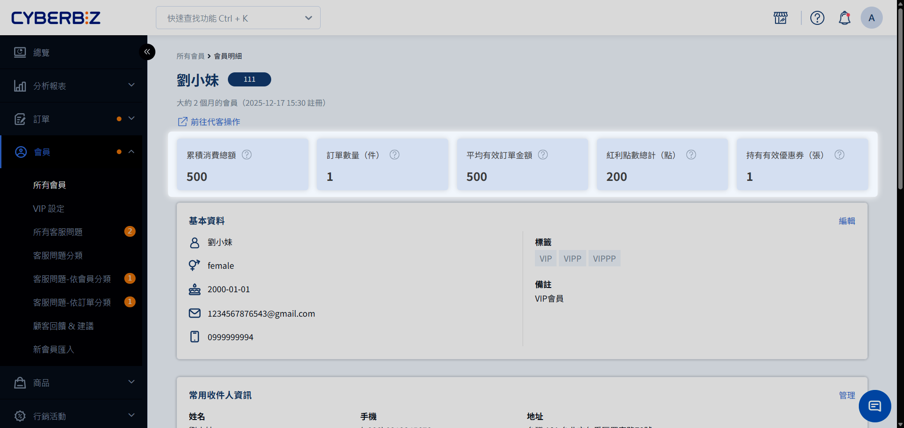

## 任務二：基本資料與帳號維護

### 1. 編輯會員基本資料

1. 進入 **會員 > 所有會員**，搜尋並點擊該會員姓名進入明細頁。
2. 於 **基本資料** 區塊點擊右上方 **編輯**。
3. 可修改姓名、電子郵件、手機、生日（僅限西元格式）、地址等資訊。
4. 點擊 **儲存**。

### 2. 管理帳號權限與狀態

在 **帳號設定** 區塊，您可以針對會員行為進行權限控管：

- **帳號狀態**：
    - `禁用帳號`：該會員將無法登入（適用於惡意使用者）。
    - `設為警示帳號`：會員仍可下單，但後台訂單列表會出現醒目標記，供出貨人員留意。
- **帳號類型**：
    - **識別註冊來源**：查看會員是否透過第三方平台（如 LINE、Google、Facebook）快速註冊。
    - **快速登入支援**：系統記錄之來源包含 LINE、Google、Facebook；若欄位顯示為 **留空**，則代表該帳號使用一般電子郵件註冊。
- **物流限制**：
    - **檢視未取貨紀錄**：查看會員過往的 **未取貨付款次數**，作為配送權限評估參考。
    - **控管超商取貨權限**：針對多次未取貨之會員，可將 `超商取貨` 或 `超商貨到付款` 切換為 **禁用**。
- **通知與推播**：
    - **管理行銷訂閱狀態**：確認會員是否願意接收商家發送的優惠資訊與電子報。
    - **設定系統通知權限**：確認會員是否願意接收訂單狀態、退貨及物流進度等自動發送之電子郵件。
    
    !!! info "修改通知與推播設定須知"
        **訂閱商家優惠** 與 **接受系統通知信** 之原始偏好由會員設定之。商家如需手動異動，請務必先與會員達成共識並獲得同意，以避免衍生收信爭議。

- **註冊人分潤代碼**：顯示該會員綁定的分潤註冊碼。

    !!! info "版本支援說明"
        註冊人分潤功能不適用於專業版，該版本之後台介面將不顯示此欄位。

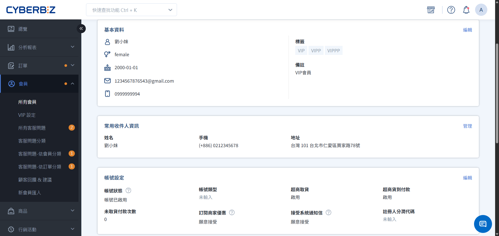

!!! info "擴充自訂資訊"
    - **常用收件人資訊**：查看會員自行新增的常用配送名單。
    - **自訂欄位**：檢視商家[自定義之註冊欄位](../website-management/設定顧客註冊流程與欄位/#步驟-4-建立與管理自訂欄位)，以及會員對應的填答內容。
      > 本功能僅支援 **高手 PLUS 版與企業版** 客戶使用。

## 任務三：消費行為與訂單管理

為了協助商家精準判斷會員價值，系統整合了 **官網與門市即時訂單** 與 **外站手動補入訂單**，提供全面的消費數據彙整。這能確保無論會員在何處消費，其 VIP 等級與權益計算皆能完整延續。

### 1. 官網與門市消費（自動同步）

捲動至 **訂單資訊** 區塊，此區塊自動彙整官網 (EC) 與 POS 門市的有效消費總額，作為評估會員貢獻度的主要依據。

-   **使用情境**：點擊 **訂單編號** 即可查看該筆交易的詳細商品清單與物流狀態。
-   **數據更新**：訂單成立後即時累計至 **官網與門市消費總額**。

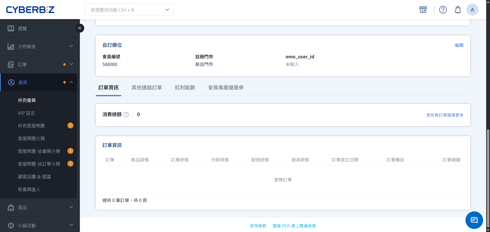

### 2. 其他通路訂單（手動補入）

捲動至 **其他通路累積金額**/**其他通路訂單** 區塊，此區塊旨在整合非系統串接平台（如：市集、私域社群導購）的消費貢獻，將零散的外站數據併入系統，完成會員全生命週期的資產管理。

根據您的版本等級，提供以下兩種管理模式：

=== "一次性補入（專業、進階）"

    -   **適用場景**：一次性補足歷史總額。
    -   **功能特性**：快速錄入總資產，簡化多筆錄入流程。
    -   **操作步驟**：
        1. 捲動至 **其他通路累積金額** 區塊，點擊 **編輯**。
        2. 輸入該會員過往累積的 **總額** 與 **成立時間**。
        3. 點擊 **確認** 完成補入。
    -   **限制**：僅紀錄總金額，無法追溯單筆訂單明細。

    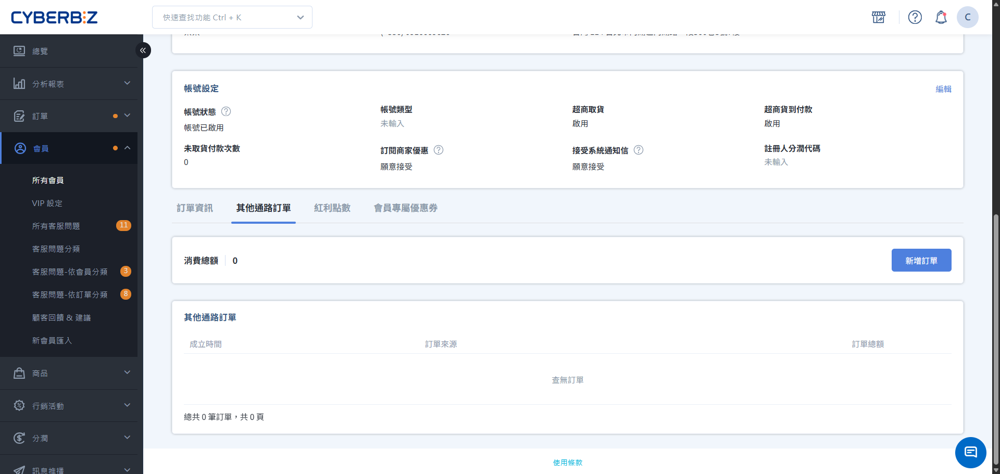

=== "精確明細管理（高手、PLUS、企業）"

    -   **適用場景**：精確紀錄每筆外站訂單來源（如：台北快閃店、LINE 團購）以供對帳。
    -   **功能特性**：可逐筆紀錄特定日期、來源與金額，作為會員等級成長的憑據。
    -   **操作步驟**：
        1. 捲動至 **其他通路訂單** 區塊，點擊 **新增訂單**。
        2. 依序填入 **成立時間**、**訂單來源** 與 **消費總額**。
        3. 點擊 **確認** 產生獨立紀錄。
    -   **限制**：支援編輯或刪除單筆紀錄；但 **訂單來源** 經確認後不可更改。

    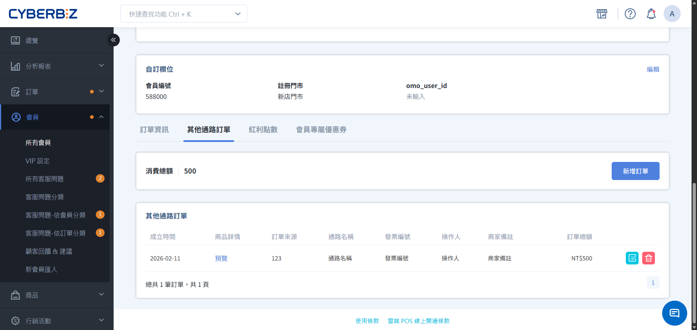

## 任務四：資產配置（點數與優惠券）

### 1. 紅利點數派發與管理

=== "單筆發送或收回"

    #### 發送

    1. 捲動至 **紅利點數** 區塊，點擊 **新增紅利點數**。
    2. 輸入 **點數名稱**（如：客訴補償）與 **點數值**。
    3. 設定 **有效期限**（0 代表永久有效）。
    4. 點擊 **確認** 後點數立即歸戶。

    #### 收回

    1. 捲動至 **紅利點數** 區塊，點擊 :lucide-trash-2:，移除特定筆數的點數紀錄。

    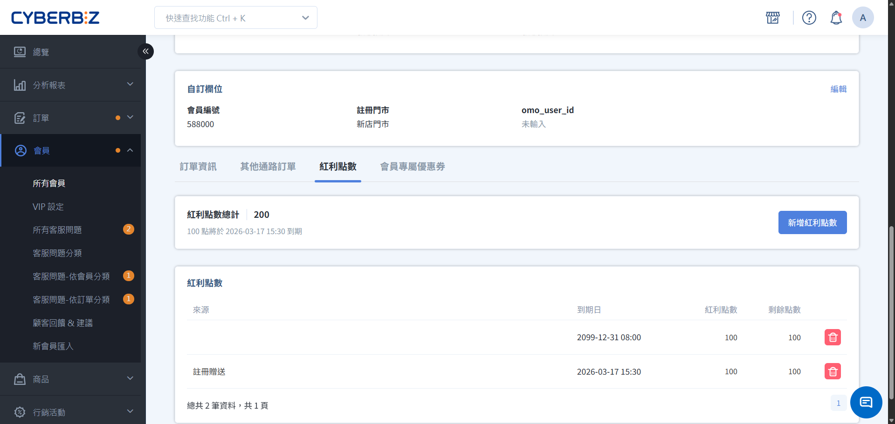

=== "批次發送"

    1. 回到 **會員 > 所有會員**。
    2. 於列表中勾選指定會員(可多選)。
      > 可使用會員篩選器，篩選出符合指定條件的所有會員，一鍵全部勾選。
    3. 於 **更多操作** 選擇 **發送紅利點數**。

    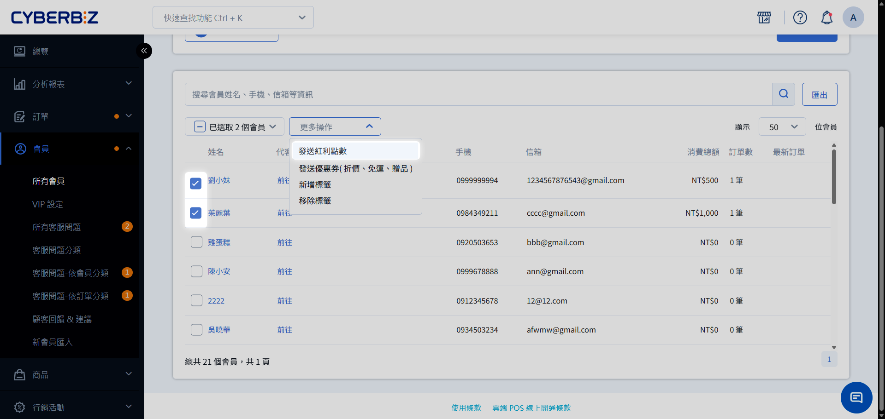

### 2. 優惠券派發與管理

=== "單筆發送或收回"

    #### 發送

    1. 捲動至 **會員專屬優惠券** 區塊，點擊 **新增會員專屬優惠券**。
    2. 輸入 **優惠券名稱**（如：客訴補償），完成後續的發送條件與限制設定。
    3. 點擊 **確認** 後優惠券立即歸戶。

    #### 收回

    1. 捲動至 **會員專屬優惠券** 區塊，點擊 :lucide-trash-2:，移除特定筆數的優惠券紀錄。

    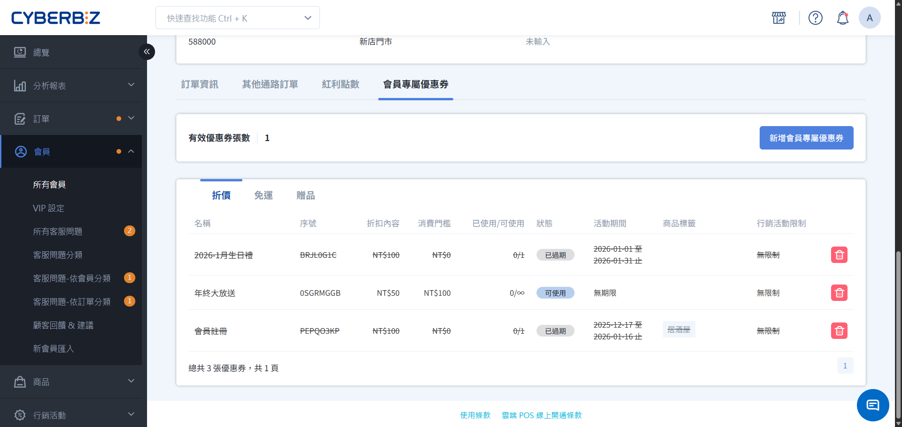

=== "批次發送"

    1. 回到 **會員 > 所有會員**。
    2. 於列表中勾選指定會員(可多選)。
      > 可使用會員篩選器，篩選出符合指定條件的所有會員，一鍵全部勾選。
    3. 於 **更多操作** 選擇 **發送優惠券**。

    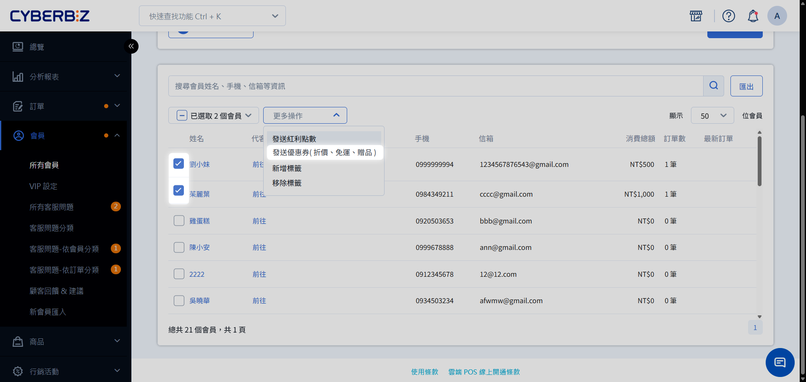

!!! info "版本支援說明"
    優惠券派發與管理功能不適用於專業版、進階版，該版本之後台介面將不顯示此介面。

---

## 任務五：行銷標籤與分眾管理

透過標籤，您可以對個別會員進行更細緻的標記：

=== "單筆新增或移除"

    1. 在會員明細頁找到 **標籤** 欄位。
    2. **新增標籤**：輸入新標籤名稱並按 Enter，或從選單勾選。
    3. **移除標籤**：點擊已存在標籤旁的 `X` 圖示並確認。
        > 當一個標籤不再被任何會員綁定時，系統將自動從標籤清單中移除。
    
    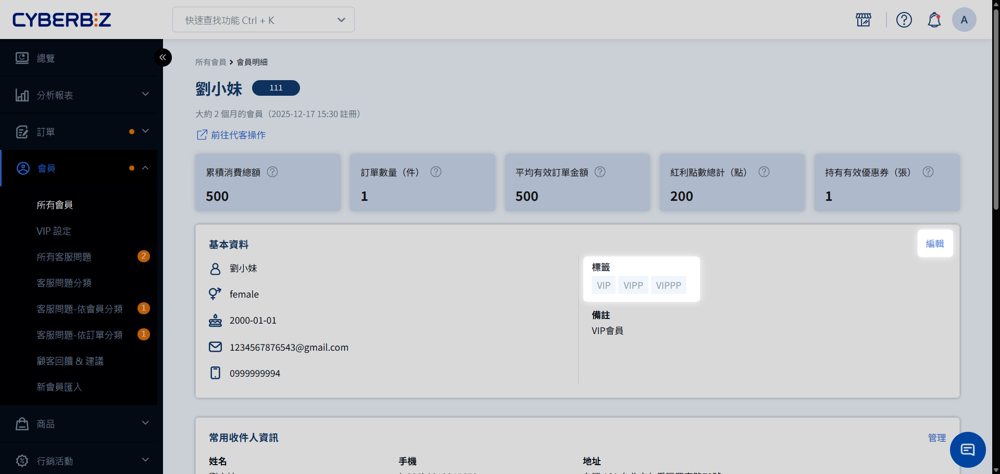

=== "批次新增或移除"

    1. 回到 **會員 > 所有會員**。
    2. 於列表中勾選指定會員(可多選)。
      > 可使用會員篩選器，篩選出符合指定條件的所有會員，一鍵全部勾選。
    3. 於 **更多操作** 選擇 **新增標籤** 或 **刪除標籤**。

    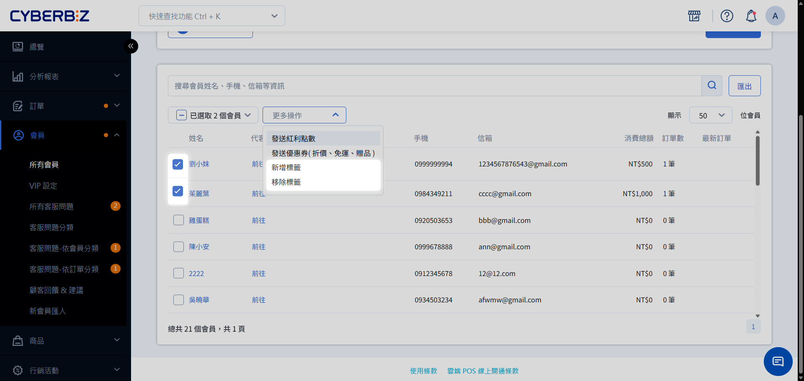

## 任務六：代客下單

適用於協助會員完成訂購，或處理托運單過期需重新下單的情境。

=== "從會員列表頁"

    回到 **會員 > 所有會員**，於會員列表中找到 `代客操作` 欄位，點擊 **前往**。

    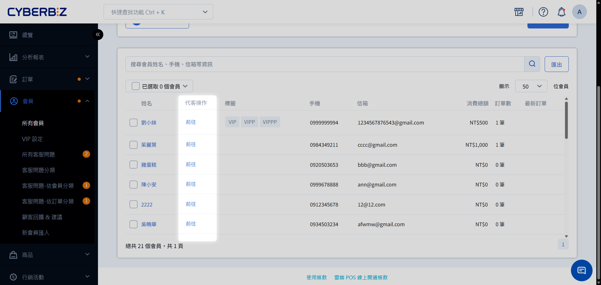

=== "從會員明細頁"

    在會員明細頁右上方點擊 **代客下單** 按鈕。

    

1. 系統將登入該會員的前台介面。
2. 搜尋並將欲購買的商品加入購物車。
3. 點擊 **購物車圖示** 完成結帳。
4. 設定物流方式（如：宅配）與支付資訊。
5. (選填) 填寫管理員備註以供日後追蹤。
6. 可於後台取得 **付款連結**，可發送給會員進行線上付款。

!!! info "版本適用說明"
    代客下單功能不支援專業版使用。

## 任務七：會員忘記密碼

基於資安原則，管理員無法直接查看或修改會員密碼。

- **引導流程**：告知會員前往官網登入頁，點擊 **忘記密碼**，輸入 Email 以接收系統自動發送的重設密碼信。
- **大量匯入帳號**：若為 Excel 匯入且未設定密碼之新帳號，會員首次登入亦須透過 **忘記密碼** 功能完成初始化。

!!! warning "HiNet 信箱郵件收信異常提醒"
    若消費者使用 **HiNet 信箱** 註冊，可能會因電信商阻擋而無法收到忘記密碼信件，建議引導使用其他信箱。

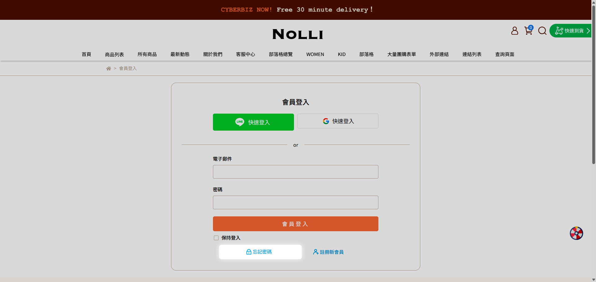

## 常見問題

??? quote "為什麼修改了會員電話，舊訂單的收件資訊沒變？"
    會員資料修改僅影響 **未來** 成立的訂單。對於 **已成立** 的訂單，其收件資訊已固化於訂單記錄中。

??? quote "發送紅利後，會員會收到通知嗎？"
    若商家有開啟 **Email 通知** 或 **簡訊通知** 中的紅利異動樣版，系統將會自動發送通知給會員。

??? quote "代客下單可以使用會員帳戶內的紅利折抵嗎？"
    可以。在後台代客下單的結帳頁面中，管理員可手動勾選並輸入該會員帳戶內剩餘的紅利進行折抵。

