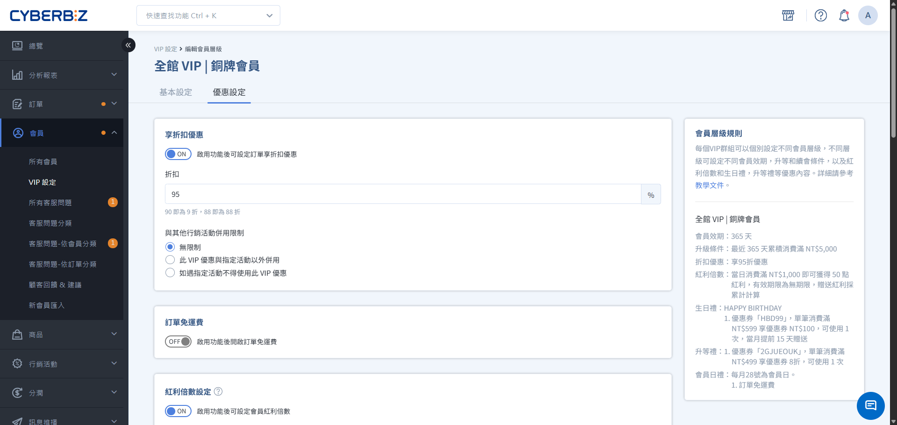

# 設定 VIP 專屬優惠

設定 VIP 會員專屬折扣、紅利獎勵與差異化定價，並掌握與全館行銷活動的併用規則。
{ .subtitle }

[:lucide-tag:{ title="適用方案" }](../../../resources/conventions#適用方案) | 高手 / 專業 PLUS / 進階 PLUS / 高手 PLUS / 企業
{ .doc-badge }

{ .hero-page }

VIP 制度的核心吸引力在於「尊榮感」與「實質回饋」。新版 VIP 系統提供多樣化的優惠組合，協助您設計出讓會員有感的差異化福利。

## 五大基本 VIP 優惠

在 **VIP 設定 > 優惠設定** 中，您可以針對不同層級開啟以下功能：

1.  **享折扣優惠**：設定整筆訂單的折數（如 90 代表 9 折）。
2.  **訂單免運費**：設定該層級專屬的免運門檻，可低於一般會員。
3.  **紅利倍數設定**：設定滿消費門檻贈送額外紅利。
4.  **生日禮設定**：自動發放紅利點數或優惠券作為生日驚喜。
5.  **升等禮設定**：當會員成功晉升至該等級時，自動獲得一次性獎勵。

## 行銷活動併用規則

當 VIP 優惠遇到全館折扣（如：週年慶全館 8 折）時，該如何計算？系統提供三種併用邏輯：

| 併用規則 | 說明 | 適用場景 |
| :--- | :--- | :--- |
| **無限制** | VIP 優惠與指定活動可同時累加使用。 | 最強回饋，適合高毛利商品。 |
| **活動以外併用** | 若商品已符合指定活動，則該商品不享 VIP 優惠；其餘商品仍可享有。 | 避免單一商品折扣過深。 |
| **遇活動不享優惠** | 該筆訂單只要有一個商品符合指定活動，整筆訂單皆不享 VIP 優惠。 | 最嚴格限制，保護毛利。 |

### 可綁定的行銷活動

*   會員專屬價格
*   單品折扣
*   紅配綠多組合優惠(組合優惠折扣)
*   任選折扣
*   商品多層級分類折扣(商品進階分類折扣)
*   全館折扣

## 優惠設定細則

### 紅利倍數設定

*   **疊加贈送：** 若您同時設定了「全館紅利贈送」與「VIP 額外紅利」，會員下單時會 **同時獲得兩者**。請務必精算發放成本。

### 生日禮設定

*   **疊加贈送：** 若您於 **行銷活動 > 全館折扣-紅利&優惠券** 設定全館會員生日禮，消費者下單後，將 **同時獲得兩者**，請謹慎規劃生日禮發放政策。
*   **提前發送：** 當您設定 **提前 N 天發送生日禮**，發送時依會員當下等級判斷是否發送。 若發送時間點早於會員升等日期，該會員將無法收到升等後等級的生日禮。您可依商店的 VIP 政策，手動補送生日禮給會員。

    !!! example "情境舉例"
        顧客Ａ的生日在 5 月，並於 4/27 升等到 VIP1。
        系統設定每月提前 5 天發送該月生日禮，則 VIP1 5 月生日禮的發送時間點為 4/26。
        系統已於 4/26 發送當月生日禮，當時顧客 A 尚未升等，因此無法收到 VIP1 對應的生日禮。

### 會員日設定

*   **有效日期限制**：若設定的會員日不在該月的有效日期範圍內，該月份將不會啟用會員日功能。

    > 若您將每月 30 日設為會員日，2 月因日期最長至 29 日（或 28 日），當月將不會自動套用會員日活動。

*   **支援類型**：訂單折扣、訂單免運、紅利、優惠券
*   **排除其他VIP優惠**：會員日當天，其他 VIP 優惠不列入計算。

    - 若開啟會員日 **訂單折扣**，則會員日當天優惠設定 **享折扣優惠** 不會生效。
    - 若開啟會員日 **訂單免運費**，則會員日當天優惠設定 **訂單免運費** 不會生效。
    - 若開啟會員日 **紅利**，則會員日當天優惠設定 **紅利倍數設定** 不會生效。

!!! info "**單月多個會員日功能** 適用版本"
    此功能為 **企業版** 專屬，您可勾選多個日期，會員便能於該月每個指定日期獲得會員禮。

### 升等禮設定

*   **發送數量：** 會員效期內各層級的升等禮僅限贈送一次。
*   **新舊版本切換：** 從舊版 VIP 套用到新版 VIP 版本，不會觸發送出升等禮。