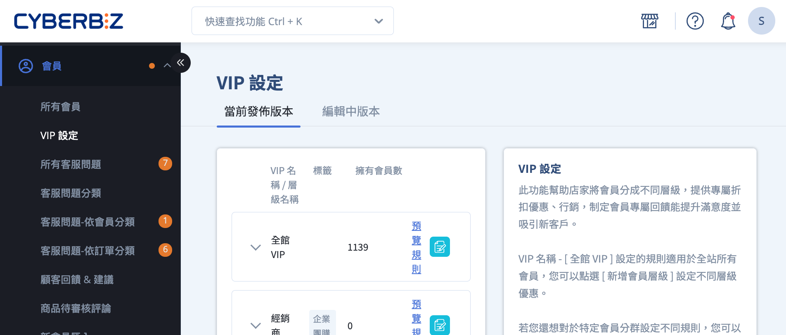

# 設定 VIP 群組

{ .hero-page }

## VIP 群組說明

在 CYBERBIZ 系統中，**VIP 制度** 是用於區分顧客貢獻度並提供差異化獎勵的核心工具，其結構主要由「VIP 群組」與「VIP 會員層級」組成。以下為各項概念的詳細說明：

### VIP 群組

「群組」是 VIP 制度的頂層分類邏輯，主要分為兩大類：

• **全館 VIP (All-Store VIP)：** 適用於商店內所有註冊會員的通用規則。

• **VIP 群組 (特定標籤群組)：** 商家可以建立 **綁定特定「會員標籤」** 的群組，讓特定受眾適用不同於全館的規則。

• **排序與篩選：** 系統會依照後台的 **排序順序由下往上** 進行篩選。建議將條件最嚴苛的群組排在列表最下方，確保高價值會員能優先匹配到正確的群組。

### VIP 會員層級

在每一個群組之下，商家可以劃分多個層級（例如：銀卡、金卡、鑽石卡），每個層級包含以下關鍵設定：

• **層級名稱與會員卡：** 商家可自訂層級名稱，並上傳該層級專屬的**會員卡圖片**，顯示於前台會員中心。

• **升等條件 (Upgrade Conditions)：** 此為**必填項目**。會員可透過「**單筆消費金額**」或「**效期內累積消費總額**」達到指定門檻後升等。系統會計算優於消費者的結果進行升級。

• **會員效期 (Membership Period)：** 系統會從符合升等條件的有效訂單成立當下開始計算（如 365 天），升等當下即刻生效。

• **續會條件 (Renewal Conditions)：** 為選填項目。在效期結束後的隔日凌晨 00:00，系統會檢查會員在效期內的消費是否達成門檻，以決定其是否能維持原等級。

• **降等邏輯：** 若原先符合升等的訂單因取消或退貨變成「無效訂單」，系統會回推最後一筆有效訂單重新計算等級，會員可能因此降等。

### VIP 會員的專屬權益

成為 VIP 會員後，系統會依據其層級自動給予多元獎勵：

• **享折扣與免運：** 可設定整筆訂單的**折扣比例**（如 9 折）或**免運費門檻**。這些優惠可進階設定是否與「會員專屬價格」、「單品折扣」等行銷活動併用。

• **紅利倍數：** 根據消費門檻贈送額外紅利點數。

• **各式禮品：** 系統可自動發送紅利或**複數張優惠券**作為「**生日禮**」、「**升等禮**」或「**會員日獎勵**」。

• **會員專屬價格：** 商家可以為特定商品設定只有該 VIP 等級看得到的「專屬價」，甚至能設定在未登入時顯示標籤提示，引導顧客登入以查看優惠。

### 系統運作與計算時機

• **計算時間點：** 當有效訂單成立、無效訂單產生、其他通路訂單異動、或**會員被加減標籤**時，系統都會重新計算會員的 VIP 等級。

• **生效延遲：** 基於維護消費者權益，發佈新的 VIP 規則後通常需要 **2 天**的緩衝期（生效日為當天 01:00）才會正式生效。

• **排除機制：** 若特定商品不希望參與 VIP 折扣，可將其加入「**不適用 VIP 優惠**」的商品群組中。

## 

!!! quote "名詞解釋"
	- VIP 會員層級
	- VIP 群組

## 後續步驟

- :lucide-badge-dollar-sign:{ .lg }   
  [__VIP 會員專屬價格__](../products/設定 VIP 會員專屬價格.md){ data-preview }       
  匯入編輯過的商品 Excel 檔案，同步更新多筆商品的商品描述與配送相關設定。

- :lucide-ban:{ .lg }     
  [__物流限制與排除選項__](設定超商配送限制與物流排除.md)  
  設定商品的配送物流條件，限制特定物流方式於結帳流程中的顯示與使用。

