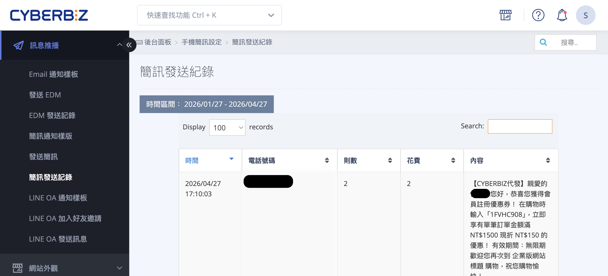
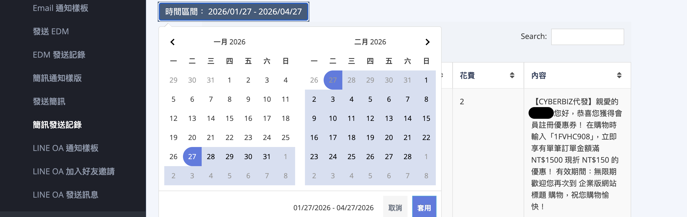
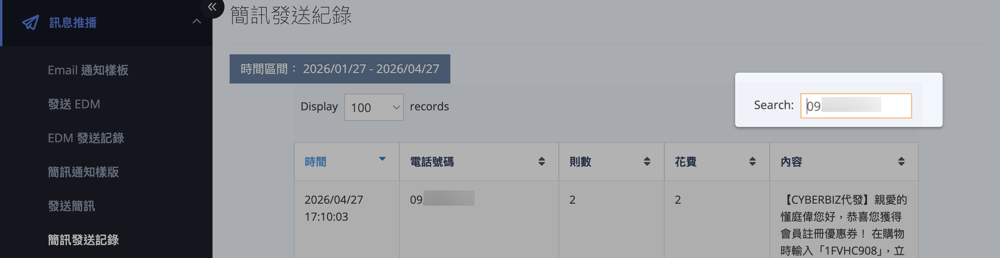
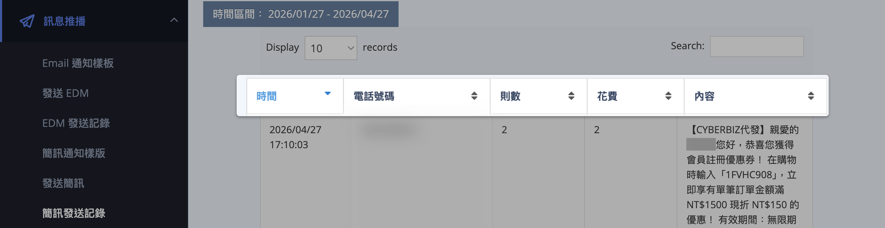

在 CYBERBIZ 後台查詢與追蹤簡訊發送紀錄，包含日期範圍篩選、關鍵字搜尋與欄位說明。
{ .subtitle }

{ .hero-page }

## 簡訊發送紀錄說明

簡訊（SMS）發送紀錄頁面可查詢店鋪的簡訊發送歷史，包含發送時間、收件手機、訊息內容與費用。

## 進入查詢介面

登入 CYBERBIZ 管理後台，前往「訊息推播」 > 「簡訊發送紀錄」。

## 篩選與搜尋

### 日期範圍

- 預設顯示近 90 天的紀錄
- 點擊日期欄位可自訂查詢區間                                     
                             

---

### 關鍵字搜尋                                                       

搜尋框支援兩種查詢方式：                                         

| 查詢方式 | 輸入範例 | 說明 |
| :--- | :--- | :--- |
| 訊息內容 | 訂單已出貨 | 輸入訊息開頭的文字 |
| 手機號碼 | 0912345678 | 須輸入完整號碼 |

!!! warning "注意事項"                                                           
    - 手機號碼必須輸入完整，輸入部分號碼將查無結果
    - 訊息內容僅比對開頭文字，例如輸入「訂單」可找到「訂單已出貨」，但找不到「您的訂單」                                         
                                                                   
## 欄位說明        

| 欄位 | 說明 |
| :--- | :--- |
| 建立時間 | 簡訊發送的時間 |
| 手機號碼 | 收件人手機號碼 |
| 發送次數 | 該筆簡訊的發送次數 |
| 費用 | 該次發送扣除的 CYBER 幣數量 |
| 訊息內容 | 實際發送的簡訊文字 |

                 

!!! warning "注意事項"
    單次查詢最多顯示 10,000 筆紀錄；若需查詢大量資料，建議縮小日期範圍分段查詢    

## 後續操作

- :lucide-message-square-plus:{ .lg }  
  [__設定與發送簡訊__](設定與發送簡訊通知.md){ data-preview }  
  了解簡訊發送的三種方法（顧客群組、手動、匯入 Excel）與費用計費標準。

- :lucide-message-square-text:{ .lg }  
  [__簡訊通知樣板管理__](設定與管理簡訊通知樣板.md){ data-preview }  
  自訂系統在特定情境下自動發送的簡訊內容。

## 常見問題

??? quote "為什麼我輸入會員手機號碼後搜不到紀錄？"

    請確認您輸入的是否為 **10 碼完整號碼**。系統目前不支援模糊查詢（例如只輸入末四碼），且號碼中不可包含空白或連字號 `-`。

??? quote "發送失敗會退回 CYBER 幣嗎？"

    簡訊發送若因「號碼錯誤」或「電信商端問題」導致失敗，通常仍會產生發送成本。詳細扣費規範請參閱 [簡訊發送規範與計費](設定與發送簡訊通知.md#簡訊發送規範與計費){ data-preview }。

??? quote "可以查詢多久以前的發送紀錄？"

    預設顯示近 **90 天** 的紀錄。若需查詢更早期的資料，可於 [日期範圍](#日期範圍){ data-preview } 自訂查詢區間。

