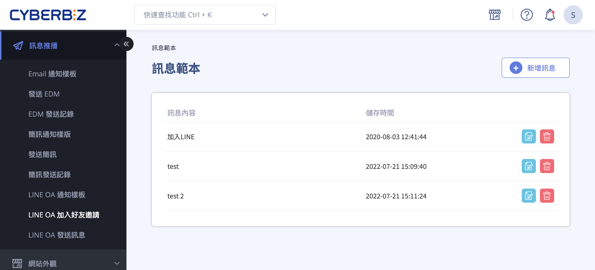

# 發送 LINE 加入好友邀請

透過簡訊或 Email 向未綁定會員發送 LINE 官方帳號加入好友邀請，以提升好友數並促進會員綁定與行銷轉換。
{ .subtitle }

[:lucide-tag:{ title="適用方案" }](../../resources/conventions#適用方案) | 企業
{ .doc-badge }

{ .hero-page }

## LINE 加入好友邀請說明

**LINE 加入好友邀請** 功能讓商家可以主動出擊，透過 **簡訊** 或 **Email** 向未綁定 LINE 官方帳號的會員發送好友邀請，引導會員加入好友並完成帳號綁定，以提升好友數與會員互動率。

以下為詳細的操作說明與教學：

## 功能前提與適用範圍

- **適用版本：** 此功能主要提供給 **企業版** 客戶使用。

- **目標受眾：** 系統會自動篩選出「尚未綁定 LINE OA」的會員作為發送對象。

	- **簡訊邀請：** 發送給有填寫手機欄位且尚未綁定 LINE OA 的會員。

	- **Email 邀請：** 發送給有填寫 Email 且尚未綁定 LINE OA 的會員。

## 步驟一：取得 LINE 官方帳號加入好友連結 {#get-line-oa-add-friend-link}

在設定推播訊息前，需先至 LINE 官方帳號管理後台取得專屬網址：

1. 登入 [**LINE Official Account Manager** :lucide-external-link:](https://manager.line.biz/)。

2. 選擇您的帳號，點選左側選單的 **主頁 > 增加好友人數 > 增加好友工具**。

3. 點選 **建立網址** 進入設定頁面，點擊 **複製** 即可獲得加入好友的連結。

## 步驟二：於 CYBERBIZ 後台新增推播訊息

1. 進入 CYBERBIZ 管理後台，前往 **訊息推播 > LINE OA 加入好友邀請**。

2. 點選 **新增訊息**。

3. 在編輯頁面設定以下內容：

	- **填寫訊息範本：** 撰寫吸引會員加入的文字內容，並貼上剛才複製的 LINE 好友連結。

	- **選擇發送方式：** 勾選【簡訊】或【E-mail】（可複選）。

4. 設定完成後按下 **儲存**。

## 步驟三：確認與傳送

1. **檢查字數（簡訊）：** 簡訊範本右下角會顯示字數統計。國內簡訊每封上限為 **70 個字**（含空白、換行、標點與連結），若超過字數將會拆分為多封寄送，並依封數扣除 **CYBER 幣**。
> :lucide-flame: 若 LINE 好友邀請網址過長導致簡訊字數超過上限，商家可以使用第三方縮網址工具處理後再貼入範本。

2. **立即傳送：** 點選「立即傳送」後，系統會跳出二次確認視窗，確認後即可發出邀請。

!!! warning "注意事項"

	- **確認帳號正確：** 發送前請務必確認邀請連結對應的是正確的 LINE OA，以免發送錯誤的好友邀請。

	- **預防簡訊阻擋：** 編輯簡訊內容時，應避免使用電信商容易攔截的關鍵字（如：股票、績優、加賴、領取等），以免發送失敗但仍被計費。

## 會員端畫面呈現

=== "簡訊"

	
	
=== "Email"

	
	
## 後續步驟

建議搭配 **LINE 綁定會員送優惠券** 功能，在邀請訊息中提及「加入好友並綁定即可領取優惠」，能有效提高轉化率。

- :lucide-gift:{ .lg }   
  [__LINE 綁定送優惠券__](../integrations/line/設定 LINE 綁定會員贈送優惠券.md){ data-preview }  
  啟用「綁定即送券」功能，利用即時獎勵誘發顧客完成 LINE OA 與官網帳號的雙向綁定。

## 常見問題

??? quote "發送好友邀請後，系統如何判定會員「已成功綁定」" 
	系統會即時比對官網會員資料庫與 LINE UID 的連動狀態。若會員點擊連結並完成 LINE 授權、成功與官網帳號連動後，該會員將從「待邀請名單」中移除，避免重複收到邀請訊息。

??? quote "簡訊發送失敗會退回 CYBER 幣嗎" 

	- **發送成功：** 正常扣除 CYBER 幣。 
	- **發送失敗：** 若因電信黑名單、號碼錯誤或格式不符導致發送失敗，系統通常不會扣費，但若因包含「敏感關鍵字」遭電信商中途攔截，則視同已執行發送，不予退還。建議發送前先進行小規模測試。

??? quote "為什麼我貼上的 LINE 連結在簡訊中無法點擊" 
	部分手機系統（如 iOS 或 Android 特定版本）會為了安全防護，將未加上通訊協定的文字視為一般純文字。請確保您的網址開頭包含 `https://`（例如：`https://line.me/R/ti/p/@yourid`）。

??? quote "使用「縮網址」會影響加入好友的轉換追蹤嗎？" 
	不會。LINE 的好友連結主要依靠網址內的 ID 進行轉跳。使用縮網址（如 bit.ly 或 lihi）不僅能節省簡訊字數，還能額外提供點擊數據統計。