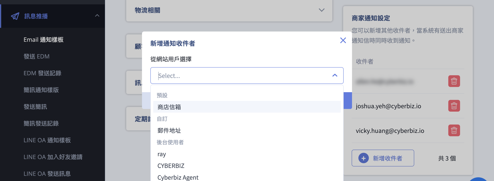

# 管理與自定義 Email 通知樣板

{ .subtitle }

[:lucide-toggle-right:{ title="適用功能" }](../../resources/conventions#適用功能) | 多國語系
{ .doc-badge }

{ .hero-page }

## Email 通知樣板說明

**Email 通知樣板管理** 功能讓商家可以自訂發送給顧客或管理者的自動化信件內容，並根據營運需求開啟或關閉特定情境的通知。

## 進入路徑與介面介紹

- **後台路徑**：前往 **訊息推播 > Email 通知樣板**。

- **樣板分類**：系統將信件分為以下幾大類別，方便商家管理：

	- **訂單相關**：如訂單確認信、付款成功通知。

	- **物流相關**：如貨物發送提醒、到店提醒。

	- **顧客相關**：如帳號啟用通知、密碼更改通知、生日禮通知。

	- **退貨相關**：如退貨申請成立通知。

	- **定期訂單相關**：針對定期購訂單的成單或跳過通知。

!!! info "實際可操作的信件分類與樣板會因 方案 或 功能設定 而異。"

## 修改信件內容步驟

1. **進入編輯頁面**：在列表中點擊想要修改的 **Email 標題**。

2. **內容編輯**：

	- 商家可以自由修改信件的主旨與內文，支援  **HTML 樣板** 或 **純文字** 格式。

	- **重要參數限制**：內文中含有 **{{ }}** 的標籤（如 `{{shop_name}}`、`{{order_number}}`）為系統變數，會自動代入實際資料，**請勿隨意更動或修改其拼法**，否則可能導致信件無法正常發送。

	- **符號限制**：編輯時請勿使用 **emoji 表情符號** 或其他特殊符號，以免顯示異常。

3. **預覽與儲存**：編輯完成後，可使用「**預覽**」按鈕查看實際呈現畫面，確認無誤後點擊「**儲存**」即可生效。

## 核心功能設定

- **功能開關**：每個樣板右側皆有 **ON/OFF** 開關，商家可自行決定是否啟用該項通知。

- **短網址功能切換**：點擊「短網址功能」選項來啟用或停用此功能。**啟用後**，系統會自動將 Email 內文中的原始長連結轉換為縮減後的短網址，藉此減少郵件總字數並優化排版美觀。

	

---

### 商家通知設定

本功能允許商家在特定觸發點（如訂單成立、付款成功）時，將系統通知同步發送給內部的相關人員或協力廠商。

#### 管理權限與主信箱

- **系統預設收件者（主信箱）**：系統預設會發送通知至網站管理者的主信箱。
    
- **修改路徑**：若需更換主信箱，請至 **管理中心 > 一般設定** [進行變更](../website-management/設定網站基本資訊.md#關於您的網站)。
    
#### 通知收件者類型

點擊 **新增收件者** 後，可透過以下三種方式指定通知對象：

|**類型**|**說明**|**設定規範**|
|---|---|---|
|**商店信箱**|系統預設值。|引用「一般設定」中所填寫的主信箱。|
|**自訂**|手動輸入外部人員的信箱。|填入多個信箱時，請務必使用 **半形逗號 (`,`)** 分隔。|
|**後台使用者**|從現有的後台管理帳號選取。|直接從選單中選取已建立的帳號名稱。|

- **商家通知設定**：

	- 除了通知顧客，部分樣板可設定通知商家人員（如：訂單成立時通知倉庫或員工）。

	- 網站管理者的主信箱可在 **管理中心 > 一般設定** 中修改。

	

系統的通知對象主要分為兩類：

• **網站管理者主信箱：** 這是系統預設的最主要接收者。若要修改此主信箱，請至「**管理中心**」→「**一般設定**」（或稱網站功能設定）中找到「**郵箱**」或「**一般設置**」→「**郵箱**」進行變更。,,,

• **額外通知收件者（商家通知設定）：** 若希望其他員工、倉庫人員或協力廠商也能同時收到通知，請在「商家通知設定」欄位中填入其 Email。,

點擊 **新增收件者**，可從網站用戶選單中選取清單。

三類：
預設：商店信箱
自訂：：自行輸入收件者的電子郵件地址，若需填入多個 Email，請務必使用 **半型逗號 (,)** 分隔（例如：`mail1@example.com,mail2@example.com`）。,,,

後台使用者：

**三、 常見應用情境與通知類型**

商家通知設定會套用到多種自動化情境：

• **訂單通知：** 當有新訂單成立或消費者申請退貨時，系統會發信至設定的信箱。,,,

• **庫存安全水位提醒：** 當商品庫存低於設定的安全水位時，系統僅會發送通知給「商家通知設定」中填寫的 Email。,

• **資料匯入提醒：** 執行 Excel 大量匯入商品或會員資料時，系統會將匯入結果（成功或失敗）寄送至商家通知信箱。,,,

• **帳務通知：** 有關對帳與金流扣款的相關資訊，亦會參考此處或「公司聯絡資訊」中的信箱設定。,,,

## 多國語系設定（選配功能）

若您的網站有開啟多國語系，Email 樣板需針對不同語言個別設定：

1. 進入編輯頁面後，點選 **🌐 語言圖示** 切換至欲編輯的語系（如英文）。

2. 各語系需個別儲存，若該語系欄位留空，系統通常會自動顯示繁體中文的內容。

## 常見問題排解

- **信件被歸類為垃圾郵件**：若商家或顧客未收到信，建議檢查 Gmail 的垃圾信箱。商家可於 Gmail 設定「篩選器」，將 `support@cyberbiz.io`、`noreply@cyberbiz.co` 等官方信箱設為「永不移至垃圾桶」。

- **發送時機**：

    - **物流通知**：系統會在訂單配送狀態更新為「**已出貨(配送中)**」時，才正式發送 Email 通知給會員，以確保包裹已確實寄出。

    - **未付款提醒**：可設定在顧客下單後 N 天自動發送，若顧客在期間內完成付款，系統將停止發送後續提醒。

- **Hinet 信箱限制**：使用 Hinet 信箱註冊的會員較容易發生漏信或阻擋密碼重設信的情況，建議引導顧客使用其他信箱。

## 後續操作

- :lucide-import:{ .lg }   
  [____]()     
  。

- :lucide-ban:{ .lg }     
  [____]()  
  。

## 常見問題

??? quote "「貨物發送資訊更改提醒」這個 email 通知在什麼情況下會觸發？修改訂單的配送地址資訊會觸發嗎"
	修改訂單的配送地址並不會觸發此通知信件喔。而是當訂單的「配送狀態」為「已出貨」、「已到店」、「已取貨」、或是「超商閉店」的時候才會發送此通知信件給消費者。

??? quote "「訂單取消提醒(管理者)」開啟後會通知「未付款自動取消」的訂單嗎"
	不會，只有顧客取消的訂單才會通知管理員。