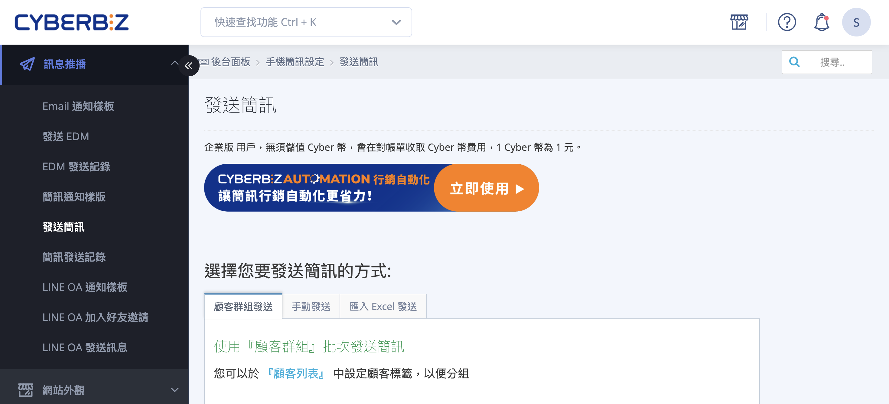
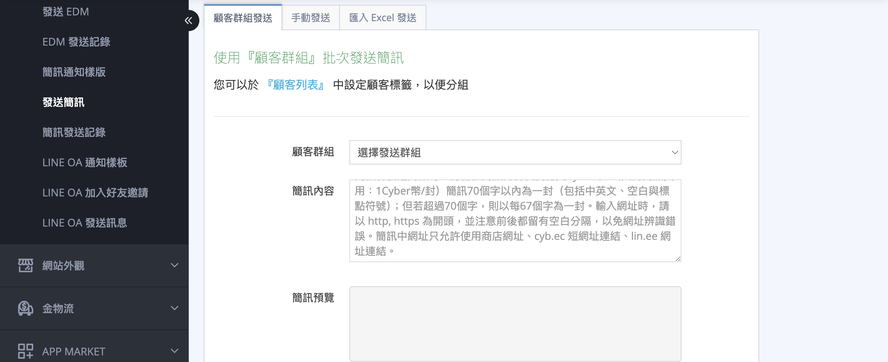
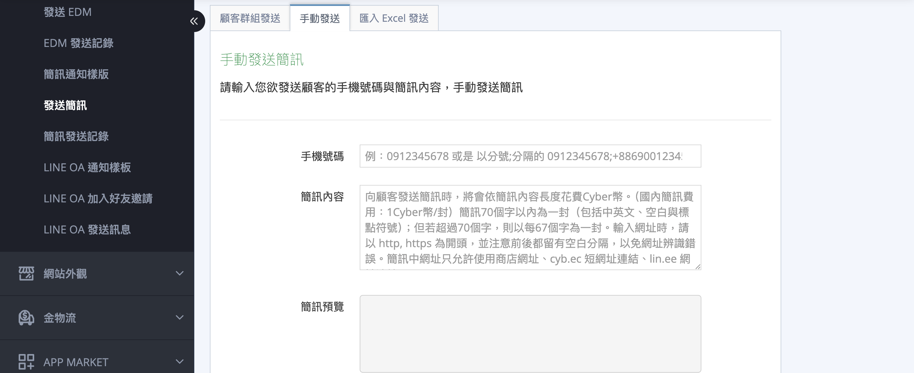
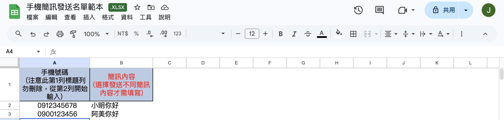
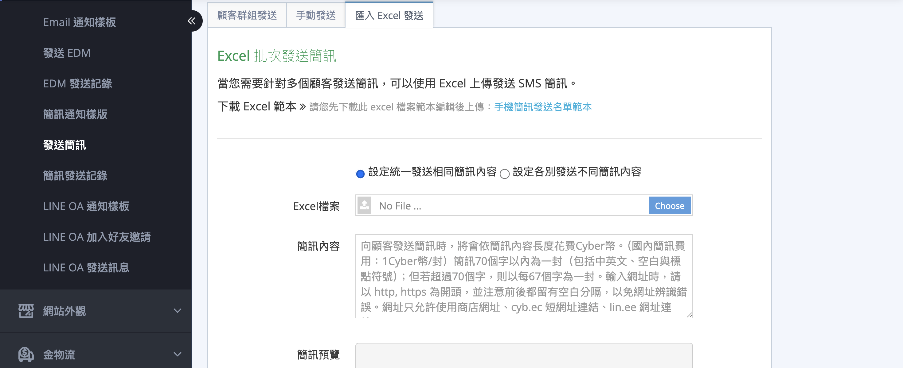
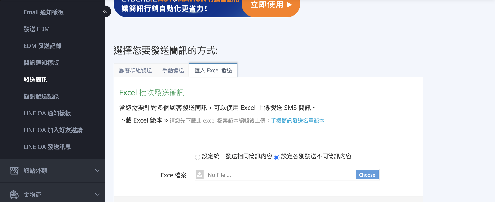

如何在 CYBERBIZ 後台設定與發送簡訊，包含發送方式、費用計算與操作步驟。
{ .subtitle }

{ .hero-page }

## 簡訊通知說明

在 CYBERBIZ 系統中，簡訊功能可用於主動向會員發送行銷訊息、訂單通知或邀请加入 LINE 官方帳號。

## 簡訊發送規範與計費

為了確保簡訊順利遞送並精確計算行銷預算，請在發送前詳閱以下規範。

### 費用與字數計算標準

系統依據簡訊長度與發送地區進行扣費。請注意，超過字數上限將自動拆分為多封發送，並按封數重複扣費。

| 發送地區 | 費用 (每封) | 單封字數上限 | 備註 |
| :--- | :--- | :--- | :--- |
| **國內簡訊** | 1 CYBER 幣 | 70 字 | **70 字以內** 計為一封；超過 70 字後，每 **67 字** 計為一封。 |
| **海外簡訊** | 5 CYBER 幣 | 70 字 | 同上（需開啟海外發送功能）。需預先開啟 [海外發送功能](設定與管理簡訊通知樣板.md#進入路徑與介面概觀){ data-preview } |

!!! warning "NCC 規範：自動添加前綴標籤"
    因應 NCC 規範，系統發送時會於簡訊開頭自動加上 「商家名稱」 或 「【CYBERBIZ代發】」：

    * 字數計入：此段標籤文字會列入簡訊總字數計算。
    * 控制建議：若您希望簡訊維持在 1 封（70 字）內，請務必將此標籤長度納入考量。若內容加上標籤後超過 70 字，系統將自動拆分為多封寄送並依封數計費。

---

### 網址使用規範

為了確保簡訊中的網址能被正確辨識並順利跳轉，請遵守以下格式要求：

- **格式要求**：網址必須以 http:// 或 https:// 開頭。
- **空白分隔**：網址前後皆須留有一個半形空白，以避免與前後文字黏連導致辨識錯誤。
- **允許域名**：為維持資安與簡訊抵達率，簡訊內僅允許使用以下網址：
    - 商店官方網址
    - cyb.ec 短網址連結
    - lin.ee LINE 官方連結

---

### 關鍵字與攔截限制

!!! warning "重要"
    請避開「LINE」、「加賴」、「領取」、「股票」、「點擊連結」等高敏感字眼。若因包含敏感字眼或網址格式錯誤遭電信商攔截，系統仍將照常扣除 CYBER 幣。

## 發送簡訊的三種方法

!!! info "開始之前"
    - **一般版** 用戶使用前請先 [儲值 CYBER 幣](../website-management/CYBER 幣儲值中心使用指南.md#如何儲值-cyber-幣){ data-preview }。
    - **PLUS / 企業版用戶** 不須額外儲值 CYBER 幣即可使用。

商家可依據需求，登入 CYBERBIZ 管理後台後，前往 **訊息推播 > 發送簡訊**，選擇合適的發送方式：

- :lucide-users:{ .ig }
  [__顧客群組發送__](#顧客群組發送){ data-preview }
- :lucide-pencil:{ .ig }
  [__手動發送__](#手動發送){ data-preview }
- :lucide-file-spreadsheet:{ .ig }
  [__匯入 Excel 發送__](#匯入-excel-發送){ data-preview }

### 顧客群組發送

用顧客群組，依顧客標籤篩選會員並統一發送相同簡訊，適合 VIP 優惠、活動通知等批次發送情境。   

1. **進入介面**：前往 訊息推播 > 發送簡訊，並選擇 「顧客群組發送」 頁籤。
2. **篩選受眾**：於「顧客群組」下拉選單中，選擇欲發送的 「顧客標籤」。
3. **撰寫內容**：在「簡訊內容」欄位輸入訊息文字，並注意右側的字數統計。
4. **預覽確認**：點擊 「預覽」，於右側核對簡訊呈現方式與自動添加的商家名稱。
5. **正式發送**：確認無誤後點擊 「發送」，並於彈窗按下 「確定」。

!!! warning "發送範圍限制"
    透過「顧客標籤」進行訊息發送，發送對象僅限「官網會員」(顧客/會員列表中的顧客，且不論是否已開通皆可發送)。

---

### 手動發送

直接輸入官網會員的手機號碼與簡訊內容，適用於單筆或少量的臨時通知。

1. **進入介面**：前往 訊息推播 > 發送簡訊，並點選 「手動發送」 頁籤。
2. **輸入號碼**：在「手機號碼」欄位輸入接收者號碼，支援國內外格式：
    - 單筆：直接輸入 10 碼數字（如 0912345678）。
    - 多筆：號碼之間請以 「分號 ( ; )」 分隔。
    - 國際：支援國際格式（如 +886900123456）。
3. **撰寫內容**：在「簡訊內容」欄位輸入訊息文字。
4. **預覽確認**：點擊 「預覽」，於右側「簡訊預覽」區域核對文字內容與排版。
5. **正式發送**：確認無誤後點擊 「發送」，並於確認視窗按下 「確定」。

---

### 匯入 Excel 發送

透過上傳 Excel 名單批次發送簡訊，支援兩種發送模式：

| 模式 | 說明 | 需填欄位 |
| :--- | :--- | :--- |
| 設定統一發送相同簡訊內容 | 所有收件人收到同一則訊息，簡訊內容於頁面上填寫 | A 欄：手機號碼 |
| 設定各別發送不同簡訊內容 | 每位收件人收到個別化訊息，簡訊內容填入 Excel | A 欄：手機號碼、B 欄：簡訊內容 |

??? example "手機簡訊發送名單範本"

    

=== "相同內容"

    所有收件人收到同一則訊息，簡訊內容於頁面上填寫。                 

    1. **準備名單**：前往 訊息推播 > 發送簡訊 > 匯入 Excel 發送，下載並在範本 A 欄填入「手機號碼」。
    2. **選取模式**：選擇「設定統一發送相同簡訊內容」並上傳填妥的 Excel 檔案。
    3. **撰寫內容**：在「簡訊內容」欄位輸入訊息文字。
    4. **預覽確認**：點擊「預覽」，核對「簡訊預覽」中顯示的號碼數量與文字內容。
    5. **正式發送**：確認無誤後點擊「發送」並於彈窗按下「確定」。

    

=== "不同內容"

    每位收件人收到個別化訊息，簡訊內容直接填入 Excel。

    1. **準備名單**：前往 訊息推播 > 發送簡訊 > 匯入 Excel 發送，下載並填寫範本：
        - A 欄「手機號碼」：填入收件人號碼。
        - B 欄「簡訊內容」：填入該對象對應的完整訊息。
    2. **選取模式**：選擇「設定各別發送不同簡訊內容」並上傳填妥的檔案。
    3. **核對資料**：系統將自動解析檔案，請確認畫面中的「手機號碼」與「內容」是否一一對應。
    4. **正式發送**：點擊「發送」並於確認彈窗按下「確定」。

    !!! warning "注意： 若 B 欄內容留空，該筆紀錄將導致發送失敗或系統報錯。"

    

## 簡訊通知樣板管理

- :lucide-message-square-text:{ .lg }  
  [__簡訊通知樣板管理__](設定與管理簡訊通知樣板.md){ data-preview }  
  商家可自訂系統在特定情境下（如訂單成立、出貨、密碼變更）自動發送的簡訊內容，並開啟短網址功能節省字數。

## 自動化簡訊發送 (CYBERBIZ AUTOMATION)

- :lucide-zap:{ .lg }  
  [__自動化簡訊發送__](../app-market/automation/使用%20AUTOMATION%20建立自動化推播流程.md#簡訊發送設定){ data-preview }  
  企業版與 PLUS 版商家可利用 CYBERBIZ AUTOMATION 建立自動化簡訊流程，設定一次性或週期性發送。

## 應用情境範例

1.  **LINE OA 加入好友邀請**：透過後台「LINE OA 加入好友邀請」功能，向尚未綁定 LINE OA 的會員發送帶有好友連結的簡訊。
2.  **訂單未付款提醒**：可開啟「顧客訂單未付款通知」，系統會依設定的間隔天數發送 3 次簡訊提醒顧客付款。
3.  **發票開立通知**：若商店註冊採手機必填，可開啟樣板發送電子發票資訊簡訊給顧客。
4.  **門市助理推薦**：總部管理者可編輯「商品推薦通知」簡訊，由門市人員發送給顧客。

## 後續操作

- :lucide-message-square-text:{ .lg }  
  [__簡訊通知樣板管理__](設定與管理簡訊通知樣板.md){ data-preview }  
  商家可自訂系統在特定情境下（如訂單成立、出貨、密碼變更）自動發送的簡訊內容，並開啟短網址功能節省字數。

- :lucide-zap:{ .lg }  
  [__自動化簡訊發送__](../app-market/automation/使用%20AUTOMATION%20建立自動化推播流程.md#簡訊發送設定){ data-preview }  
  企業版與 PLUS 版商家可利用 CYBERBIZ AUTOMATION 建立自動化簡訊流程，設定一次性或週期性發送。

- :lucide-history:{ .lg }  
  [__查詢簡訊發送紀錄__](查詢與追蹤簡訊發送紀錄.md){ data-preview }  
  可查詢店鋪的簡訊發送歷史，包含發送時間、收件手機、訊息內容與費用。

## 常見問題

??? quote "如何發送簡訊？"

    您可以透過三種方式發送簡訊：

    1. **顧客群組發送**：利用顧客標籤篩選會員後統一發送
    2. **手動發送**：直接輸入手機號碼發送
    3. **匯入 Excel 發送**：上傳 Excel 檔案批量發送

??? quote "簡訊如何收費？"

    - **國內簡訊**：每封扣除 1 CYBER 幣（1 元）
    - **海外簡訊**：每封扣除 5 CYBER 幣
    - PLUS / 企業版 用戶不須額外儲值即可使用
    - 超過 70 字會拆分為多封並加倍扣費

??? quote "簡訊發送失敗會退回 CYBER 幣嗎？"

    若因「號碼錯誤」或「電信商端問題」導致發送失敗，通常仍會產生發送成本並扣除 Cyber 幣。為避免失敗，請確保：

    - 手機號碼為 10 碼完整號碼
    - 避免使用高敏感字眼（LINE、加賴、股票等）
    - 網址格式正確（需 http:// 或 https:// 開頭）

