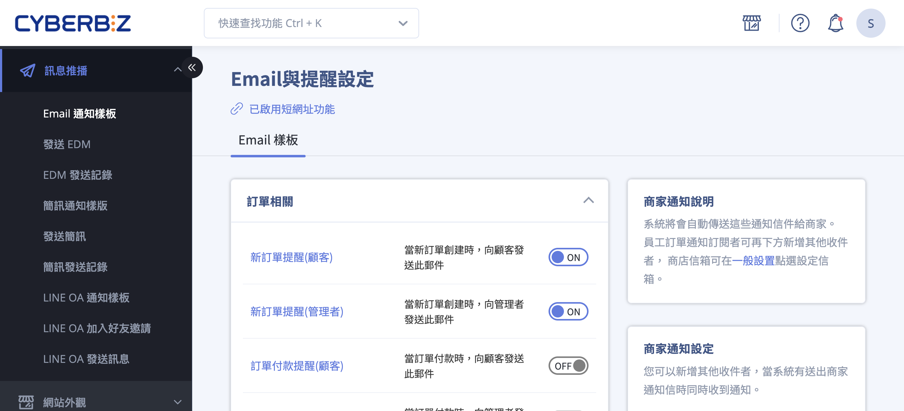
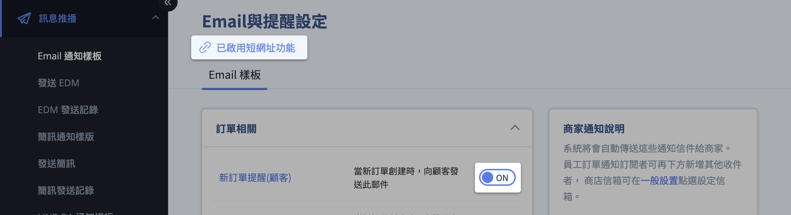

# 設定與管理 Email 通知樣板

管理與編輯系統自動發送的 Email 通知樣板，包括內容自訂、啟用控制、收件者設定與多國語系配置。
{ .subtitle }

[:lucide-bolt:{ title="適用功能" }](../../resources/conventions#適用功能) | 多國語系
{ .doc-badge }

{ .hero-page }

## Email 通知樣板說明

**Email 通知樣板管理** 功能讓商家可以自訂發送給顧客或管理者的自動化信件內容，並根據營運需求開啟或關閉特定情境的通知。

## 進入路徑與介面介紹

- **後台路徑**：前往 **訊息推播 > Email 通知樣板**。

- **樣板分類**：系統將信件分為以下幾大類別，方便商家管理：

	- **訂單相關**：如訂單確認信、付款成功通知。

	- **物流相關**：如貨物發送提醒、到店提醒。

	- **顧客相關**：如帳號啟用通知、密碼更改通知、生日禮通知。

	- **退貨相關**：如退貨申請成立通知。

	- **定期訂單相關**：針對定期購訂單的成單或跳過通知。

!!! info "實際可操作的信件分類與樣板會因 方案 或 功能設定 而異。"

## 修改信件內容步驟

1. **進入編輯頁面**：在列表中點擊想要修改的 **Email 標題**。

2. **內容編輯**：

	- 商家可以自由修改信件的主旨與內文，支援  **HTML 樣板** 或 **純文字** 格式。

	- **重要參數限制**：內文中含有 **{{ }}** 的標籤（如 `{{shop_name}}`、`{{order_number}}`）為系統變數，會自動代入實際資料，**請勿隨意更動或修改其拼法**，否則可能導致信件無法正常發送。

	- **符號限制**：編輯時請勿使用 **emoji 表情符號** 或其他特殊符號，以免顯示異常。

3. **預覽與儲存**：編輯完成後，可使用「**預覽**」按鈕查看實際呈現畫面，確認無誤後點擊「**儲存**」即可生效。

## 核心功能設定

- **功能開關**：每個樣板右側皆有 **ON/OFF** 開關，商家可自行決定是否啟用該項通知。

- **短網址功能切換**：點擊「短網址功能」選項來啟用或停用此功能。**啟用後**，系統會自動將 Email 內文中的原始長連結轉換為縮減後的短網址，藉此減少郵件總字數並優化排版美觀。

	

---

### 商家通知設定

本功能允許商家在特定觸發點（如訂單成立、付款成功）時，將系統通知同步發送給內部的相關人員或協力廠商。

#### 管理權限與主信箱

- **系統預設收件者（主信箱）**：系統預設會發送通知至網站管理者的主信箱。
    
- **修改路徑**：若需 [更換主信箱](../website-management/設定網站基本資訊.md#關於您的網站)，請至 **管理中心 > 一般設定** 進行變更。
    
#### 通知收件者類型

點擊 **新增收件者** 後，可透過以下三種方式指定通知對象：

|**類型**|**說明**|**設定規範**|
|---|---|---|
|**商店信箱**|系統預設值。|引用「一般設定」中所填寫的主信箱。|
|**自訂**|手動輸入外部人員的信箱。|填入多個信箱時，請務必使用 **半形逗號 (`,`)** 分隔。|
|**後台使用者**|從現有的後台管理帳號選取。|直接從選單中選取已建立的帳號名稱。|

## 常見應用情境與通知類型

系統通知依據對象分為「顧客通知」與「商家內部通知」，其發送邏輯與適用通路如下：

### 顧客端自動化通知

此類通知旨在即時告知消費者訂單與帳號狀態。

|**通知類型**|**關鍵發送邏輯**|**支援通路**|
|---|---|---|
|**出貨通知**|**僅在配送狀態轉為「已出貨 (配送中)」時觸發**。旨在確保包裹已由物流商承運。詳見 [出貨狀態物流提示說明](../orders/出貨狀態物流提示文字說明.md){ data-preview }  。|Email, 簡訊, LINE|
|**訂單狀態變更**|當訂單成立、付款成功或取消時觸發。|Email, 簡訊, LINE|
|**會員權益通知**|包含帳號啟用、密碼重設、生日禮金發送等。|Email, 簡訊|

!!! tip "多通路發送原則"
	若商家同時開啟多種通訊管道（如 Email 與 LINE），系統將根據設定同步發送。建議重要資訊（如出貨通知）開啟多通路以確保送達。

### 管理端內部通知 

此類通知僅發送至「商家通知設定」中指定的信箱（如倉庫人員或財務），不會發送給顧客。

- **訂單管理通知**：新訂單成立、顧客申請退貨提醒。
    
- **庫存安全水位提醒**：當商品庫存低於預設水位時，系統會自動發信告知採購人員。
    
- **系統作業結果**：執行 Excel 大量匯入（商品、會員）後的成功或失敗結果回報。
    
- **帳務與對帳通知**：有關金流扣款、對帳單生成等財務資訊。

## 多國語系設定（選配功能）

若您的網站有開啟多國語系，Email 樣板需針對不同語言個別設定：

1. 進入編輯頁面後，點選 **:lucide-globe: 語言圖示** 切換至欲編輯的語系（如英文）。

2. 各語系需個別儲存，若該語系欄位留空，系統通常會自動顯示繁體中文的內容。

## 後續操作

- :lucide-message-square-text:{ .lg }   
  [__修改簡訊內容__]()     
  。

- :simple-line:{ .lg }     
  [__串接 LINE 通知__]()  
  。

## 常見問題

??? quote "「貨物發送資訊更改提醒」這個 email 通知在什麼情況下會觸發？修改訂單的配送地址資訊會觸發嗎"
	修改訂單的配送地址並不會觸發此通知信件喔。而是當訂單的「配送狀態」為「已出貨」、「已到店」、「已取貨」、或是「超商閉店」的時候才會發送此通知信件給消費者。

??? quote "「訂單取消提醒(管理者)」開啟後會通知「未付款自動取消」的訂單嗎"
	不會，只有顧客取消的訂單才會通知管理員。

??? quote "為什麼商家或顧客沒有收到系統發送的通知信"
	
	- **垃圾郵件過濾**：郵件可能被歸類至垃圾信箱。建議商家與顧客檢查 Gmail 垃圾桶，並將 `support@cyberbiz.io` 與 `noreply@cyberbiz.co` 加入通訊錄。
	    
	- **Gmail 篩選器設定**：為確保收信順暢，建議於 Gmail 設定中建立篩選器，將上述官方網域設為「永不移至垃圾桶」。
	    
	- **Hinet 信箱限制**：由於 Hinet (msa.hinet.net) 的阻擋機制較嚴格，使用該信箱註冊的會員較容易發生漏信或無法收到「密碼重設信」的情況，建議引導顧客改用 Gmail 或 Outlook。
	    
??? quote "為什麼商家或顧客沒有收到系統通知信"

    此現象通常與郵件服務商的過濾機制有關，請參考以下排解步驟：

    - **檢查垃圾郵件箱**：郵件可能被誤判為廣告或風險信件。請確認 Gmail 或其他郵件系統的「垃圾郵件」資料夾，並將 `support@cyberbiz.io` 與 `noreply@cyberbiz.co` 加入通訊錄。
    
    - **配置 Gmail 篩選器**：為防止後續漏信，建議建立 Gmail 篩選器，將官方網域設定為「永不移至垃圾桶」。
    
    - **更換收件服務商 (ISP)**：Hinet (`msa.hinet.net`) 等電信業者信箱具備較嚴格的阻擋機制，常導致「密碼重設信」或「訂單通知」遭系統攔截。若發生頻率過高，建議引導顧客改用 Gmail 或 Outlook 以確保收信穩定性。
    
??? quote "系統在什麼時間點會發送「出貨通知」"
	
	系統僅在訂單的配送狀態變更為「**已出貨 (配送中)**」時才會觸發 Email 通訊。此機制旨在確保包裹已由物流端正式承運，避免消費者在商家僅產出託運單（待收件階段）時收到無效通知。

??? quote "「未付款提醒」的發送規則為何"
	
	商家可設定於下單後 *N* 天自動發送。若顧客在設定的間隔時間內完成付款，系統會自動終止該筆訂單後續的提醒排程，避免重複發送。

??? quote "門市管理者（或非主帳號人員）可以收到安全庫存通知嗎"
	
	可以。由於門市管理者受限於權限，僅能查看所屬門市資訊，若需接收「安全庫存」或其他全域通知，必須由 **網站擁有者 (Owner)** 手動將該人員的 Email 加入「商家通知設定」的收件清單中。
