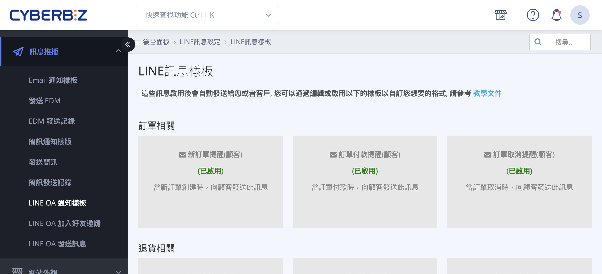
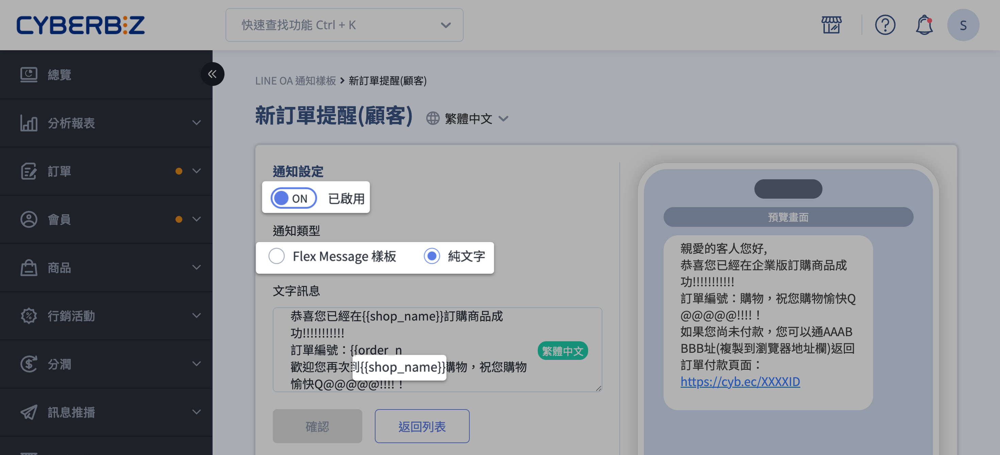

# 設定與管理 LINE OA 通知樣板

設定與管理 LINE 官方帳號（LINE Official Account）的自動化通知樣板，包含前置條件、樣板設定流程、支援情境與計費規則。
{ .subtitle }

[:lucide-tag:{ title="適用方案" }](../../resources/conventions#適用方案) | 專業 PLUS / 進階 PLUS / 高手 PLUS / 企業
{ .doc-badge }

{ .hero-page }

## LINE OA 通知樣板說明

**LINE OA 訊息提醒樣板** 可讓商家在「訂單」、「退貨」、「物流」、「顧客」及「定期訂單」等特定情境下，自動發送推播訊息給顧客。

以下為 LINE OA 訊息提醒樣板的詳細設定說明與教學：

## 設定前置準備

在使用樣板功能前，必須先完成以下設定：

- [x] [**串接 Messaging API**](../integrations/line/串接 LINE Messaging API.md){ data-preview }  ：須先將您的 LINE 官方帳號與系統後台完成 API 串接。

- [x] **收集 LINE UID**：商家需開啟 **LINE 快速登入** 或引導會員操作 [**LINE OA 官方帳號綁定官網會員**](../integrations/line/綁定 LINE 官方帳號與官網會員.md){ data-preview }  ，系統才能收集會員的 LINE UID 以發送訊息。

- [x] **好友狀態確認**：顧客必須是該官方帳號的 **好友**，且未封鎖該帳號，才能成功收到訊息。

- [x] **訊息額度**：請確保您的 LINE 官方帳號訊息額度充足，訊息費將依 LINE 官方方案計費。

## 訊息樣板設定步驟

1. **進入路徑**：登入管理後台，前往 **訊息推播 > LINE OA 通知樣板**。

2. **選擇樣板**：在列表中點選想要啟用的提醒樣板標題進入編輯頁面。

3. **內容設定**：

	- **狀態切換**：將開關切換至 **ON** 以啟用該樣板。

	- **通知類型**：可選擇使用「**Flex Message 樣板**」（圖文格式）或「**純文字**」格式。

	- **內文編輯**：商家可自行新增或刪減公版內容。

	- **重要參數限制**：內文中含有 **{{ }}** 的標籤（如 `{{shop_name}}`、`{{order_number}}`）是系統預設變數，會自動抓取訂單資料，**請勿自行更動或修改拼法**，否則會導致訊息無法正確發送。

4. **儲存設定**：編輯完成後點擊確認，即可立即套用。

## 支援的訊息類別與發送時機

系統提供多種自動化通知情境，包含但不限於：

- **貨物發送提醒**：當訂單配送狀態更新為「**已出貨(配送中)**」時發送（僅限使用系統串接物流並下載託運單之訂單）。

- **貨物到店提醒**：包裹抵達超商門市（如全家、萊爾富、黑貓快速到店）時發送。

- **7-11 貨物到店提醒**：包裹抵達 7-11 門市時發送。

- **定期訂單通知**：包含第一筆「母訂單」成立時的確認提醒，以及後續每筆「子訂單」成立時的出貨提醒。

- **未付款提醒**：針對下單後未完成付款的訂單，系統會依商家設定的時間間隔自動發送通知。

- **行銷相關通知**：如優惠券或紅利積點即將到期的提醒。

<!--

|**訊息類別**|**發送時機與條件**|**台灣站**|**日本站**|
|---|---|---|---|
|**貨物發送提醒**|訂單狀態更新為「已出貨」。 _(僅限使用系統託運單之訂單)_|:lucide-check:|:lucide-check:|
|**一般到店提醒**|包裹抵達全家、萊爾富、黑貓快速到店門市。|:lucide-check:|:lucide-x:|
|**7-11 到店提醒**|包裹抵達 7-11 門市。|:lucide-check:|:lucide-x:|
|**門市到店提醒**|包裹抵達商家自營之實體門市時發送。|:lucide-check:|:lucide-x:|
|**定期訂單確認**|會員成立第一筆「母訂單」時發送。|:lucide-check:|:lucide-x:|
|**定期訂單出貨**|每筆「子訂單」產生時發送。|:lucide-check:|:lucide-x:| 

-->

## 重要注意事項

- **計費規則**：LINE 推播屬於付費項目（由 LINE 官方收取），手動推播或系統自動傳送的訂單通知皆包含在內，僅有 **發送成功** 的訊息會被計費。

- **貨態追蹤限制**：若商家不使用系統產出的託運單出貨（如自訂物流），系統將無法自動追蹤貨態並觸發物流相關的 LINE 通知。

- **發送時機點**：出貨通知並非在下載託運單時立即發送，而是需等物流商 **回傳「配送中」貨態** 後，系統才會正式推播 LINE 訊息給會員。

<!--
## 後續操作

- :lucide-import:{ .lg }   
  [____]()     
  。

- :lucide-ban:{ .lg }     
  [____]()  
  。

-->

## 常見問題

??? quote "為什麼顧客反映沒有收到 LINE 通知" 
	請依序確認以下點： 

	1. **綁定狀態**：顧客是否已完成 [LINE OA 與官網會員綁定](../integrations/line/綁定 LINE 官方帳號與官網會員.md)？系統必須取得 LINE UID 才能發送。 
	2. **好友狀態**：顧客是否封鎖了您的官方帳號？ 
	3. **訊息額度**：您的 LINE 官方帳號（Manager）訊息額度是否已達上限？ 
	4. **發送條件**：該筆訂單是否符合發送時機（例如：是否使用了系統串接物流並產生託運單）？

??? quote "我可以自訂訊息內的參數（如 {{order_number}}）嗎" 
	**不可以。** `{{ }}` 內的變數為系統固定參數，用於自動帶入訂單資訊。您可以更動參數前後的文字敘述，但請勿修改括號內的拼法或格式，否則將導致變數失效，訊息會顯示原始代碼或發送失敗。

??? quote "「出貨通知」是在按下出貨按鈕時就立即發送嗎" 
	**不是。** 為了確保資訊準確，系統不會在商家點擊「出貨」或「列印託運單」時立即發送，而是需等待物流商（如 7-11、全家、黑貓）回傳 **「配送中」** 的貨態更新後，系統才會觸發發送流程。

??? quote "如果我手動修改訂單狀態為「已出貨」，會觸發通知嗎" 
	這取決於您的物流模式： 
	
	- **系統串接物流**：通知觸發點為物流商回傳的實體貨態，手動更改狀態通常不會觸發物流類通知。 
	- **自訂物流**：由於系統無法追蹤第三方物流貨態，此類訂單目前不支援自動發送物流通知。

??? quote "發送 LINE 通知會扣除我的訊息額度嗎" 
	**會。** 所有透過 Messaging API 發送的通知（包含自動化樣板訊息）皆會計入 LINE 官方帳號的每月訊息額度中，費用計算依您的 LINE 官方方案為準。
